# System organizacji pracy dla biura tłumaczeń

## Spis treści

* [Wprowadzenie](#wprowadzenie)
  * [Biznes tłumaczeń w dzisiejszych czasach](#biznes-tłumaczeń-w-dzisiejszych-czasach)
  * [Wspóczesne zarządzanie projektami](#wspóczesne-zarządzanie-projektami)
  * [Systemy zarządzania projektami i ich rola w branży tłumaczeniowej](#systemy-zarządzania-projektami-i-ich-rola-w-branży-tłumaczeniowej)
* [Koncepcja aplikacji](#koncepcja-aplikacji)
  * [Geneza projektu i inspiracje](#geneza-projektu-i-inspiracje)
  * [Założenia i cele projektu](#założenia-i-cele-projektu)
  * [Funkcjonalności aplikacji](#funkcjonalności-aplikacji)
* [Projekt aplikacji](#projekt-aplikacji)
  * [Przypadki użycia i historyjki użytkownika](#przypadki-użycia-i-historyjki-użytkownika)
    * [Jako użytkownik, chcę:](#jako-użytkownik-chcę)
    * [Jako administrator systemu, chcę:](#jako-administrator-systemu-chcę)
    * [Jako kierownik projektu, chcę:](#jako-kierownik-projektu-chcę)
    * [Jako tłumacz, redaktor, korektor, ekspert merytoryczny czy edytor chcę:](#jako-tłumacz-redaktor-korektor-ekspert-merytoryczny-czy-edytor-chcę)
    * [Jako inżynier wsparcia, chcę:](#jako-inżynier-wsparcia-chcę)
* [Stos technologiczny](#stos-technologiczny)
  * [Postanowienia ogólne w wyborze technologii](#postanowienia-ogólne-w-wyborze-technologii)
  * [Interfejs użytkownika](#interfejs-użytkownika)
  * [Serwer aplikacji](#serwer-aplikacji)
  * [Przechowywanie danych](#przechowywanie-danych)
  * [Zewnętrzne API](#zewnętrzne-api)
  * [Monitorowanie i analiza pracy aplikacji](#monitorowanie-i-analiza-pracy-aplikacji)
  * [Testowanie](#testowanie)
  * [Wdrożenie](#wdrożenie)
  * [Uwierzytelnianie i autoryzacja](#uwierzytelnianie-i-autoryzacja)
* [Implementacja](#implementacja)
  * [Przygotowanie środowiska](#przygotowanie-środowiska)
    * [Instalacja Node.js](#instalacja-nodejs)
    * [Instalacja Docker](#instalacja-docker)
    * [Instalacja Visual Studio Code](#instalacja-visual-studio-code)
    * [Instalacja IntelliJ IDEA](#instalacja-intellij-idea)
    * [Instalacja Git](#instalacja-git)
  * [Infrastruktura](#infrastruktura)
    * [Docker Compose](#docker-compose)
    * [Konfiguracja instancji PostgreSQL](#konfiguracja-instancji-postgresql)
    * [Konfiguracja instancji Redis](#konfiguracja-instancji-elasticsearch)
    * [Konfiguracja instancji MinIO](#konfiguracja-instancji-minio)
    * [Konfiguracja instancji Keycloak](#konfiguracja-instancji-keycloak)
    * [Konfiguracja stosu ELK](#konfiguracja-stosu-elk)
  * [Interfejs użytkownika](#interfejs-użytkownika-1)
    * [Tworzenie projektu za pomocą Vite](#tworzenie-projektu-za-pomocą-vite)
    * [Zarządzanie zależnościami za pomocą narzędzia npm](#zarządzanie-zależnościami-za-pomocą-narzędzia-npm)
    * [Wyznaczenie kluczowych elementów interfejsu](#wyznaczenie-kluczowych-elementów-interfejsu)
    * [Uwierzytelnianie i kontrola dostępu](#uwierzytelnianie-i-kontrola-dostępu)
    * [Lokalizacja](#lokalizacja)
    * [Nawigacja i routing](#nawigacja-i-routing)
    * [Komunikacja z serwerem](#komunikacja-z-serwerem)
    * [Implementacja widoków](#implementacja-widoków)
    * [Implementacja formularzy](#implementacja-formularzy)
    * [Wdrożenie aplikacji](#wdrożenie-aplikacji)
  * [Serwer aplikacji](#serwer-aplikacji-1)
    * [Tworzenie projektu za pomocą Spring Initializr](#tworzenie-projektu-za-pomocą-spring-initializr)
    * [Narzędzie Gradle](#narzędzie-gradle)
    * [Warstwa domeny - encje](#warstwa-domeny---encje)
    * [Warstwa domeny - repozytoria](#warstwa-domeny---repozytoria)
    * [Warstwa domeny - zapytania i specyfikacje](#warstwa-domeny---zapytania-i-specyfikacje)
    * [Warstwa domeny - serwisy](#warstwa-domeny---serwisy)
    * [Warstwa aplikacji - persystencja](#warstwa-aplikacji---persystencja)
    * [Warstwa aplikacji - serwisy aplikacyjne](#warstwa-aplikacji---serwisy-aplikacyjne)
    * [Warstwa aplikacji - kontrolery](#warstwa-aplikacji---kontrolery)
    * [Warstwa aplikacji - specyfikacje](#warstwa-aplikacji---specyfikacje)
    * [Warstwa aplikacji - serwisy zewnętrzne](#warstwa-aplikacji---serwisy-zewnętrzne)
    * [Warstwa aplikacji - uwierzytelnianie i autoryzacja](#warstwa-aplikacji---uwierzytelnianie-i-autoryzacja)
    * [Implementacja logowania i monitorowania](#implementacja-logowania-i-monitorowania)
    * [Testowanie](#testowanie-1)
    * [Wdrożenie aplikacji](#wdrożenie-aplikacji-1)
* [Prezentacja](#prezentacja)
  * [Rejestracja nowego użytkownika](#rejestracja-nowego-użytkownika)
  * [Logowanie się do systemu](#logowanie-się-do-systemu)
  * [Zarządzanie słownikami](#zarządzanie-słownikami)
  * [Zarządzanie bazą klientów](#zarządzanie-bazą-klientów)
  * [Zarządzanie projektami](#zarządzanie-projektami)
    * [Przegląd projektów](#przegląd-projektów)
    * [Tworzenie i edycja projektu](#tworzenie-i-edytowanie-projektu)
    * [Zmiana statusu projektu](#zmiana-statusu-projektu)
    * [Zmiana terminu realizacji projektu](#zmiana-terminu-realizacji-projektu)
    * [Podział projektu na zadania](#podział-projektu-na-zadania)
    * [Zarządzanie zadaniami](#zarządzanie-zadaniami)
    * [Zarządzanie kosztami realizacji projektu](#zarządzanie-kosztami-realizacji-projektu)
    * [Zarządzanie dokumentami projektu](#zarządzanie-dokumentami-projektu)
    * [Komunikacja w ramach projektu](#komunikacja-w-ramach-projektu)
  * [Monitorowanie pracy systemu](#monitorowanie-pracy-systemu)
* [Przyszłość systemu](#przyszłość-systemu)
  * [Ważność ciąglej ewolucji systemu](#ważność-ciąglej-ewolucji-systemu)
  * [Nowe narzędzia dla tłumaczy i kadry redakcyjnej](#nowe-narzędzia-dla-tłumaczy-i-kadry-redakcyjnej)
  * [Rozbudowanie możliwości raportowania](#rozbudowanie-możliwości-raportowania)
  * [Dostarczenie funkcjonalności dla pracowników działu księgowości](#dostarczenie-funkcjonalności-dla-pracowników-działu-księgowości)
  * [Usprawnienia monitorowania pracy systemu](#usprawnienia-monitorowania-pracy-systemu)

## Wprowadzenie

### Biznes tłumaczeń w dzisiejszych czasach

W dzisiejszych czasach, wraz z globalizacją i rosnącym handlem międzynarodowym, rola tłumaczeń biznesowych staje się niezwykle ważna. Przedsiębiorstwa, dążąc do ekspansji na rynkach zagranicznych, muszą dostosowywać swoje materiały, takie jak umowy, dokumenty finansowe, strategie marketingowe, raporty, prezentacje czy strony internetowe, do języka i kultury docelowej. Tłumaczenia biznesowe, ze względu na specyfikę, wymagają nie tylko doskonałej znajomości języka, ale także specjalistycznej wiedzy w danej branży. Błędy w tłumaczeniu mogą prowadzić do poważnych nieporozumień, które mogą mieć negatywne konsekwencje dla firmy.
W związku z tym wiele firm decyduje się na współpracę z profesjonalnymi biurami tłumaczeń, które oferują usługi dostosowane do specyficznych potrzeb biznesu. Tłumacze specjalizujący się w danych dziedzinach zapewniają wysoką jakość i precyzję tłumaczeń, co jest kluczem do budowania zaufania i pozytywnego wizerunku na rynkach międzynarodowych[1][2][4].

Globalizacja rynków prowadzi do zwiększenia znaczenia kultury w komunikacji biznesowej. Tłumaczenie tekstu to jedno, ale dostosowanie go do specyfiki kulturowej docelowego kraju to zadanie o wiele bardziej złożone, a jednocześnie kluczowe dla skuteczności przekazu. To właśnie proces nazywamy lokalizacją.
Lokalizacja to proces adaptacji produktu lub treści do specyfiki kulturowej, językowej, prawnej i innych aspektów konkretnego rynku docelowego. Chodzi tu nie tylko o tłumaczenie językowe, ale także o uwzględnienie różnic kulturowych, norm społecznych, zwyczajów, wartości oraz oczekiwań docelowej grupy odbiorców.

**Dlaczego lokalizacja jest ważna?**:
1. **Zrozumienie rynku**: Lokalizacja pozwala firmom na lepsze zrozumienie potrzeb i oczekiwań lokalnych konsumentów, co przekłada się na skuteczniejszą komunikację i większe zaufanie do marki.
2. **Budowanie relacji**: Dostosowanie treści do lokalnych realiów pozwala na nawiązanie głębszej relacji z klientem, co z kolei prowadzi do lojalności i większego zaangażowania.
3. **Unikanie wpadek kulturowych**: Niedostosowanie treści do kultury docelowej może prowadzić do nieporozumień, a w skrajnych przypadkach nawet do skandalów. Lokalizacja minimalizuje ryzyko nieświadomego popełnienia kulturowych faux pas.

**Przykłady lokalizacji**:
1. **Reklama**: Słynny przykład dotyczy Chevroleta, który wprowadził na rynek latynoamerykański model o nazwie Nova. W języku hiszpańskim "no va" oznacza "nie jedzie", co nie było najlepszym wyborem dla samochodu.
2. **Strony internetowe**: Wiele firm dostosowuje design, treści i funkcje swoich stron do lokalnych oczekiwań, np. różne metody płatności czy odmienne grafiki związane z lokalnymi świętami.
3. **Gry komputerowe**: Lokalizacja gier to nie tylko tłumaczenie dialogów, ale także dostosowywanie postaci, scenariuszy czy nawet mechaniki gry do lokalnych oczekiwań.

**Wykorzystanie technologii**: Lokalizacja korzysta z zaawansowanych narzędzi technologicznych, które pozwalają na efektywną adaptację treści. Przykładowo, systemy zarządzania tłumaczeniami (TMS) mogą automatycznie identyfikować elementy do lokalizacji, a także dbać o spójność terminologiczną.

Lokalizacja to kluczowy element strategii międzynarodowej każdej firmy, która dąży do skutecznej komunikacji z klientami na różnych rynkach. W erze globalizacji nie wystarczy już tylko tłumaczyć - trzeba "mówić" językiem kultury.

W świecie, gdzie interakcje międzynarodowe stały się codziennością, tłumaczenia ustne odgrywają kluczową rolę w wielu aspektach komunikacji. Od spotkań biznesowych, przez konferencje naukowe, po wydarzenia kulturalne - profesjonalne tłumaczenia ustne są niezbędne, by zapewnić płynny przepływ informacji między ludźmi różnych narodowości i kultur.

**Rodzaje tłumaczeń ustnych**:
1. **Tłumaczenie konsekutywne**: Tłumacz przekazuje treść po tym, jak mówca skończy wypowiedź. Jest to często stosowane w małych grupach lub w trakcie spotkań biznesowych.
2. **Tłumaczenie symultaniczne**: Tłumacz przekazuje treść niemal jednocześnie z mówcą, zwykle pracując w kabinie dźwiękoszczelnej. Jest to typ tłumaczenia popularny na dużych konferencjach czy wydarzeniach międzynarodowych.
3. **Tłumaczenie szeptane**: Tłumacz siedzi obok osoby, która potrzebuje tłumaczenia, i szeptem przekazuje jej treść wypowiedzi.

**Kluczowe znaczenie tłumaczeń ustnych**:
1. **Przekroczenie barier językowych**: Tłumaczenia ustne umożliwiają płynną komunikację między osobami, które nie mówią tym samym językiem, eliminując jednocześnie ryzyko nieporozumień.
2. **Kulturowa adaptacja**: Profesjonalni tłumacze ustni nie tylko przekładają słowa, ale również dostosowują komunikat do specyfiki kulturowej odbiorców, uwzględniając niuanse, zwyczaje i kontekst.
3. **Dostępność informacji**: Na dużych konferencjach czy seminarium tłumaczenia ustne gwarantują, że każdy uczestnik, niezależnie od jego języka ojczystego, ma dostęp do tej samej wiedzy i informacji.
4. **Profesjonalizm w biznesie**: W kontekście biznesowym tłumaczenia ustne są często kluczem do sukcesu, umożliwiając precyzyjne negocjacje, budowanie zaufania i rozwijanie relacji z partnerami międzynarodowymi.

**Wyzwania związane z tłumaczeniami ustnymi**:
- **Wysoki poziom stresu**: Tłumaczenie symultaniczne wymaga niezwykle wysokiej koncentracji i jest bardzo wymagające psychicznie.
- **Potrzeba ciągłego doskonalenia**: Świat jest w ciągłym ruchu, a wraz z nim ewoluują języki i terminologia. Dlatego tłumacze muszą nieustannie podnosić swoje kwalifikacje.
- **Różnorodność tematyczna**: Tłumacze często muszą radzić sobie z tematyką, która jest dla nich nowa, co wymaga szybkiego przyswajania informacji.

Z kolei technologia, w tym sztuczna inteligencja, rewolucjonizuje branżę tłumaczeń. Narzędzia tłumaczeniowe oparte na AI pozwalają na szybsze i bardziej efektywne tłumaczenia, co z kolei przyczynia się do zwiększenia konkurencyjności firmy na globalnym rynku. Niemniej jednak, niezależnie od technologii, ludzki dotyk i ekspertyza w tłumaczeniu pozostają niezastąpione [3]. Istnieje kilka powodów, dla których SI nie jest jeszcze w stanie zastąpić tłumaczy[6][7]:

1. **Brak kontekstu**: W przetwarzaniu języka naturalnego kontekst jest kluczowy dla zrozumienia tekstu. SI może mieć trudności w zrozumieniu kontekstu, co prowadzi do błędów tłumaczeniowych.
2. **Złożoność języka naturalnego**: Język naturalny jest bardzo złożony i ma wiele niuansów i subtelnych znaczeń. SI może mieć trudności w przeniesieniu tych niuansów i znaczeń na inny język.
3. **Złożoność tłumaczenia**: Tłumaczenie to nie tylko przekładanie słów z jednego języka na drugi. To proces interpretacji i przekazywania znaczenia tekstu, co wymaga wiedzy i doświadczenia, którego SI nie posiada.
4. **Jakość tłumaczenia**: Mimo postępu w rozwoju SI, wciąż nie jest w stanie osiągnąć jakości tłumaczenia, która byłaby wystarczająca do zastąpienia tłumaczy. Żywi tłumacze posiadają wiedzę i doświadczenie, które pozwala im na tworzenie dokładnych i precyzyjnych tłumaczeń.

Pomimo tych ograniczeń, SI może nadal odgrywać ważną rolę w procesie tłumaczenia. Może pomóc w automatyzacji procesów tłumaczeniowych, takich jak tłumaczenie dokumentów lub stron internetowych, ale wciąż potrzebuje wsparcia żywych tłumaczy, którzy sprawdzą i poprawią jakość tłumaczeń [5].

Podsumowując, w dobie globalizacji i rosnącego znaczenia międzynarodowego handlu oraz komunikacji, tłumaczenia - zarówno pisemne, jak i ustne - odgrywają kluczową rolę w budowaniu relacji, prowadzeniu biznesu i wymianie informacji między różnymi kulturami i narodami. Chociaż technologia, w tym sztuczna inteligencja, wnosi ważny wkład w usprawnienie i przyspieszenie procesów tłumaczeniowych, niezastąpionym elementem tłumaczenia pozostaje człowiek, który jest w stanie zrozumieć kontekst, niuanse i subtelności języka. Współpraca między ludźmi a technologią to przyszłość branży tłumaczeniowej, łącząca najlepsze z obu światów.

Źródła:

1. "Business Translation Services for Global Enterprises" - TransPerfect - https://www.transperfect.com/services/business-translation-services [dostęp: 21.02.2023]
2. "What is Business Translation?" - SDL - https://www.sdl.com/solutions/translation/what-is-business-translation/ [dostęp: 21.02.2023]
3. "The Role of Translation in Global Business" - Multilingua Blog - https://www.multilingua.com/blog/the-role-of-translation-in-global-business/ [dostęp: 21.02.2023]
4. "Business Translation Services" - LingvoHouse - https://lingvohouse.com/services/business-translation/ [dostęp: 21.02.2023]
5. "Can AI Replace Human Translators?" - TAUS - https://www.taus.net/think-tank/articles/can-ai-replace-human-translators [dostęp: 21.02.2023]
6. "The Pros and Cons of Artificial Intelligence in Translation" - Memsource - https://www.memsource.com/blog/2018/01/18/the-pros-and-cons-of-artificial-intelligence-in-translation/ [dostęp: 21.02.2023]
7. "Why AI will never replace human translators" - LanguageWire - https://www.languagewire.com/en/blog/why-ai-will-never-replace-human-translators [dostęp: 21.02.2023]

###	Wspóczesne zarządzanie projektami

Wykonanie każdego zadania, nieważne jak skomplikowane i wielkie - czy była by to budowa nowego wieżowca czy otwarcie małego osiedlowego sklepu - może być nazwane projektem. Większość z nas dokładnie wie, jak tego rodzaju dzieła kształtują nasz życiu osobistym i/lub zawodowym. Niestety, nie wszystkie projekty kończą się pełnym sukcesem. Zdarzają się prekroczenia budżetów i terminów realizacji, mogą nie spełniać wymagań stawianych przez klientów lub przez nas samych. Część projektów zostaje porzucona.

Umiejętne zarządzanie jest ważnym czynnikiem, mającym znaczący wpływ na sukces w przeprowadzaniu projektu. Skuteczne zarządzanie opiera się na wysokim poziomie kompetencji w kilku obszarach. Potrzebne są umiejętności optymalnego planowania, podtrzymania motywacji zespołu, komunikacji interpersonalnej oraz często szeroka wiedza techniczna i dziedzinowa. Wszystkie te elementy są istotne podczas realizacji różnorodnych typów projektów i maja olbrzymi wpływ na ich końcowy sukces [1]. Zarządzanie projektami dzisiaj zajmuje się zbieraniem wiedzy i poszerzaniem wiedzy oraz budowaniem narzędzi, metodyk i technik, które pomagają w efektywnej realizacji projektów. Zarządzanie projektami jest bardzo bogatą i szeroką dyscypliną zawiera w sobie tysiące lat doświadczenia w realizacji różnej skali projektów i stanowi jedną z najbardziej dynamicznie rozwijających się dziedzin zarządzania. Wiele organizacji, w tym także te związane z tłumaczeniami, zaczyna dostrzegać korzyści płynące z zastosowania narzędzi i technik zarządzania projektami.

Pierwsza połowa XX wieku stała się początkiem ery szerokiego użycia nowych technologii i narzędzi. Upowszechnienie samolotów i samochodów poskutkowało zwiększeniem mobilności zasobów i pozwoliło na dużo bardziej efektywną ich alokację. Rozwój środków telekomunikacji w postaci telegrafów i telefonów spowodował zanczące uproszenia w komunikacji na duże odłegłosći. Pojawiały się pierwsze komputery i bazy danych, co z kolei uprościło różnolakie obliczenia i procesy administracyjne. Kolejnym ważnym w tym okresie wydarzeniem było pojawienie się pierwszych koncepcji zarządzania projektami. W 1917 roku Henry Gantt opracował jeden ze swoich najważniejszych wkładów w dziedzinę zarządzania projektami: diagram Gantta, który pozwalał na wizualizację harmonogramu projektu. Jednym z pierwszych zastosowań wykresu Gantta w dużych projektach było planowanie i realizacja budowy Zapory Hoovera w latach 1931-1936[2]. 

Za początek współczesnego zarządzania projektami można uznać założenie w 1956 roku Amerykańskiego Stowarzyszenia Inżynierów Kosztów (ang. The American Association of Cost Engineers, dzisiaj znane jako AACE International). Jest to wiodące stowarzyszenie zawodowe skupiające kosztorysantów, inżynierów kosztów, planistów, kierowników projektów i specjalistów ds. kontroli projektów. W kolejnych latach zaczęły pojawiać się pierwsze metodyki zarządzania projektami, takie jak CPM/PERT. W roku 1969 powstał Project Management Institute (PMI), który jest największą organizacją na świecie zrzeszającą specjalistów z zakresu zarządzania projektami. W kolejnych latach zaczęły pojawiać się kolejne metodyki zarządzania projektami, takie jak PRINCE2, PMBOK, Scrum, Kanban, Lean, itd.

Na przestrzeni lat możemy zauważyć jak podejście do zarządzania projektami zmieniało się od bardziej "sztywnego" sekwencyjnego podejścia, które zakładało że wszystkie wymagania projektówe są znane na początku realizacji do "reaktywnego" zwinnego podejścia, które pozwalało lepiej przystosować się do ciągle zmieniających sie potrzeb. Zmiany te wynikały ze wzrostem skali i złożoności projektów oraz potrzebą reagować na coraz bardziej dynamicznie rozwijający się świat.

Najbardziej znaną sekwencyjną metodyką jest Waterfall. Obecnie metodyka Waterfall jest najczęściej wykorzystywana w projektach, które są bardzo dobrze zdefiniowane i nie ulegają zmianie w trakcie realizacji, np. w grach wideo czy projektach budowlanych. Można ją stosować zarówno w dużych przedsięwzięciach, jak i w mniejszych projektach - dla każdego projektu, który od początku ma dobrze zdefiniowane wymagania. Przykładem sukcesu takiego podejścia do realizacji projektu może być misja Apollo 11, celem której było wysłanie pierwszego człowieka na Księżyc. Projekt ten był bardzo dobrze zdefiniowany, miał mierzalny cel i był realny do osiągnięcia w określonym czasie [8].

Agile (czyli "zwinnność") jest to zbiorcze określenie dla metod i praktyk zarządzania projektami, które kładą nacisk na elastyczność, adaptację do zmieniających się wymagań i skupienie na dostarczaniu wartości dla klienta w jak najkrótszym czasie [2][3][5]. Jest to odpowiedź na tradycyjne metody zarządzania projektami, które często były uznawane za zbyt sztywne i nieefektywne w szybko zmieniających się środowiskach, takich jak rozwój oprogramowania.

Podstawowe cechy podejścia Agile:

1. **Iteracyjność i przyrostowość**: Projekty są dzielone na małe części, nazywane iteracjami lub sprintami, które trwają zazwyczaj od dwóch do czterech tygodni. Każda iteracja ma na celu dostarczenie pewnej funkcjonalności lub wartości dla klienta.

2. **Komunikacja**: Regularne spotkania (tzw. stand-upy) pomagają zespołowi porozumieć się, wyznaczyć priorytety i rozwiązać bieżące problemy.

3. **Feedback**: Klient jest stale angażowany w proces tworzenia produktu, dzięki czemu może na bieżąco dostarczać informacji zwrotnych, które pozwalają na dostosowywanie produktu do jego potrzeb.

4. **Autoorganizacja zespołu**: Zespoły Agile są często samodzielne i mają pełne uprawnienia do podejmowania decyzji dotyczących tego, jak najlepiej osiągnąć cel sprintu.

5. **Ciągłe doskonalenie**: Po każdej iteracji zespoły przeprowadzają retrospekcje, podczas których analizują, co poszło dobrze, a co można poprawić.

Ważne jest również zrozumienie, że Agile to nie tylko metodyki (takie jak Scrum czy Kanban), ale również kultura i zestaw wartości. Te wartości zostały zdefiniowane w "Agile Manifesto" i obejmują między innymi:

- Wartość ludzi i interakcji ponad procesy i narzędzia.
- Współpracę z klientem ponad negocjowanie umów.
- Reagowanie na zmiany ponad śledzenie planu.

Mimo że początki Agile są związane głównie z branżą IT i rozwijaniem oprogramowania, zasady te są obecnie stosowane w wielu różnych branżach i kontekstach [6].

Omawiająć tematykę zarządzania projektami, warto też zawsze pamiętać, że nie wszystko kończy się na narzędziach i metodach. Wiele projektów kończy się niepowodzeniem, a jednym z głównych powodów jest brak odpowiedniego przygotowania i planowania. Przykładami takich projektów są:

1. **Budowa Eurotunelu** - początkowo oszacowano, że projekt będzie kosztować około 5 miliardów funtów, ale ostateczny koszt wyniósł prawie 10 miliardów funtów. Znaczenie dokładnego budżetowania i monitorowania kosztów jest tutaj kluczowe.
2. **Festiwal Fyre** - brak odpowiedniego planowania i zarządzania ryzykiem doprowadził do katastrofalnej imprezy, która zakończyła się fiaskiem i wieloma skargami.
3. **Kryzys BlackBerry w 2011 roku**, kiedy usługi firmy na całym świecie przestały działać na trzy dni. Firma została skrytykowana za słabą komunikację z klientami podczas awarii.

Ważnym elementem współczesnego zarządzania projektami jest wykorzystanie narzędzi informatycznych, takich jak oprogramowanie do zarządzania projektami, które umożliwiają prowadzenie projektów na wysokim poziomie i ułatwiają koordynację pracy zespołu. Dodatkowo, analiza danych i wykorzystanie narzędzi Business Intelligence pozwala na wgląd w efektywność projektów oraz umożliwia podejmowanie szybkich i trafnych decyzji [1].

Ważnym elementem współczesnego zarządzania projektami jest również zwrócenie uwagi na aspekty związane z etyką i zrównoważonym rozwojem [1][4]. Zgodność z przepisami i normami, a także zasadami etycznymi i społecznymi, to kluczowe elementy dla długoterminowego sukcesu projektu i organizacji [1].

Źródła:

1. Project Management Institute (PMI) - https://www.pmi.org/
2. Agile Alliance - https://www.agilealliance.org/
3. "Agile Project Management with Scrum" - Ken Schwaber
4. "Effective Project Management: Traditional, Agile, Extreme" - Robert K. Wysocki
5. "The Project Manager's Guide to Mastering Agile" - Charles G. Cobb
6. Waterfall vs Agile - https://www.atlassian.com/agile/project-management/waterfall-vs-agile
7. Waterfall Model a Complete Guide - 2019 Edition - Gerardus Blokdyk
8. How Project Apollo Shaped the Project Management Landscape for any Organization? - https://www.saviom.com/blog/project-apollo-shaped-the-project-management-landscape/

### Systemy zarządzania projektami i ich rola w branży tłumaczeniowej

System zarządzania projektami (Project Management System, PMS) to narzędzie informatyczne, które pozwala na kompleksowe zarządzanie projektem poprzez koordynację pracy zespołu, planowanie zadań, monitorowanie postępów i raportowanie wyników. Często PMS wspierają różne współczesne metody zarządznia projektami, w tym z rodziny Agile. [8][9]

Przykładowe PMS i ich funkcjonalności:

1. **Asana** - Asana jest elastycznym narzędziem do zarządzania projektami, które pozwala na planowanie, śledzenie i komunikację w projekcie. Zawiera listy zadań, harmonogramy, panele i funkcje automatyzacji.
2. **Trello** - Trello bazuje na metodologii Kanban i pozwala użytkownikom tworzyć tablice z kartami reprezentującymi zadania. Jest intuicyjne, wizualne i można je dostosować poprzez różne dodatki.
3. **Jira** - Stworzony głównie dla zespołów programistycznych, Jira oferuje zaawansowane narzędzia do śledzenia błędów i zadań. Często jest używany z Confluence, narzędziem do zarządzania dokumentacją.
4. **Monday** - Monday.com to wizualna platforma zarządzania pracą, która pozwala zespołom planować i śledzić projekty w kolorowych i dostosowywalnych tablicach.
5. **Basecamp** - Basecamp jest narzędziem do zarządzania projektami i komunikacji zespołowej, które oferuje czaty, listy zadań, dokumenty i harmonogramy w jednym miejscu.
6. **Microsoft Project** - Jest to jedno z najbardziej zaawansowanych narzędzi do zarządzania projektami, które oferuje szczegółowe harmonogramowanie, alokację zasobów i analizę postępów.
7. **Smartsheet** - Smartsheet to platforma do zarządzania i automatyzacji pracy, która łączy wygląd arkusza kalkulacyjnego z funkcjami zarządzania projektami.
8. **Wrike** - Wrike to narzędzie do zarządzania pracą z funkcjami takimi jak listy zadań, śledzenie czasu, raportowanie i integracja z innymi narzędziami.
9. **Notion** - Notion to wszechstronne narzędzie, które łączy notatki, bazy danych, tablice Kanban, wikis i kalendarze, pozwalając zespołom na organizację i zarządzanie projektami.
10. **Redmine** - Redmine to otwarte oprogramowanie do zarządzania projektami, które oferuje śledzenie błędów, harmonogramowanie i wsparcie dla wielu projektów.
11. **Jama Connect** - Jama Connect to narzędzie do zarządzania wymaganiami, które pozwala zespołom na śledzenie wymagań, testowanie i zarządzanie zmianami.

Systemy PMS zwiększają efektywność zarządzania projektem poprzez łatwe planowanie zadań, monitorowanie postępów oraz komunikację w zespole. Umożliwiają oni również klarowne określenie celów, ocenę ryzyka i identyfikację problemów. Dzięki nim projekt staje się bardziej transparentny, ułatwiając wymianę informacji wśród członków zespołu oraz komunikację z interesariuszami zewnętrznymi. Systemy te przyczyniają się do oszczędności czasu, adaptacji do zmieniających się wymagań oraz korzystają z narzędzi analitycznych i sztucznej inteligencji. Służą zarządzaniu różnymi projektami, takimi jak oprogramowanie, budowa czy kampanie marketingowe, pomagając dostarczyć je na czas i w ramach budżetu[8][10][11][12].

Kontynuując temat, co raz więcej firm decyduje się na tworzenie takich narzędzi od zera, co pozwoli im dostać system w pełni odpowiadający potrzebom organizacji. Jednakże, systemy PMS nie są tylko dla tradycyjnych sektorów biznesu. Biura tłumaczeń również odnajdują w nich wielkie korzyści.

Biura tłumaczeń zajmują się przetwarzaniem ogromnej ilości informacji, co może stanowić wyzwanie dla zarządzania projektami tłumaczeniowymi. W celu poprawy jakości zarządzania takimi projektami i zwiększenia efektywności pracy biuro tłumaczeń powinno rozważyć użycie specjalistycznego narzędzia PMS.

Według raportu opublikowanego na stronie Language Industry Hires [14], zastosowanie PMS pozwala na lepsze zarządzanie projektami tłumaczeniowymi, ponieważ umożliwia łatwe przypisywanie zadań, śledzenie postępów prac i dzielenie się plikami między członkami zespołu. PMS ułatwia także współpracę w zespole, co przyczynia się do zwiększenia skuteczności i efektywności projektów tłumaczeniowych.

Innym istotnym aspektem jest możliwość analizowania danych, które pozwala na dokładniejsze monitorowanie postępów projektów i dokonywanie zmian w planie projektowym. Według badania przeprowadzonego przez Common Sense Advisory, firmy, które korzystają z narzędzi analitycznych w procesie tłumaczenia, są bardziej skuteczne i efektywne. Dzięki analizie danych biuro tłumaczeń może zidentyfikować słabe punkty w procesie tłumaczenia i wprowadzić odpowiednie zmiany, aby poprawić jego jakość i zwiększyć zyski.

Podsumowując, specjalistyczne narzędzia PMS mogą przynieść wiele korzyści dla biur tłumaczeń. Pozwalają one na usprawnienie zarządzania projektami, ułatwienie współpracy w zespole, zwiększenie efektywności projektów, poprawę jakości produktów końcowych i zwiększenie konkurencyjności na rynku. W związku z tym warto rozważyć zastosowanie takiego narzędzia w codziennej pracy biura tłumaczeń.

Warto podkreślić, że specjalistyczne narzędzie PMS jest dostosowane do potrzeb biur tłumaczeń, a nie jest to jedynie uniwersalne narzędzie do zarządzania projektami. Istnieje wiele dostępnych na rynku rozwiązań, które oferują różne funkcjonalności i opcje, co pozwala na wybór narzędzia, które najlepiej odpowiada indywidualnym potrzebom i wymaganiom biura tłumaczeń.

Źródła:

9. Project Management Institute (PMI) - https://www.pmi.org/
10. "Project Management Systems: A Technology Review" - Alok Mishra and Neeraj Mishra, International Journal of Computer Applications Technology and Research, Volume 5– Issue 1, 2016
11. "The Benefits of Project Management Software" - Derek Huether, ProjectManager.com - https://www.projectmanager.com/blog/the-benefits-of-project-management-software
12. "The Advantages of Project Management Software" - Workzone - https://www.workzone.com/blog/the-advantages-of-project-management-software/
13. "Why Use Project Management Software?" - Zoho - https://www.zoho.com/projects/blog/
14. "5 Reasons Why Your Translation Agency Needs Project Management Software" - Language Industry Hires - https://www.languageindustryhires.com/single-post/2017/03/13/5-Reasons-Why-Your-Translation-Agency-Needs-Project-Management-Software [dostęp: 21.02.2023]
15. "Translation Management Technology for LSPs" - Common Sense Advisory - https://csa-research.com/Insights/ArticleID/46/Translation-Management-Technology-for-LSPs [dostęp: 21.02.2023]

## Koncepcja aplikacji

### Geneza projektu i inspiracje

Wraz z rosnącym zapotrzebowaniem na profesjonalne usługi tłumaczeniowe dostrzegłem potrzebę stworzenia specjalistycznego narzędzia do zarządzania unikalnymi wyzwaniami związanymi z projektami tłumaczeniowymi. Tradycyjne narzędzia do zarządzania projektami często nie radzą sobie z obsługą wielu języków, zarządzaniem wieloma tłumaczami i obsługą różnych formatów plików. Dlatego też postanowino stworzyć specjalistyczny system zarządzania projektami tłumaczeniowymi.

Zadaniem systemu jest usprawnienie przepływu pracy nad tłumaczeniami, poprawienie ich jakości oraz ułatwienie komunikacji i współpracy między kierownikami projektów, tłumaczami i innymi członkami zespołu. Zawiera on również funkcje takie jak zapewnienie jakości, zarządzanie terminologią oraz integrację z tłumaczeniami maszynowymi, co pozwala zapewnić najwyższą jakość tłumaczeń.

Dodatkowo, system zapewni ulepszone zarządzanie zasobami, pozwalając kierownikom na bardziej efektywne zarządzanie czasem i budżetem, a także zautomatyzowane raporty i analizy umożliwiające śledzenie postępów projektu, alokacji zasobów i budżetu.

Podsumowując, poprzez stworzenie specjalistycznego systemu zarządzania projektami tłumaczeniowymi, dążymy do poprawy wydajności, jakości i ogólnego sukcesu projektów tłumaczeniowych, pomagając firmom i organizacjom w skutecznej komunikacji z klientami, partnerami i innymi interesariuszami w różnych językach.

### Założenia i cele projektu

Cele i założenia koncepcji aplikacji systemu zarządzania projektami tłumaczeniowymi obejmują:

1. **Usprawnienie przepływu pracy tłumaczeniowej**: Poprzez zapewnienie scentralizowanej platformy do zarządzania projektami tłumaczeniowymi, aplikacja pomoże kierownikom projektów i tłumaczom pracować wydajniej i efektywniej.
2. **Ułatwienie komunikacji i współpracy**: Aplikacja zapewni kierownikom projektów i tłumaczom narzędzia do komunikacji i współpracy nad projektami, co pomoże zwiększyć efektywność procesu tłumaczenia.
3. **Usprawnienie zarządzania zasobami**: Poprzez dostarczenie narzędzi do śledzenia i raportowania czasu i budżetu, aplikacja pomoże kierownikom projektów w bardziej efektywnym zarządzaniu zasobami.
4. **Zapewnienie widoczności i kontroli**: Aplikacja zapewni zautomatyzowane raportowanie i analitykę, aby pomóc kierownikom projektów w śledzeniu postępów projektu, alokacji zasobów i budżetu, co pomoże poprawić widoczność i kontrolę nad projektem.
5. **Zapewnienie przyjazności dla użytkownika**: Aplikacja będzie miała łatwy w użyciu interfejs, dzięki czemu będzie dostępna dla użytkowników o każdym poziomie umiejętności.
6. **Zapewnienie bezpeiczeństwa**: Aplikacja będzie posiadała solidne zabezpieczenia chroniące dane projektu oraz dane użytkowników.
7. **Aspekty techniczne**: Aplikacja będzie elastyczna i skalowalna, aby dostosować się do rosnących potrzeb i wymagań klienta.

Podsumowując, cele i założenia koncepcji aplikacji systemu zarządzania projektami tłumaczeniowymi to usprawnienie i poprawa procesu tłumaczenia poprzez zapewnienie scentralizowanej platformy do zarządzania projektami tłumaczeniowymi, poprawa jakości tłumaczeń, ułatwienie komunikacji i współpracy, poprawa zarządzania zasobami, zapewnienie widoczności i kontroli nad projektem, bycie przyjaznym dla użytkownika, bycie bezpiecznym i możliwość dostosowania do potrzeb klientów.

### Funkcjonalności aplikacji

Aplikacja będzie zawierała następujące funkcje:

1. **Zarządzanie projektami**: Aplikacja zapewni narzędzia do zarządzania projektami tłumaczeniowymi, takie jak tworzenie i edytowanie projektów, przydzielanie zadań oraz śledzenie postępów projektu. Jest to podstawowa funkcja aplikacji, która pomoże usprawnić przepływ pracy tłumaczeniowej. Dla każdego projektu mozna będzie zdefiniować nazwę, opis, szczegóły realizacji, powiązanie z klientem, języki, terminy, oraz budżet. Powstanie też funkcjonalność zarządzania zespołem projektowym oraz centralne repozytorium plików projektu.
2. **Komunikacja i współpraca**: W celach komunikacji w ramach każdego projektu powstanie funkcjonalność tworzenia wątków komunikacyjnych, które będą zawierały temat wątku, treść, oraz możliwość zostawienia komentarzy i reakcji. Każdy wątek będzie miał możliwość zamrożenia, zamknięcia i ponownego otwarcia, co pozwoli na lepszą organizację komunikacji.
3. **Zarządzanie zasobami**: Powstaną narzędzia do śledzenia i raportowania kosztów i czasu, poświęconego na realizacje projektu, co pomoże kierownikom projektów skuteczniej zarządzać zasobami.
4. **Raportowanie i analityka**: Zostanie zaimplementowany widoki siątki z rozbudowanymi opcjami filtrowania i sortowania, dzięki czemu będzie można łatwo znaleźć szukane dane. Powstanie również funkcjonalność eksportu danych z widoków siatek, tak aby można było je wykorzystać w innych aplikacjach w celach raportowania i analizy, takich jak Excel czy Power BI.
5. **Zarządzanie użytkownikami**: Aplikacja zapewni narzędzia do zarządzania użytkownikami, takie jak tworzenie i edycja użytkowników, przypisywanie ról i zarządzanie uprawnieniami.
6. **Bezpieczeństwo**: Powstaną mechanizmy autentykacji i autoryzacji, takie jak logowanie, wylogowanie, resetowanie hasła, zmiana adresu e-mail, oraz resetowanie adresu e-mail. System autentykacji i autoryzacji zapewni konfigurowalność, tak aby można było włączyć lub wyłączyć niektóre z tych mechanizmów.
7. **Aspekty techniczne**: Zostanie zapewniona monitorowalność w postaci rozbudowanego systemu logowania i narzędzi analizy logów, co pomoże w szybkim rozwiązywaniu problemów.

## Projekt aplikacji
 
### Role użytkowników

1. **Administrator** to kluczowa postać w ekosystemie aplikacji, dysponująca pełnym dostępem do wszystkich jej funkcji. Odpowiada za najwyższy poziom zarządzania systemem, w tym projektami, analizami i raportami, a także konfiguracją ustawień bezpieczeństwa i autentykacji. Jego rola umożliwia tworzenie, edytowanie i zarządzanie kontami użytkowników, przydzielanie ról oraz kontrolowanie uprawnień.
2. **Kierownik projektu** to osoba z pełnym zaufaniem do nadzorowania projektów tłumaczeniowych, posiadająca uprawnienia do zarządzania nimi, komunikacji i współpracy w zespole, zarządzania zasobami, a także dostępu do raportów i analiz. Jego kompetencje obejmują również zarządzanie zespołem projektowym i centralnym repozytorium dokumentów projektu, a także bazą danych klientów.
3. **Tłumacz** to profesjonalista odpowiedzialny za realizację zadań tłumaczeniowych w ramach projektów, do których ma dostęp. Użytkownik ten korzysta z funkcji zarządzania projektami, komunikacji, współpracy i zarządzania zasobami. Tłumacz współpracuje z zespołem projektowym, mając wpływ na centralne repozytorium plików projektu.
4. **Redaktor** to specjalista od dopracowywania treści tłumaczeniowych, zapewniający ich wysoką jakość i spójność. Posiada dostęp do narzędzi niezbędnych do efektywnej pracy nad projektami, współpracy z zespołem oraz zarządzania dokumentacją projektową.
5. **Korektor** zajmuje się finalną weryfikacją tekstów, eliminując błędy i niedociągnięcia. Jego działania są wspierane przez funkcje zarządzania projektami, komunikacji i współpracy, co pozwala na skuteczną poprawę jakości finalnych produktów.
6. **Ekspert merytoryczny** to osoba dysponująca specjalistyczną wiedzą, kluczowa dla sukcesu projektów tłumaczeniowych. Dzięki dostępowi do narzędzi zarządzania, może aktywnie wspierać zespół projektowy, oferując cenne wskazówki i uwagi merytoryczne.
7. **Edytor** to osoba odpowiedzialna za edycję treści w ramach projektów tłumaczeniowych, mająca wpływ na końcową formę materiałów. Użytkownik ten korzysta z narzędzi zarządzania projektami, umożliwiających sprawną współpracę i efektywną realizację zadań.
8. **Obserwator** to użytkownik z ograniczonym dostępem, który może przeglądać projekty, zadania, dokumentację i komunikację, ale nie posiada możliwości wpływania na przebieg prac. Jego rola polega na monitorowaniu postępów i analizie wyników projektów.

#### Przepły logowania i resetu hasła

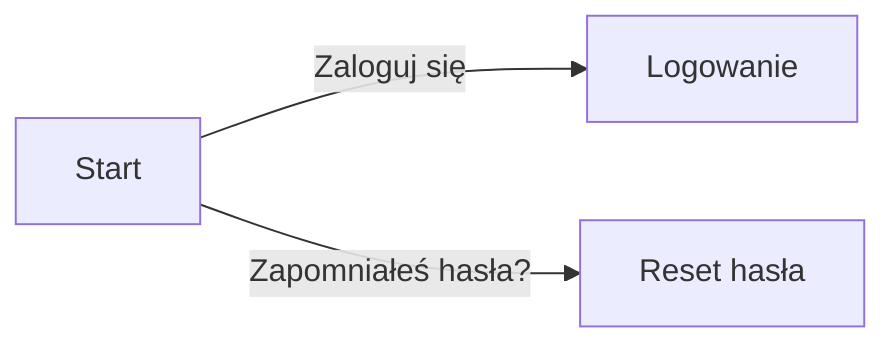

System zarządzania projektami tłumaczeniowymi będzie posiadał klasyczny system logowania, który umożliwi użytkownikom dostęp do aplikacji poprzez podanie loginu i hasła. W przypadku zapomnienia hasła, użytkownicy będą mogli skorzystać z funkcji resetu hasła, która pozwoli na ustawienie nowego hasła.

#### Zarządzanie kontem i sesją

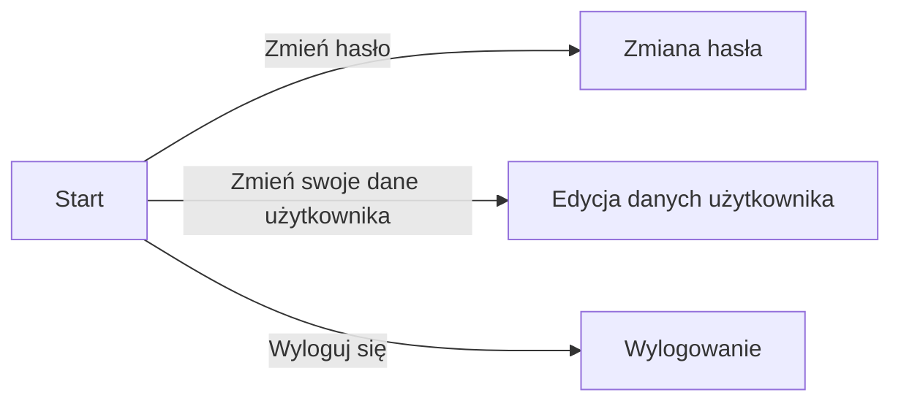

Użytkownicy systemu będą mieli możliwość zarządzania swoim kontem i sesją, co pozwoli na dostosowanie ustawień do swoich potrzeb. Będą mogli zmieniać hasło, adres e-mail oraz swoje dane użytkownika, a także wylogować się z aplikacji.

#### Przepływ zarządzania użytkownikami

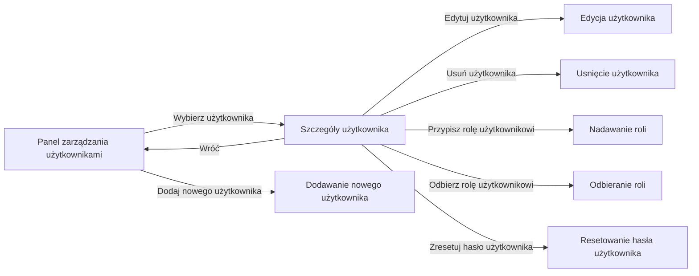

System będzie umożliwiał zarządzanie użytkownikami, co pozwoli na kontrolę nad dostępem do aplikacji oraz nad uprawnieniami poszczególnych użytkowników. Będzie możliwe wyświetlanie, edytowanie, usuwanie, przypisywanie ról oraz resetowanie haseł użytkowników, a także dodawanie nowych użytkowników.

#### Przepływ procesu zarządzania projektami

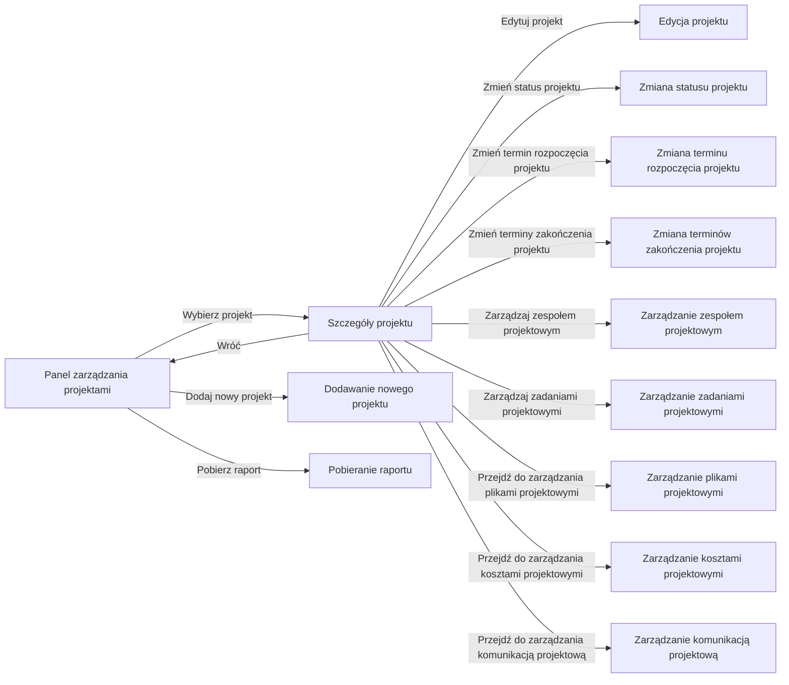
__Schema:__ Przepływ zarządzania projektami

W systemie zostanie zaimplementowany rozbudowany system zarządzania projektami, co pozwoli na kontrolę nad wszystkimi aspektami realizacji w jednym miejscu.

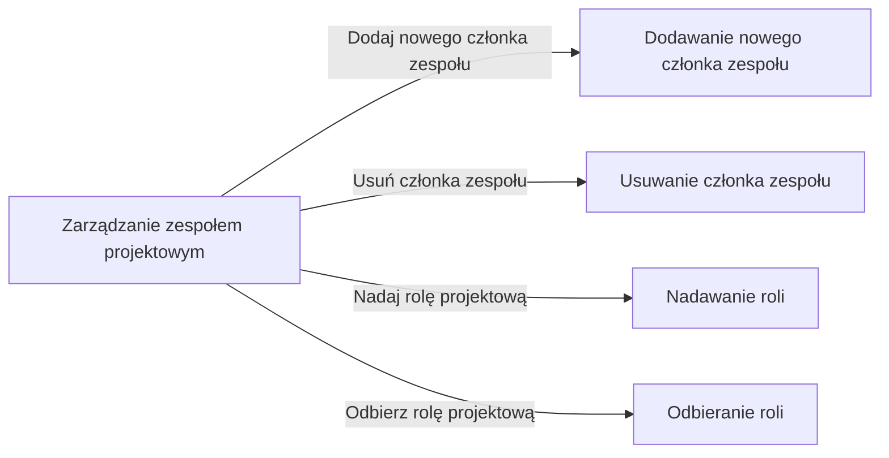
__Schema:__ Przepływ zarządzania zespołem projektowym z poziomu projektu

Zarządzanie zespołem projektowym będzie umożliwiało kontrolę nad składem zespołu projektowego, a także nad nadawaniem i odbieraniem ról projektowych.

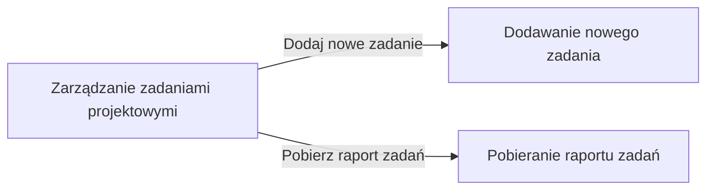
__Schema:__ Przepływ zarządzania zadaniami projektowymi z poziomu projektu

Tworzenie zadań projektowych będzie umożliwiało podział projektu na mniejsze części, co pozwoli na lepszą kontrolę nad realizacją projektu.

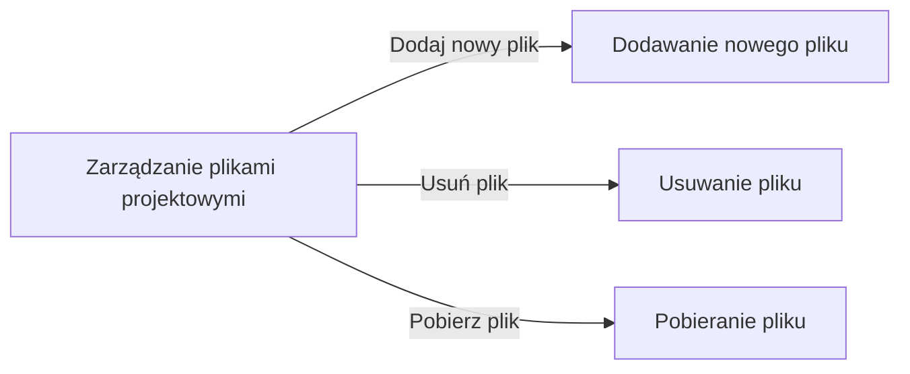
__Schema:__ Przepływ zarządzania plikami projektowymi z poziomu projektu

Dla każdego projektu zostanie zaimplementowane centralne repozytorium plików, co pozwoli na przechowywanie i zarządzanie plikami projektowymi w jednym miejscu.

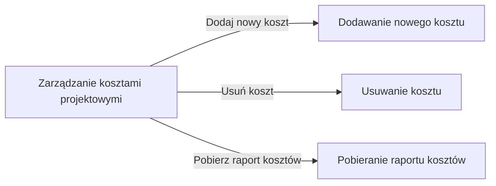
__Schema:__ Przepływ zarządzania kosztami projektowymi z poziomu projektu

Zarządzanie kosztami projektowymi będzie umożliwiało kontrolę nad kosztami związanymi z realizacją projektu, a także nad dodawaniem i usuwaniem kosztów.


__Schema:__ Przepływ zarządzania komunikacją projektową z poziomu projektu

Zarządzanie komunikacją projektową będzie umożliwiało kontrolę nad komunikacją w ramach projektu, a także nad dodawaniem nowych wątków komunikacyjnych.

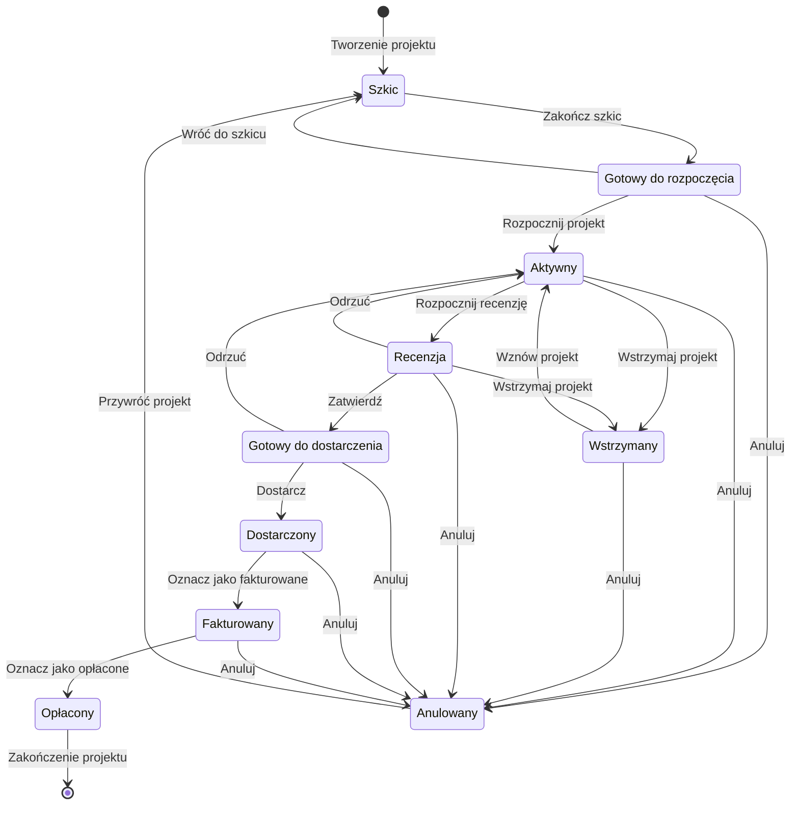
__Schema:__ Cykl życia projektu

Status projektu będzie narzędziem do kontrolowania postępów projektu, co pozwoli na lepszą organizację i zarządzanie realizacją projektu.

#### Przepływ zarządzania zadaniami projektowymi

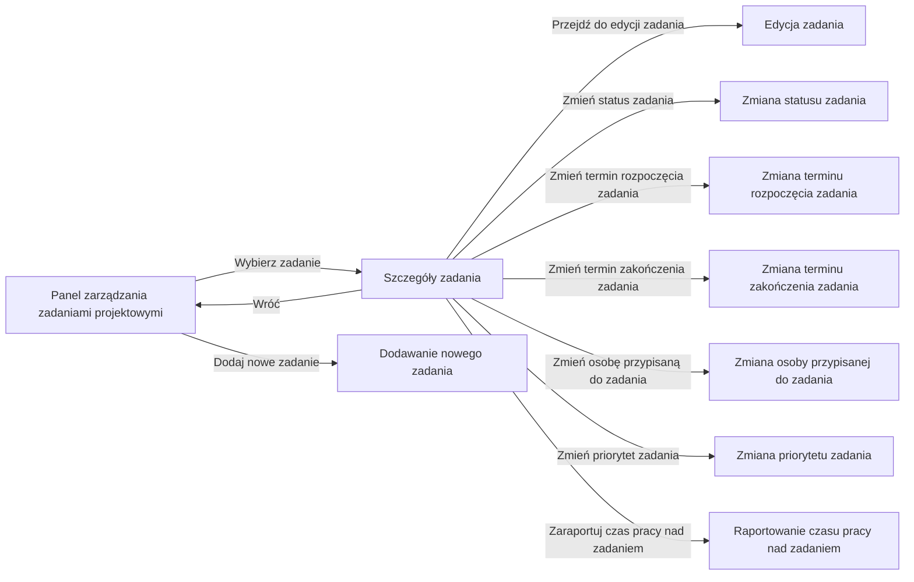

System będzie posiadać rozbudowane narzędzia do zarządzania zadaniami projektowymi, co pozwoli na kontrolę nad wszystkimi aspektami realizacji zadań w ramach projektów tłumaczeniowych. Będzie możliwe wyświetlanie, edytowanie, zmiana statusu, zmiana terminu rozpoczęcia, zmiana terminu zakończenia, zmiana osoby przypisanej oraz zmiana priorytetu zadań, a także dodawanie nowych zadań.

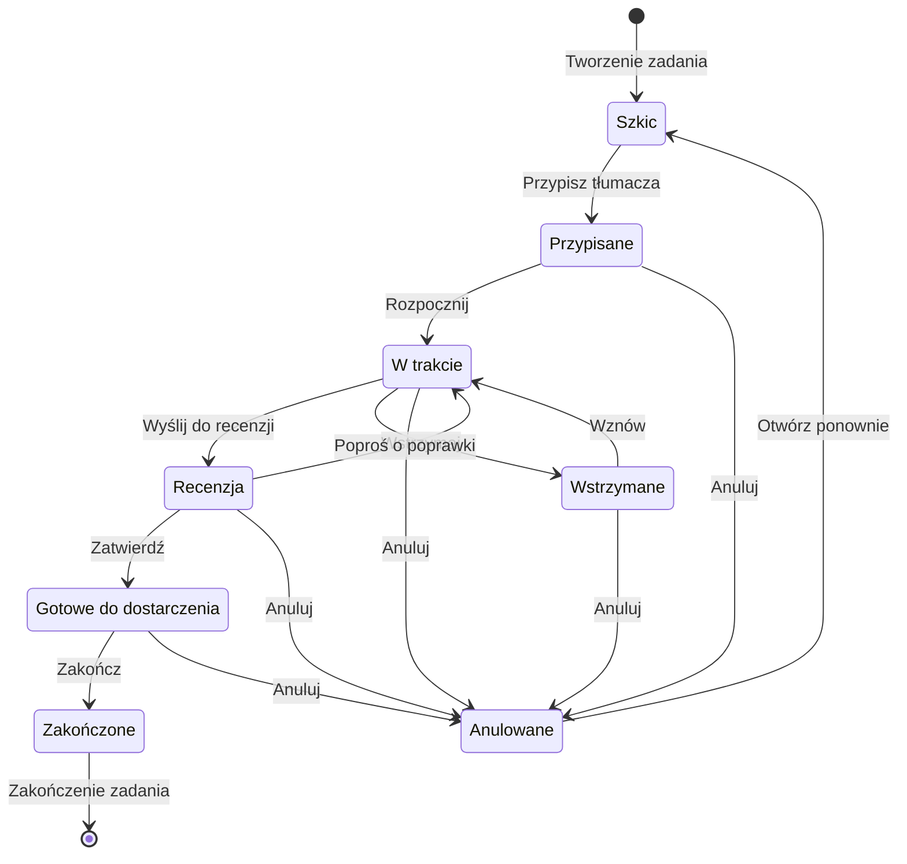

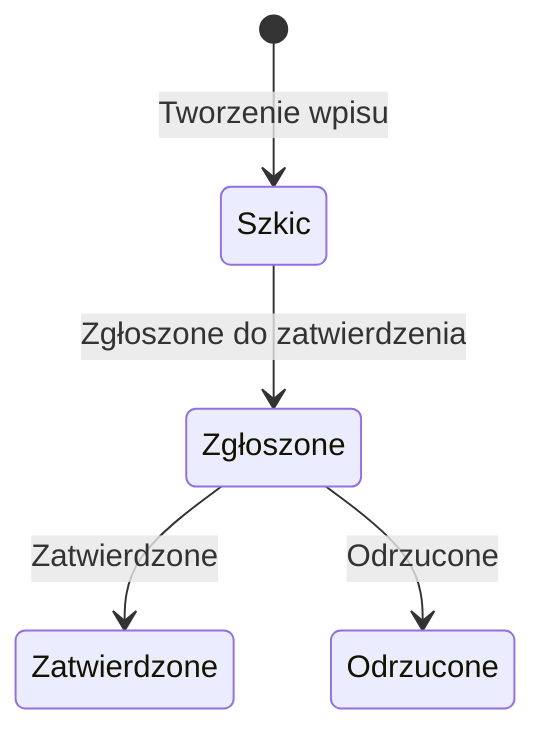

### Przepływ interakcji z wątkami komunikacyjnymi

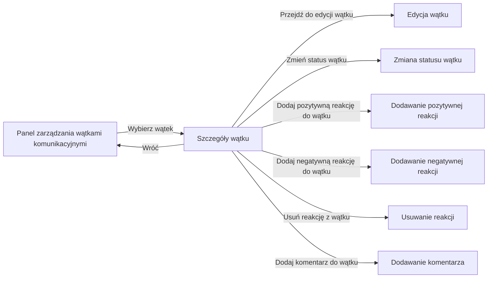

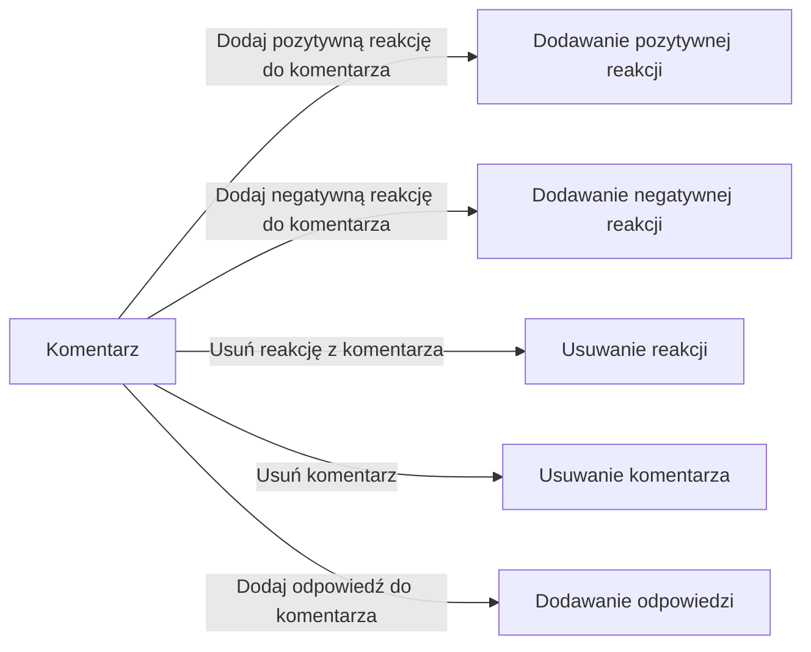

System będzie posiadać rozbudowane narzędzia do zarządzania wątkami komunikacyjnymi, co pozwoli na kontrolę nad wszystkimi aspektami komunikacji w ramach projektów tłumaczeniowych. Będzie możliwe wyświetlanie, edytowanie, zmiana statusu, dodawanie reakcji, usuwanie reakcji, dodawanie komentarzy, usuwanie komentarzy oraz dodawanie odpowiedzi do komentarzy.

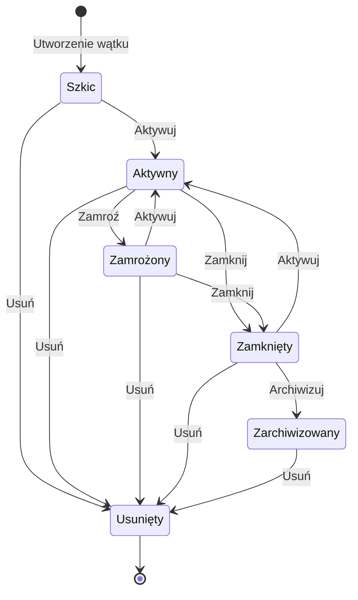

### Zarządzanie bazą klientów i słownikami

Słowniki w naszym systemie to zaawansowany mechanizm umożliwiający definiowanie i wykorzystanie niestandardowych wartości w wielu aspektach aplikacji. Pozwalają one na precyzyjne dopasowanie funkcjonalności do specyficznych potrzeb, takich jak ustalanie priorytetów zadań czy kategoryzacja kosztów.

Zaimplementowaliśmy następujące słowniki, które wspierają różnorodność i elastyczność operacji w systemie:
1. **Typ klienta** – umożliwia klasyfikację klientów, np. jako klient indywidualny, firma, instytucja itd.
2. **Dokładność tłumaczenia** – określa wymagany poziom dokładności tłumaczeń, oferując opcje takie jak dosłowne czy zrozumiałe.
3. **Kraj** – pozwala na określenie kraju, np. Polska, Niemcy, Francja, co jest kluczowe przy definiowaniu pochodzenia klienta.
4. **Waluta** – definiuje walutę operacji finansowych, taką jak złoty, euro, dolar, niezbędną przy określaniu waluty kosztów projektu.
5. **Kategoria kosztów** – umożliwia kategoryzację kosztów realizacji projektów, np. oprogramowanie, usługi kurierskie.
6. **Branża** – identyfikuje branżę, do której należy projekt, np. medycyna, prawo, technologia, co ułatwia jego klasyfikację.
7. **Język** – kluczowy dla projektów tłumaczeniowych, definiuje języki, np. polski, niemiecki, francuski.
8. **Priorytet zadania** – pozwala na określenie ważności zadania, z opcjami takimi jak niski, średni, wysoki.
9. **Typ usługi** – wskazuje rodzaj świadczonej usługi, np. tłumaczenie, korekta, redakcja.
10. **Jednostka rozliczeniowa** – definiuje jednostki, na podstawie których rozliczane są usługi, np. słowo, strona, godzina.

Dodatkowo, baza klientów działa jako specjalny typ słownika, przechowujący kompleksowe informacje o klientach, w tym nazwę, adres, kraj pochodzenia, preferowaną walutę, branżę itp. Ta baza znajduje zastosowanie w różnych segmentach aplikacji, na przykład przy definiowaniu klienta dla danego projektu, zapewniając spersonalizowaną i efektywną obsługę.

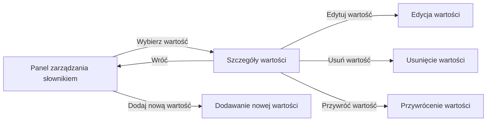

## Stos technologiczny

### Postanowienia ogólne w wyborze technologii

Wybierając stos technologiczny dla systemu organizacji pracy w biurze tłumaczeń, istnieje wiele ogólnych postanowień, które warto wziąć pod uwagę. Stos technologiczny to zestaw narzędzi, frameworków, języków programowania i infrastruktury, które zostaną wykorzystane do budowy i zarządzania systemem. Oto kilka kluczowych aspektów, które postanowiono rozważyć przy wyborze stosu technologicznego[1]:

1. **Cel i wymagania systemu**: Jakie funkcje i możliwości ma zapewnić system? Jakie problemy ma rozwiązywać? To pomoże w określeniu, jakie technologie najlepiej spełnią te cele.

2. **Skalowalność**: System musi być elastyczny, umożliwiający nie tylko obsługę większej liczby użytkowników, ale też łatwą adaptację do nowych funkcji i wymagań.

3. **Bezpieczeństwo**: Bezpieczeństwo jest kluczowym aspektem w biurze tłumaczeń, gdzie dane klientów mogą być poufne. Należy wybierać technologie, które zapewnią odpowiednie mechanizmy ochrony danych, uwzględniając kwestie takie jak szyfrowanie i autoryzacja, zarządzanie dostępem oraz obrona przed atakami z zewnątrz.

4. **Integracje**: Wybrane technologie powinne pozwalać na łatwe integrowanie się z innymi narzędziami i systemami, które biuro tłumaczeń już używa, na przykład z narzędziami do zarządzania projektami, systemami CRM, API zewnętrznych dostawców czy narzędziami do tłumaczeń.

5. **Wspieranie języków**: Specyfika pracy biura tłumaczeń często ma za sobą obsługę wielu języków, ważne jest, aby stos technologiczny obsługiwał różne zestawy znaków i mógł być dostosowany do specyfiki różnych języków.

6. **Łatwość utrzymania i rozwoju**: Należy wybierać technologie, które są stosunkowo łatwe do utrzymania i rozwijania. To pomoże zminimalizować koszty eksploatacji i zapewnić, że system będzie gotowy na przyszłe zmiany i ulepszenia.

7. **Wsparcie społeczności i dokumentacja**: Ważne jest też sprawdzić, czy wybrane technologie cieszą się wsparciem społeczności programistycznej, co ułatwi rozwiązywanie problemów i znajdowanie odpowiedzi na pytania. Również dostępność do dobrej dokumentacji jest kluczowa. W przyszłości, wybór popularnych i lubianych technologii może ułatwić znalezienie nowych pracowników do zespołu utrzymania i rozwoju systemu. Narzędzia, lubiane przez społeczność, są zwykle dłużej utrzymywane i rozwijane, co jest ważne w przypadku długoterminowego projektu.

8. **Koszty**: Koszty są istotnym czynnikiem. Każde biuro tłumaczeń ma inne możliwości finansowe, ale wszystkie chcą zapewnić że koszt utrzymania i rozwoju systemu będzie jak najniższy. Dla tego ważne jest, aby wybierać technologie, które oferują najlepszy stosunek ceny do wartości, uwzględniając zarówno darmowe, jak i płatne opcje.

9. **Zgodność z przepisami prawno-regulacyjnymi**: Jeśli biuro tłumaczeń obsługuje tłumaczenia o charakterze prawnym, medycznym lub innym specjalistycznym, należy upewnić się, że wybrane technologie pomogą w spełnieniu wymogów prawnych i regulacyjnych.

Żródła:

1. https://www.softermii.com/blog/10-tips-in-choosing-the-best-tech-stack-for-your-web-application

### Interfejs użytkownika

Interfejs użytkownika (UI), czasem nazywany interfejsem graficznym użytkownika (GUI), stanowi kluczową część oprogramowania, umożliwiającą interakcję między użytkownikiem a systemem komputerowym. To właśnie dzięki UI użytkownik obcuje z aplikacją; zawiera on przyciski, pola tekstowe, menu, ikony i inne elementy nawigacyjne. Istotą dobrze zaprojektowanego interfejsu jest jego intuicyjność i użyteczność, co jest szczególnie ważne w systemach służących do organizacji pracy, gdyż są one używane przez użytkowników na co dzień.

W kontekście tworzonego systemu do organizacji pracy biura tłumaczeń, postanowiono, aby interfejs użytkownika przybrał formę aplikacji webowej. Wybór ten podyktowany jest wieloma zaletami aplikacji internetowych, wśród których warto wymienić:

1. **Dostępność z różnych lokalizacji i urządzeń**: Aplikacje webowe są dostępne poprzez przeglądarki internetowe. Umożliwia to korzystanie z systemu z dowolnego miejsca świata oraz na różnorodnych urządzeniach - od komputerów po smartfony. Taka elastyczność jest kluczowa dla biura tłumaczeń, gdzie mobilność i zdalna praca są na porządku dziennym.
2. **Prostota aktualizacji i konserwacji**: Aplikacje webowe są łatwe do aktualizacji. Zmiany są wprowadzane centralnie i natychmiast dostępne dla wszystkich użytkowników, eliminując potrzebę indywidualnych aktualizacji na poszczególnych urządzeniach.
3. **Skalowalność**: Aplikacje te mogą być dostosowane do potrzeb zarówno małych biur tłumaczeń, jak i dużych korporacji. W miarę wzrostu firmy, system może być odpowiednio rozbudowywany.
4. **Bezpieczeństwo**: Poprzez zastosowanie odpowiednich protokołów i mechanizmów, takich jak szyfrowanie danych czy uwierzytelnienie, aplikacje webowe mogą zapewnić wysoki poziom bezpieczeństwa.

Po wyborze formy aplikacji internetowej na interfejs użytkownika, kluczowym stało się określenie technologii niezbędnych do jego realizacji. W świetle przyjętych założeń projektowych, postanowiono wykorzystać:

1. **React**: To dynamicznie rozwijana biblioteka JavaScript, przeznaczona do tworzenia interfejsów użytkownika[1]. React pozwala na budowę modułowych, łatwych do zarządzania komponentów, które można wielokrotnie wykorzystywać w różnych częściach aplikacji. Ważne jest, że React, jako biblioteka, skupia się głównie na interfejsie użytkownika, pozostawiając programiście swobodę w wyborze innych narzędzi do zarządzania stanem aplikacji czy nawigacją.
2. **Typescript**: To rozszerzenie języka JavaScript, które wprowadza m.in. statyczne typowanie[2]. Dzięki temu pozwala wyłapać wiele błędów jeszcze przed uruchomieniem kodu, co przekłada się na większą stabilność i bezpieczeństwo aplikacji.
3. **Material Design**: Zestaw wytycznych i zasad projektowania interfejsów, stworzony przez Google[3]. Skupia się na tworzeniu spójnych, intuicyjnych i nowoczesnych aplikacji. Wykorzystanie gotowych komponentów zgodnych z Material Design, takich jak te dostarczane przez MUI[4], przyspiesza proces tworzenia aplikacji i gwarantuje estetyczny oraz ujednolicony wygląd.

Kombinacja React z TypeScriptem zapewnia solidne podstawy do tworzenia stabilnych i wydajnych aplikacji. Material Design, z kolei, gwarantuje intuicyjny i estetyczny interfejs, co przekłada się na lepsze doświadczenie użytkownika.

Źródła:

1. React - [https://react.dev/](https://react.dev/)
2. Typescript - [https://www.typescriptlang.org/](https://www.typescriptlang.org/)
3. Material Design - [https://m3.material.io/](https://m3.material.io/)
4. MUI - [https://mui.com/](https://mui.com/)

### Serwer aplikacji

Serwer aplikacji służy jako centralne miejsce przetwarzania danych oraz zarządzania operacjami biznesowymi. Musi być on wydajny, skalowalny oraz łatwy w utrzymaniu. 

Kierując się zasadami określonymi w sekcji [Postanowienia ogólne w wyborze technologii](#postanowienia-ogólne-w-wyborze-technologii), podjęto decyzję o implementacji serwera aplikacji w formie usługi sieciowej bazującej na architekturze REST. Usługa sieciowa to aplikacja oferująca interfejs programistyczny (API), umożliwiający komunikację z innymi aplikacjami. Architektura REST (Representational State Transfer) stanowi obecnie dominujący standard tworzenia API. Charakteryzuje się ona oparciem o zasoby i definiuje sposób komunikacji między klientem a serwerem. Warto również podkreślić, że REST jest niezależny od protokołu, co pozwala na jego zastosowanie z różnymi protokołami, takimi jak HTTP, HTTPS, TCP, UDP i inne.

Do realizacji tego projektu wybrano następujące technologie:

1. **Spring Framework**: Jest to sprawdzony w praktyce szkielet do tworzenia aplikacji[1]. Dzięki niemu łatwiej jest budować zaawansowane systemy, ponieważ oferuje on gotowe rozwiązania dla wielu aspektów rozwoju oprogramowania, takich jak wstrzykiwanie zależności, bezpieczeństwo, obsługa błędów, a także obsługa baz danych. Jego elastyczność czyni go doskonałym wyborem do tworzenia usług REST-owych.
2. **Spring Boot**: Uproszczony start z Spring[2]. Dzięki Spring Boot możemy ominąć wiele kroków konfiguracyjnych wymaganych przy tradycyjnym podejściu do Springa, przyspieszając tym samym rozwój aplikacji.
3. **Spring Cloud**: Zestaw narzędzi zoptymalizowany do tworzenia aplikacji rozproszonych[3]. Dzięki niemu łatwiej jest zarządzać problemami typowymi dla systemów rozproszonych, takimi jak odkrywanie usług czy obsługa obciążenia.
4. **Spring Data**: Ułatwia interakcję z bazami danych poprzez abstrakcję na poziomie repozytorium[4], eliminując potrzebę ręcznego pisania zapytań do bazy. Zintegrowane rozwiązania dla różnych baz danych pozwalają na łatwe zarządzanie i manipulację danymi.
5. **Spring Security**: Framework skoncentrowany na zapewnieniu szerokiego zakresu funkcji autentykacji i autoryzacji[5]. Oferuje wsparcie dla różnych mechanizmów bezpieczeństwa, takich jak uwierzytelnianie oparte na formularzach, OAuth2 czy JWT.
6. **Język Kotlin**: Chociaż Kotlin[6] jest często kojarzony z programowaniem aplikacji mobilnych, znalazł on również szerokie zastosowanie w środowisku backendowym. Jego ekspresywna składnia oraz silne wsparcie dla bezpieczeństwa typów czynią go atrakcyjnym wyborem dla wielu programistów. Kotlin jest kompatybilny z Java, co umożliwia korzystanie z bogatego ekosystemu tej technologii, w tym z frameworku Spring.

Kluczową zaletą skorzystania z technologii Spring oraz jej podprojektów jest ich dojrzałość, wsparcie społeczności oraz bogactwo funkcjonalności. Spring Framework stał się de facto standardem w świecie aplikacji Java. Jego modułowość, szeroki zakres funkcji i elastyczność stanowią silne podstawy do tworzenia niezawodnych i wydajnych aplikacji. Kotlin, jako język programowania, dodaje wartość dzięki swojej ekspresywności, bezpieczeństwu i kompatybilności z technologią Java. W połączeniu z frameworkiem Spring, Kotlin może naprawdę przyspieszyć rozwój projektu, jednocześnie zapewniając wysoką jakość kodu.

Źródła:

1. Spring Framework - [https://spring.io/projects/spring-framework](https://spring.io/projects/spring-framework)
2. Spring Boot - [https://spring.io/projects/spring-boot](https://spring.io/projects/spring-boot)
3. Spring Cloud - [https://spring.io/projects/spring-cloud](https://spring.io/projects/spring-cloud)
4. Spring Data - [https://spring.io/projects/spring-data](https://spring.io/projects/spring-data)
5. Spring Security - [https://spring.io/projects/spring-security](https://spring.io/projects/spring-security)
6. Kotlin - [https://kotlinlang.org/](https://kotlinlang.org/)

### Przechowywanie danych

Przechowywanie danych to kluczowy aspekt każdej aplikacji. Wybór odpowiednich technologii do przechowywania, zarządzania i odzyskiwania danych jest niezbędny dla zapewnienia wydajności, niezawodności i elastyczności systemu.

Opierając się na wcześniej ustalonych zasadach, zdefiniowanych w sekcji [Postanowienia ogólne w wyborze technologii](#postanowienia-ogólne-w-wyborze-technologii), dokonano wyboru technologii przechowywania danych w następujący sposób:

1. **Postgres**: Jest to jedna z najbardziej zaawansowanych baz danych typu open-source na świecie. Postgres oferuje wsparcie dla transakcji, zaawansowane funkcje indeksowania, możliwość przechowywania różnorodnych typów danych i wiele innych funkcji niezbędnych do skutecznego zarządzania danymi w skali dużych aplikacji. Jego niezawodność, skalowalność oraz wsparcie dla procedur składowanych i wyzwalaczy czynią go idealnym wyborem dla przechowywania głównych danych aplikacyjnych.
2. **Redis**: To bardzo wydajna, in-memory baza danych, która często jest wykorzystywana jako system cache. Dzięki przechowywaniu danych w pamięci RAM, Redis oferuje błyskawiczny czas dostępu do danych, co jest niezwykle przydatne dla operacji wymagających szybkiego odczytu. Redis jest nie tylko systemem pamięci podręcznej, ale również oferuje struktury danych, takie jak listy, zestawy, mapy i kolejki, co sprawia, że jest wszechstronnym narzędziem do różnorodnych zastosowań w aplikacji.
3. **MinIO**: MinIO to wysokiej wydajności, rozproszony magazyn plików i obiektów. Dzięki swojej skalowalności i wydajności jest idealny do przechowywania dużych ilości plików, takich jak obrazy, filmy czy dokumenty. MinIO zapewnia też funkcje takie jak szyfrowanie, replikacja czy wersjonowanie obiektów. Jego architektura API jest kompatybilna z Amazon S3, co czyni go łatwym w integracji z wieloma aplikacjami i narzędziami dostępnymi na rynku.

Wspólnie, te technologie tworzą kompleksowy ekosystem przechowywania danych, który może sprostać różnorodnym wymaganiom aplikacji, zarówno pod względem wydajności, jak i bezpieczeństwa. Poprzez połączenie relacyjnej bazy danych (Postgres) z szybką pamięcią podręczną (Redis) oraz skalowalnym magazynem plików (MinIO), aplikacja jest w stanie efektywnie zarządzać danymi w różnorodnych scenariuszach użycia.

### Zewnętrzne API

W erze cyfrowej wiele aplikacji polega na zewnętrznych źródłach danych, które oferują specyficzne informacje lub funkcje. Zewnętrzne API (Application Programming Interface) umożliwiają aplikacjom dostęp do takich danych w sposób ustrukturyzowany i automatyczny. W projekcie zdecydowano się skorzystać z trzech kluczowych zewnętrznych API, aby uzyskać dostęp do różnych zestawów danych i funkcji:

1. **Restcountries**
    - **Opis**: Restcountries to publiczne API dostarczające informacji na temat różnych krajów na świecie. Umożliwia użytkownikom dostęp do szczegółów takich jak nazwa kraju, stolica, populacja, waluta, język, flaga i wiele innych.
    - **Zastosowanie**: Wykorzystanie tego API pozwala na bieżące informacje dotyczące krajów, co może być przydatne w wielu aplikacjach, zwłaszcza tych o charakterze międzynarodowym.
    - **Link**: [https://restcountries.com/](https://restcountries.com/)

2. **SIL International Code Tables**
    - **Opis**: SIL International Code Tables oferują kody dla różnych języków, krajów oraz skryptów. Są one szeroko używane w międzynarodowych projektach oraz w badaniach lingwistycznych.
    - **Zastosowanie**: Dzięki temu API aplikacja może identyfikować języki, kraje i skrypty za pomocą standardowych kodów, co zapewnia spójność danych i ułatwia integrację z innymi systemami.
    - **Link**: [https://iso639-3.sil.org/code_tables](https://iso639-3.sil.org/code_tables)

3. **Exchangerate.host**
    - **Opis**: Exchangerate.host to bezpłatne API umożliwiające dostęp do aktualnych kursów walut oraz historycznych danych. API korzysta z różnych źródeł, aby zapewnić dokładne i aktualne informacje.
    - **Zastosowanie**: W aplikacjach biznesowych, zwłaszcza w tych, które obsługują różne waluty, aktualne kursy walut są niezbędne. Exchangerate.host jest nieocenionym narzędziem w takich przypadkach, umożliwiając łatwą konwersję walut oraz analizę historycznych trendów kursów walut.
    - **Link**: [https://exchangerate.host/](https://exchangerate.host/)

Współczesne aplikacje często opierają się na zewnętrznych źródłach danych, które wzbogacają ich funkcjonalność i zapewniają wartość dodaną dla użytkowników. Wybór odpowiednich API jest kluczowy dla funkcjonalności i niezawodności aplikacji. Restcountries, SIL International Code Tables i Exchangerate.host zostały wybrane ze względu na ich niezawodność, dokładność danych oraz łatwość integracji. Korzystanie z tych API umożliwi aplikacji dostarczanie dokładnych i aktualnych danych w różnych kontekstach, od informacji geograficznych i lingwistycznych po finansowe.

### Monitorowanie i analiza pracy aplikacji

Monitorowanie i analiza działania aplikacji są kluczowymi elementami w procesie zarządzania i utrzymania oprogramowania. Umożliwiają one identyfikację i rozwiązywanie problemów, a także dostarczają cennych informacji na temat wydajności i zachowania użytkowników. Jednym z najbardziej popularnych rozwiązań na rynku, które pozwala na kompleksową analizę danych operacyjnych z aplikacji, jest stos ELK, składający się z trzech głównych komponentów: Elasticsearch, Logstash i Kibana.

1. **Elasticsearch**: Jest to silnik wyszukiwania i analizy w czasie rzeczywistym oparty na Lucene. Pozwala na przechowywanie, indeksowanie i analizę dużych ilości danych. Jest wysoce skalowalny i może przetwarzać terabajty danych w ciągu sekund. Elasticsearch zapewnia możliwość szybkiego wyszukiwania i agregacji danych, co jest kluczowe dla monitorowania i analizy w czasie rzeczywistym.

2. **Logstash**: To narzędzie służące do zbierania, przetwarzania i przesyłania logów i danych operacyjnych do różnych miejsc przechowywania, w tym do Elasticsearch. Logstash jest niezwykle elastyczny i pozwala na zbieranie danych z różnych źródeł, ich przetwarzanie (np. filtracja, wzbogacanie) oraz przesyłanie do wielu różnych celów.

3. **Kibana**: Jest to narzędzie do wizualizacji danych przechowywanych w Elasticsearch. Umożliwia tworzenie różnorodnych dashboardów, map cieplnych, wykresów i tabel, które pozwalają na dogłębną analizę zgromadzonych danych. Dzięki Kibanie, zespoły IT mogą w łatwy sposób monitorować wydajność aplikacji, identyfikować problemy oraz analizować zachowanie użytkowników.

Korzystanie z ELK w kontekście monitorowania aplikacji daje wiele korzyści:

- **Szybkość reakcji**: Dzięki analizie w czasie rzeczywistym możliwe jest szybkie wykrywanie i rozwiązywanie problemów związanych z wydajnością, błędami czy awariami.
  
- **Elastyczność**: Stos ELK pozwala na integrację z wieloma źródłami danych, co umożliwia zbieranie i analizę informacji z różnych części systemu.
  
- **Skalowalność**: ELK jest w stanie obsłużyć bardzo duże ilości danych, dzięki czemu nadaje się do monitorowania zarówno małych aplikacji, jak i dużych systemów enterprise.
  
- **Personalizacja**: Możliwość dostosowywania dashboardów w Kibana do indywidualnych potrzeb pozwala na tworzenie spersonalizowanych widoków dla różnych użytkowników i zespołów.

Podsumowując, stos ELK jest potężnym narzędziem, które pozwala na kompleksowe monitorowanie i analizę działania aplikacji. Jego modułowa budowa oraz integracja z wieloma źródłami danych sprawiają, że jest to jedno z najlepszych rozwiązań dostępnych na rynku w zakresie analizy operacyjnej.

### Testowanie

W dzisiejszym świecie programistycznym nie można podważać znaczenia testowania. Właściwie przetestowane oprogramowanie nie tylko zwiększa zaufanie do kodu, ale również pozwala deweloperom na szybkie wprowadzanie zmian, mając pewność, że nie wprowadzają regresji. W ekosystemie Java dwa najpopularniejsze narzędzia używane do testowania jednostkowego to JUnit i Mockito.

1. **JUnit**: Jest to ramka do testowania jednostkowego dla języka Java. JUnit umożliwia szybkie i skuteczne testowanie fragmentów kodu, zwanych jednostkami, w izolowanym środowisku. Nowa wersja, JUnit 5, wprowadza wiele ulepszeń, takich jak możliwość grupowania testów czy parametryzowania, co sprawia, że testowanie staje się jeszcze bardziej elastyczne i wydajne.

2. **Mockito**: To biblioteka do tworzenia atrap (ang. mock) obiektów w testach jednostkowych w Javie. Mockito pozwala na symulowanie zachowania zewnętrznych zależności w testowanych jednostkach, dzięki czemu testy są naprawdę niezależne od zewnętrznego środowiska. Dzięki temu deweloperzy mogą skupić się na testowaniu konkretnego zachowania, a nie całego systemu.

Aby w pełni korzystać z możliwości JUnit i Mockito, ważne jest, aby pisać kod, który jest łatwy do testowania. Oto kilka wskazówek, jak to osiągnąć:

- **Modularyzacja**: Kod powinien być podzielony na mniejsze, niezależne moduły lub klasy. Dzięki temu można testować każdy fragment osobno, co ułatwia identyfikację i naprawę błędów.

- **Unikanie zbyt wielu zależności**: Im mniej zależności ma dana klasa, tym łatwiej jest ją przetestować. Gdzie to możliwe, należy korzystać z wstrzykiwania zależności, co pozwala na łatwą zamianę rzeczywistych komponentów na atrapy w testach.

- **Przejrzystość funkcji**: Każda funkcja lub metoda powinna wykonywać jedno konkretne zadanie. Nie tylko ułatwia to testowanie, ale również sprawia, że kod jest czytelniejszy i łatwiejszy do utrzymania.

- **Korzystanie z interfejsów**: W Javie korzystanie z interfejsów pozwala na tworzenie bardziej elastycznego i łatwego do testowania kodu. Mockito doskonale radzi sobie z naśladowaniem interfejsów, co ułatwia symulację zachowań w testach.

- **Unikanie kodu statycznego i singletonów**: Są one trudne do testowania i mogą prowadzić do problemów z izolacją w testach. Zamiast tego lepiej korzystać z wzorców projektowych, które umożliwiają lepszą kontrolę nad zależnościami.

Podsumowując, testowanie jest kluczowym elementem cyklu życia oprogramowania. Korzystając z narzędzi takich jak JUnit i Mockito oraz pisząc kod z myślą o testowalności, deweloperzy mogą znacznie zwiększyć jakość swojego oprogramowania, zredukować liczbę błędów i usprawnić proces wdrażania zmian.

### Wdrożenie

Wdrożenie oprogramowania to kluczowy etap w cyklu życia projektu, który ma na celu umożliwienie użytkownikom dostępu do aplikacji w środowisku produkcyjnym. Współczesne praktyki w zakresie wdrażania skupiają się na automatyzacji, reprodukowalności i skalowalności rozwiązań. Jednym z narzędzi, które odmieniło podejście do wdrażania i zarządzania aplikacjami, jest Docker. Docker to platforma, która pozwala na tworzenie, wdrażanie i uruchamianie aplikacji w kontenerach. Konteneryzacja, czyli izolowanie aplikacji w kontenerach, przypomina działanie maszyn wirtualnych, ale jest bardziej lekka i elastyczna.

Kluczowe korzyści wynikające z użycia Dockera w procesie wdrożenia:

- **Reprodukowalność**: Dzięki Dockerowi, aplikacja działa identycznie w każdym środowisku, od deweloperskiego po produkcyjne. Kontenery zawierają wszystko, co potrzebne do działania aplikacji, co eliminuje problem "u mnie działa".

- **Izolacja**: Każdy kontener działa niezależnie, co oznacza, że jedna aplikacja nie wpływa na działanie innych. To idealne rozwiązanie dla mikrousług lub gdy kilka aplikacji działa na jednym serwerze.

- **Skalowalność**: Docker współpracuje z narzędziami do orkiestracji, takimi jak Kubernetes, co umożliwia automatyczne skalowanie aplikacji w zależności od obciążenia.

- **Szybkość**: Kontenery Dockera są lżejsze niż tradycyjne maszyny wirtualne i uruchamiają się szybciej. Pozwala to na błyskawiczne wdrożenia i aktualizacje.

- **Integracja z CI/CD**: Docker może być zintegrowany z narzędziami do ciągłej integracji i dostarczania (CI/CD), co automatyzuje proces budowania, testowania i wdrażania aplikacji.

**Proces wdrożenia z Dockerem**:

1. **Tworzenie obrazu**: Pierwszym krokiem jest stworzenie obrazu Dockera na podstawie pliku `Dockerfile`, który opisuje, jak skonfigurować środowisko dla aplikacji. Obraz ten zawiera wszystkie zależności potrzebne do działania aplikacji.

2. **Przechowywanie obrazów**: Po utworzeniu obraz można go przechowywać w repozytorium, takim jak Docker Hub lub prywatne repozytorium. Umożliwia to łatwe rozpowszechnianie obrazu wśród członków zespołu lub w różnych środowiskach.

3. **Uruchamianie kontenera**: Z obrazu można uruchomić kontener, który działa na docelowej maszynie lub klastrze. Kontener uruchamia aplikację w izolowanym środowisku, które zostało wcześniej zdefiniowane w `Dockerfile`.

Podsumowując, Docker odmienił sposób, w jaki myślimy o wdrożeniach, oferując rozwiązania, które są jednocześnie szybkie, niezawodne i skalowalne. Dzięki niemu zespoły mogą skupić się na tworzeniu świetnych aplikacji, mając pewność, że będą one działać tak samo w każdym środowisku.

### Uwierzytelnianie i autoryzacja

Uwierzytelnianie i autoryzacja to dwie kluczowe kwestie w zakresie bezpieczeństwa każdej aplikacji. Uwierzytelnianie polega na weryfikacji tożsamości użytkownika, podczas gdy autoryzacja określa, jakie zasoby są dostępne dla uwierzytelnionego użytkownika. W tym rozdziale przedstawimy technologie, które wspomagają te procesy: Keycloak, SSO, OIDC, OAuth2 i JWT.

1. **Keycloak**: Keycloak to otwarte oprogramowanie do zarządzania tożsamością i dostępem. Umożliwia uwierzytelnianie, autoryzację oraz centralne zarządzanie użytkownikami. Zapewnia wsparcie dla wielu protokołów uwierzytelniania, w tym SSO, OIDC i OAuth2, zarządzanie sesjami użytkowników, integrację z różnymi bazami danych użytkowników, takimi jak LDAP czy Active Directory, oraz rozbudowę poprzez dodatki.

2. **SSO (Single Sign-On)**: SSO to metoda jednokrotnego logowania, która pozwala użytkownikom na dostęp do wielu aplikacji i systemów po jednorazowym uwierzytelnieniu. Zamiast wielokrotnego logowania do różnych aplikacji, użytkownik loguje się tylko raz, a jego tożsamość jest automatycznie rozpoznawana w innych systemach.

3. **OIDC (OpenID Connect)**: OIDC to rozszerzenie protokołu OAuth2, które dodaje funkcje uwierzytelniania. Umożliwia klientom zdobycie informacji o tożsamości uwierzytelnionego użytkownika.

4. **OAuth2**: OAuth2 to protokół autoryzacji, umożliwiający aplikacjom ograniczony dostęp do kont użytkowników w innych usługach. Na przykład, użytkownik może pozwolić aplikacji A na dostęp do jego danych w usłudze B, nie udostępniając swojego hasła do usługi B.

5. **JWT (JSON Web Token)**: JWT to standard kodowania informacji o użytkowniku w postaci tokena. Jest on cyfrowo podpisany, co gwarantuje jego autentyczność i integralność. Może być używany do przesyłania informacji o tożsamości użytkownika między systemami.

Korzystając z tych technologii, możemy stworzyć zaawansowany system uwierzytelniania i autoryzacji. Dzięki Keycloak, który może służyć jako centralny serwer uwierzytelniania, możemy wdrożyć SSO we wszystkich naszych aplikacjach. Gdy użytkownik loguje się po raz pierwszy, Keycloak generuje token JWT, który jest przekazywany do aplikacji. Token ten potwierdza tożsamość użytkownika i może zawierać informacje o jego uprawnieniach, bazując na protokołach takich jak OIDC i OAuth2.

Odpowiednia konfiguracja uwierzytelniania i autoryzacji jest kluczem do ochrony danych i zasobów przed nieuprawnionym dostępem, jednocześnie gwarantując użytkownikom łatwy dostęp do potrzebnych zasobów. Wspomniane technologie pozwalają zbudować bezpieczny i wydajny system uwierzytelniania.

## Implementacja

### Przygotowanie środowiska
#### Instalacja Node.js

Node.js to środowisko uruchomieniowe JavaScript, umożliwiające wykonywanie kodu JavaScript poza przeglądarką. W naszym projekcie Node.js będzie używane głównie do uruchomienia serwera deweloperskiego dla Reacta, co umożliwi efektywny rozwój i testowanie aplikacji front-endowej. Dzięki temu programiści będą mogli korzystać z funkcji, takich jak "hot reloading", co znacząco przyspiesza proces tworzenia oprogramowania. 

Node.js dostarcza również menedżera pakietów npm, który jest niezbędnym narzędziem dla każdego programisty JavaScript. Npm pozwala na zarządzanie zależnościami projektu i jest wykorzystywany do instalowania, udostępniania i zarządzania zależnościami (takimi jak biblioteki i narzędzia), które są niezbędne do rozwoju aplikacji.

Aby zainstalować Node.js na Windowsie, należy pobrać instalator z oficjalnej strony projektu Node.js i postępować zgodnie z instrukcjami wyświetlanymi przez instalator. Po zakończeniu instalacji, można sprawdzić poprawność instalacji, otwierając wiersz poleceń i wpisując polecenie `node -v`. Prawidłowa odpowiedź powinna zawierać numer zainstalowanej wersji Node.js. Aby sprawdzić czy npm został poprawnie zainstalowany razem z Node.js, można użyć polecenia `npm -v`, które także powinno zwrócić numer wersji.

#### Instalacja Docker

Docker to platforma umożliwiająca konteneryzację aplikacji, co sprawia, że aplikacje są izolowane w kontenerach, co z kolei umożliwia łatwe przenoszenie i uruchamianie ich w różnych środowiskach. Docker jest niezbędnym narzędziem dla programistów, umożliwiającym tworzenie, testowanie, i rozmieszczanie aplikacji w izolowanym, spójnym i powtarzalnym środowisku.

Docker umożliwia instalację różnych narzędzi, silników baz danych, serwerów WWW i instancji serwisów, takich jak ELK, prawie nie ingerując w działanie maszyny-hosta. To pozwala na szybkie stawianie środowiska od zera, bez obaw o konflikty z wcześniej zainstalowanym oprogramowaniem.

W kontekście pracy nad systemem organizacji pracy dla biura tłumaczeń, Docker będzie używany do uruchamiania różnych serwisów i narzędzi. Ułatwi to zarządzanie zależnościami oraz konfigurację środowiska programistycznego i produkcyjnego. Dzięki Dockerowi, konfiguracja środowiska jest jednolita dla wszystkich programistów pracujących nad systemem, minimalizując ryzyko pojawienia się błędów wynikających z różnic w konfiguracji lokalnych środowisk programistycznych.

Aby zainstalować Docker na platformie Windows, należy pobrać instalator Docker Desktop for Windows ze strony [Docker Hub](https://hub.docker.com/editions/community/docker-ce-desktop-windows) i postępować zgodnie z instrukcjami wyświetlanymi przez instalator. Po zakończeniu instalacji, Docker powinien być dostępny w menu Start. Aby sprawdzić, czy instalacja przebiegła prawidłowo, można otworzyć wiersz poleceń i wpisać polecenie `docker -v`, które powinno zwrócić numer zainstalowanej wersji Docker.

#### Instalacja Visual Studio Code

Visual Studio Code to lekki, ale potężny edytor kodu źródłowego, dostępny na różne platformy, który staje się coraz bardziej popularny wśród programistów. Jest to narzędzie, które charakteryzuje się minimalnym użyciem zasobów komputera, co sprawia, że jest bardzo wydajne, nawet na komputerach o ograniczonej mocy obliczeniowej. Visual Studio Code oferuje także prawie nieograniczone możliwości personalizacji oraz konfiguracji za pomocą rozszerzeń dostępnych w sklepie Visual Studio Code Marketplace, co pozwala dostosować edytor do indywidualnych potrzeb i preferencji każdego programisty.

W kontekście budowy systemu organizacji pracy dla biura tłumaczeń, Visual Studio Code zostanie użyty głównie do tworzenia i modyfikowania kodu aplikacji front-endowej. Jego przystępność, elastyczność i wydajność sprawiają, że jest to idealne narzędzie do prac związanych z rozwojem aplikacji opartej na technologiach webowych.

Aby zainstalować Visual Studio Code na platformie Windows, należy najpierw odwiedzić stronę [Visual Studio Code](https://code.visualstudio.com/) i pobrać instalator dla systemu Windows. Następnie, po pobraniu, uruchomić instalator i postępować zgodnie z instrukcjami wyświetlanymi przez kreatora instalacji. Po zakończeniu procesu instalacji, Visual Studio Code będzie dostępny w menu Start, gotowy do uruchomienia i konfiguracji zgodnie z indywidualnymi preferencjami, w tym dodawania odpowiednich rozszerzeń dostępnych w Visual Studio Code Marketplace.

Visual Studio Code to narzędzie, które doskonale nadaje się do pracy nad różnymi typami projektów programistycznych, a jego elastyczność i możliwość personalizacji pozwalają na dostosowanie edytora do konkretnych wymagań projektu, co sprawia, że jest to jedno z kluczowych narzędzi wykorzystywanych w procesie tworzenia oprogramowania.

#### Instalacja IntelliJ IDEA

IntelliJ IDEA to zaawansowane środowisko programistyczne (IDE) stworzone przez JetBrains, znane z doskonałego wsparcia dla ekosystemu JVM i Javy. Jest to wybór wielu profesjonalnych programistów, szczególnie tych, którzy pracują nad aplikacjami korzystającymi z Spring Framework oraz JPA, dzięki wszechstronnemu i intuicyjnemu wsparciu tych technologii.

IntelliJ IDEA oferuje szereg funkcji, które ułatwiają codzienną pracę, takich jak inteligentne uzupełnianie kodu, analiza kodu w czasie rzeczywistym, automatyczne refaktoryzacje i wiele innych. Dzięki temu skomplikowane zadania stają się bardziej zrozumiałe, a proces rozwijania aplikacji na platformie Java staje się bardziej efektywny i przyjemny.

W przypadku naszej pracy nad systemem dla biura tłumaczeń, IntelliJ IDEA będzie głównym narzędziem wykorzystywanym do rozwijania części backendowej aplikacji, oferując efektywne narzędzia i wsparcie dla technologii używanych w projekcie.

Aby zainstalować IntelliJ IDEA na platformie Windows, należy przejść na stronę [IntelliJ IDEA](https://www.jetbrains.com/idea/download/) i pobrać wersję odpowiednią dla systemu operacyjnego Windows. Po pobraniu pliku instalacyjnego, wystarczy uruchomić go i postępować zgodnie z instrukcjami pojawiającymi się w trakcie procesu instalacji. Po zakończeniu instalacji, IntelliJ IDEA będzie gotowa do użycia i dalszej konfiguracji zgodnie z preferencjami użytkownika.

#### Instalacja Git

Git to system kontroli wersji, który umożliwia efektywne śledzenie zmian w kodzie źródłowym, zapisywanie różnych wersji projektu i bezproblemowe wprowadzanie modyfikacji w kodzie. Jest to kluczowe narzędzie, które pozwala na organizację i kontrolę pracy nad kodem źródłowym podczas tworzenia systemu organizacji pracy dla biura tłumaczeń.

W tym projekcie, Git będzie używany do zapisywania różnych etapów rozwoju projektu, co pozwoli na łatwy dostęp do wcześniejszych wersji kodu i umożliwi analizę oraz modyfikację historii projektu. Dzięki temu możliwe będzie utrzymanie porządku i ciągłości pracy nad systemem, oraz precyzyjna kontrola nad każdym etapem procesu tworzenia oprogramowania.

Aby zainstalować Git na platformie Windows, najpierw trzeba pobrać instalator z oficjalnej strony [Git](https://git-scm.com/). Po pobraniu instalatora, użytkownik powinien uruchomić plik i postępować zgodnie z instrukcjami pojawiającymi się w kreatorze instalacji. Zaleca się akceptowanie domyślnych ustawień, choć doświadczeni użytkownicy mogą dostosować opcje instalacji do własnych potrzeb. Po zakończeniu instalacji, Git jest gotowy do użycia zarówno z linii poleceń, jak i za pośrednictwem dostarczonego interfejsu graficznego, takiego jak Git Bash.

### Infrastruktura

#### Docker Compose

Docker Compose to narzędzie do definiowania i uruchamiania wielokontenerowych aplikacji Docker. Umożliwia użytkownikowi definiowanie całego ekosystemu aplikacji, składającego się z wielu serwisów, w jednym pliku YAML. Dzięki temu możliwe jest jednoczesne uruchamianie wszystkich serwisów z jednym poleceniem (`docker-compose up`).

Plik `docker-compose.yml` to standardowy plik konfiguracyjny używany przez Docker Compose do definiowania i uruchamiania wielokontenerowych aplikacji Docker. Jest napisany w formacie YAML i umożliwia definiowanie różnych aspektów infrastruktury aplikacji.

Kluczowe sekcje w pliku `docker-compose.yml` to:

1. **services**: Sekcja ta definiuje kontenery, które mają być uruchomione w ramach danej kompozycji. Każdy serwis reprezentuje kontener i opiera się na obrazie Docker:
    ```yaml
    services:
      web:
        image: nginx:latest
        ports:
          - "8080:80"
      database:
        image: postgres:latest
        environment:
          POSTGRES_DB: mydatabase
          POSTGRES_USER: user
          POSTGRES_PASSWORD: password
    ```
    W powyższym przykładzie definiujemy dwa serwisy: `web` oparty na obrazie `nginx` oraz `database` oparty na obrazie `postgres`. W ramach projektu poszczególne serwisy będą reprezentować instancje różnych narzędzi

2. **networks**: Sekcja ta pozwala na definiowanie własnych sieci dla kontenerów. Dzięki temu można izolować komunikację między kontenerami lub połączyć je w określony sposób:
    ```yaml
    networks:
      frontend:
      backend:
    ```
    Możemy następnie przypisać te sieci do określonych serwisów:
    ```yaml
    services:
      web:
        image: nginx:latest
        networks:
          - frontend
      database:
        image: postgres:latest
        networks:
          - backend
      ```

3. **volumes**: Sekcja ta umożliwia definiowanie woluminów, które pozwalają na trwałe przechowywanie danych poza kontenerami. Jest to kluczowe dla baz danych, aby dane nie były tracone po zniszczeniu kontenera:
    ```yaml
    volumes:
      db-data:
    ```
    Podobnie jak w przypadku sieci, można następnie przypisać te woluminy do określonych serwisów:
    ```yaml
    services:
      database:
        image: postgres:latest
        volumes:
          - db-data:/var/lib/postgresql/data
    ```

Każda z tych sekcji pozwala na definiowanie kluczowych aspektów kompozycji wielokontenerowej aplikacji. Korzystając z nich, można zapewnić właściwą komunikację między kontenerami, trwałe przechowywanie danych oraz precyzyjne definiowanie zależności i konfiguracji każdego kontenera. Inicjalizacje projektu zaczniemy od tworzenia katalogu, umieszczając w nim plik `docker-compose.yml` z podstawową konfiguracją:

```yaml
version: "3.8"

services:

volumes:

networks:
  tpm-network:
    driver: bridge

```

Wykorzystanie Docker Compose w projekcie ma na celu uproszczenie procesu konfiguracji środowiska developerskiego oraz zapewnienie spójności środowiska między programistami. Poniżej kilka kluczowych korzyści wynikających z zastosowania Docker Compose:

1. **Kod jako infrastruktura**: Dzięki Docker Compose cała infrastruktura jest zdefiniowana w postaci kodu, co sprawia, że jest ona łatwo powtarzalna, przenośna i wersjonowana. Wszystkie zależności, konfiguracje i inne ustawienia są jasno określone w pliku `docker-compose.yml`.
2. **Eliminacja "u mnie działa"**: Problem różnic w środowiskach developerskich jest dobrze znany w branży IT. Docker Compose minimalizuje ten problem, gwarantując, że wszyscy programiści pracują na identycznym środowisku.
3. **Szybkie wdrażanie i przywracanie środowiska**: W przypadku problemów z konfiguracją lub uszkodzeniem środowiska, zamiast tracić godziny na diagnozowanie i naprawę, programista może szybko zniszczyć i ponownie uruchomić wszystkie kontenery za pomocą kilku poleceń (`docker-compose down` i `docker-compose up`). Jeśli problem dotyczy konkretnego kontenera, istnieje również możliwość ponownego uruchomienia tylko tego kontenera. Dodatkowo, przy użyciu woluminów, dane, takie jak bazy danych, mogą być zachowane nawet po zniszczeniu kontenera, a w razie potrzeby można też przywrócić konkretne woluminy lub sieci do ich pierwotnego stanu.
4. **Onboarding nowych programistów**: Wprowadzenie nowego członka zespołu jest znacznie uproszczone, niezależnie od tego, czy pracuje on w biurze, czy zdalnie. Wystarczy sklonować repozytorium i uruchomić `docker-compose up`, aby natychmiast mieć działające środowisko developerskie. Dzięki temu zminimalizowane są potencjalne problemy z różnicami w konfiguracji lokalnych maszyn, co jest szczególnie ważne w środowiskach zdalnych, gdzie fizyczna pomoc innych członków zespołu może być utrudniona.

W kontekście współczesnego rozwoju oprogramowania, gdzie złożoność technologiczna i liczba zależności ciągle rośnie, narzędzia takie jak Docker Compose stają się niezbędne. W tym projekcie Docker Compose pełni kluczową rolę, umożliwiając łatwe zarządzanie, konfigurację i izolację różnych serwisów potrzebnych do działania aplikacji.

#### Konfiguracja instancji PostgreSQL

Baza danych jest kluczowym składnikiem większości aplikacji. W systemie organizacji pracy dla biura tłumaczeń zostanie wykorzystany PostgreSQL - popularny system zarządzania relacyjnymi bazami danych. Konfiguracja bazy danych dla systemu składa się z kilku kroków:

1. **Plik Dockerfile**

    Plik `db.Dockerfile` w katalogu `db` definiuje obraz kontenera dla instancji PostgreSQL:

    ```Dockerfile
    FROM postgres:15.3-alpine

    ENV POSTGRES_USER=admin
    ENV POSTGRES_PASSWORD=1qaz@WSX

    COPY ./init.sql /docker-entrypoint-initdb.d/init.sql

    EXPOSE 5432

    CMD ["postgres"]
    ```

    Krótkie objaśnienie poszczególnych sekcji:

    - `FROM postgres:15.3-alpine`: Obraz bazowy, na którym zostanie oparty kontener. W tym przypadku jest to `postgres:15.3-alpine`, który jest oficjalnym obrazem PostgreSQL opartym na Alpine Linux.
    - `ENV POSTGRES_USER` i `ENV POSTGRES_PASSWORD`: Zmienne środowiskowe, które zostaną użyte do utworzenia użytkownika i hasła dla bazy danych.
    - `COPY ./init.sql /docker-entrypoint-initdb.d/init.sql`: Kopiowanie pliku `init.sql` do katalogu `/docker-entrypoint-initdb.d/` w kontenerze. Plik ten zawiera instrukcje SQL, które zostaną wykonane podczas pierwszego uruchomienia kontenera w celu skonfigurowania bazy danych.
    - `EXPOSE 5432`: Mapowanie portu 5432, na którym działa serwer PostgreSQL, aby był dostępny z zewnątrz.
    - `CMD ["postgres"]`: Komenda, która zostanie wykonana po uruchomieniu kontenera. W tym przypadku jest to `postgres`, czyli komenda, która uruchamia serwer PostgreSQL.

2. **Skrypt inicjalizacyjny**

    Plik `init.sql` zawiera instrukcje SQL, które są automatycznie wykonane podczas pierwszego uruchomienia kontenera. Pozwala to na automatyczne skonfigurowanie struktury bazy danych oraz przyznanie odpowiednich uprawnień dla użytkowników:

    ```sql
    CREATE USER "application" WITH PASSWORD '1qaz@WSX';
    CREATE USER "keycloak" WITH PASSWORD '1qaz@WSX';

    CREATE DATABASE "tpm";
    GRANT CONNECT, TEMPORARY ON DATABASE "tpm" TO "application";
    GRANT CONNECT, TEMPORARY ON DATABASE "tpm" TO "keycloak";

    \c tpm

    CREATE SCHEMA IF NOT EXISTS "application";
    GRANT ALL PRIVILEGES ON SCHEMA "application" TO "application";

    CREATE SCHEMA IF NOT EXISTS "keycloak";
    GRANT ALL PRIVILEGES ON SCHEMA "keycloak" TO "keycloak";

    CREATE EXTENSION IF NOT EXISTS "uuid-ossp";
    ```

    W przypadku systemu organizacji pracy dla biura tłumaczeń, skrypt inicjalizacyjny tworzy dwóch użytkowników: `application` oraz `keycloak`, którzy będą używani przez aplikację oraz serwer Keycloak. Następnie tworzy schematy `application` i `keycloak`, które będą używane przez aplikację oraz serwer Keycloak i przyznaje odpowiednie uprawnienia dla użytkowników. Na koniec, skrypt tworzy rozszerzenie `uuid-ossp`, które będzie używane przez aplikację do generowania identyfikatorów UUID.

3. **Definicja serwisu**

    W pliku `docker-compose.yml` do sekcji `services` należy dodać definicję serwisu dla bazy danych:

    ```yaml
    services:
      db:
        container_name: db
        build:
          context: ./db
          dockerfile: ./db.Dockerfile
        ports:
          - "5432:5432"
        networks:
          - tpm-network
        volumes:
          - db-data:/var/lib/postgresql/data
        healthcheck:
          test: ["CMD", "pg_isready", "-U", "postgres"]
          interval: 30s
          timeout: 5s
          retries: 5
    ```

    Ważne aspekty konfiguracji serwisu:
    - `container_name`: Definicja nazwy kontenera.
    - `build`: Definicja sposobu budowania obrazu kontenera. W tym przypadku zostanie użyty plik `db.Dockerfile` znajdujący się w katalogu `db`.
    - `ports`: Mapowanie portów. W tym przypadku port 5432 kontenera zostanie udostępniony na porcie 5432 maszyny-hosta.
    - `networks`: Przypisanie kontenera do sieci `tpm-network`.
    - `volumes`: Mapowanie woluminu `db-data` do katalogu `/var/lib/postgresql/data` w kontenerze.
    - `healthcheck`: Definicja testu sprawdzającego stan kontenera. W tym przypadku sprawdzana jest dostępność serwera PostgreSQL.

    Konfiguracja woluminu z kolei jest bardzo prosta, wystarczy dodać definicję woluminu do sekcji `volumes`:

    ```yaml
    volumes:
      db-data:
    ```

    W ten sposób, wolumin `db-data` zostanie utworzony i będzie dostępny dla kontenera `db`.

Konfiguracja instancji PostgreSQL w kontenerze Docker może wydawać się skomplikowana, ale poprzez podzielenie jej na logiczne kroki i jasne objaśnienie każdego z nich, proces ten staje się prosty i przejrzysty. Dzięki takiej konfiguracji, zyskujemy pewność, że baza danych jest nie tylko izolowana i łatwa w zarządzaniu, ale także łatwo reproducyjna, co jest nieocenione w środowiskach produkcyjnych. Ponadto, wykorzystanie Dockera zapewnia elastyczność i skalowalność, dzięki czemu można łatwo dostosować się do rosnących wymagań systemu i zapewnić niezawodność na najwyższym poziomie.

#### Konfiguracja instancji Redis

Redis to bardzo popularna, otwartoźródłowa baza danych typu klucz-wartość, która oferuje szybkie operacje na danych. W systemie organizacji pracy dla biura tłumaczeń zostanie wykorzystana instancja Redis do celów cache'owania i tymczasowego przechowywania danych. Konfiguracja tej instancji odbywa się w kilku krokach:

1. **Plik Dockerfile**

    Plik `cache.Dockerfile` w katalogu `cache` definiuje obraz kontenera dla instancji Redis:

    ```Dockerfile
    FROM redis/redis-stack-server:6.2.6-v9

    EXPOSE 6379

    CMD redis-server --requirepass 1qaz@WSX
    ```

    Krótkie objaśnienie poszczególnych sekcji:

    - `FROM redis/redis-stack-server:6.2.6-v9`: Wykorzystanie oficjalnego obrazu Redis o określonej wersji jako bazowy dla kontenera.
    - `EXPOSE 6379`: Eksponowanie portu 6379, standardowego portu dla Redis, dzięki czemu będzie on dostępny z zewnątrz kontenera.
    - `CMD redis-server --requirepass 1qaz@WSX`: Instrukcja uruchamiająca serwer Redis z wymaganym hasłem dostępu.

2. **Definicja serwisu**

    W pliku `docker-compose.yml` do sekcji `services` należy dodać definicję serwisu dla instancji Redis:

    ```yaml
    services:
      cache:
        container_name: cache
        build:
          context: ./cache
          dockerfile: ./cache.Dockerfile
        ports:
          - "6379:6379"
        networks:
          - tpm-network
        volumes:
          - cache-data:/data
    ```

    Ważne aspekty konfiguracji serwisu:
    - `container_name`: Określa nazwę kontenera.
    - `build`: Określa, w jaki sposób obraz kontenera zostanie zbudowany. Tutaj wskazujemy na plik `cache.Dockerfile` znajdujący się w katalogu `cache`.
    - `ports`: Mapuje port 6379 kontenera do portu 6379 maszyny-hosta.
    - `networks`: Przypisuje kontener do sieci `tpm-network`.
    - `volumes`: Mapuje wolumin `cache-data` do katalogu `/data` w kontenerze.

    Aby zapewnić trwałość danych, wolumin `cache-data` zostanie użyty do przechowywania danych w instancji Redis, o czym mówi sekcja `volumes`:

    ```yaml
    volumes:
      cache-data:
    ```

Konfiguracja instancji Redis jest prosta i zwięzła. Dzięki wykorzystaniu Dockera możemy w szybki sposób uruchomić i skonfigurować serwer Redis, który będzie służył jako mechanizm cache'owania w naszym systemie. Całość konfiguracji opiera się na dwóch głównych elementach: pliku Dockerfile i definicji serwisu w `docker-compose.yml`. Po prawidłowej konfiguracji, serwer Redis jest gotowy do użycia z bezpiecznym hasłem dostępu i możliwością przechowywania danych w sposób trwały dzięki woluminom.

#### Konfiguracja instancji MinIO

MinIO jest wysoko wydajnym, otwartoźródłowym serwerem przechowywania obiektowego, który jest zgodny z Amazon S3. W systemie organizacji pracy dla biura tłumaczeń, MinIO będzie wykorzystywany jako lokalne rozwiązanie do przechowywania plików. Konfiguracja tej instancji obejmuje kilka kroków:

1. **Plik Dockerfile**

    Plik `file-storage.Dockerfile` w katalogu `file-storage` opisuje obraz kontenera dla instancji MinIO:

    ```Dockerfile
    FROM quay.io/minio/minio:RELEASE.2023-03-24T21-41-23Z

    ENV MINIO_ROOT_USER=admin
    ENV MINIO_ROOT_PASSWORD=1qaz@WSX

    EXPOSE 9000 9001

    RUN mkdir -p /data

    COPY entrypoint.sh /entrypoint.sh

    RUN chmod +x /entrypoint.sh

    ENTRYPOINT ["/entrypoint.sh"]
    ```

    Krótkie objaśnienie poszczególnych sekcji:

    - `FROM quay.io/minio/minio:RELEASE.2023-03-24T21-41-23Z`: Wykorzystuje określony obraz MinIO jako bazowy dla kontenera.
    - `ENV MINIO_ROOT_USER` i `ENV MINIO_ROOT_PASSWORD`: Zmienne środowiskowe definiujące głównego użytkownika i hasło dla serwera MinIO.
    - `EXPOSE 9000 9001`: Eksponuje porty 9000 i 9001 używane przez MinIO.
    - `RUN mkdir -p /data`: Tworzy katalog, który będzie używany do przechowywania danych.
    - `COPY` i `RUN`: Kopiuje i nadaje uprawnienia do wykonania pliku `entrypoint.sh`, który będzie używany jako punkt wejściowy do kontenera.

2. **Plik entrypoint.sh**

    Plik `entrypoint.sh` opisuje instrukcje, które zostaną wykonane podczas uruchamiania kontenera:

    ```bash
    #!/bin/sh
    "$@" &
    minio server --address "0.0.0.0:9000" --console-address "0.0.0.0:9001" /data
    ```

    Ten skrypt uruchamia serwer MinIO na adresie `0.0.0.0:9000` oraz konsolę zarządzania MinIO na adresie `0.0.0.0:9001`.

3. **Definicja serwisu**

    Definicja serwisu w pliku `docker-compose.yml` dla instancji MinIO:

    ```yaml
    services:
      file-storage:
        container_name: file-storage
        build:
          context: ./file-storage
          dockerfile: ./file-storage.Dockerfile
        ports:
          - "9000:9000"
          - "9001:9001"
        networks:
          - tpm-network
        volumes:
          - ./file-storage/entrypoint.sh:/entrypoint.sh:ro,Z
          - file-storage-data:/data
    ```

    Kluczowe elementy tej definicji to mapowanie portów, przypisanie kontenera do sieci `tpm-network`, oraz mapowanie woluminów, które zapewniają trwałość danych oraz dostępność skryptu `entrypoint.sh` w kontenerze.

Konfiguracja instancji MinIO pozwala na szybkie wdrożenie lokalnego rozwiązania przechowywania plików w zgodzie ze standardem Amazon S3. Dzięki jasnym definicjom Dockerfile oraz skryptowi `entrypoint.sh`, proces uruchamiania serwera jest transparentny i łatwo konfigurowalny. Wykorzystując Docker, można z łatwością zintegrować MinIO z innymi usługami w systemie, zapewniając wydajne i niezawodne przechowywanie danych.

#### Konfiguracja instancji Keycloak

Keycloak to otwarte oprogramowanie do zarządzania tożsamością i dostępem, które umożliwia uwierzytelnianie i autoryzację użytkowników. W systemie organizacji pracy dla biura tłumaczeń, Keycloak służy jako centralny serwer uwierzytelniania, który zarządza tożsamościami użytkowników i zapewnia bezpieczny dostęp do zasobów.

Konfiguracja obejmuje:

1. **Plik Dockerfile**

    Plik `auth-server.Dockerfile` w katalogu `auth-server` definiuje obraz kontenera dla instancji Keycloak:

    ```Dockerfile
    FROM quay.io/keycloak/keycloak:22.0.1 AS builder

    ENV KC_HEALTH_ENABLED=true
    ENV KC_METRICS_ENABLED=true
    ENV KC_DB=postgres

    WORKDIR /opt/keycloak
    # use proper certificate for production
    RUN keytool -genkeypair -storepass password -storetype PKCS12 -keyalg RSA -keysize 2048 -dname "CN=server" -alias server -ext "SAN:c=DNS:localhost,IP:127.0.0.1" -keystore conf/server.keystore
    RUN /opt/keycloak/bin/kc.sh build

    FROM quay.io/keycloak/keycloak:22.0.1
    COPY --from=builder /opt/keycloak /opt/keycloak

    ENV KC_PROXY=edge
    ENV KC_HOSTNAME_STRICT=false
    ENV KC_HOSTNAME_STRICT_HTTPS=false

    ENV KC_DB=postgres
    ENV KC_DB_URL=jdbc:postgresql://db:5432/tpm
    ENV KC_DB_SCHEMA=keycloak
    ENV KC_DB_USERNAME=keycloak
    ENV KC_DB_PASSWORD=1qaz@WSX

    ENV KEYCLOAK_ADMIN=admin
    ENV KEYCLOAK_ADMIN_PASSWORD=1qaz@WSX

    COPY ./realm.json /opt/keycloak/data/import/realm.json

    EXPOSE 8080
    EXPOSE 8443

    ENTRYPOINT [ \
        "/opt/keycloak/bin/kc.sh", \
        "start", \
        "--optimized", \
        "--import-realm" \
    ]
    ```

    Ważne elementy tego Dockerfile to:

    - Używanie dwóch etapów budowy: `builder` do tworzenia klucza i budowy, oraz głównego obrazu, który kopi
    uje wyniki z etapu budowy.
    - Generowanie klucza dla serwera za pomocą `keytool`.
    - Ustawianie zmiennych środowiskowych dla konfiguracji Keycloak, takich jak parametry bazy danych, nazwa i hasło administratora, oraz parametry związane z proxy i certyfikatami.
    - Kopiowanie konfiguracji domeny (realm) z pliku `realm.json`.
    - Określenie punktu wejścia, który uruchamia Keycloak z optymalizacjami i importuje konfigurację domeny.

2. **Definicja serwisu**

    Definicja serwisu w pliku `docker-compose.yml` dla instancji Keycloak:

    ```yaml
    services:
      auth-server:
        container_name: auth-server
        build:
          context: ./auth-server
          dockerfile: ./auth-server.Dockerfile
        ports:
          - "8081:8080"
          - "8082:8443"
        networks:
          - tpm-network
        depends_on:
          - db
          - logstash
    ```

    Warto zauważyć, że serwis `auth-server` zależy od serwisów `db` i `logstash`.

Za pomocą powyższej konfiguracji, Keycloak zostanie skonfigurowany do działania jako serwer uwierzytelniania w środowisku Docker. Zostały uwzględnione ważne aspekty takie jak konfiguracja bazy danych, administratora, certyfikatów oraz zależności serwisów. Dzięki Dockerowi, proces wdrożenia i zarządzania instancją Keycloak staje się znacznie bardziej uproszczony i łatwy w utrzymaniu.

#### Konfiguracja stosu ELK

ELK to popularny stos składający się z Elasticsearch (przeszukiwanie i przechowywanie), Logstash (przetwarzanie i przesyłanie logów) oraz Kibana (wizualizacja danych). W systemie organizacji pracy dla biura tłumaczeń, stos ELK będzie wykorzystywany do przetwarzania logów aplikacji i przechowywania ich w centralnym repozytorium.

Konfiguracja obejmuje:

1. **Pseudousługa monitoring-setup**

    Psuedousługa `monitoring-setup` jest usługą, która uruchamia się tylko raz, podczas pierwszego uruchomienia stosu ELK. Jej zadaniem jest skonfigurowanie indeksów, szablonów i innych elementów wymaganych do prawidłowego działania stosu ELK. Definicja tej usługi w pliku `docker-compose.yml`:

    ```yaml
    services:
      monitoring-setup:
        container_name: monitoring-setup
        build:
          context: ./monitoring/setup
          dockerfile: ./setup.Dockerfile
          args:
            ELASTIC_VERSION: ${ELASTIC_VERSION}
        init: true
        volumes:
          - ./monitoring/setup/entrypoint.sh:/entrypoint.sh:ro,Z
          - ./monitoring/setup/lib.sh:/lib.sh:ro,Z
          - ./monitoring/setup/roles:/roles:ro,Z
          - monitoring-setup-data:/state:Z
        environment:
          ELASTIC_PASSWORD: ${ELASTIC_PASSWORD:-}
          LOGSTASH_INTERNAL_PASSWORD: ${LOGSTASH_INTERNAL_PASSWORD:-}
          KIBANA_SYSTEM_PASSWORD: ${KIBANA_SYSTEM_PASSWORD:-}
        networks:
          - tpm-network
        depends_on:
          - elasticsearch
    ```

    Ważnym elementem tej definicji jest użycie `init: true`, co oznacza, że usługa ta uruchomi się tylko raz oraz definicja zmiennych środowiskowych w sekcji `environment`, które są wymagane do prawidłowego działania usługi. W tym przypadku, zmienne te są pobierane z pliku `.env` znajdującego się w katalogu głównym projektu: 

    ```sh
    ELASTIC_VERSION=8.6.2

    ELASTIC_PASSWORD='1qaz@WSX'
    LOGSTASH_INTERNAL_PASSWORD='1qaz@WSX'
    KIBANA_SYSTEM_PASSWORD='1qaz@WSX'
    ```

    Właściwa konfiguracja usługi `monitoring-setup` znajduje się w plikach `setup.Dockerfile` oraz `entrypoint.sh` w katalogu `monitoring/setup`. Plik `setup.Dockerfile` definiuje obraz kontenera dla usługi `monitoring-setup`:

    ```Dockerfile
    ARG ELASTIC_VERSION

    # https://www.docker.elastic.co/
    FROM docker.elastic.co/elasticsearch/elasticsearch:${ELASTIC_VERSION}

    USER root

    RUN set -eux; \
      mkdir /state; \
      chmod 0775 /state; \
      chown elasticsearch:root /state

    USER elasticsearch:root

    ENTRYPOINT ["/entrypoint.sh"]
    ```

    Z kolei plik `entrypoint.sh` zawiera instrukcje, które zostaną wykonane podczas uruchamiania kontenera.

2. **Konfiguracja usług `elasticsearch`, `logstash`, `kibana`**

    Usługi `elasticsearch`, `logstash` i `kibana` są konfigurowane w podobny sposób:

    ```yaml
    services:
      elasticsearch:
        container_name: elasticsearch
        build:
          context: ./monitoring/elasticsearch
          dockerfile: ./elasticsearch.Dockerfile
          args:
            ELASTIC_VERSION: ${ELASTIC_VERSION}
        volumes:
          - ./monitoring/elasticsearch/config/elasticsearch.yml:/usr/share/elasticsearch/config/elasticsearch.yml:ro,Z
          - elasticsearch-data:/usr/share/elasticsearch/data:Z
        expose:
          - "9200"
          - "9300"
        environment:
          node.name: elasticsearch
          ES_JAVA_OPTS: -Xms512m -Xmx512m
          ELASTIC_PASSWORD: ${ELASTIC_PASSWORD:-}
          discovery.type: single-node
        networks:
          - tpm-network
        restart: unless-stopped

      logstash:
        container_name: logstash
        build:
          context: ./monitoring/logstash
          dockerfile: ./logstash.Dockerfile
          args:
            ELASTIC_VERSION: ${ELASTIC_VERSION}
        volumes:
          - ./monitoring/logstash/config/logstash.yml:/usr/share/logstash/config/logstash.yml:ro,Z
          - ./monitoring/logstash/pipeline:/usr/share/logstash/pipeline:ro,Z
        ports:
          - "5000:5000"
          - "5044:5044"
          - "9600:9600"
        environment:
          LS_JAVA_OPTS: -Xms256m -Xmx256m
          LOGSTASH_INTERNAL_PASSWORD: ${LOGSTASH_INTERNAL_PASSWORD:-}
        networks:
          - tpm-network
        depends_on:
          - elasticsearch
        restart: unless-stopped

      kibana:
        container_name: kibana
        build:
          context: ./monitoring/kibana
          dockerfile: ./kibana.Dockerfile
          args:
            ELASTIC_VERSION: ${ELASTIC_VERSION}
        volumes:
          - ./monitoring/kibana/config/kibana.yml:/usr/share/kibana/config/kibana.yml:ro,Z
        ports:
          - "5601:5601"
        environment:
          KIBANA_SYSTEM_PASSWORD: ${KIBANA_SYSTEM_PASSWORD:-}
        networks:
          - tpm-network
        depends_on:
          - elasticsearch
        restart: unless-stopped
    ```

    Warto zauważyć, że usługa `logstash` zależy od usługi `elasticsearch`, ponieważ wysyła do niej logi. Ponadto, wszystkie usługi korzystają z woluminów, które zapewniają trwałość danych.

    Pliki `elasticsearch.Dockerfile`, `logstash.Dockerfile` i `kibana.Dockerfile` są bardzo podobne do siebie, różnią się jedynie odwołaniami do odpowiednich plików konfiguracyjnych. Wszystkie te pliki znajdują się w katalogach `monitoring/elasticsearch`, `monitoring/logstash` i `monitoring/kibana` odpowiednio. Przykładowo, plik `elasticsearch.Dockerfile`:

    ```Dockerfile
    ARG ELASTIC_VERSION

    FROM docker.elastic.co/elasticsearch/elasticsearch:${ELASTIC_VERSION}

    # Add elasticsearch plugins setup here
    # RUN elasticsearch-plugin install analysis-icu
    ```

    Każda z usług ma zdefiniowany dodatkowy plik konfiguracyjny, który jest montowany do kontenera. Przykładowo, plik `config/logstash.yml` dla usługi `logstash`:

    ```yaml
    http.host: 0.0.0.0

    node.name: logstash
    ```

    Oraz w przypadku usługi `logstash`, plik `pipeline/logstash.conf`:

    ```conf
    input {
      beats {
        port => 5044
      }

      udp {
            port => 5000
            codec => json
        }

      tcp {
        port => 5000
        codec => json_lines
      }
    }

    output {
      elasticsearch {
        hosts => "elasticsearch:9200"
        user => "logstash_internal"
        password => "${LOGSTASH_INTERNAL_PASSWORD}"
      }
    }
    ```

Wykorzystanie Dockera w procesie konfiguracji stosu ELK przynosi wiele korzyści:

1. **Przejrzystość**: Docker pozwala na izolację usług w kontenerach, co gwarantuje, że konfiguracja jest jednolita niezależnie od środowiska, na którym działa. Dzięki jasnym definicjom w Dockerfile oraz plikom konfiguracyjnym, każda usługa jest dokładnie zdefiniowana, co eliminuje problem "u mnie działa".

2. **Skalowalność**: Docker daje możliwość łatwego skalowania usług w miarę wzrostu potrzeb. Można dodawać więcej instancji Elasticsearch czy Logstash bez konieczności ręcznej konfiguracji każdej z nich.

3. **Zarządzanie**: Dzięki Docker Compose wszystkie usługi są zdefiniowane w jednym pliku, co ułatwia zarządzanie, uruchamianie, zatrzymywanie i aktualizację całego stosu jednym poleceniem.

4. **Integracja**: Docker umożliwia łatwą integrację różnych usług, dzięki czemu usługi ELK mogą być łatwo połączone z innymi aplikacjami czy bazami danych w środowisku deweloperskim.

5. **Bezpieczeństwo**: Izolacja kontenerów zapewnia dodatkową warstwę bezpieczeństwa, chroniąc aplikacje przed potencjalnie szkodliwymi interakcjami. Ponadto Docker umożliwia montowanie konfiguracji jako woluminów tylko do odczytu, co dodatkowo zwiększa bezpieczeństwo.

Konfiguracja stosu ELK kończy proces konfiguracji środowiska deweloperskiego. Stos ELK, w połączeniu z innymi usługami, tworzy spójne i wysoce funkcjonalne środowisko, które jest nie tylko łatwe w zarządzaniu, ale również elastyczne i skalowalne. Wykorzystanie Docker Compose do definiowania wszystkich usług w jednym miejscu sprawia, że całe środowisko staje się bardziej zorganizowane i łatwe w utrzymaniu.

### Interfejs użytkownika

#### Tworzenie projektu za pomocą Vite

Vite, narzędzie zbudowane z myślą o współczesnym front-endzie, jest narzędziem, które zrewolucjonizowało podejście do budowania oraz serwowania plików w trakcie deweloperki. Stworzone przez Evana You, twórcę Vue.js, Vite oferuje szybkość i wydajność poprzez wykorzystanie natywnego modułu ES (ECMAScript Module) oraz innych nowoczesnych technologii. Sama nazwa "Vite" (wymawiana jako /vit/) pochodzi z języka francuskiego i oznacza "szybko" - co odzwierciedla główny cel tego narzędzia, czyli zapewnienie szybkiego rozwoju i feedbacku dla deweloperów.

Korzystając z Vite, projekty są nie tylko szybsze w fazie deweloperskiej, ale także łatwiejsze do skalowania i optymalizacji pod kątem różnych wymagań wytwarzania oprogramowania.

Mechanizm działania Vite:

1. **Szybki Cold Start**: 
   - Vite unika konieczności bundlowania całej aplikacji podczas inicjalizacji serwera deweloperskiego, co znacząco przyspiesza start projektu. 
   - Vite odczytuje i interpretuje jedynie te moduły, które są aktualnie używane przez aplikację, zapewniając tym samym błyskawiczne uruchomienia, nawet w bardzo dużych projektach.

2. **Instant HMR (Hot Module Replacement)**:
   - Hot Module Replacement jest procesem, który pozwala na zastąpienie modułów w czasie uruchomienia aplikacji bez konieczności jej pełnego przeładowania. 
   - Dzięki wykorzystaniu natywnego ESM, Vite jest w stanie precyzyjnie identyfikować, które moduły były zmienione lub są zależne od zmienionego modułu, co umożliwia bardzo szybkie, niemal natychmiastowe, aktualizacje w trakcie deweloperki.

3. **Optymalizacja Build**:
   - Podczas procesu budowania na produkcję, Vite korzysta z Rollup - jednego z najbardziej efektywnych bundlerów w ekosystemie JavaScript, co zapewnia optymalizację kodu na produkcję.
   - Umożliwia wykorzystanie najnowszych technologii JavaScript, a także optymalizacje takie jak code splitting czy tree-shaking, dzięki czemu dostarczana do użytkownika końcowego aplikacja jest jak najbardziej zoptymalizowana pod względem wydajności i wielkości plików.

Przy użyciu Vite, deweloperzy mogą korzystać ze wszystkich zalet nowoczesnych technologii front-endowych, jednocześnie unikając wielu problemów związanych z konfiguracją i wydajnością, które często pojawiają się przy użyciu tradycyjnych bundlerów i narzędzi budujących. Vite, z jego szybkością i efektywnością, pozwala na bardziej płynny i produktywny proces tworzenia aplikacji webowych.

Proces tworzenia polega na wykonaniu poniższego polecenia:

```sh
npm create vite@latest tpm-ui --template react-ts
```

Polecenie to tworzy nowy projekt Vite o nazwie `tpm-ui` z szablonem `react-ts`, który zawiera wszystkie niezbędne zależności i konfiguracje dla aplikacji React napisanej w TypeScript. Kolejny krok to przejście do katalogu projektu i tworzenie plików `.gitignore`, `.eslintrc.cjs` oraz `postinstall.ts`: 

```sh 
cd tpm-ui
touch .gitignore
touch .eslintrc.cjs
touch postinstall.ts
```

Plik `.gitignore` zawiera listę plików i katalogów, które mają być ignorowane przez system kontroli wersji Git. W przypadku projektu Vite, plik ten powinien zawierać następujące wpisy:

```sh
# Logs
logs
*.log
npm-debug.log*
yarn-debug.log*
yarn-error.log*
pnpm-debug.log*
lerna-debug.log*

node_modules
dist
dist-ssr
*.local

# Editor directories and files
.vscode/*
!.vscode/extensions.json
.idea
.DS_Store
*.suo
*.ntvs*
*.njsproj
*.sln
*.sw?

/public/ag-grid/
/public/assets/
/public/tinymce/
```

Z kolei plik `.eslintrc.cjs` zawiera konfigurację ESLint, narzędzia do automatycznego formatowania kodu i wykrywania problematycznych wzorców w kodzie. Plik ten powinien zawierać następujące wpisy:

```js
module.exports = {
  root: true,
  env: { browser: true, es2020: true },
  extends: [
    'eslint:recommended',
    'plugin:@typescript-eslint/recommended',
    'plugin:react-hooks/recommended',
  ],
  ignorePatterns: ['dist', '.eslintrc.cjs'],
  parser: '@typescript-eslint/parser',
  plugins: ['react-refresh'],
  rules: {
    'react-refresh/only-export-components': [
      'warn',
      { allowConstantExport: true },
    ],
  },
}
```

Plik `postinstall.ts` zawiera skrypt, który jest uruchamiany po zakończeniu instalacji zależności projektu. Żeby to zadziało się automatycznie, należy dodać wpis do pliku `package.json` w sekcji `scripts`:

```json
{
  "scripts": {
    "postinstall": "node postinstall.ts"
  }
}
```

Na etapie inicjalizacji projektu, skrypt ten jest pusty, ale w przyszłości może zostać użyty do automatycznego generowania plików konfiguracyjnych, instalowania dodatkowych zależności lub uruchamiania innych skryptów.

Kolejny krok to instalacja zależności projektu za pomocą polecenia `npm install`. Po zakończeniu instalacji, struktura projektu powinna wyglądać następująco:

```
tpm-ui
├── node_modules
├── public
│   └── vite.svg
├── src
│   ├── App.css
│   ├── App.tsx
│   ├── assets
│   │   └── react.svg
│   ├── index.css
│   ├── main.tsx
│   └── vite-env.d.ts
├── .eslintrc.cjs
├── index.html
├── package-lock.json
├── package.json
├── postinstall.ts
├── README.md
├── tsconfig.json
├── tsconfig.node.json
└── vite.config.ts
```

Pozostałe pliki konfiguracyjne, takie jak `package.json`, `package-lock.json`, `tsconfig.json`, `tsconfig.node.json` oraz `vite.config.ts` są generowane automatycznie podczas inicjalizacji projektu i zawierają domyślne ustawienia dla projektu Vite:

- **`package.json`**: Plik konfiguracyjny npm, który zawiera listę zależności projektu, skrypty, aliasy i inne ustawienia.
- **`package-lock.json`**: Plik konfiguracyjny npm, który zawiera dokładne wersje zależności projektu, co zapewnia spójność wersji zależności między różnymi środowiskami.
- **`tsconfig.json`**: Plik konfiguracyjny TypeScript, który określa różne opcje kompilatora oraz ścieżki bazowe i aliasy dla modułów.
- **`tsconfig.node.json`**: Opcjonalny plik konfiguracyjny, który może być używany do określenia ustawień kompilatora TypeScript specyficznych dla środowiska Node.js, jeśli takowe są używane w projekcie.
- **`vite.config.ts`**: Plik konfiguracyjny Vite napisany w TypeScript, który pozwala na dostosowanie różnych aspektów Vite, takich jak aliasy ścieżek, proxy dla API, konfigurację dodatków i wiele więcej.

Każdy z tych plików konfiguracyjnych jest ważnym elementem ekosystemu projektu i zapewnia różne funkcjonalności oraz kontrolę nad różnymi aspektami pracy deweloperów oraz zachowania aplikacji w różnych środowiskach i fazach cyklu życia oprogramowania.

Po zakończeniu inicjalizacji projektu, można uruchomić serwer deweloperski za pomocą polecenia `npm run dev`. Po uruchomieniu, serwer deweloperski powinien wyświetlić następujący komunikat:

```sh
  VITE v4.4.9  ready in 505 ms

  ➜  Local:   http://localhost:5173/
  ➜  Network: use --host to expose
  ➜  press h to show help
```

Po uruchomieniu serwera deweloperskiego, można przejść do przeglądarki i otworzyć adres `http://localhost:5173/` aby zobaczyć domyślną stronę aplikacji. Zaczynając od tego momentu, można rozpocząć pracę nad aplikacją, modyfikując pliki w katalogu `src` i obserwując zmiany w czasie rzeczywistym w przeglądarce.

#### Zarządzanie zależnościami za pomocą narzędzia npm

Narzędzie NPM (Node Package Manager) jest kluczowym elementem ekosystemu Node.js i służy do zarządzania pakietami (modułami). Obejmuje to zarówno instalację, aktualizację, jak i usuwanie pakietów, które mogą być używane w twoim projekcie. Pakiety te mogą obejmować wszystko, od prostych bibliotek pomocniczych do pełnoprawnych frameworków.

Zarządzanie zależnościami z użyciem npm może być realizowane poprzez różne komendy, które są dostępne w narzędziu:
- `npm install [pakiet]`: Instaluje określony pakiet i dodaje go do pliku `package.json` oraz `package-lock.json`.
- `npm uninstall [pakiet]`: Usuwa pakiet i jednocześnie usuwa wpis z `package.json` i `package-lock.json`.
- `npm update [pakiet]`: Aktualizuje pakiet do najnowszej dostępnej wersji oraz aktualizuje wpis w `package.json`.
- `npm list`: Wyświetla zainstalowane pakiety i ich wersje.

NPM używa semantycznego wersjonowania, które jest zdefiniowane jako `MAJOR.MINOR.PATCH`, przy czym:
- `MAJOR` jest zwiększany dla niekompatybilnych zmian, które wymagają zmiany użytkownika.
- `MINOR` jest zwiększany dla nowości, które są kompatybilne wstecz.
- `PATCH` jest zwiększany dla kompatybilnych napraw błędów.

Dodatkowo, wersje mogą zawierać dodatkowe etykiety, takie jak `alpha`, `beta` lub `rc`, które są używane do oznaczania wersji testowych.

Istnieje też podział na lokalne i globalne zależności:
- Lokalne instalacje są preferowane, ponieważ gwarantują, że wszystkie zależności i ich dokładne wersje są dokumentowane i łatwo reprodukowalne między środowiskami. Pakiety lokalne są instalowane w katalogu projektu i są dostępne tylko dla tego projektu. Żeby zainstalować pakiet jako zależność deweloperską, należy użyć flagi `--save-dev` podczas instalacji. Zależności deweloperskie są używane tylko podczas tworzenia projektu i nie są wymagane do uruchomienia aplikacji.
- Globalne instalacje mogą być użyteczne dla narzędzi deweloperskich (takich jak linters czy test runners), które są używane w wielu projektach. Żeby zainstalować pakiet globalnie, należy użyć flagi `-g` podczas instalacji.

Przykładowe polecenia:

```sh
# Instalacja pakietu luxon w wersji 3.3.0
npm install luxon@3.3.0
```

```sh
# Instalacja pakietu @types/luxon w wersji 3.3.1 jako zależność deweloperska
npm install @types/luxon@3.3.1 --save-dev
```

```sh
# Aktualizacja pakietu luxon do najnowszej wersji
npm update luxon
```

```sh
# Usunięcie pakietu luxon
npm uninstall luxon
```

```sh
# Wyświetlenie listy zainstalowanych pakietów
npm list
```

##### NPM Scripts

W sekcji "scripts" pliku `package.json`, możemy definiować skrypty, które mogą być uruchamiane przy użyciu `npm run [skrypt]`. Skrypty te są używane do automatyzacji różnych zadań, takich jak budowanie projektu, uruchamianie testów, czy deployment.

```json
{
  "scripts": {
    "dev": "vite",
    "build": "tsc && vite build",
    "lint": "eslint . --ext ts,tsx --report-unused-disable-directives --max-warnings 0",
    "preview": "vite preview",
    "postinstall": "node ./postinstall.ts"
  }
}
```

Zarządzanie zależnościami to kluczowy aspekt w większości projektów programistycznych, zapewniając, że nasz projekt działa tak samo w różnych środowiskach. NPM jest jednym z najpopularniejszych menedżerów pakietów i jest szeroko stosowane w ekosystemie JavaScript.

#### Wyznaczenie kluczowych elementów interfejsu

Interfejs użytkownika (UI) to kluczowy element każdej strony internetowej lub aplikacji, umożliwiając użytkownikom interakcję z funkcjonalnościami i treściami. Zaprojektowanie intuicyjnego i przyjaznego interfejsu jest fundamentem doświadczenia użytkownika (UX).

System organizacji pracy dla biura tłumaczeń będzie w swojej istocie panelem administracyjnym, który będzie używany przez pracowników biura tłumaczeń do zarządzania projektami i klientami. W związku z tym, interfejs użytkownika powinien używać już istniejących wzorców i konwencji, które są znane użytkownikom i nie wymagają dodatkowego wysiłku w celu zrozumienia. Stąd zostały zdefiniowane kilka kluczowych elementów interfejsu, które są powszechnie stosowane w aplikacjach webowych:

1. **Nawigacja górna (breadcrumbs)**
   - **Definicja**: "Breadcrumbs" są elementem nawigacji, który pomaga użytkownikom zrozumieć, gdzie aktualnie się znajdują w strukturze witryny.
   - **Znaczenie**: Umożliwiają użytkownikom łatwe przejście do wcześniejszych sekcji strony lub powrót do strony głównej.
   - **Dobre praktyki**: Zazwyczaj umieszczane są na górze strony i prezentują ścieżkę nawigacji w formie hierarchicznej.
2. **Nawigacja boczna**
   - **Definicja**: To pionowy pasek narzędzi umieszczony zwykle po lewej stronie interfejsu, zawierający linki do różnych sekcji serwisu.
   - **Znaczenie**: Ułatwia dostęp do różnych sekcji serwisu, umożliwiając szybki dostęp do kluczowych funkcji.
   - **Dobre praktyki**: Powinna być prosta, czytelna, i zawierać ikony lub etykiety ilustrujące każdą sekcję.
3. **Przyciski akcji na pasku nawigacji górnej**
   - **Definicja**: Są to interaktywne elementy, które umożliwiają użytkownikowi dostęp do różnych funkcji, takich jak zmiana języka czy zarządzanie kontem.
   - **Znaczenie**: Wprowadzają dynamiczne funkcje strony, zwiększające dostosowanie do preferencji użytkownika.
   - **Dobre praktyki**: Przyciski powinny być łatwo rozpoznawalne i mieć jasne etykiety lub ikony.
4. **Główna treść strony**
   - **Definicja**: Jest to centralna część interfejsu, gdzie prezentowane są główne informacje, produkty lub funkcje.
   - **Znaczenie**: Zwraca uwagę użytkownika i stanowi główne miejsce, gdzie będą oni spędzać najwięcej czasu.
   - **Dobre praktyki**: Treść powinna być dobrze zorganizowana, czytelna i dostarczać wartościowe informacje.
5. **Footer**
   - **Definicja**: Dolna sekcja strony, która często zawiera linki do stron pomocniczych, informacje kontaktowe oraz prawne.
   - **Znaczenie**: Pomaga użytkownikom znaleźć dodatkowe informacje oraz dostarcza niezbędnych danych np. w zakresie praw autorskich.
   - **Dobre praktyki**: Powinien być przejrzysty, mieć czytelną czcionkę i zawierać istotne linki.

Poniżej przedstawiono przykładowy szkic interfejsu użytkownika, który zawiera kluczowe elementy interfejsu wymienione powyżej. Każdy z elementów jest oznaczony numerem, który odpowiada numerowi w powyższym opisie:


Kontynuując temat konwencji i wzorców, należy też pamiętać o takich ważnych elementach jak kolorystyka, dostępność, responsywność i wiele innych. Rozwiązania te są szeroko opisane w literaturze i nie będą tutaj szczegółowo omawiane, ale należy pamiętać, że są one niezbędne do stworzenia intuicyjnego i przyjaznego interfejsu użytkownika. W projekcie zostanie wykorzystany system projektowania Material Design, który adresuje wiele z tych problemów i zapewnia spójny wygląd i zachowanie aplikacji.

#### Uwierzytelnianie i kontrola dostępu

Uwierzytelnianie i kontrola dostępu to kluczowe elementy każdej aplikacji, które zapewniają bezpieczeństwo i poufność danych. W przypadku interfejsu użytkownika systemu organizacji pracy dla biura tłumaczeń, uwierzytelnianie i kontrola dostępu realizują następujące funkcje:

1. **Blokada dostępu do aplikacji**
   - **Definicja**: Jest to mechanizm, który uniemożliwia dostęp do aplikacji osobom nieupoważnionym.
   - **Znaczenie**: Zapewnia bezpieczeństwo i poufność danych, uniemożliwiając dostęp osobom niepowołanym.
   - **Dobre praktyki**: Powinien być łatwy w użyciu, a jednocześnie zapewniać wysoki poziom bezpieczeństwa.
2. **Uwierzytelnianie użytkownika**
   - **Definicja**: Jest to proces weryfikacji tożsamości użytkownika, który pozwala na potwierdzenie, że użytkownik jest tym, za kogo się podaje.
   - **Znaczenie**: Zapewnia bezpieczeństwo i poufność danych, uniemożliwiając dostęp osobom niepowołanym.
   - **Dobre praktyki**: Powinien być łatwy w użyciu, a jednocześnie zapewniać wysoki poziom bezpieczeństwa.
3. **Kontrola dostępu**
   - **Definicja**: Jest to mechanizm, który pozwala na kontrolę dostępu do różnych funkcji aplikacji na podstawie uprawnień użytkownika.
   - **Znaczenie**: Zapewnia bezpieczeństwo i poufność danych, uniemożliwiając dostęp osobom niepowołanym.
   - **Dobre praktyki**: Powinien być łatwy w użyciu, a jednocześnie zapewniać wysoki poziom bezpieczeństwa.

Cały system uwierzytelniania i kontroli dostępu będzie oparty o Keycloak, otwartoźródłowe narzędzie do zarządzania tożsamością i dostępem. Keycloak został skonfigurowany pod obsługę protokołu OpenID Connect, który jest standardem branżowym dla uwierzytelniania i kontroli dostępu. W przypadku interfejsu użytkownika, zadaniem jest integracja z Keycloak.

Integracja z Keycloak na skonfigurowaniu klienta OIDC w Keycloak oraz tworzeniu kontekstu autoryzacji w aplikacji.

Konfiguracją klienta OIDC w Keycloak polega na utworzeniu klienta w odpowiednim realmie, który będzie używany przez aplikację do uwierzytelniania użytkowników. W tym celu należy przejść do zakładki "Clients" w panelu administracyjnym Keycloak i kliknąć przycisk "Create". Typ klienta powinien być ustawiony na "OpenID Connect", a nazwę klienta można ustawić na dowolną, np. "tpm-ui":


Klikamy przycisk "Next". Następnym krokiem będzie konfiguracja klienta. W tym kroku musimy upewnić się, że opcja Client Authentication jest wyłącona, a opcje "Standard Flow Enabled" oraz "Direct Access Grants" są zaznaczone:


Klikamy prycisk "Next". W kolejnym kroku musimy ustawić adres URL aplikacji w polu "Valid Redirect URIs" oraz "Web Origins":


Klikamy przycisk "Save". Na tym etapie konfiguracja klienta OIDC w Keycloak jest zakończona.

Kolejnym krokiem jest utworzenie kontekstu autoryzacji w aplikacji. Kontekst autoryzacji jest odpowiedzialny za komunikację z Keycloak i uwierzytelnianie użytkowników. Kontekst autoryzacji został zaimplementowany z użyciem React Context API oraz biblioteki `keycloak-js`.

Na początku, tworzymy plik `AuthContext.tsx` w katalogu `src/contexts`. Zaczynamy od tworzenia instancji klienta Keycloak:

```tsx
const keycloakConfig: KeycloakConfig = {
  realm: "tpm",
  clientId: "tpm-frontend",
  url: environment.authServerUrl,
};

const keycloak = new Keycloak(keycloakConfig);
```

W konfiguracji klienta Keycloak, należy ustawić `realm` na nazwę realmu, który został utworzony w Keycloak, `clientId` na nazwę klienta, który został utworzony w Keycloak, oraz `url` na adres URL instancji Keycloak. W przypadku projektu, wartości te są pobierane z pliku konfiguracyjnego `environment.ts`.

Kolejny krok to utworzenie kontekstu autoryzacji. Kontekst w aplikacji React służy do przechowania globalnego stanu aplikacji i udostępnienia go wszystkim komponentom które są w nim zawarte. W tym przypadku, kontekst autoryzacji będzie zawierał informacje o zalogowanym użytkowniku, takie jak identyfikator, imię, nazwisko, adres email, role, itp. Kontekst autoryzacji będzie też zawierał funkcje, które będą używane do logowania i wylogowywania użytkownika, sprawdzania uprawnień, itp.

Początek implementacji odznacza definicja interfejsu `AuthContextValues`, który będzie zawierał wszystkie wartości, które będą dostępne w kontekście autoryzacji:

```tsx
export type Role = "admin"
  | "project-manager"
  | "translator"
  | "editor"
  | "proofreader"
  | "subject-matter-expert"
  | "publisher"
  | "observer"
  | "user";

interface AuthContextValues {
  isAuthenticated: boolean;
  logout: () => void;
  userId: string;
  username: string;
  firstName: string;
  lastName: string;
  email: string;
  roles: Role[];
  hasRole: (role: Role) => boolean;
  hasAnyRole: (roles: Role[]) => boolean;
}
```

Następnie, definiujemy sam kontekst autoryzacji z domyślnymi wartościami używając funkcji `createContext`:

```tsx
export const AuthContext = createContext<AuthContextValues>({
  isAuthenticated: false,
  logout: () => {},
  userId: "",
  username: "",
  firstName: "",
  lastName: "",
  email: "",
  roles: [],
  hasRole: (role: Role) => false,
  hasAnyRole: (roles: Role[]) => false
});
```

Wartości te są domyślne i będą używane w przypadku, gdy użytkownik nie jest zalogowany. Następnie, definiujemy komponent `AuthContextProvider`. `AuthContextProvider` ma za zadanie inicjalizację klienta Keycloak, uwierzytelnianie użytkownika, oraz przechowywanie informacji o użytkowniku w kontekście autoryzacji. Implementacja używa hooków Reacta. Hooki w React są funkcjami, które pozwalają na manipulację stanem komponentu oraz wykonanie pewnych akcji w odpowiednich momentach cyklu życia komponentu. W tym przypadku, hooki są używane do przechowywania stanu uwierzytelnienia użytkownika oraz informacji o użytkowniku (hook `useState`), a także do inicjalizacji klienta Keycloak i aktualizacji informacji o użytkowniku (hook `useEffect`):

```tsx
interface AuthContextProviderProps {
  children: JSX.Element;
}

const AuthContextProvider = (props: AuthContextProviderProps) => {
  const [initialized, setInitialized] = useState<boolean>(false);

  const [isAuthenticated, setAuthenticated] = useState<boolean>(false);
  const [userId, setUserId] = useState<string>("");
  const [username, setUsername] = useState<string>("");
  const [firstName, setFirstName] = useState<string>("");
  const [lastName, setLastName] = useState<string>("");
  const [email, setEmail] = useState<string>("");
  const [roles, setRoles] = useState<Role[]>([]);

  const keycloakInitOptions: KeycloakInitOptions = {
    onLoad: "login-required",
    flow: "standard"
  };

  useEffect(() => {
    const initializeUser = (authenticated) => {
      setAuthenticated(authenticated);
      const { sub, preferred_username, given_name, family_name, email, realm_access } = keycloak.tokenParsed || {};
      setUserId(sub || "");
      setUsername(preferred_username);
      setFirstName(given_name);
      setLastName(family_name);
      setEmail(email);
      setRoles(realm_access?.roles as Array<Role> || []);
    };

    const setAuthorizationHeader = (config) => {
      config.headers = config.headers || {};
      config.headers["Authorization"] = `Bearer ${keycloak.token}`;
      return config;
    };

    const handleResponseError = async (error) => {
      if (error.response?.status === 401) {
        try {
          const result = await keycloak.updateToken(5);
          if (result) {
            return axios({ ...error.config });
          } else {
            throw new Error("Unauthorized");
          }
        } catch (error) {
          keycloak.logout();
          throw error;
        }
      }
      throw error;
    };

    const initializeKeycloak = async () => {
      try {
        const authenticated = await keycloak.init(keycloakInitOptions);
        if (!authenticated) keycloak.login();
        initializeUser(authenticated);

        axios.interceptors.request.use(setAuthorizationHeader, error => Promise.reject(error));
        axios.interceptors.response.use(response => response, handleResponseError);

        setInitialized(true);
      } catch (error) {
        setAuthenticated(false);
        setInitialized(true);
      }
    };

    initializeKeycloak();
  }, []);

  useEffect(() => {
    if (isAuthenticated) {
      setUserId(keycloak.tokenParsed?.sub || "");
      setUsername(keycloak.tokenParsed?.preferred_username);
      setFirstName(keycloak.tokenParsed?.given_name);
      setLastName(keycloak.tokenParsed?.family_name);
      setEmail(keycloak.tokenParsed?.email);
      setRoles(keycloak.tokenParsed?.realm_access?.roles as Array<Role> || []);
    }
  }, [isAuthenticated]);

  const logout = () => {
    keycloak.logout();
  };

  const hasRole = (role: Role) => {
    return roles.includes(role);
  };

  const hasAnyRole = (roles: Role[]) => {
    return roles.some(role => hasRole(role));
  };

  return (
    <AuthContext.Provider value={{ isAuthenticated, logout, userId, username, firstName, lastName, email, roles, hasRole, hasAnyRole }}>
      { initialized ? props.children : <LoadingScreen /> }
    </AuthContext.Provider>
  );
};

export default AuthContextProvider;
```

Na koniec, dodatkowo definiujemy hook `useAuth`, który pozwala na dostęp do kontekstu autoryzacji w komponentach:

```tsx
export const useAuth = () => {
  const authContext = useContext(AuthContext);

  if (!authContext) {
    throw new Error("useAuth must be used within an AuthContextProvider");
  }

  return authContext;
}
```

Po zdefiniowaniu kontekstu autoryzacji, należy go użyć w aplikacji. W tym celu, należy dodać komponent `AuthContextProvider` blisko korzenia aplikacji tak, aby zawierał wszystkie komponenty, które będą używały kontekstu autoryzacji:

```tsx
const Root = () => {
  const { theme } = useThemeContext();
  const currentTheme = useMemo(() => theme === "dark" ? darkTheme : lightTheme, [theme]);

  return (
    <ThemeProvider theme={currentTheme}>
      <CssBaseline />
      <BrowserRouter>
        <AuthContextProvider>
          <LocalizationProvider dateAdapter={AdapterLuxon}>
            <BreadcrumbsContextProvider>
              <SnackbarContextProvider>
                <StrictMode>
                  <App />
                </StrictMode>
              </SnackbarContextProvider>
            </BreadcrumbsContextProvider>
          </LocalizationProvider>
        </AuthContextProvider>
      </BrowserRouter>
    </ThemeProvider>
  );
};
```

Po dodaniu komponentu `AuthContextProvider`, aplikacja jest gotowa do uwierzytelniania użytkowników.

#### Lokalizacja

W erze globalizacji, zdolność aplikacji do obsługi różnych języków i dostosowywania się do kulturowych specyfików danego regionu stała się kluczem do jej sukcesu na międzynarodowym rynku. Lokalizacja odnosi się nie tylko do tłumaczenia treści, ale również do dostosowywania formatu daty, waluty, jednostek miary i innych kulturowych norm. W przypadku systemu zarządzania biurem tłumaczeń, zdolność do obsługi wielu języków jest nie tylko pożądana, ale wręcz konieczna.

W ramach projektu, lokalizacja została zaimplementowana z użyciem biblioteki react-i18next, która jest szeroko stosowana w ekosystemie React. React-i18next jest biblioteką, która umożliwia tłumaczenie treści, obsługuje wiele języków i dostosowuje się do regionalnych ustawień użytkownika. W przypadku aplikacji React, react-i18next jest najczęściej używaną biblioteką do lokalizacji. Kluczowe Funkcje react-i18next:
- **Wsparcie dla wielu języków:** Umożliwia dodawanie i zarządzanie tłumaczeniami dla wielu języków.
- **Lazy Loading:** Tłumaczenia dla określonego języka mogą być ładowane na żądanie, co przyspiesza wczytywanie aplikacji.
- **Detekcja języka:** Automatyczne rozpoznawanie preferowanego języka użytkownika na podstawie ustawień przeglądarki.
- **Zintegrowane interpolacje:** Możliwość wstawiania dynamicznych wartości do tłumaczonych ciągów.

Proces implementacji lokalizacji zaczyna się od inicjalizacji react-i18next. Inicjalizacja react-i18next polega na utworzeniu instancji `i18n` i przekazaniu jej konfiguracji. Konfiguracja `i18n` zawiera informacje o językach, które są obsługiwane przez aplikację, domyślny język, oraz ścieżkę do plików z tłumaczeniami. W tym celu tworzymy plik `localization.ts` w katalogu `src`:

```ts
import i18n from "i18next";
import { initReactI18next } from "react-i18next";
import en from '../public/locales/en/translation.json';
import pl from '../public/locales/pl/translation.json';
// Pozostałe języki

i18n.use(initReactI18next).init({
  lng: 'en',
  resources: {
    en: {
      translation: en
    },
    pl: {
      translation: pl
    },
    // Pozostałe języki
  },
  fallbackLng: 'en'
});

export default i18n;
```

Kolejny krok to zdefiniowanie tłumaczeń. Tłumaczenia są przechowywane w plikach JSON, gdzie każdy język posiada osobny plik z odpowiadającymi mu tłumaczeniami. W tym celu tworzymy katalog `locales` w katalogu `public`, a następnie tworzymy katalogi dla każdego języka, który jest obsługiwany przez aplikację. W każdym katalogu tworzymy plik `translation.json`, który zawiera tłumaczenia dla danego języka. Przykładowe tłumaczenia dla języka angielskiego:

```json
{
  "layout": {
    "header": {
      "title": "Project Hermes"
    },
    "navigationDrawer": {
      "title": "Project Hermes",
      "items": {
        "projects": "Projects",
        "tasks": "Tasks",
        "expenses": "Expenses",
        "threads": "Threads",
        "clients": "Clients",
        "clientTypes": "Client Types",
        "dictionaries": "Dictionaries",
        "languages": "Languages",
        "countries": "Countries",
        "currencies": "Currencies",
        "accuracies": "Accuracies",
        "expenseCategories": "Expense Categories",
        "industries": "Industries",
        "priorities": "Priorities",
        "translationUnits": "Translation Units",
        "serviceTypes": "Service Types",
        "users": "Users"
      }
    },
    "themeSwitcher": {
      "tooltip": "Toggle light/dark theme"
    },
    "languageSwitcher": {
      "tooltip": "Change language"
    },
    "settingsMenu": {
      "tooltip": "Settings",
      "items": {
        "account": "Account",
        "logout": "Logout"
      }
    }
  },
  // Pozostałe tłumaczenia
}
```

Po zdefiniowaniu tłumczeń, pozostaje użyć ich w aplikacji. W tym celu, należy użyć hooka `useTranslation`, który pozwala na dostęp do tłumaczeń w komponentach. Hook `useTranslation` zwraca obiekt, który zawiera funkcję `t`, która pozwala na tłumaczenie ciągów tekstowych. Przykład użycia hooka `useTranslation`:

```tsx
export const ThemeSwitcher = () => {
  const { theme, setTheme } = useThemeContext();
  const { t } = useTranslation("translation", { keyPrefix: "layout.themeSwitcher" });
  const [darkTheme, setDarkTheme] = useState<boolean>(theme === "dark"); 

  const handleThemeChange = () => {
    setDarkTheme(prevDarkTheme => {
      setTheme(prevDarkTheme ? "light" : "dark");
      return !prevDarkTheme;
    });
  };

  return (
    <Tooltip title={t('tooltip')}>
      <IconButton onClick={handleThemeChange}>
        {darkTheme ? <Brightness7 /> : <Brightness4 />}
      </IconButton>
    </Tooltip>
  );
};
```

Ostatnim krokiem jest implementacja mechanizmu zmiany języka. W tym celu, należy użyć hooka `useTranslation`. Hook `useTranslation` zwraca obiekt, który zawiera funkcję `i18n`, która pozwala na zmianę języka. Przykład implementacji mechanizmu zmiany języka w postaci menu:

```tsx
export const LanguageSwitcher = () => {
  const styles = {
    langaugeSwitchContainer: css`
      position: relative;
      display: inline-block;
    `,
  };

  const [anchorEl, setAnchorEl] = useState(null);
  const [language, setLanguage] = useState("en");

  const languages = [
    {
      code: "en",
      name: "English",
    },
    {
      code: "pl",
      name: "Polski",
    },
    // Pozostałe języki
  ];

  const { t, i18n } = useTranslation("translation", { keyPrefix: "layout.languageSwitcher" });

  const handleOpenLanguageMenu = (event: any) => {
    setAnchorEl(event.currentTarget);
  };

  const handleCloseLanguageMenu = () => {
    setAnchorEl(null);
  };

  const handleLanguageChange = (code: string) => {
    i18n.changeLanguage(code);
    setLanguage(language);
    setAnchorEl(null);
  };

  return (
    <div className={styles.langaugeSwitchContainer}>
      <Tooltip title={t("tooltip")}>
        <IconButton onClick={handleOpenLanguageMenu}>
          <Language />
        </IconButton>
      </Tooltip>
      <Menu id="language-menu"
        anchorEl={anchorEl}
        open={Boolean(anchorEl)}
        onClose={handleCloseLanguageMenu}
        anchorOrigin={{
          vertical: "bottom",
          horizontal: "right",
        }}
        keepMounted
        transformOrigin={{
          vertical: "top",
          horizontal: "right",
        }}
      >
        {languages.map((language) => (
          <MenuItem key={language.code} onClick={() => handleLanguageChange(language.code)}>
            {language.name}
          </MenuItem>
        ))}
      </Menu>
    </div>
  );
};
```

Integracja react-i18next z aplikacją zapewnia elastyczne i skalowalne rozwiązanie do obsługi wielojęzyczności. Biuro tłumaczeń, działając na arenie międzynarodowej, zyskuje dzięki temu narzędziu zdolność do komunikacji z klientami i tłumaczami w ich ojczystym języku, co znacząco poprawia doświadczenie użytkownika i profesjonalizm serwisu.

#### Nawigacja i routing

W aplikcajach webowych, routing jest mechanizmem, który pozwala na nawigację pomiędzy różnymi widokami aplikacji. Z kolei nawigacja to proces przechodzenia pomiędzy różnymi widokami aplikacji. Są one ze sobą ścisłe powiązane, ponieważ nawigacja jest realizowana za pomocą routingu i odwrotnie, routing jest używany do nawigacji.

W przypadku interfejsu użytkownika systemu organizacji pracy dla biura tłumaczeń, routing i nawigacja zostały zaimplementowane z użyciem biblioteki React Router DOM, która cieszy się dużą popularnością w ekosystemie React. React Router DOM jest biblioteką, która pozwala na deklaratywne definiowanie routingu w aplikacji React. Deklaratywne definiowanie oznacza, że routing jest definiowany za pomocą komponentów React, które są renderowane w zależności od ścieżki URL. React Router DOM pozwala też na nawigację pomiędzy widokami aplikacji za pomocą komponentu `Link`, który renderuje link do określonej ścieżki URL.

Implementację routingu zaczynamy od zdefiniowania komponentu `RouterConfig`. Komponent ten zawiera wszystkie ścieżki URL, które są dostępne w aplikacji oraz komponenty, które są renderowane dla tych ścieżek, oraz odpowiada za kontrolę dostępu do poszczególnych ścieżek. Implementację komponentu zapoczątkowuje zdefiniowanie interfejsu `RouteConfig`, który zawiera informacje o ścieżce URL, komponencie, który ma być renderowany dla tej ścieżki, oraz rolach, które są wymagane do uzyskania dostępu do tej ścieżki:

```tsx
type RouteConfig = {
  path: string;
  roles: Role[];
  element: JSX.Element;
};
```

Następnie, definiujemy tablicę `routerConfig`, która zawiera wszystkie ścieżki URL, które są dostępne w aplikacji. Każda ścieżka jest reprezentowana przez obiekt typu `RouteConfig`:

```tsx
const routerConfig: RouteConfig[] = [
  {
    path: "/",
    roles: [
      "admin",
      "project-manager",
      "translator",
      "editor",
      "proofreader",
      "subject-matter-expert",
      "publisher",
      "observer",
      "user",
    ],
    element: <Navigate to="/dashboard" />,
  },
  {
    path: "/dashboard",
    roles: [
      "admin",
      "project-manager",
      "translator",
      "editor",
      "proofreader",
      "subject-matter-expert",
      "publisher",
      "observer",
      "user",
    ],
    element: <Dashboard />,
  },
  {
    path: "/projects",
    roles: [
      "admin",
      "project-manager",
      "translator",
      "editor",
      "proofreader",
      "subject-matter-expert",
      "publisher",
      "observer",
    ],
    element: <Projects.Index />,
  },
  {
    path: "/projects/create",
    roles: ["admin", "project-manager"],
    element: <Projects.Create />,
  },
  {
    path: "/projects/:id/edit",
    roles: ["admin", "project-manager"],
    element: <Projects.Edit />,
  },
  {
    path: "/projects/:id",
    roles: [
      "admin",
      "project-manager",
      "translator",
      "editor",
      "proofreader",
      "subject-matter-expert",
      "publisher",
      "observer",
    ],
    element: <Projects.Details />,
  },
  {
    path: "/tasks",
    roles: [
      "admin",
      "project-manager",
      "translator",
      "editor",
      "proofreader",
      "subject-matter-expert",
      "publisher",
      "observer",
    ],
    element: <Tasks.Index />,
  },
  // Pozostałe ścieżki...
];
```

Następnie, definiujemy komponent `RouterConfig`, który będzie renderował komponent `Routes` z React Router DOM. Komponent `Routes` renderuje komponent `Route` dla każdej ścieżki URL zdefiniowanej w tablicy `routerConfig`. Komponent `Route` z kolei renderuje komponent `SecuredRoute`, który jest odpowiedzialny za kontrolę dostępu do ścieżki URL.

```tsx
export const RouterConfig = () => {
  return (
    <Routes>
      {
        routerConfig.map((item, index) => {
          return (
            <Route
              key={`route-${index}`}
              path={item.path}
              element={
                <SecuredRoute roles={item.roles}>
                  {item.element}
                </SecuredRoute>
              }
            />
          );
        })
      }
      <Route path="/forbidden" element={<Errors.Forbidden />} />
      <Route path="/internal-server-error" element={<Errors.InternalServerError />} />
      <Route path="*" element={<Errors.NotFound />} />
    </Routes>
  );
}
```

Komponent `SecuredRoute` jest odpowiedzialny za kontrolę dostępu do ścieżki URL. Komponent ten sprawdza, czy użytkownik jest zalogowany, a następnie sprawdza, czy użytkownik ma wymagane role do uzyskania dostępu do ścieżki URL. Jeżeli użytkownik nie jest zalogowany, to zostaje przekierowany do strony logowania zgodnie z implementacją kontekstu autoryzacji. Jeżeli użytkownik jest zalogowany, ale nie ma wymaganych ról, to zostaje przekierowany do strony "403 Forbidden". Implementacja komponentu `SecuredRoute` wygląda następująco:

```tsx
export interface SecuredRouteProps {
  roles?: Role[];
  children: ReactNode;
}

export const SecuredRoute = (props: SecuredRouteProps) => {
  const { roles, children } = props;
  const { isAuthenticated, hasAnyRole } = useAuth();

  return isAuthenticated
    ? roles && hasAnyRole(roles) ? <>{children}</> : <Navigate to="/forbidden" />
    : <LoadingScreen />;
};
```

Za nawigacje pomiędzy widokami aplikacji odpowiadają komponenty `NavigationDrawer` oraz `NavigationBreadcrumbs`. Komponent `NavigationDrawer` jest odpowiedzialny za nawigację pomiędzy widokami aplikacji za pomocą nawigacji bocznej. Komponent ten renderuje listę linków do poszczególnych widoków aplikacji. Implementacja komponentu `NavigationDrawer` zaczyna się od zdefiniowania konfiguracji nawigacji, która zawiera informacje o ścieżce URL, ikonie, etykiecie oraz rolach, które są wymagane do uzyskania dostępu do widoku:

```tsx
export function useMenuConfig(): MenuConfig {
  const { t } = useTranslation("translation", { keyPrefix: "layout.navigationDrawer" });

  return [
    {
      icon: ChecklistIcon,
      label: () => t("items.projects"),
      path: Projects.path,
      roles: [
        "admin",
        "project-manager",
        "translator",
        "editor",
        "proofreader",
        "subject-matter-expert",
        "publisher",
        "observer"
      ],
    },
    {
      icon: TaskIcon,
      label: () => t("items.tasks"),
      path: Tasks.path,
      roles: [
        "admin",
        "project-manager",
        "translator",
        "editor",
        "proofreader",
        "subject-matter-expert",
        "publisher",
        "observer"
      ],
    },
    {
      icon: WorkIcon,
      label: () => t("items.clients"),
      items: [
        {
          icon: WorkIcon,
          label: Clients.title,
          path: Clients.path,
          roles: [
            "admin",
            "project-manager"
          ],
        },
        {
          icon: HomeWorkIcon,
          label: () => t("items.clientTypes"),
          path: ClientTypes.path,
          roles: [
            "admin",
            "project-manager"
          ],
        }
      ]
    },
    // Pozostałe elementy...
  ];
}
```

Z kolei komponent `NavigationDrawer` renderuje listę linków do poszczególnych widoków aplikacji. Komponent ten wykorzystuje komponent `Link` z React Router DOM do nawigacji pomiędzy widokami aplikacji. Implementacja komponentu `NavigationDrawer` wykorzystuje komponenty z biblioteki `@mui/material` do renderowania nawigacji bocznej oraz ikon z biblioteki `@mui/icons-material` do renderowania ikon. Zostały również zaimplementowane dodatkowe subtelne animacje i stylowanie, które sprawiają, że nawigacja boczna jest bardziej przyjazna dla użytkownika. Komponent został zaimplementowany w taki sposób, aby uwzględniał uprawnienia użytkownika do poszczególnych widoków aplikacji korzystając z kontekstu autoryzacji. Implementacja komponentu `NavigationDrawer` wygląda następująco:

```tsx
export interface NavigationDrawerProps {
  open: boolean;
}

export const NavigationDrawer = (props: NavigationDrawerProps) => {
  const [open, setOpen] = useState(props.open);
  useEffect(() => setOpen(props.open), [props.open]);

  const drawerWidth = 280;
  const theme = useTheme();
  const menuConfig = useMenuConfig();
  const { hasAnyRole } = useAuth();

  const drawerOpenAnimation = theme.transitions.create("width", {
    easing: theme.transitions.easing.sharp,
    duration: theme.transitions.duration.enteringScreen,
  });
  const drawerCloseAnimation = theme.transitions.create("width", {
    easing: theme.transitions.easing.sharp,
    duration: theme.transitions.duration.leavingScreen,
  });

  const styles = {
    drawerOpened: css`
      transition: ${drawerOpenAnimation};
      & .MuiDrawer-paper {
        transition: ${drawerOpenAnimation};
      }
    `,
    drawerClosed: css`
      transition: ${drawerCloseAnimation};
      & .MuiDrawer-paper {
        transition: ${drawerCloseAnimation};
      }
    `,
  };

  const filterMenu = (menu: MenuConfig) => {
    const filteredItems: MenuConfig = [];

    for (const item of menu) {
      if (isItem(item) && hasAnyRole(item.roles)) {
        filteredItems.push(item);
      } else if (isGroup(item)) {
        const filteredGroup = filterItemGroup(item);
        if (filteredGroup.items.length > 0) {
          filteredItems.push(filteredGroup);
        }
      }
    }

    return filteredItems;
  }

  const filterItemGroup = (group: MenuItemGroup) => {
    const filteredItems: MenuConfig = [];

    for (const item of group.items) {
      if (isItem(item) && hasAnyRole(item.roles)) {
        filteredItems.push(item);
      } else if (isGroup(item)) {
        const filteredGroup = filterItemGroup(item);
        if (filteredGroup.items.length > 0) {
          filteredItems.push(filteredGroup);
        }
      }
    }

    return {
      ...group,
      items: filteredItems,
    };
  }

  return (
    <Drawer
      variant="permanent"
      open={open}
      className={open ? styles.drawerOpened : styles.drawerClosed}
      sx={{
        flexShrink: 0,
        whiteSpace: "nowrap",
        boxSizing: "border-box",
        overflow: "hidden",
        width: open ? drawerWidth : theme.spacing(9),
        "& .MuiDrawer-paper": {
          width: open ? drawerWidth : theme.spacing(9),
          whiteSpace: "nowrap",
          boxSizing: "border-box",
          overflow: "hidden",
        },
      }}
    >
      <Toolbar />
      <Box sx={{ overflowY: "auto", overflowX: "hidden" }}>
        {open ? (
          <List>
            {filterMenu(menuConfig).map((menuItem, index) =>
              (isItem(menuItem) ? (
                <NavigationDrawerItem
                  key={index}
                  open={open}
                  index={index}
                  icon={menuItem.icon}
                  label={menuItem.label}
                  path={menuItem.path}
                  nestIndex={0}
                />
              ) : (
                isGroup(menuItem) && (
                  <NavigationDrawerItemGroup
                    key={index}
                    drawerOpen={open}
                    index={index}
                    icon={menuItem.icon}
                    label={menuItem.label}
                    items={menuItem.items}
                    nestIndex={0}
                  />
                )
              )
            ))}
          </List>
        ) : flattenMenu(filterMenu(menuConfig)).map((menuItem, index) => (
            <NavigationDrawerItem
              key={index}
              open={open}
              index={index}
              icon={menuItem.icon}
              label={menuItem.label}
              path={menuItem.path}
              nestIndex={0}
            />
        ))}
      </Box>
    </Drawer>
  );
};
```

Komponent `NavigationBreadcrumbs` jest odpowiedzialny za nawigację pomiędzy widokami aplikacji za pomocą nawigacji górnej. Komponent ten renderuje listę linków do poszczególnych widoków aplikacji, które pokazują ścieżkę nawigacji od widoku głównego do aktualnego widoku. Implementacja komponentu `NavigationBreadcrumbs` wykorzystuje komponent `Link` z React Router DOM do nawigacji pomiędzy widokami aplikacji oraz komponent `Breadcrumbs` z biblioteki `@mui/material` do renderowania nawigacji górnej:

```tsx
export const NavigationBreadcrumbs = () => {
  const { breadcrumbs } = useBreadcrumbsContext();
  const { t, i18n } = useTranslation();

  // Force the component to re-render when the language changes
  useEffect(() => {}, [i18n]);

  return (
    <Breadcrumbs
      aria-label="breadcrumb"
      separator={<NavigateNextIcon fontSize="small" />}
    >
      <Link
        underline="hover"
        color="text.primary"
        component={RouterLink}
        to="/dashboard"
      >
        <Typography variant="h6" component="div">
          {t("layout.header.title")}
        </Typography>
      </Link>
      {breadcrumbs &&
        breadcrumbs.map((item, index) => {
          return (
            <Link
              key={`breadcrumb-${index}`}
              underline="hover"
              color="inherit"
              component={RouterLink}
              to={item.path}
            >
              <Typography variant="h6" component="div" color="inherit">
                {item.label instanceof Function ? <item.label /> : item.label}
              </Typography>
            </Link>
          );
        })}
    </Breadcrumbs>
  );
};
```

Informacje o tym, jakie linki powinny być wyświetlane w nawigacji górnej są przechowywane w kontekście nawigacji `BreadcrumbsContext`, zaimplementowanym w analogiczny do kontekstu autoryzacji sposób. Kontekst nawigacji `BreadcrumbsContext` jest odpowiedzialny za przechowywanie informacji o ścieżce nawigacji oraz aktualizację tych informacji w zależności od aktualnego widoku aplikacji i jest opisany poprzez interfejs `BreadcrumbsContextValues`:

```tsx
interface Breadcrumb<T = object> {
  label: string | JSX.Element | React.ComponentType<T>;
  path: string;
}

interface BreadcrumbsContextValues {
  breadcrumbs: Breadcrumb[];
  setBreadcrumbs: (breadcrumbs: Breadcrumb[]) => void;
}
```

Pojedyńcze widoki aplikacji są odpowiedzialne za aktualizację kontekstu nawigacji `BreadcrumbsContext` w zależności od aktualnego widoku aplikacji.

#### Komunikacja z serwerem

Tworzenie odpowiedniej komunikacji między klientem a serwerem jest kluczowe dla każdej aplikacji webowej. W celu zapewnienia wydajnej i skalowalnej komunikacji między klientem a serwerem, w aplikacji został zaimplementowany klient HTTP, który jest odpowiedzialny za wysyłanie żądań HTTP do serwera oraz konwersję odpowiedzi na obiekty JavaScript. 

Klient aplikacji został zaprojektowany w postaci prostej obudowy dla biblioteki Axios, która jest szeroko stosowana w ekosystemie React. Axios jest biblioteką, która pozwala na wykonywanie żądań HTTP w przeglądarce oraz w środowisku Node.js. Biblioteka ta oferuje wiele funkcji, które ułatwiają komunikację z serwerem, takich jak automatyczna konwersja odpowiedzi na obiekty JavaScript, obsługa błędów, anulowanie żądań, obsługa zapytań i odpowiedzi, itp.

Pierwszy krok w implementacji klienta aplikacji to obudowanie metod `get`, `post`, `put`, `patch`, `delete` klienta Axios w celu wykorzystania ich w aplikacji. Zaczynamy od utworzenia pliku `ApplicationClient.ts` w katalogu `src/client` i wprowadzamy następującą implementację:

```ts
function toObservable<T>(promise: Promise<AxiosResponse<T>>): Observable<T> {
  return new Observable((observer) => {
    promise
      .then((response) => {
        observer.next(response.data);
        observer.complete();
      })
      .catch((error) => {
        observer.error(error);
      });
  });
}

function getResource<TResponse>(
  path: string,
  search?: Partial<Search>,
  config?: {
    responseType?: ResponseType;
    headers?: object;
  }
): Observable<TResponse> {
  const params = search
    ? {
        page: search.page,
        size: search.pageSize,
        sort:
          search.sort &&
          search.sort.map((s) => `${s.field}:${s.direction}`).join("&"),
        search:
          search.filters &&
          search.filters
            .map((f) => `${f.field}:${f.operator}:${f.value || ""}`)
            .join("&"),
      }
    : undefined;

  return toObservable(
    axios.get(`${environment.apiUrl}/${path}`, {
      params: params,
      responseType: config?.responseType,
      headers: config?.headers,
    })
  );
}

function postResource<TRequest, TResponse>(
  path: string,
  body: TRequest
): Observable<TResponse> {
  return toObservable(
    axios.post(`${environment.apiUrl}/${path}`, body)
  );
}

function postMultipartResource<TResponse>(
  path: string,
  body: FormData
): Observable<TResponse> {
  return toObservable(
    axios.post(`${environment.apiUrl}/${path}`, body, {
      headers: {
        "Content-Type": "multipart/form-data",
      },
    })
  );
}

function putResource<TRequest, TResponse>(
  path: string,
  body: TRequest
): Observable<TResponse> {
  return toObservable(
    axios.put(`${environment.apiUrl}/${path}`, body)
  );
}

function patchResource<TRequest, TResponse>(
  path: string,
  body?: TRequest
): Observable<TResponse> {
  return toObservable(
    axios.patch(`${environment.apiUrl}/${path}`, body)
  );
}

function deleteResource(path: string) {
  return toObservable(
    axios.delete(`${environment.apiUrl}/${path}`)
  );
}
```

Domyślnie, żądania HTTP wykonane za pomocą Axios zwracają Promise, ale w systemie organizacji pracy dla biura tłumaczeń, zdecydowano się na wykorzystanie Observable z biblioteki RxJS. Ma to na celu wykorzystanie takich zalet RxJS, jak:

1. **Strumienie Danych (Data Streams):** Observables traktują wszelkie dane jako strumienie. W odróżnieniu od promisów, które reprezentują jedno wartość w czasie, Observables mogą emitować wiele wartości w różnych momentach. Pozwala to na efektywną obsługę danych w czasie rzeczywistym, takich jak strumieniowanie wideo, aktualizacje na żywo i inne interaktywne funkcje.
2. **Operatory (Operators):** Operatory RxJS umożliwiają skomplikowane operacje na strumieniach danych. Dzięki nim, możemy filtrować, mapować, redukować i łączyć strumienie w sposób modularny i złożony. Ułatwiają one również obsługę błędów, retryingów i wielu innych operacji, które byłyby trudne do zaimplementowania przy użyciu tradycyjnych callbacków lub promisów.
3. **Leniwa Wykonania (Lazy Execution):**
Observables nie są aktywowane dopóki ktoś na nie nie "subskrybuje". To oznacza, że możemy zdefiniować cały przepływ danych i operacje na nim bez faktycznego przetwarzania danych do momentu, gdy są one rzeczywiście potrzebne. Daje to elastyczność w kontroli nad przepływem danych.
4. **Wielokrotne Wartości i Łatwość Obsługi Błędów:** Innym kluczowym aspektem Observables jest ich zdolność do emitowania wielu wartości w czasie oraz łatwość w obsłudze błędów. W przypadku wystąpienia błędu w strumieniu, możemy łatwo przechwycić go i zareagować, na przykład poprzez retrying, czy też przekazanie błędu do odpowiedniego mechanizmu obsługi.

Następnie, definiujemy klienta aplikacji, który jest odpowiedzialny za wykonywanie żądań HTTP do serwera oraz konwersję odpowiedzi na obiekty JavaScript. Klient aplikacji jest zaprojektowany w taki sposób, aby zaoferować kolejny poziom abstrakcji i zamiast oferować metody obsługujące żądania HTTP, oferuje metody obsługujące konkretne zasoby. Implementacja klienta aplikacji wygląda następująco:

```ts
export const applicationClient = {
  projects() {
    return {
      all: (search?: Partial<Search>): Observable<Page<Project>> => getResource("project", search),
      export: (search?: Partial<Search>): Observable<unknown> => getResource("project/export", search, { responseType: "blob" }),
      create: (body: CreateProject): Observable<Project> => postResource("project", body),
      refdata: () => {
        return {
          statuses: (): Observable<ProjectStatus[]> => getResource(`project/refdata/status`),
          teamMembers: () => {
            return {
              roles: (): Observable<ProjectRole[]> => getResource(`project/refdata/team-member/role`),
            };
          }
        };
      },
      withId: (id: string) => {
        return {
          get: (): Observable<Project> => getResource(`project/${id}`),
          update: (body: UpdateProject): Observable<Project> => putResource(`project/${id}`, body),
          moveStart: (body: ProjectMoveStart): Observable<ProjectStartMoved> => patchResource(`project/${id}/move-start`, body),
          moveDeadline: (body: ProjectMoveDeadline): Observable<ProjectDeadlineMoved> => patchResource(`project/${id}/move-deadline`, body),
          finishDraft: (): Observable<ProjectNewStatus> => patchResource(`project/${id}/finish-draft`),
          backToDraft: (): Observable<ProjectNewStatus> => patchResource(`project/${id}/back-to-draft`),
          startProgress: (): Observable<ProjectNewStatus> => patchResource(`project/${id}/start-progress`),
          startReview: (): Observable<ProjectNewStatus> => patchResource(`project/${id}/start-review`),
          approve: (): Observable<ProjectNewStatus> => patchResource(`project/${id}/approve`),
          reject: (): Observable<ProjectNewStatus> => patchResource(`project/${id}/reject`),
          deliver: (): Observable<ProjectNewStatus> => patchResource(`project/${id}/deliver`),
          invoice: (): Observable<ProjectNewStatus> => patchResource(`project/${id}/invoice`),
          pay: (): Observable<ProjectNewStatus> => patchResource(`project/${id}/pay`),
          putOnHold: (): Observable<ProjectNewStatus> => patchResource(`project/${id}/put-on-hold`),
          resume: (): Observable<ProjectNewStatus> => patchResource(`project/${id}/resume`),
          cancel: (): Observable<ProjectNewStatus> => patchResource(`project/${id}/cancel`),
          reopen: (): Observable<ProjectNewStatus> => patchResource(`project/${id}/reopen`),
          teamMembers: () => {
            return {
              all: (search?: Partial<Search>): Observable<Page<TeamMember>> => getResource(`project/${id}/team-member`, search),
              add: (body: CreateTeamMember): Observable<TeamMember> => postResource(`project/${id}/team-member`, body),
              remove: (id: string) => deleteResource(`project/${id}/team-member/${id}`)
            };
          },
          tasks: () => {
            return {
              all: (search?: Partial<Search>): Observable<Page<Task>> => getResource(`project/${id}/task`, search),
              export: (search?: Partial<Search>): Observable<unknown> => getResource(`project/${id}/task/export`, search, { responseType: "blob" }),
              create: (body: CreateTask): Observable<Task> => postResource(`project/${id}/task`, body),
            };
          },
          expenses: () => {
            return {
              all: (search?: Partial<Search>): Observable<Page<Expense>> => getResource(`project/${id}/expense`, search),
              export: (search?: Partial<Search>): Observable<unknown> => getResource(`project/${id}/expense/export`, search, { responseType: "blob" }),
              create: (body: CreateExpense): Observable<Expense> => postResource(`project/${id}/expense`, body),
            };
          },
          threads: () => {
            return {
              all: (search?: Partial<Search>): Observable<Page<Thread>> => getResource(`project/${id}/thread`, search),
              create: (body: CreateThread): Observable<Thread> => postResource(`project/${id}/thread`, body),
            };
          },
          files: () => {
            return {
              all: (search?: Partial<Search>): Observable<Page<File>> => getResource(`project/${id}/file`, search),
              export: (search?: Partial<Search>): Observable<unknown> => getResource(`project/${id}/file/export`, search, { responseType: "blob" }),
              create: (body: FormData) => postMultipartResource(`project/${id}/file`, body),
            };
          },
        };
      },
    };
  },
  clients() {
    return {
      all: (search?: Partial<Search>): Observable<Page<Client>> => getResource(`client`, search),
      export: (search?: Partial<Search>): Observable<unknown> => getResource(`client/export`, search, { responseType: "blob" }),
      create: (body: CreateClient): Observable<Client> => postResource(`client`, body),
      withId: (id: string) => {
        return {
          get: (): Observable<Client> => getResource(`client/${id}`),
          update: (body: UpdateClient): Observable<Client> => putResource(`client/${id}`, body),
          activate: (): Observable<ClientStatus> => patchResource(`client/${id}/activate`),
          deactivate: (): Observable<ClientStatus> => patchResource(`client/${id}/deactivate`),
        };
      },
    };
  },
  // Pozostałe zasoby...
};
```

Co z kolei pozwala na wykonywanie żądań HTTP do serwera w sposób dużo bardziej czytelny i przejrzysty:

```tsx
const [projects, setProjects] = useState<Project[]>([]);

useEffect(() => {
  applicationClient.projects().all().subscribe((response) => {
    setProjects(response.content);
  });
}, []);
```

W wyniku, otrzymaliśmy klient aplikacji, zapełniający wysoki poziom abstrakcji i zapełnia asynchroniczność. To pozwoli na łatwe wykorzystanie klienta aplikacji w widokach i formularzach wszędzie tam, gdzie jest to potrzebne. Z kolei asynchroniczność pozwoli znacznie poprawić wydajność aplikacji, pozwalając na uniknięcie blokowania interfejsu użytkownika w czasie wykonywania żądań HTTP.

#### Implementacja widoków

W kontekście systemu organizacji pracy dla biura tłumaczeń, widokiem nazywany jest komponent, odpowidzialny za prezentacje zasobu aplikacji użytkownikowi oraz umożliwiają użytkownikowi interakcje z prezentowanym zasobem. Widoki w aplikacji są zamieszczone w katalogu `src/pages`, który zawiera podkatalogi dla poszczególnych zasobów aplikacji:

```bash
src/pages
├── clients
├── dashboard
├── dictionaries
│   ├── accuracy
│   ├── client-type
│   ├── country
│   ├── currency
│   ├── expense-category
│   ├── industry
│   ├── language
│   ├── priority
│   ├── service-types
│   └── unit
├── errors
├── expenses
├── projects
├── tasks
├── threads
├── users
└── utils
```

Każdy podkatałog zawiera pliki, odpowiedzialne za pojedyńcze widoki aplikacji. Złożoność takiego widoku jest zależna od złożoności zasobu, który jest prezentowany. W przypadku zasobów, które są proste i mają prostą interakcje, tych plików kilka, jak na przykład w przypadku `country`:

```bash
src/pages/dictionaries/country
├── Countries.ts
├── Details.tsx
└── Index.tsx
```

Tak jak w przypadku zasobów, które są bardziej złożone i mają bardziej złożoną interakcje, tych plików może być znacznie więcej, jak na przykład w przypadku `project`:

```bash
.
├── Create.tsx
├── Details.tsx
├── Edit.tsx
├── Index.tsx
├── Projects.ts
└── details
    ├── ProjectDetails.tsx
    ├── ProjectExpenses.tsx
    ├── ProjectFiles.tsx
    ├── ProjectTasks.tsx
    ├── ProjectTeamMembers.tsx
    ├── ProjectThreads.tsx
    ├── context
    │   └── ProjectContext.tsx
    ├── dialogs
    │   ├── ProjectMoveDeadlinesDialog.tsx
    │   └── ProjectMoveStartDialog.tsx
    └── handlers
        └── ProjectStatusTransitionHandlers.ts
```

Taki podział plików pozwala na łatwiejsze zarządzanie kodem źródłowym aplikacji, a także na łatwiejsze zarządzanie złożonością widoków aplikacji. Każdy widok w aplikacji jest zaimplementowany w postaci komponentu funkcyjnego, który wykorzystuje hooki React. Implementacja każdego widoku zaczyna się od utworzenia podstawowego komponentu funkcyjnego.
Do przykładu, implementacja widoku `src/pages/dictionaries/service-types/Index.tsx` zaczyna się od:

```tsx
const Index = () => {
  return (
    <h2>Client List</h2>
  );
};

export default Index;
```

Na bazie podstawowego komponentu funkcyjnego, implementacja widoku jest rozwijana o kolejne elementy, takie jak:

1. **Użycie hooka `useTranslation` z biblioteki `react-i18next` do tłumaczenia tekstu w widoku:**

    ```tsx
    const Index = () => {
      const { t } = useTranslation("translation", { keyPrefix: "serviceTypes.index" });

      // Pozostałe elementy widoku...

      return (
        <h2>{t("title")}</h2>
      );
    };
    ```

2. **Dalej widok ustawia odpowiednią ścieżkę nawigacji w kontekście nawigacji `BreadcrumbsContext`, używając hooka `useBreadcrumbs`:**

    ```tsx
    const Index = () => {
      // Pozostałe elementy widoku...

      useBreadcrumbs([
        { label: () => <Translate t={t} tKey='breadcrumbs.index'/>, path: "/service-types" }
      ]);

      // Pozostałe elementy widoku...

      return (
        <h2>{t("title")}</h2>
      );
    };
    ```

3. **Następnie jest umieszczona konfiguracja siatki danych, która jest wykorzystywana do wyświetlenia informacji na widoku:**

    ```tsx
    const Index = () => {
      // Pozostałe elementy widoku...

      const startPage = 0;
      const pageSize = 25;
      const columnDefs = [
        {
          headerComponent: () => <Translate t={t} tKey='grid.id'/>,
          field: "id",
          resizable: true,
          lockVisible: true,
          cellRenderer: IdRenderer
        },
        {
          headerComponent: () => <Translate t={t} tKey='grid.name' />,
          field: "name",
          resizable: true
        },
        {
          headerComponent: () => <Translate t={t} tKey='grid.description' />,
          field: "description",
          resizable: true
        },
        {
          headerComponent: () => <Translate t={t} tKey='grid.active' />,
          field: "active",
          resizable: true
        },
        {
          headerComponent: () => <Translate t={t} tKey='grid.value' />,
          field: "value",
          resizable: true
        },
        {
          headerComponent: () => <Translate t={t} tKey='grid.emoji' />,
          field: "emoji",
          resizable: true
        },
        {
          headerComponent: () => <Translate t={t} tKey='grid.actions.columnTitle' />,
          resizable: true,
          lockVisible: true,
          cellRenderer: ActionsRenderer
        }
      ];
      const filterDefs = [
        FilterDefinition.uniqueToken("id", () => <Translate t={t} tKey='grid.filters.id' />),
        FilterDefinition.string("name", () => <Translate t={t} tKey='grid.filters.name' />),
        FilterDefinition.boolean("active", () => <Translate t={t} tKey='grid.filters.active' />)
      ];

      // Pozostałe elementy widoku...

      return (
        <h2>{t("title")}</h2>
      );
    };
    ```

4. **Na koniec, kod TSX odpowiedzialny za renderowanie widoku:**

    ```tsx
    const Index = () => {
      // Pozostałe elementy widoku...

      return (
        <Box>
          <Typography variant="h4">{t('title')}</Typography>
          <Typography variant="subtitle1">{t('description')}</Typography>
          <Box pb={2} />
          <Grid<ServiceType>
            startPage={startPage}
            pageSize={pageSize}
            getRowId={(row) => row.data.id}
            fetch={applicationClient.serviceTypes().all}
            exportData={applicationClient.serviceTypes().export}
            filters={filterDefs}
            columnDefinitions={columnDefs}
            elevation={2}
          />
          <Box pb={2} />

          <SecuredComponent roles={['admin', 'project-manager']}>
            <Paper elevation={2} sx={{ p: 2 }}>
              <Button variant="contained" component={Link} to="create">{t('actions.create')}</Button>
            </Paper>
          </SecuredComponent>
        </Box>
      );
    };
    ```

    Warto zwrócić uwagę na komponent `SecuredComponent`, który w kontekście omawianego widoku jest odpowiedzialny za wyświetlenie przycisku do tworzenia nowego zasobu aplikacji tylko dla użytkowników, którzy posiadają odpowiednie uprawnienia administartora lub kierownika projektu.

W wyniku, otrzymaliśmy widok, który prezentuje listę zasobów aplikacji użytkownikowi oraz umożliwia użytkownikowi interakcje z prezentowanym zasobem. Skomplikowaność implementacji takiego widoku może różnić się mniej lub bardziej, w zależności od złożoności zasobu i interakcji z nim.

Minimalne różnice posiada widok `src/pages/dictionaries/service-types/Details.tsx`, który prezentuje szczegóły zasobu aplikacji użytkownikowi oraz umożliwia użytkownikowi interakcje z prezentowanym zasobem. Implementacja widoku `src/pages/dictionaries/service-types/Details.tsx` wygląda następująco:

```tsx
const Details = () => {
  const { id } = useParams();

  if (!id) {
    throw new Error('No id provided');
  }

  const { t } = useTranslation('translation', { keyPrefix: 'serviceTypes.details' });
  const { setBreadcrumbs } = useBreadcrumbsContext();

  const { loading, loadingError, serviceType, activate, deactivate } =
    useServiceType(id, (serviceType) => {
      setBreadcrumbs([
        { label: () => <Translate t={t} tKey='index'/>, path: '/service-types' },
        { label: serviceType.name, path: `/service-types/${serviceType.id}` }
      ]);
    });

  if (loading) {
    return (
      <Paper elevation={2} sx={{ p: 2 }}>
        <LoadingScreen />
      </Paper>
    );
  }

  if (loadingError) {
    return (
      <Paper elevation={2} sx={{ p: 2 }}>
        <Typography variant="h4" gutterBottom>{t('loadingError')} {id}</Typography>
        <Typography variant="body1" gutterBottom>{loadingError}</Typography>
      </Paper>
    );
  }

  return (
    <Box>
      <Typography variant="h4" gutterBottom>{serviceType.name}</Typography>

      <Paper elevation={2} sx={{ p: 2 }}>
        <Typography variant="h5" gutterBottom>{t('description')}</Typography>
        <Typography variant="body1" gutterBottom>{serviceType.description}</Typography>
      </Paper>
      <Box sx={{ pt: 2 }} />

      <Paper elevation={2} sx={{ p: 2 }}>
        <Typography variant="h5" gutterBottom>{t('details')}</Typography>
        <Typography variant="body1">{t('id')}: {serviceType.id}</Typography>
        <Typography variant="body1" gutterBottom>{t('active')}: {serviceType.active ? t('yes') : t('no')}</Typography>
      </Paper>
      <Box sx={{ pt: 2 }} />

      <SecuredComponent roles={['admin', 'project-manager']}>
        <Paper elevation={2} sx={{ p: 2 }}>
          <Typography variant="h5" gutterBottom>{t('actions')}</Typography>

          <Box component="span" pr={2}>
            <Button variant="contained" color="primary" component={Link} to="edit">{t('edit')}</Button>
          </Box>
          <Box component="span" pr={2}>
            {
              serviceType.active ? 
                <Button variant="contained" color="secondary" onClick={deactivate}>{t('deactivate')}</Button> :
                <Button variant="contained" color="secondary" onClick={activate}>{t('activate')}</Button>
            }
          </Box>
        </Paper>
      </SecuredComponent>
    </Box>
  );
};

export default Details;
```

Różnice w implementacji nie są trudne do wychwycenia:

1. **useParams** - hook z biblioteki React Router DOM, który pozwala na pobranie parametrów z adresu URL. W przypadku widoku `src/pages/dictionaries/service-types/Details.tsx`, parametr `id` jest wykorzystywany do pobrania szczegółów zasobu aplikacji z serwera.
2. **useServiceType** - hook, który jest odpowiedzialny za pobranie szczegółów zasobu aplikacji z serwera. Hook dostarcza informacje o stanie pobierania danych, błędach pobierania danych oraz o samych danych, a także dostarcza funkcje, które pozwalają na interakcje z zasobem aplikacji.
3. **useBreadcrumbsContext** - hook, który jest odpowiedzialny za dostarczenie informacji o kontekście nawigacji `BreadcrumbsContext`. Hook dostarcza funkcję `setBreadcrumbs`, która pozwala na ustawienie ścieżki nawigacji. `setBreadcrumbs` jest zaimplementowany w celu użycia go w przypadkach bardziej złożonych, np. w przypadku, gdy ścieżka nawigacji jest zależna od danych pobranych z serwera, na które trzeba poczekać.
4. **Różne widoki w zależności od stanu komponentu** - widok może prezentować różne informacje użytkownikowi. Na etapie pobierania danych, użytkownik zobaczy ekran ładowania, w przypadku błędu pobierania danych, użytkownik zobaczy informacje o błędzie, a w przypadku poprawnego pobrania danych, użytkownik zobaczy szczegóły zasobu aplikacji.

Dalej należy uwzględnić routing i zaimplementować widoki w kontekście aplikacji. W tym celu, najpierw tworzymy plik `src/pages/dictionaries/service-types/ServiceTypes.tsx`, który jest odpowiedzialny za zgrupowanie wszystkich widoków związanych z zasobem:

```tsx
export const ServiceTypes = {
  path: '/service-types',
  Index: React.lazy(() => import('./Index')),
  Details: React.lazy(() => import('./Details')),
  Create: React.lazy(() => import('./Create')),
  Edit: React.lazy(() => import('./Edit'))
}
```

Użycie `React.lazy` oraz dynamicznych importów pozwala na ładowanie widoków asynchronicznie, co pozwala na poprawę wydajności aplikacji. Na koniec, należy uwzględnić routing w kontekście aplikacji. W tym celu, powrócimy na chwilę do komponentu `RouterConfig.tsx`, omawianego wcześniej, i dodajmy odpowiednią konfigurację:

```tsx
const routerConfig: RouteConfig[] = [
  // Pozostałe elementy konfiguracji...
  {
    path: "/service-types",
    roles: ["admin", "project-manager"],
    element: <ServiceTypes.Index />,
  },
  {
    path: "/service-types/create",
    roles: ["admin", "project-manager"],
    element: <ServiceTypes.Create />,
  },
  {
    path: "/service-types/:id/edit",
    roles: ["admin", "project-manager"],
    element: <ServiceTypes.Edit />,
  },
  {
    path: "/service-types/:id",
    roles: ["admin", "project-manager"],
    element: <ServiceTypes.Details />,
  },
  // Pozostałe elementy konfiguracji...
];
```

Komponent `RouterConfig` należy zaktulizować, dodając możliwość renderowania komponentów asynchronicznie. W tym celu należy użyć komponentu `Suspense` z biblioteki React:

```tsx
export const RouterConfig = () => {
  return (
    <Routes>
      {
        routerConfig.map((item, index) => {
          return (
            <Route
              key={`route-${index}`}
              path={item.path}
              element={
                <SecuredRoute roles={item.roles}>
                  { /* Komponent Suspense jest odpowiedzialny za ładowanie widoków asynchronicznie */ }
                  <React.Suspense fallback={<LoadingScreen />}>
                    {item.element}
                  </React.Suspense>  
                </SecuredRoute>
              }
            />
          );
        })
      }
      <Route path="/forbidden" element={<Errors.Forbidden />} />
      <Route path="/internal-server-error" element={<Errors.InternalServerError />} />
      <Route path="*" element={<Errors.NotFound />} />
    </Routes>
  );
}
```

Podsumowując, opracowano efektywną podejście do tworzenia widoków w aplikacji. Zastosowanie komponentów funkcyjnych, hooków i zaawansowanego routingu owocuje modułową i skalowalną architekturą, która sprzyja utrzymaniu porządku w kodzie i ułatwia rozwój aplikacji.

#### Implementacja formularzy

Formularze są jednym z najważniejszych elementów aplikacji. Są one odpowiedzialne za wprowadzanie danych przez użytkownika. Rozbudowane formularze mogą być bardzo złożone i wymagać wielu elementów, takich jak:

* **Pola formularza** - pola formularza są odpowiedzialne za prezentacje danych użytkownikowi oraz za ich wprowadzanie. W zależności od typu danych, pola formularza mogą być różne. Na przykład, pole formularza, które jest odpowiedzialne za wprowadzanie daty, będzie miało inną implementację niż pole formularza, które jest odpowiedzialne za wprowadzanie tekstu.
* **Walidacja formularza** - walidacja formularza jest odpowiedzialna za sprawdzenie poprawności wprowadzonych danych przez użytkownika. W zależności od typu danych, walidacja formularza może być różna. Na przykład, walidacja formularza, która jest odpowiedzialna za sprawdzenie poprawności wprowadzonej daty, będzie miała inną implementację niż walidacja formularza, która jest odpowiedzialna za sprawdzenie poprawności wprowadzonego tekstu.
* **Ładowanie danych pomocniczych do formularza** - w zależności od złożoności formularza, może być konieczne załadowanie danych pomocniczych do formularza. Na przykład, w przypadku formularza, który jest odpowiedzialny za wprowadzanie danych klienta, może być konieczne załadowanie listy krajów, które są dostępne w systemie.
* **Obsługa błędów z serwera** - w przypadku wystąpienia błędów z serwera, użytkownik powinien otrzymać odpowiednią informację o błędzie. Na przykład, w przypadku formularza, który jest odpowiedzialny za wprowadzanie danych klienta, jeśli serwer zwróci błąd, że klient o podanym identyfikatorze już istnieje, użytkownik powinien otrzymać odpowiednią informację o błędzie.

Przykładem implementacji formularza jest widok `src/pages/dictionaries/units/edit.tsx`, który jest odpowiedzialny za edycję zasobu aplikacji:

```tsx
const Edit = () => {
  const { id } = useParams();

  if (!id) {
    throw new Error('No id provided');
  }

  const { t } = useTranslation('translation', { keyPrefix: 'units.edit' });
  const navigate = useNavigate();
  const { setBreadcrumbs } = useBreadcrumbsContext();
  const { showSuccess } = useSnackbarContext();

  const { measurements, loading: measurementsLoading, loadingError: measurementsLoadingError } = useMeasurements();
  const { unit, loading: unitLoading, loadingError: unitLoadingError } =
    useUnit(id, (unit) => {
      setBreadcrumbs([
        { label: () => <Translate t={t} tKey='index' />, path: '/units' },
        { label: unit.name, path: `/units/${unit.id}` },
        { label: () => <Translate t={t} tKey='edit' />, path: `/units/${unit.id}/edit` }
      ]);
    });

  const { handleSubmit, submitError } = useSubmitHandler<UpdateUnit, Unit>({
    handleSubmit: (values: UpdateUnit) => applicationClient.units().withId(id).update(values),
    successHandler: (result: Unit) => {
      showSuccess(
        t('successTitle'),
        t('successMessage', { id: result.id })
      );
      navigate(`/units/${result.id}`);
    }
  });

  const validate = useValidator(
    object({
      name: string().required(t('validation.nameRequired'))
        .min(3, t('validation.nameMinLength'))
        .max(50, t('validation.nameMaxLength')),
      description: string().required(t('validation.descriptionRequired'))
        .min(3, t('validation.descriptionMinLength'))
        .max(1000, t('validation.descriptionMaxLength')),
      volume: number().required(t('validation.volumeRequired'))
        .integer(t('validation.volumeInteger'))
        .min(0, t('validation.volumeMin'))
        .max(1000000, t('validation.volumeMax')),
      measurement: string().required(t('validation.measurementRequired'))
    })
  );

  if (measurementsLoading || unitLoading) {
    return (
      <Paper elevation={2} sx={{ p: 2 }}>
        <LoadingScreen />
      </Paper>
    );
  }

  if (measurementsLoadingError || unitLoadingError) {
    return (
      <Paper elevation={2} sx={{ p: 2 }}>
        <Typography variant="h4" gutterBottom>{t('loadingError')} {id}</Typography>
        {measurementsLoadingError && <Typography variant="body1" gutterBottom>{measurementsLoadingError}</Typography>}
        {unitLoadingError && <Typography variant="body1" gutterBottom>{unitLoadingError}</Typography>}
      </Paper>
    );
  }

  return (
    <Box>
      <Typography variant="h4">{t('edit')} {unit.name}</Typography>
      <Box pb={2} />
      <Form onSubmit={handleSubmit}
        keepDirtyOnReinitialize
        initialValues={{
          name: unit.name,
          description: unit.description,
          volume: unit.volume,
          measurement: unit.measurement
        }}
        validate={validate}
        render={({ handleSubmit, form, submitting, pristine }) => (
          <form onSubmit={handleSubmit} noValidate>
            <Paper elevation={2} sx={{ p: 2 }}>
              <TextField name="name" label={t('field.name')} required />
              <TextField name="description" label={t('field.description')} multiline rows={4} required />
              <NumberField name="volume" label={t('field.volume')} required />
              <SelectField name="measurement" label={t('field.measurement')} required
                options={
                  measurements.map((e) => ({ key: e.code as string, value: e.name,}))
                }
              />
            </Paper>
            <Box pb={2} />

            {submitError && (
              <>
                <Paper elevation={2} sx={{ p: 2 }}>
                  <Typography color="error">{t('submitError')}: {submitError}</Typography>
                </Paper>
                <Box pb={2} />
              </>
            )}

            <Paper elevation={2} sx={{ p: 2 }}>
              <Box display="flex" justifyContent="flex-end">
                <Button type="submit" disabled={submitting || pristine}>
                  {t('submit')}
                </Button>
                <Button type="button" disabled={submitting || pristine} onClick={() => form.reset()}>
                  {t('reset')}
                </Button>
              </Box>
            </Paper>
          </form>
        )}
      />
    </Box>
  );
};

export default Edit;
```

Implementacja formularza posiada wiele już znanych elementów, takich jak pobieranie parametrów z adresu URL, pobieranie danych z serwera, ustawianie ścieżki nawigacji, obsługa błędów, itp. Warto zwrócić uwagę na elementy, które są nowe:

1. **Hook `useSubmitHandler`** - hook, który jest odpowiedzialny za obsługę wysyłania formularza. Hook dostarcza funkcję `handleSubmit`, która jest później używana do obsługi wysyłania formularza oraz obsługi błędów. `submitError` jest zmienną, która przechowuje informacje o błędzie, który wystąpił podczas wysyłania formularza. Implementacja hooka `useSubmitHandler` wygląda następująco:

    ```tsx
    export interface SubmitHandlerParams<SubmitPayload, SubmitResult> {
      handleSubmit: (values: SubmitPayload) => Observable<SubmitResult>;
      successHandler: (result: SubmitResult) => void;
    }

    export function useSubmitHandler<SubmitPayload, SubmitResult>(
      config: SubmitHandlerParams<SubmitPayload, SubmitResult>
    ): {
      handleSubmit: (values: SubmitPayload) => Promise<SubmissionErrors | undefined>;
      submitError: string | null;
    } {
      const [submitError, setSubmitError] = useState<string | null>(null);

      const { t } = useTranslation("translation", { keyPrefix: "errors" });
      const { showError } = useSnackbarContext();

      const handleSubmit = async (values: SubmitPayload) => {
        try {
          const result = await firstValueFrom(config.handleSubmit(values));
          config.successHandler(result);
        } catch (error: any) {
          switch (error.response.status) {
            case 400: {
              const errors = error.response.data as {
                message: string;
                errors: [{ field: string; message: string }];
              };
      
              const formErrors: SubmissionErrors = {};
      
              errors.errors.forEach((e) => {
                formErrors[e.field] = e.message;
              });
      
              showError(t("error"), errors.message);
              setSubmitError(errors.message);
              return formErrors;
            }
            case 401:
              showError(t("error"), t("unauthorized"));
              setSubmitError(t("unauthorizedDescription"));
              break;
            case 403:
              showError(t("error"), t("forbidden"));
              setSubmitError(t("forbiddenDescription"));
              break;
            case 500:
              showError(t("error"), error.response.data.message);
              setSubmitError(`${t('internalServerError')}: ${error.response.data.message}`);
              break;
            default:
              showError(t("error"), error.message);
              setSubmitError(error.message);
          }
        }
      }

      return { handleSubmit, submitError };
    }
    ```

    Warto zwrócić uwagę na obsługę błędów, która jest zaimplementowana w hooku `useSubmitHandler`. W zależności od błędu, który wystąpił podczas wysyłania formularza, użytkownik otrzyma odpowiednią informację o błędzie. Na przykład, w przypadku błędu 400, użytkownik otrzyma informację o błędzie walidacji formularza, a w przypadku błędu 500, użytkownik otrzyma informację o błędzie serwera.

2. **Hook `useValidator`** - hook, który jest odpowiedzialny za walidację formularza. Hook dostarcza funkcję `validate`, która jest później używana do walidacji formularza. Implementacja hooka `useValidator` wygląda następująco:

    ```tsx
    type Validator = (values: any) => ValidationErrors;

    export function useValidator(validationSchema: ObjectSchema<any>): Validator {
      return (values: any) => {
        try {
          validationSchema.validateSync(values, { abortEarly: false });
          return {};
        } catch (error: any) {
          return error.inner.reduce((errors: any, error: any) => {
            return {
              ...errors,
              [error.path]: error.message
            };
          }, {});
        }
      };
    }
    ```

    Walidacja formularza jest zaimplementowana za pomocą biblioteki `yup`, która pozwala w sposób delkaratywny zdefiniować reguły walidacji formularza. Implementacja hooka `useValidator` obudowuje walidację formularza z biblioteki `yup` i dostarcza funkcję, która jest później używana do walidacji formularza i zwraca błędy walidacji, które potem są wyświetlane użytkownikowi.

3. **Komponent `Form` z biblioteki `react-final-form`** - komponent, który jest odpowiedzialny obsługę stanu i cyklu życia formularza. `react-final-form` rozwiązuje wiele typowych problemów związanych z formularzami w React, takich jak walidacja, zarządzanie stanem pól formularza, obsługę przesyłania formularzy oraz obsługę błędów i stanów pola. Biblioteka jest również lekka i nie wymaga zewnętrznych zależności stanu, co sprawia, że jest łatwa w integracji z istniejącymi projektami bez obciążania ich nadmiernie.

4. **Pola formularza** - elementy, które pozwalają użytkownikowi na wprowadzanie danych. W aplikacji pola formularza są zaimplementowane w postaci komponentów, takich jak `TextField`, `SelectField` czy `NumberField` i łączą komponent `Field` z biblioteki `react-final-form` z odpowiednimi komponentami z biblioteki `mui`. Na przykład, implementacja komponentu `SelectField` wygląda następująco:

    ```tsx
    export interface SelectFieldProps {
      name: string;
      label: string;
      multiple?: boolean;
      required?: boolean;
      defaultValue?: [];
      options: { key: string, value: string }[];
    }

    export const SelectField = (props: SelectFieldProps) => {
      const { name, label, multiple, required, options } = props;
      const labelId = `${name}-label`;

      return (
        <Field name={name}>
          {({ input, meta }) => (
            <FormControl variant="outlined" fullWidth margin="normal" error={meta.error && meta.touched}>
              <InputLabel id={labelId}>{label}</InputLabel>
              <Select
                {...input}
                label={label}
                labelId={labelId}
                displayEmpty
                multiple={multiple}
                required={required}
                inputProps={{ name: label, id: label }}
                error={(meta.error && meta.touched) || meta.submitError}
                value={input.value || (multiple ? [] : '')}
              >
                {
                  options.map(option => (
                    <MenuItem key={option.key} value={option.key}>
                      {option.value}
                    </MenuItem>
                  ))
                }
              </Select>
              <FormHelperText error={(meta.error && meta.touched) || meta.submitError}>
                {(meta.touched && meta.error) || meta.submitError}
              </FormHelperText>
            </FormControl>
          )}
        </Field>
      );
    }
    ```

Podsumowując, połaczenie wyżej wspomnianych komponentów poskutkowało otrzymanie prostego, ale zupełnie zadowalającego potrzeby aplikacji systemu trworzenia formularzy. W zależności od złożoności formularza, implementacja może być bardziej lub mniej złożona, ale zawsze będzie opierać się na tych samych elementach.

#### Wdrożenie aplikacji

Finalnie, aplikacja musi zostać wdrożona. W przypadku systemu organizacji pracy dla biura tłumaczeń, aplikacja musi zostac przygotowana do wdrożenia za pomocą narzędzia Docker. W tym celu, należy utworzyć plik `Dockerfile`, który będzie zawierał skrypt, który będzie odpowiedzialny za budowanie oraz za uruchomienie kontenera z aplikacją:

```dockerfile
FROM node:18-alpine as builder
WORKDIR /app
ENV PATH /app/node_modules/.bin:$PATH
COPY package.json package-lock.json postinstall.ts ./
COPY assets ./assets
RUN npm ci
COPY . ./
RUN npm run build

FROM nginx:stable-alpine
COPY --from=builder /app/dist /usr/share/nginx/html
COPY nginx.conf /etc/nginx/nginx.conf
EXPOSE 80
CMD ["nginx", "-g", "daemon off;"]
```

Zbudowanie obrazu aplikacji za pomocą pliku `Dockerfile` sklada się z dwóch etapów:

1. **Budowanie aplikacji** - na etapie budowania, aplikacja jest budowana, co przekształca kod źródłowy aplikacji do statycznych plików, które będą gotowe do serwowania przez serwer HTTP.
2. **Uruchomienie aplikacji** - na etapie uruchomienia, aplikacja jest uruchamiana w kontenerze, który jest oparty na serwerze HTTP Nginx.

Należy dodatkowo nadpisać domyślną konfigurację serwera HTTP Nginx, aby umożliwić poprawne serwowanie aplikacji oraz poprawne działanie routingu aplikacji. W tym celu, należy utworzyć plik `nginx.conf`, który będzie zawierał konfigurację serwera HTTP Nginx:

```nginx
events {}

http {
  include /etc/nginx/mime.types;
  
  server {
    listen       80;
    server_name  localhost;

    location / {
      root   /usr/share/nginx/html;
      index  index.html;
      try_files $uri $uri/ /index.html;

      # Add CORS headers
      if ($request_method = 'OPTIONS') {
        add_header 'Access-Control-Allow-Origin' '*';
        add_header 'Access-Control-Allow-Methods' 'GET, POST, OPTIONS';
        add_header 'Access-Control-Allow-Headers' 'DNT,User-Agent,X-Requested-With,If-Modified-Since,Cache-Control,Content-Type,Range,Authorization';
        add_header 'Access-Control-Max-Age' 1728000;
        add_header 'Content-Type' 'text/plain; charset=utf-8';
        add_header 'Content-Length' 0;
        return 204;
      }
      add_header 'Access-Control-Allow-Origin' '*';
      add_header 'Access-Control-Allow-Methods' 'GET, POST, OPTIONS';
      add_header 'Access-Control-Allow-Headers' 'DNT,User-Agent,X-Requested-With,If-Modified-Since,Cache-Control,Content-Type,Range,Authorization';
    }

    error_page   500 502 503 504  /50x.html;
    location = /50x.html {
      root   /usr/share/nginx/html;
    }
  }
}
```

Po utworzeniu pliku `nginx.conf`, należy zbudować obraz aplikacji za pomocą polecenia:

```bash
docker build -t tpm-ui:1.0.0-BETA . --no-cache
```

Zbudowany obraz aplikacji dostępny jest w lokalnym repozytorium obrazów Docker. Następnie, do pliku `docker-compose.yml` w projekcie `tpm-infrastructure` należy dodać konfigurację aplikacji:

```yaml
services:
  ui:
    container_name: ui
    build:
      context: ./ui
      dockerfile: ./ui.Dockerfile
    ports:
      - "80:80"
    networks:
      - tpm-network
```

Oraz utworzyć plik `ui.Dockerfile`, który będzie zawierał jedną linię, która będzie odpowiedzialna za uruchomienie kontenera z aplikacją:

```dockerfile
FROM tpm-ui:1.0.0-BETA
```

Po dodaniu konfiguracji aplikacji do pliku `docker-compose.yml`, należy uruchomić aplikację za pomocą polecenia:

```bash
docker-compose up -d
```

Po uruchomieniu, aplikacja będzie dostępna pod adresem `http://localhost`.

### Serwer aplikacji

## 1. Modelowanie domeny

Projektowanie każdej aplikacji zaczyna się od opisania problemu, który ma ona rozwiązać. Szczegółowe zrozumienie problemu pozwala zrozumieć jakie obiekty, reguły i procesy są w nim zaangażowane. Z czasem, w procesie projectowania, powstaną rożnorodne wykresy, diagramy, tabele, które pozwolą zwizualizować problem i jego rozwiązanie. Wśród nich zawarty może zostać diagram klas, opisujący encje oraz relacje pomiędzy nimi i możliwe operacje, które na nich można wykonać. Diagram ten może wyglądać tak:

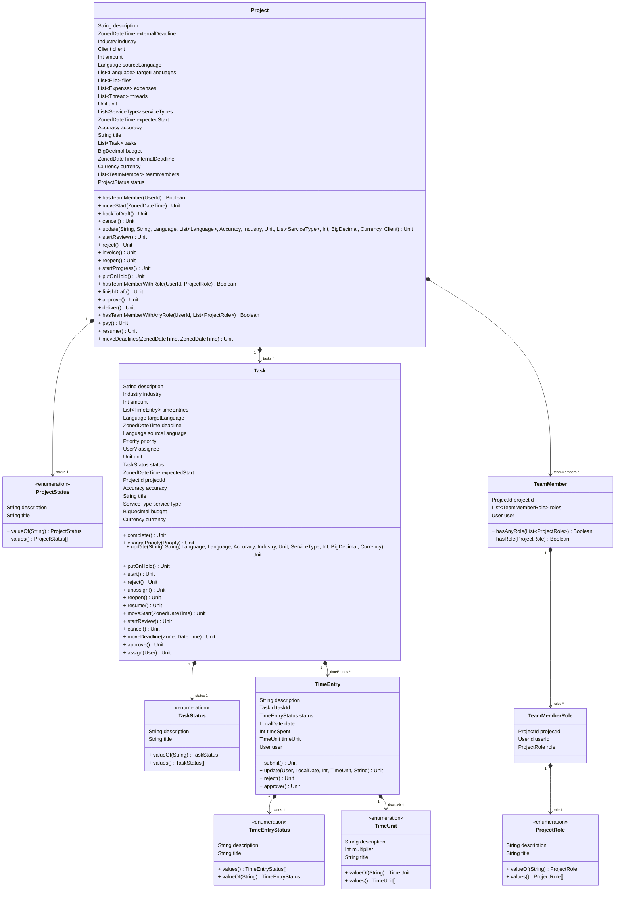

_Rysunek 1. Diagram klas, opisujący fragment domeny aplikacji_

Z podanego gdiagramu możemy odczytać, że w aplikacji istnieje encja `Project`, która posiada wiele zadań `Task`, które z kolei posiadają wiele wpisów czasu `TimeEntry`. Każda z tych encji posiada swój status, który jest opisany przez enumerację. Każda z tych encji posiada również swoje własne metody, implementujące reguły biznesowe, które są związane z daną encją. Kolejnym krokiem, po zaprojektowaniu domeny aplikacji, jest implementacja tego projektu. W systemie organizacji pracy biura tłumaczeń, domena aplikacji została wykonana w języku Kotlin. Kotlin został wybrany ze względu na jego czytelność i przejrzystość, a też łatwość w integracji z ekosystemem JVM. Jako system budowy aplikacji został wybrany Gradle, który jest narzędziem do automatyzacji budowy aplikacji. Gradle pozwala na definiowanie zależności, konfiguracji i zadań budowy aplikacji za pomocą języka Kotlin. Gradle nie jest jedynym dostępnym narzędziem tego typu, ale został wybrany ze względu na swoją elastyczność i czytelność.

Kolejną zasadą projektowania domeny jest zasada "Domain Driven Design", mówiąca o stworzeniu "Ubiquitous Language", czyli języka, który jest zrozumiały zarówno dla programistów, jak i dla osób, które nie są związane z programowaniem. Podejście to pozwala na zrozumienie problemu, który ma być rozwiązany, a także na zrozumienie implementacji, która ma ten problem rozwiązać.

Implementację domeny można zacząć od reprezentacji encji w kodzie aplikacji. W Kotlinie, implementacja encji `Project` może wyglądać tak:

```kotlin
// Definicja wyjątku, który zostanie rzucony w przypadku, gdy zmiana statusu projektu jest niemożliwa
class ProjectStatusChangeException(message: String) : Exception(message)

// Definicja identyfikatora projektu jako obiektu wartości
class ProjectId(value: UUID = UUID.randomUUID()): Id<UUID>(value)

// Definicja encji projektu
class Project(
    id: ProjectId = ProjectId(),
    title: String,
    description: String,
    sourceLanguage: Language,
    targetLanguages: List<Language>,
    // Pozostałe parametry konstruktora pominięte dla czytelności...
) : Entity<ProjectId>(id) {

    // Blok inicjalizacyjny, który jest wykonywany w momencie tworzenia obiektu
    // W tym przypadku, blok inicjalizacyjny zawiera walidacje, które muszą być spełnione
    init {
        validate {
            assert { title.isNotBlank() } otherwise {
                ValidationError("title", "Title cannot be blank")
            }
            assert { description.isNotBlank() } otherwise {
                ValidationError("description", "Description cannot be blank")
            }
            // Pozostałe walidacje pominięte dla czytelności...
        }
    }

    // Definicja pól encji projektu
    // Pola encji definiują stan obiektu
    // Zmiana stanu obiektu jest możliwa tylko za pomocą metod obiektu
    var title = title; private set
    var description = description; private set
    var sourceLanguage = sourceLanguage; private set
    var targetLanguages = targetLanguages; private set
    // Pozostałe pola pominięte dla czytelności...

    // Metody encji - implementacja reguł biznesowych
    // Metoda `moveDeadlines` pozwala na zmianę terminów projektu i waliduje, czy nowe terminy są poprawne
    fun moveDeadlines(internalDeadline: ZonedDateTime, externalDeadline: ZonedDateTime) {
        validate {
            assert { internalDeadline.isAfter(expectedStart) } otherwise {
                ValidationError("internalDeadline", "Internal deadline must be after expected start")
            }
            assert { externalDeadline.isAfter(internalDeadline) } otherwise {
                ValidationError("externalDeadline", "External deadline must be after internal deadline")
            }
        }

        this.internalDeadline = internalDeadline
        this.externalDeadline = externalDeadline
    }

    // Metoda `finishDraft` pozwala na zakończenie etapu projektu 'Draft' i przeniesienie go do etapu 'Ready to start'
    fun finishDraft() {
        if (status != ProjectStatus.DRAFT) {
            throw ProjectStatusChangeException("Project must be in draft status")
        }
        status = ProjectStatus.READY_TO_START
    }

     // Pozostałe metody pominięte dla czytelności...
}
```

_Lisitng 1. Implementacja encji `Project` w języku Kotlin_

Kolejnym krokiem jest implementacja serwisów, które będą operować na encjach. Serwisy w DDD są kluczowe dla implementacji logiki biznesowej. Stanowią one warstwę pośrednią między warstwą prezentacji a warstwą domeny, odpowiadając za orkiestrację i wykonanie złożonych operacji biznesowych. Często serwisy są wykorzystywane do implementacji operacji, które nie są związane z konkretną encją, ale z całym agregatem czy nawet z częścią kontekstu ograniczoną przez konkretny serwis. Do przykładu, rozważmy serwis `ProjectService`:

```kotlin
// Definicja interfejsu serwisu
interface ProjectService {

    fun moveDeadlines(id: ProjectId, internalDeadline: ZonedDateTime, externalDeadline: ZonedDateTime): Project
    fun finishDraft(id: ProjectId): Project
    // Pozostałe metody pominięte dla czytelności...
}

// Implementacja serwisu
class ProjectServiceImpl(
    // Zależności serwisu
    private val projectRepository: ProjectRepository,
    private val languageRepository: LanguageRepository,
    private val accuracyRepository: AccuracyRepository,
    private val industryRepository: IndustryRepository,
    private val unitRepository: UnitRepository,
    private val serviceTypeRepository: ServiceTypeRepository,
    private val currencyRepository: CurrencyRepository,
    private val clientRepository: ClientRepository,
    private val userContextProvider: UserContextProvider,
    private val logger: Logger
) : ProjectService {

    // Implementacja metody `moveDeadlines`
    // Metoda w serwisie wykonuje operacje na encji `Project` które nie mogą być wykonane bezpośrednio na encji
    override fun moveDeadlines(id: ProjectId, internalDeadline: ZonedDateTime, externalDeadline: ZonedDateTime): Project {
        // Encja nie ma dostępu do kontekstu aplikacji - w tym przypadku, do zalogowanego użytkownika
        // Serwis dostarcza kontekst aplikacji do encji
        val currentUser = userContextProvider.getCurrentUser()

        // Pobranie encji projektu z repozytorium - encja nie może pobrać samej siebie
        val project = projectRepository.get(id) ?: throw NotFoundException("Project not found")

        // Walidacja uprawnień użytkownika odbywa się w serwisie - encja nie ma dostępu do kontekstu aplikacji
        if (!currentUser.hasRole(UserRole.ADMIN) && !project.hasTeamMemberWithRole(currentUser.id, ProjectRole.PROJECT_MANAGER)) {
            throw ProjectAccessException("User is not allowed to move project deadlines")
        }

        // Wywołanie metody encji `moveDeadlines` - faktyczna zmiana terminów projektu
        project.moveDeadlines(internalDeadline, externalDeadline)

        // Podobnie jak w przypadku pobrania encji, zapis encji odbywa się w serwisie
        // Encja nie ma dostępu do repozytorium - nie może zapisać siebie samej
        return projectRepository.update(project)
    }

    // Implementacja metody `finishDraft`
    // Implementacja metody `finishDraft`, podobnie jak w przypadku metody `moveDeadlines`, odbywa się w serwisie
    override fun finishDraft(id: ProjectId): Project {
        // Pobranie zalogowanego użytkownika z kontekstu aplikacji
        val currentUser = userContextProvider.getCurrentUser()

        // Pobranie encji projektu z repozytorium
        val project = projectRepository.get(id) ?: throw NotFoundException("Project not found")

        // Walidacja uprawnień użytkownika
        if (!currentUser.hasRole(UserRole.ADMIN) && !project.hasTeamMemberWithRole(currentUser.id, ProjectRole.PROJECT_MANAGER)) {
            throw ProjectAccessException("User is not allowed to change project status")
        }

        // Wywołanie metody encji `finishDraft` - faktyczna zmiana statusu projektu
        project.finishDraft()

        // Zapis encji projektu
        return projectRepository.update(project)
    }
}
```

_Lisitng 2. Implementacja serwisu `ProjectService` w języku Kotlin_

Przyglądając się do implementacji serwisu `ProjectService`, możemy zauważyć listę zalężności, które są wstrzykiwane do serwisu. Jest to implementacją podejście "Dependency Injection", które pozwala na wstrzykiwanie zależności do serwisu, zamiast tworzenia ich wewnątrz serwisu. Dzięki temu, serwis jest łatwiejszy w testowaniu, a jego implementacja jest bardziej elastyczna. Na liście zależności też widzimy kolejny ważny element domeny aplikacji - repozytoria. Repozytoria w DDD pełnią kluczową rolę w dostarczaniu encji z bazy danych. Są one odpowiedzialne za abstrakcję i enkapsulację sposobu, w jaki obiekty domenowe są przechowywane i odzyskiwane, co pozwala na oddzielenie logiki biznesowej od szczegółów przechowywania danych. Repozytoria są integralną częścią warstwy domeny, ponieważ bezpośrednio współpracują z encjami, które stanowią rdzeń modelu domenowego. Dostarczają one niezbędnych operacji do zapisywania, odzyskiwania i zarządzania życiem encji. W domenie aplikacji, definiowane są tylko interfejsy repozytoriów, a ich implementacja jest dostarczana przez warstwę infrastruktury. W Kotlinie, implementacja repozytorium `ProjectRepository` może wyglądać tak:

```kotlin
// Podstawowy interfejs repozytorium - interfejs generyczny dla wszystkich encji
interface BaseRepository<TEntity : Entity<TEntityId>, TEntityId : Id<*>> {

    // Metody repozytorium, generyczne dla wszystkich encji
    fun getAll(): List<TEntity>
    fun get(id: TEntityId): TEntity?
    fun get(ids: List<TEntityId>): List<TEntity>
    fun get(query: Query<TEntity>): Page<TEntity>
    fun create(entity: TEntity): TEntity
    fun createAll(entities: List<TEntity>): List<TEntity>
    fun update(entity: TEntity): TEntity
    fun updateAll(entities: List<TEntity>): List<TEntity>
    fun delete(id: TEntityId)
    fun deleteAll(ids: List<TEntityId>)
}

// Interfejs repozytorium encji `Project`
interface ProjectRepository : BaseRepository<Project, ProjectId> {

    // Dodatkowe metody repozytorium - metody specyficzne dla encji `Project`
    fun getProjectsForUser(userId: UserId, query: Query<Project>): Page<Project>
}
```

_Lisitng 3. Definicja interfejsu repozytorium `ProjectRepository` w języku Kotlin_

Kolejny, bardzo ważny aspekt implementacji domeny aplikacji - stosowanie podejścia "Architektura Heksagonalna". Podejście to polega na podziale aplikacji na warstwy, z których każda ma swoje własne zadania i odpowiedzialności. W podejściu Heksagonalnym, domena aplikacji jest w centrum aplikacji, a warstwy zewnętrzne są odpowiedzialne za dostarczanie danych do domeny aplikacji oraz za dostarczanie danych z domeny aplikacji. W domenie aplikacji, nie ma odwołań do warstw zewnętrznych, co pozwala na odseparowanie logiki biznesowej od szczegółów implementacyjnych: bazy danych, serwisów zewnętrznych, itp.

Kolejną zaletą Architektury Heksagonalnej jest możliwość łatwego testowania aplikacji. Aplikacja nie posiada zależności od warstw zewnętrznych, co pozwala na łatwe zastępowanie tych warstw w testach jednostkowych. W systemie organizacji pracy biura tłumaczeń, testy są wykonane przy użyciu szkieletu testowego JUnit5 oraz biblioteki do tworzenia atrap obiektów - Mockito. Przykładowy test jednostkowy dla metody `moveDeadlines` w serwisie `ProjectService` może wyglądać tak:

```kotlin
class ProjectServiceImplTest {

    @Test
    fun `moveDeadlines should throw an exception if deadline is before start date`() {
        // Arrange - przygotowanie testu
        // Przygotowanie danych testowych i atrap obiektów
        val user = User(
            id = UserId(),
            firstName = "Test",
            lastName = "User",
            username = "testuser",
            email = "testuser@testorg.com",
            roles = listOf(UserRole.ADMIN)
        )

        val projectId = ProjectId()
        val project = Project(
            id = projectId,
            title = "Test project",
            description = "Test description",
            sourceLanguage = mock(),
            targetLanguages = listOf(
                mock(),
                mock()
            ),
            industry = mock {
                on { active } doReturn true
            },
            // Pozostałe parametry pominięte dla czytelności...
        )

        val projectRepository = mock<ProjectRepository> {
            on { get(projectId) } doReturn project
        }
        val userContextProvider = mock<UserContextProvider> {
            on { getCurrentUser() } doReturn user
        }
        // Pozostałe atrapy obiektów pominięte dla czytelności...

        // Tworzenie serwisu z wstrzykniętymi atrapami obiektów
        val projectService = ProjectServiceImpl(
            projectRepository = projectRepository,
            languageRepository = languageRepository,
            accuracyRepository = accuracyRepository,
            industryRepository = industryRepository,
            unitRepository = unitRepository,
            serviceTypeRepository = serviceTypeRepository,
            currencyRepository = currencyRepository,
            clientRepository = clientRepository,
            userContextProvider = userContextProvider,
            logger = logger
        )


        // Act - wykonanie testu
        // Wywołanie metody testowanej
        val exception = assertThrows<ValidationException> {
            projectService.moveDeadlines(projectId, ZonedDateTime.now().minusDays(20), ZonedDateTime.now().minusDays(10))
        }

        // Assert - asercje
        // Sprawdzenie, czy metoda testowana rzuciła wyjątek z odpowiednimi błędami
        assertEquals(
            listOf(ValidationError("internalDeadline", "Internal deadline must be after expected start")),
            exception.errors
        )
    }

    // Pozostałe testy pominięte dla czytelności...
}
```

_Lisitng 4. Przykładowy test jednostkowy dla metody `moveDeadlines` w serwisie `ProjectService` w języku Kotlin_

Połączenie podejść DDD, Dependency Injection, Architektury Heksagonalnej i testowania jednostkowego pozwala na stworzenie domeny aplikacji, która jest elastyczna, łatwa w testowaniu i utrzymaniu. Dzięki temu, aplikacja jest bardziej odporna na zmiany, a jej implementacja jest bardziej przejrzysta i czytelna.

## 2. Implementacja portów wejściowych. Spring Web

Po implementacji domeny aplikacji, należy zaimplementować porty wejściowe aplikacji. Porty wejściowe aplikacji służą dwóm celom: definiują interfejs, za pomocą którego inne serwisy mogą komunikować się z aplikacją, oraz przekazują żądania od innych serwisów do domeny aplikacji. W taki sposób powstaje kontrakt pomiędzy aplikacją a innymi serwisami, którymi mogą być naprzykład aplikacje klienckie, aplikacje mobilne, serwisy zewnętrzne, itp. Porty wejściowe mogą być zaimplementowane na wiele różnych sposobów - może to być REST API, GraphQL, SOAP, WebSockets, itp. Implementacja portu wejściowego jest nazywana adapterem i mieści się w warstwie infrastruktury aplikacji. W systemie organizacji pracy biura tłumaczeń, porty wejściowe aplikacji zostały zaimplementowane jako REST API, za pomocą Spring Web. Spring Web jest częścią Spring Framework, który dostarcza narzędzia do tworzenia aplikacji webowych. Spring Web przejmuje na siebie większość zadań związanych z obsługą żądań HTTP - parsowanie żądań, walidacja, serializacja odpowiedzi, itp. Głównym elementem Spring Web jest kontroler, który definiuje endpointy HTTP. W Kotlinie, implementacja kontrolera `ProjectController` może wyglądać tak:

```kotlin
// Definicja kontrolera Spring Web - kontroler REST API
// Kontroler definiuje endpointy HTTP, które są punktami wejściowymi aplikacji
// Ściężka `/api/v1/project` jest prefixem dla wszystkich endpointów kontrolera
@RestController
@RequestMapping("/api/v1/project")
class ProjectController(
  // Serwis ProjectApplicationService jest łącznikiem pomiędzy kontrolerem a serwisami domenowymi
  private val service: ProjectApplicationService
) {

    private val logger = loggerFor(ProjectController::class.java)

    // Definicja endpointu HTTP GET `/api/v1/project`
    // Podstawowy endpoint, który zwraca paginowaną listę projektów zgodnie z zadanymi kryteriami
    // Domyślna konfiguracja Spring Web pozwala na automatyczną serializację obiektów do formatu JSON
    @GetMapping("")
    fun getProjects(query: ListProjects): ResponseEntity<Page<Project>> {
        logger.info("GET /api/v1/project")
        return ResponseEntity.ok().body(service.getProjects(query))
    }

    // Definicja endpointu HTTP GET `/api/v1/project/{projectId}`
    // Endpoint, który zwraca pojedynczy projekt na podstawie identyfikatora
    @GetMapping("/{projectId}")
    fun getProject(
      // Adnotacja @PathVariable mapuje parametr z adresu URL na parametr metody
      @PathVariable(name = "projectId") id: UUID
    ): ResponseEntity<Project> {
        logger.info("GET /api/v1/project/$id")
        return ResponseEntity.ok().body(service.getProject(id))
    }

    // Definicja endpointu HTTP POST `/api/v1/project`
    // Endpoint, który tworzy nowy projekt
    @PostMapping("")
    fun createProject(
      // Adnotacja @RequestBody mapuje ciało żądania HTTP na parametr metody
      @RequestBody request: CreateProject
    ): ResponseEntity<Project> {
        logger.info("POST /api/v1/project")
        return ResponseEntity.ok().body(service.createProject(request))
    }

    // Definicja endpointu HTTP PUT `/api/v1/project/{projectId}`
    // Endpoint, który aktualizuje istniejący projekt
    @PutMapping("/{projectId}")
    fun updateProject(
        @PathVariable(name = "projectId") id: UUID, @RequestBody request: UpdateProject
    ): ResponseEntity<Project> {
        logger.info("PUT /api/v1/project/$id")
        return ResponseEntity.ok().body(service.updateProject(id, request))
    }

    // Definicja endpointu HTTP PATCH `/api/v1/project/{projectId}/move-start`
    // Endpoint, który zmienia termin rozpoczęcia projektu
    @PatchMapping("/{projectId}/move-start")
    fun moveStart(
        @PathVariable(name = "projectId") id: UUID, @RequestBody request: MoveProjectStart
    ): ResponseEntity<ProjectStartMoved> {
        logger.info("PATCH /api/v1/project/$id/move-start")
        return ResponseEntity.ok().body(service.moveProjectStart(id, request))
    }

    // Definicja endpointu HTTP PATCH `/api/v1/project/{projectId}/move-deadline`
    // Endpoint, który zmienia terminy projektu
    @PatchMapping("/{projectId}/move-deadline")
    fun moveDeadline(
        @PathVariable(name = "projectId") id: UUID, @RequestBody request: MoveProjectDeadline
    ): ResponseEntity<ProjectDeadlineMoved> {
        logger.info("PATCH /api/v1/project/$id/move-deadline")
        return ResponseEntity.ok().body(service.moveProjectDeadline(id, request))
    }

    // @ExceptionHandler - obsługa wyjątków
    // Metoda obsługuje wyjątek NotFoundException, który jest rzucony w przypadku, gdy zasób nie został znaleziony
    @ExceptionHandler(NotFoundException::class)
    fun handleNotFoundException(e: NotFoundException): ResponseEntity<Unit> {
        logger.warn("NotFoundException: ${e.message}")
        return ResponseEntity.notFound().build()
    }
}
```

_Lisitng 5. Implementacja kontrolera `ProjectController` w języku Kotlin z wykorzystaniem Spring Web_

Każdy ze zdefiniowanych endpointów kontrolera `ProjectController` definiuje punkt wejściowy aplikacji. Adnotacje Spring Web pozwalają skonifurować kontroler w przejrzysty sposób. Na podstawie tych adnotacji Spring zbuduje kontekst aplikacji, który będzie obsługiwał żądania HTTP. Warto dodatkowo omówić inne elementy, które są spotkane w kodzie kontrolera. Pierwszy taki element to `ProjectApplicationService`. `ProjectApplicationService` jest serwisem aplikacji, który jest łącznikiem pomiędzy kontrolerem a serwisami domenowymi. Serwisy aplikacji są odpowiedzialne za przetłumaczenie modelu użytego w definicji kontrolera na model używany w serwisach domenowych. Implementacja `ProjectApplicationService` może wyglądać tak:

```kotlin
// Rejestracja serwisu w kontenerze wstrzykiwania zależności dostarczanym przez Spring
// @Transactional zmusza Spring do wywołania metod serwisu w ramach transakcji
@Service
@Transactional(propagation = Propagation.REQUIRED)
class ProjectApplicationService(
    // Wstrzyknięcie serwisu domenowego
    private val service: ProjectService,
    private val repository: ProjectRepository,
    private val userContextProvider: UserContextProvider,
    private val specificationBuilder: SpecificationBuilder<Project>
) {

    private val logger = loggerFor(ProjectApplicationService::class.java)

    // ProjectResponse jest aliasem dla Project - klasa DTO, która jest mapowana na obiekt domenowy
    fun updateProject(id: UUID, request: UpdateProject): ProjectResponse {
        logger.info("updateProject($id, $request)")

        // Wywołanie metody serwisu domenowego
        // Obiekt `UpdateProject` jest rozkładany na poszczególne parametry metody serwisu
        return service.update(
            id = ProjectId(id),
            title = request.title,
            description = request.description,
            sourceLanguage = LanguageCode(request.sourceLanguage),
            targetLanguages = request.targetLanguages.map { LanguageCode(it) },
            accuracyId = AccuracyId(request.accuracyId),
            industryId = IndustryId(request.industryId),
            unitId = UnitId(request.unitId),
            serviceTypeIds = request.serviceTypeIds.map { ServiceTypeId(it) },
            amount = request.amount,
            budget = request.budget,
            currencyCode = CurrencyCode(request.currencyCode),
            clientId = ClientId(request.clientId)
        ).toView() // Wynik operacji metody serwisu jest mapowany na obiekt DTO
    }

    // Pozostałe metody pominięte dla czytelności...
}
```

_Lisitng 6. Implementacja serwisu aplikacji `ProjectApplicationService` w języku Kotlin_

Serwis domenowy musi być zarejestowany w kontenerze wstrzykiwania zależności dostarczanym przez Spring. Można to zrobić w następujący sposób:

```kotlin
// @Configuration - adnotacja, która oznacza klasę jako klasę konfiguracyjną
@Configuration
class ProjectConfig(
    // Wstrzyknięcie zależności do konfiguracji
    private val projectRepository: ProjectRepository,
    private val languageRepository: LanguageRepository,
    private val accuracyRepository: AccuracyRepository,
    private val industryRepository: IndustryRepository,
    private val unitRepository: UnitRepository,
    private val serviceTypeRepository: ServiceTypeRepository,
    private val currencyRepository: CurrencyRepository,
    private val clientRepository: ClientRepository,
    private val userContextProvider: UserContextProvider
) {
    // @Bean - oznaczenie metody jako fabryki zwrającej obiekt konkretnego typu w kontenerze wstrzykiwania zależności
    // Taki sposób rejestracji pozwala zachować swobodę domeny aplikacji od wybranego frameworku
    @Bean
    fun projectService(): ProjectService =
        ProjectServiceImpl(
            projectRepository,
            languageRepository,
            accuracyRepository,
            industryRepository,
            unitRepository,
            serviceTypeRepository,
            currencyRepository,
            clientRepository,
            userContextProvider,
            loggerFor(ProjectService::class.java)
        )
}
```

Klasy DTO, takie jak `UpdateProject` i `ProjectResponse`, definiują model używany w warstwie infrastruktury aplikacji przez adaptery portów wejściowych:

```kotlin
// Klasa `UpdateProject` definiuje model żądania dla endpointu PUT `/api/v1/project/{projectId}`
data class UpdateProject(
    val title: String,
    val description: String,
    val sourceLanguage: String,
    val targetLanguages: List<String>,
    val accuracyId: UUID,
    val industryId: UUID,
    val unitId: UUID,
    val serviceTypeIds: List<UUID>,
    val amount: Int,
    val budget: BigDecimal,
    val currencyCode: String,
    val clientId: UUID
)

// Klasa `Project` definiuje model odpowiedzi
data class Project(
    val id: UUID,
    val title: String,
    val description: String,
    val sourceLanguage: Language,
    val targetLanguages: List<Language>,
    val accuracy: Accuracy,
    val industry: Industry,
    val unit: Unit,
    val serviceTypes: List<ServiceType>,
    val amount: Int,
    val expectedStart: ZonedDateTime,
    val internalDeadline: ZonedDateTime,
    val externalDeadline: ZonedDateTime,
    val budget: BigDecimal,
    val currency: Currency,
    val status: ProjectStatus,
    val client: Client
)
```

_Lisitng 7. Przykładowa definicja klas DTO w języku Kotlin_

Jeśli mappery się rozrastają lub są używane w wielu miejscach w kodzie, warto zastanowić się nad wydzieleniem ich do osobnej klasy. Taki mapper można zaimplementować w postaci funkcji rozszerzającej, która będzie mapować obiekt domenowy na obiekt DTO:

```kotlin

// Definicja `object` w Kotlinie - obiekt, który jest jednocześnie klasą i instancją tej klasy
// Jest to implementacja wzorca Singleton w języku Kotlin
object ProjectMapper {

    // Metoda rozszerzające sąsposobem na dodanie nowej metody do istniejącej klasy
    // Pozwala to uniknąć użycia dziedziczenia czy modyfikacji klasy
    fun Project.toView() = ProjectResponse(
        id = id.value,
        title = title,
        description = description,
        sourceLanguage = sourceLanguage.toView(),
        targetLanguages = targetLanguages.map { it.toView() },
        accuracy = accuracy.toView(),
        industry = industry.toView(),
        unit = unit.toView(),
        serviceTypes = serviceTypes.map { it.toView() },
        amount = amount,
        expectedStart = expectedStart,
        internalDeadline = internalDeadline,
        externalDeadline = externalDeadline,
        budget = budget,
        currency = currency.toView(),
        status = ProjectStatus(
            status = status,
            title = status.title,
            description = status.description
        ),
        client = client.toView(),
    )

    // Pozostałe mappery pominięte dla czytelności...
}
```

_Lisitng 8. Implementacja mappera `ProjectMapper` w języku Kotlin_

Tworzenie serwisów aplikacji, takich jak `ProjectApplicationService`, dla enkapsulacji mapowań pozwala zachować czystość kodu kontrolera. W taki sposób, kontroler może skupić się tylko obsłudze żądań HTTP. Z kolei, używanie dwóch modeli - modelu domenowego i modelu DTO - pozwala ukryć szczegóły implementacyjne modelu domenowego przed klientami aplikacji. Takie podejście zapewnia elastyczność aplikacji oraz redukuje ryzyko nadmiarowej ekspozycji danych.

## 3. Implementacja portów wyjściowych. Spring Data

Opierająć się na definicję portu wejściowego jako miejsca łączącego świat zewnętrzny z domeną aplikacji, można zdefniować port wyjściowy jako miejsce łączące domenę aplikacji z światem zewnętrznym. Innymi słowami, jeśli port wyściowy dostarca dane do domeny, port wyjściowy jest odpowiedzialny za dostarczanie danych z domeny do innych serwisów. Podobnie jak w przypadku portów wejściowych, porty wyjściowe są implementowane jako adaptery w warstwie infrastruktury aplikacji.

Jednym z zastosowań portów wyjściowych jest komunikacja domeny z warstwą persystencji. Wastwa persystencji odpowiada za trwale przechowywanie danych aplikacji. Warstwa persystencji może być zaimplementowana na wiele różnych sposobów - może to być relacyjna baza danych, baza danych NoSQL, system plików, serwisy zewnętrzne czy nawet proste pliki testowe. Persystencja w systemie organizacji pracy biura tłumaczeń opiera się na:

- **Relacyjnej bazie danych PostgreSQL** - PostgreSQL jest jednym z najbardziej zaawansowanych systemów zarządzania relacyjnymi bazami danych. Z zalet PostgreSQL można wymienić, oprócz tradycyjnych cech baz danych relacyjnych, można wymienić też jej bogate możliwości rozszerzania oraz niski koszt utrzymania. W systemie organizacji pracy biura tłumaczeń, PostgreSQL jest wykorzystywany do przechowywania danych aplikacji, takich jak projekty, klienci, tłumacze, itp.
- **Bazie danych klucz-wartość Redis** - Redis jest szybką bazą danych klucz-wartość, która jest wykorzystywana w systemie organizacji pracy biura tłumaczeń do przechowywania danych tymczasowych (cache). W szczególności warto przypomnieć zastosowanie Redis jako cache dla danych z zewnętrznych serwisów, które mają ograniczoną przepustowość lub są płatne.
- **Systemie plików MinIO** - MinIO jest szybkim i prostym w obsłudze systemem plików, który jest wykorzystywany w systemie organizacji pracy biura tłumaczeń do przechowywania plików, takich jak dokumenty projektowe, tłumaczenia, itp.

Część warstwy infrastruktury aplikacji, która jest odpowiedzialna za komunikację z warstwą persystencji, została zaimplementowana za pomocą Spring Data. Spring Data jest częścią Spring Framework, która dostarcza narzędzia do tworzenia adapterów do różnych źródeł danych. Spring Data pozwala na definiowanie repozytoriów, które są interfejsami, a ich implementacja jest dostarczana przez Spring Framework.

Podobnie jak adaptery portów wejściowych, adaptery portów wyjściowych operują na własnym, odseparowanym od domeny aplikacji modelu. Dobrym pomysłem jest zacząć od definiowania modelu adapterów:

```kotlin
// Definicja modelu bazy danych - encja `Project`
// @Entity - adnotacja, która oznacza klasę jako encję bazy danych.
// Nazwa encji jest używana jako nazwa tabeli w zapytaniach JPA
// @Table - adnotacja, która pozwala na konfigurację tabeli w bazie danych
@Entity(name = "Project")
@Table(name = "project")
open class ProjectDatabaseModel(
    @Id() // @Id - adnotacja, która oznacza pole jako klucz główny
    open var id: UUID,

    @Column(nullable = false, length = 128) // Mapowanie pola na kolumnę w bazie danych
    open var title: String,

    @ElementCollection // @ElementCollection - adnotacja, która oznacza pole jako kolekcję elementów
    @CollectionTable(name = "project_target_language") // Definicja tabeli dla kolekcji elementów
    @Column(nullable = false, length = 16, name = "target_language") // Konfiguracja kolumny w bazie danych
    open var targetLanguages: List<String>,

    @ManyToOne(fetch = FetchType.LAZY, cascade = [CascadeType.PERSIST]) // Relacja wiele do jednego z opóźnionym ładowaniem i kaskadowym zapisem
    @JoinColumn(nullable = false) // Konfiguracja mapowania kolumny z kluczem obcym
    open var accuracy: AccuracyDatabaseModel,

    @ManyToMany(fetch = FetchType.LAZY, cascade = [CascadeType.PERSIST]) // Relacja wiele do wielu z opóźnionym ładowaniem i kaskadowym zapisem
    @JoinTable(
        name = "project_service_type",
        joinColumns = [JoinColumn(name = "project_id")],
        inverseJoinColumns = [JoinColumn(name = "service_type_id")]
    ) // Konfiguracja tabeli łączącej
    open var serviceTypes: MutableList<ServiceTypeDatabaseModel>,

    @Column(nullable = false)
    @Enumerated(EnumType.STRING) // Mapowanie pola na enumerację
    open var status: ProjectStatusDatabaseModel,

    // Pozostałe pola są definiowane analogicznie...
)

// Definicja modelu bazy danych - enumeracja `ProjectStatus`
enum class ProjectStatusDatabaseModel {
    DRAFT,
    READY_TO_START,
    IN_PROGRESS,
    // Pozostałe wartości analogicznie jak w modelu domenowym...
}
```
_Lisitng 9. Definicja modelu bazy danych w języku Kotlin z wykorzystaniem Spring Data_

W kolejnym kroku zdefiniujmy odpowiedni adapter korzystając ze Spring Data:

```kotlin
// Interfejs repozytorium Spring Data
// Na podstawie interfejsu Spring automatycznie generuje implementację repozytorium w trakcie uruchamiania aplikacji
interface ProjectJpaRepository : JpaRepository<ProjectDatabaseModel, UUID>, JpaSpecificationExecutor<ProjectDatabaseModel>

// Adapter reposzytorium domenowego - implementacja repozytorium
@Repository
class ProjectRepositoryImpl(
    // Wstrzyknięcie zależności do repozytorium
    private val jpaRepository: ProjectJpaRepository,
    private val specificationBuilder: ProjectSpecificationFactory,
    private val userSpecificationBuilder: ProjectUserSpecificationBuilder,
    private val languageRepository: LanguageRepository,
    // Pozostałe zależności pominięte dla czytelności...
) : ProjectRepository {

    override fun getAll() = jpaRepository.findAll()
        .map {
            it.toDomain(
                languageRepository,
                // Pozostałe zależności pominięte dla czytelności...
            )
        }

    override fun get(id: ProjectId): Project? = jpaRepository.findById(id.value)
        .map {
            it.toDomain(
                languageRepository,
                // Pozostałe zależności pominięte dla czytelności...
            )
        }
        .orElse(null)

    // Pozostałe metody pominięte dla czytelności...

    // Obiekt `Mappers` zawiera metody mapujące obiekty bazy danych na obiekty domenowe i odwrotnie
    companion object Mappers {

        fun ProjectDatabaseModel.toDomain(
            languageRepository: LanguageRepository,
            // Pozostałe zależności pominięte dla czytelności...
        ) = Project(
            id = ProjectId(id),
            title = title,
            description = description,
            sourceLanguage = LanguageCode(sourceLanguage).let { languageRepository.get(it) ?: UnknownLanguage(it) },
            targetLanguages = targetLanguages
                .map { LanguageCode(it) }
                .map { languageRepository.get(it) ?: UnknownLanguage(it) },
            accuracy = accuracy.toDomain(),
            // Pozostałe mapowania...
        )

        fun Project.toDatabaseModel() = ProjectDatabaseModel(
            id = id.value,
            title = title,
            description = description,
            sourceLanguage = sourceLanguage.id.value,
            targetLanguages = targetLanguages.map { it.id.value },
            accuracy = accuracy.toDatabaseModel(),
            // Pozostałe mapowania...
        )

        fun ProjectStatusDatabaseModel.toDomain() = when (this) {
            ProjectStatusDatabaseModel.DRAFT -> ProjectStatus.DRAFT
            ProjectStatusDatabaseModel.READY_TO_START -> ProjectStatus.READY_TO_START
            ProjectStatusDatabaseModel.ACTIVE -> ProjectStatus.ACTIVE
            // Pozostałe mapowania...
        }

        fun ProjectStatus.toDatabaseModel() = when (this) {
            ProjectStatus.DRAFT -> ProjectStatusDatabaseModel.DRAFT
            ProjectStatus.READY_TO_START -> ProjectStatusDatabaseModel.READY_TO_START
            ProjectStatus.ACTIVE -> ProjectStatusDatabaseModel.ACTIVE
            // Pozostałe mapowania...
        }
    }
}
```
_Lisitng 10. Implementacja adaptera repozytorium `ProjectRepository` w języku Kotlin z wykorzystaniem Spring Data_

Zbudowana z użyciem Spring Data implementacja adaptera jest maksymalnie prosta - w zasadzie ogranicza sie do zdefiniowania modelu i mapperów. Spring Data automatycznie generuje implementację repozytorium na podstawie podanych definicji, co zabiera całą pracę związaną z twożeniem zapytań SQL. Takie podejście pozwala uniknąć wielu rozpowszechnionych błędów i podatności związanych z tworzeniem zapytań SQL ręcznie. Domyślna konfiguracja Spring Data też automatycznie generuje schemat bazy danych na podstawie modelu, co pozwala na szybkie uruchomienie aplikacji bez konieczności ręcznego tworzenia schematu bazy danych, choć w przypadku aplikacji produkcyjnych zaleca się ręczne zarządzanie schematem bazy danych czy użycie narzędzi do migracji schematu bazy danych, takich jak Flyway czy Liquibase. Pozwoli to na kontrolę nad zmianami w schemacie bazy danych i uniknięcie nieoczekiwanych problemów związanych z migracją danych.

Z kolei, implementacja adaptera dla portu serwisu schowka plików umożliwiającego zapis i odczyt plików z systemu plików MinIO jest zaimplementowana z użyciem klienta MinIO:

```kotlin
@Service
class MinioStorageService(private val minioClient: MinioClient) : FileStorageService {

    // Enkapsulacja operacji ładowania pliku z systemu plików
    override fun load(location: String, name: String): InputStream {
        return minioClient.getObject(
            GetObjectArgs.builder()
                .bucket(location)
                .`object`(name)
                .build()
        )
    }

    // Enkapsulacja operacji zapisu pliku do systemu plików
    override fun store(location: String, name: String, dataStream: InputStream) {
        minioClient.putObject(
            PutObjectArgs.builder()
                .bucket(location)
                .`object`(name)
                .stream(dataStream, dataStream.available().toLong(), -1)
                .build()
        )
    }

    // Enkapsulacja operacji usuwania pliku z systemu plików
    override fun delete(location: String, name: String) {
        minioClient.removeObject(
            RemoveObjectArgs.builder()
                .bucket(location)
                .`object`(name)
                .build()
        )
    }
}
```
_Lisitng 11. Implementacja adaptera serwisu schowka plików `MinioStorageService` w języku Kotlin_

Ostatni adapter, który warto omówić, to adapter dla serwisu konwersji walut. System organizacji pracy biura tłumaczeń korzysta z serwisu zewnętrznego do konwersji walut - serwisu `exchangeratesapi.io`. Implementacja adaptera dla serwisu `exchangeratesapi.io` jest oparta o Feign, który pozwala na deklaratywne definiowanie klientów HTTP:

```kotlin
// Deklaracja klienta Feign
@FeignClient(name = "currencies", url = "http://api.exchangerate.host")
interface CurrencyClient {

    // Deklaracja metody klienta Feign
    // Wyniki zapytania są zapisywane w pamieci tymczasowej (cache), żeby uniknąć nadmiernego użycia serwisu zewnętrznego
    @RequestMapping(method = [RequestMethod.GET], value = ["/live?source={base}&access_key=test_access_key"])
    @Cacheable(value = ["currencies-client-cache"], key = "'live'")
    fun getLatest(@PathVariable(name = "source") source: String): CurrencyExchangeRatesExternalModel

    @RequestMapping(method = [RequestMethod.GET], value = ["/list?access_key=test_access_key"])
    @Cacheable(value = ["currencies-client-cache"], key = "'symbols'")
    fun getSymbols(): CurrencySymbolsExternalModel
}
```
_Lisitng 12. Implementacja adaptera klienta Feign dla serwisu `exchangeratesapi.io` w języku Kotlin_

Podobnie jak adaptery persystencji, ten operuje na własnym modelu, który jest mapowany na model domenowy. Implementacja adaptera klienta Feign jest maksymalnie prosta - ogranicza się do deklaracji klienta Feign i mapowania wyników zapytań na model domenowy.

Podsumowując, porty wyjściowe są odpowiedzialne za komunikację domeny aplikacji z warstwą persystencji oraz zewnętrznymi serwisami. Głownym celem jest implementacja adapterów w sposób, oddzielający domenę aplikacji od szczegółów implementacyjnych warstwy persystencji i zewnętrznych serwisów. Dzięki temu, domena aplikacji jest bardziej elastyczna i łatwiejsza w utrzymaniu. Warto też dodać, że wyjściowe porty nie ograniczają się tylko do komunikacji z warstwą persystencji i zewnętrznymi serwisami - mogą to też być inne serwisy w ramach tej samej aplikacji, systemy mailowe, wysyłanie powiadomień SMS, wstawianie danych do kolejek czy nawet publikacja wpisów na Twitterze.

## 4. Zabezpieczenia. Spring Security

Kolejny ważny element infrastruktury aplikacji to zabezpieczenia - aplikacja musi być zabezpieczona przed nieuprawnionym dostępem. Bezpieczeństwo aplikacji zawiera wiele czynników - zabezpieczenie danych (szyfrowanie danych, zabezpieczenie przed wyciekiem danych), zabezpieczenie przed atakami (SQL Injection, Cross-Site Scripting, Cross-Site Request Forgery, itp.), zabezpieczenie przed nieuprawnionym dostępem (autoryzacja, autentykacja), itp. Spring i inne wybrane technologie są od razu zabezpieczone przed wieloma atakami, ale zabezpieczenia aplikacji to nie tylko zabezpieczenia techniczne - to też zabezpieczenia organizacyjne, takie jak polityka bezpieczeństwa, zarządzanie dostępem, zarządzanie tożsamością, itp. Z tego wynika potrzeba w zaimplementowaniu przejrzystego i elastycznego systemu uprawnień, który pozwoli na zarządzanie dostępem do zasobów aplikacji.

Często oragnizacje używają więcej niż jednego systemu - użytkownicy mogą potrzebować korzystać np. z wewnątrzfirmowych komunikatorów, wewnętrznego Wiki, systemów zarządzania projektami, itp. Zarządzanie wieloma systemami to zarządzanie wieloma tożsamościami, co jest bardzo uciążliwe dla użytkowników. Dla tego, wiele organizacji korzysta z systemów zarządzania tożsamościami (IAM), które pozwalają stworzenie jednej tożsamości, która jest używana w wielu systemach. Takie podejście jest nazwane Single Sign-On (SSO). Centralne zarządzanie tożsamościami pozwala na łatwe zarządzanie dostępem do zasobów aplikacji, a także na łatwe zarządzanie użytkownikami, ich uprawnieniami, itp.

Jako przykład systemu zarządzania tożsamościami, który jest wykorzystywany w systemie organizacji pracy biura tłumaczeń, można wymienić Keycloak. Keycloak to bardzo popularne rozwiązanie open-source, które oferuje wiele funkcji związanych z zarządzaniem tożsamościami, takich jak autentykacja, autoryzacja, zarządzanie sesjami, zarządzanie dostępem, itp. Keycloak oferuje implementację SSO na podstawie protokołu OpenID Connect (OIDC) oraz protokołu SAML, a też integracje z LDAP, Active Directory i wieloma innymi systemami. Keycloak oferuje też wiele funkcji związanych z zarządzaniem dostępem, takich jak zarządzanie rolami, grupami, politykami dostępu, itp.

Zabezpieczenie serwera aplikacji zaczyna się od konfiguracji klienta OIDC po stronie Keycloak. Klient OIDC serwera aplikacji musi posidać *konfidencyjny* typ dostępu. To oznacza, że klient OIDC będzie używał tajnego klucza do autentykacji żądań do serwera autoryzacji. Konfidencyjny typ dostępu jest zalecany dla aplikacji, które działają po stronie serwera, a nie po stronie przeglądarki. Warto też zwrócić uwagę na konfigurację "Redirect URIs" - to adresy URL, które są używane do przekierowania użytkownika po autentykacji oraz "Web Origins" dla poprawnego zabezpieczenia przed atakami CSRF i CORS. Pozostałe konfiguracje klienta OIDC, takie jak konfiguracja tokenów, polityk dostępu, itp., zależą od wymagań aplikacji.

W przypadku serwera aplikacji, klient został skonfigurowany ze wsparciem granulacji dostępu. Granulacja dostępu pozwala na kontrolę dostępu do zasobów aplikacji na podstawie polityk dostępu. Polityki dostępu są definiowane w postaci reguł, które określają, kto, co, kiedy i jak może zrobić. Granulacja dostępu w Keycloak polega na:

1. Definicji zakresów autoryzacji (ang. *scopes*) - zakres autoryzacji definiuje akcję, która jest wykonywana na zasobie aplikacji. Przykładowe zakresy autoryzacji to `read`, `write`, `delete`, `manage`, itp.
2. Definicji zasobów (ang. *resources*) - zasób to obiekt aplikacji, który jest chroniony przez polityki dostępu. Przykładowe zasoby to `project`, `client`, `translator`, itp. Zasoby należy powiązać z zakresami autoryzacji.
3. Definicja polityk dostępu (ang. *policies*) - polityka dostępu określa jak użytkownik może uzyskać dostęp do zasobu. Polityka dostępu może być oparta o role, o klienta, o grupę, o atrybuty użytkownika, itp.
4. Definicja reguł dostępu (ang. *permission*) - reguła dostępu to połączenie polityki dostępu z zasobem i zakresem autoryzacji. Reguła dostępu określa, kto, co, kiedy i jak może zrobić. 

Po skonfigurowaniu klienta OIDC po stronie Keycloak, należy skonfigurować serwer aplikacji i do użycia Keycloak. Taka integracja może w prosty sposób być zaimplementowana za pomocą Spring Security. Na początek, należy dodać odpowiednie wpisy w pliku `application.yml`:

```properties
spring:
  security:
    oauth2:
      client:
        registration:
          # Rejestracja klienta OIDC
          # Aplikacja może być zarejestrowana w wielu serwerach autoryzacji
          keycloak:
            provider: keycloak
            client-id: tpm-backend
            client-secret: client-secret
            authorization-grant-type: authorization_code
            scope: openid,profile,email
        provider:
          # Konfiguracja dostawcy autoryzacji
          # W tym przypadku jest to serwer Keycloak, który jest uruchomiony lokalnie
          keycloak:
            issuer-uri: http://localhost:8081/realms/tpm
            user-info-uri: http://localhost:8081/realms/tpm/protocol/openid-connect/userinfo
            jwk-set-uri: http://localhost:8081/realms/tpm/protocol/openid-connect/certs
            authorization-uri: http://localhost:8081/realms/tpm/protocol/openid-connect/auth
            token-uri: http://localhost:8081/realms/tpm/protocol/openid-connect/token
            user-name-attribute: preferred_username
      resourceserver:
        jwt:
          issuer-uri: http://localhost:8081/realms/tpm
          jwk-set-uri: http://localhost:8081/realms/tpm/protocol/openid-connect/certs
```
_Lisitng 13. Konfiguracja Spring Security w pliku `application.yml`_

Wsparcie granularnego dostępu Keycloak w Spring Security można zaimplementować, używając `ServletPolicyEnforcerFilter`, który definiuje połączenie połączenie do serwera autoryzacji oraz mapuje ścieżki aplikacji i metody HTTP na odpowiednie zakresy autoryzacji:

```kotlin
// Konfiguracja zabezpieczeń aplikacji
@Configuration
@EnableWebSecurity
class SecurityConfiguration(
    private val policyEnforcerPathsProviders: List<PolicyEnforcerPathsProvider>,
    private val keycloakProperties: KeycloakProperties,
    @Value("\${spring.security.oauth2.resourceserver.jwt.jwk-set-uri}") private val jwkSetUri: String
) {

    // Konfiguracja łańcucha filtrów zabezpieczeń
    @Bean
    @Order(3)
    fun apiFilterChain(http: HttpSecurity): SecurityFilterChain {
        http.securityMatchers { it.requestMatchers("/api/**") }
            .authorizeHttpRequests { it.requestMatchers("/api/**").authenticated() }
            .oauth2ResourceServer { it.jwt(Customizer.withDefaults()) }
            .addFilterAfter(createPolicyEnforcerFilter(), BearerTokenAuthenticationFilter::class.java)
            .cors { it.configurationSource { corsConfiguration() } }
            .csrf { it.disable() }

        return http.build()
    }

    // Konfiguracja pozostałych filtrów zabezpieczeń pominięta dla czytelności...

    // Konfiguracja CORS
    private fun corsConfiguration() =
        CorsConfiguration().apply {
            allowedOrigins = listOf(
                "http://localhost",
                "http://localhost:5173",
                // Pozostałe adresy URL pominięte dla czytelności...
            )
            allowedMethods = listOf("GET", "POST", "PUT", "PATCH", "DELETE", "OPTIONS")
            allowedHeaders = listOf("*")
            allowCredentials = true
        }

    // Konfiguracja filtru `ServletPolicyEnforcerFilter` z użyciem `PolicyEnforcerConfig`
    // `PolicyEnforcerConfig` definiuje konfigurację połączenia do serwera autoryzacji
    // oraz mapowanie ścieżek aplikacji na zakresy autoryzacji
    private fun createPolicyEnforcerFilter() =
        ServletPolicyEnforcerFilter {
            policyEnforcerConfig {
                realm = keycloakProperties.realm
                authServerUrl = keycloakProperties.authServerUrl
                resource = keycloakProperties.resource
                credentials = mapOf(
                    "secret" to keycloakProperties.credentials.secret
                )
                paths = policyEnforcerPathsProviders.flatMap { it.paths }
            }
        }

    @Bean // Konfiguracja dekodera JWT
    fun jwtDecoder(): JwtDecoder = NimbusJwtDecoder.withJwkSetUri(jwkSetUri).build()

    // Przykładowa implementacja `PolicyEnforcerPathsProvider`
    // `PolicyEnforcerPathsProvider` definiuje mapowanie ścieżek aplikacji na zakresy autoryzacji
    // Mapowania zostaną użyte przez `ServletPolicyEnforcerFilter` do zabezpieczenia aplikacji
    @Bean
    fun projectExpensePolicyEnforcerPathsProvider() = object : PolicyEnforcerPathsProvider {
        override val paths = mutableListOf(
            pathConfig {
                path = "/api/v1/project/{projectId}/expense"
                methods = mutableListOf(
                    methodConfig {
                        method = "GET"
                        scopes = mutableListOf("urn:tpm-backend:resource:expense:query")
                    },
                    methodConfig {
                        method = "POST"
                        scopes = mutableListOf("urn:tpm-backend:resource:expense:create")
                    }
                )
            }
        )
    }
}
```
_Lisitng 14. Konfiguracja zabezpieczeń aplikacji w Spring Security_

Mapowanie na tylko i wyłącznie zakresy autoryzacji pozwala na elastyczne zarządzanie dostępem do zasobów aplikacji. Skutkuje to przeniesieniem logiki autoryzacji z aplikacji do serwera autoryzacji. Konfiguracja dostępu po stronie serwera autoryzacji pozwala nadawać i odbierać dostęp do zasobów aplikacji bez konieczności zmiany kodu aplikacji. Dzięki temu, aplikacja jest bardziej elastyczna i łatwiejsza w utrzymaniu.

## 5. Deployment. Budowanie kontenerów z aplikacją

Ostatni krok - dostarczenie aplikacji do użytkowników. Kod sam w sobie nie jest aplikacją - musi zostać przetłumaczony na coś, co może być uruchomione. W przypadku aplikacji JVM, kod jest tłumaczony na bytecode, który jest uruchamiany na maszynie wirtualnej JVM. Proces przetłumaczenia jest nazywany budowaniem aplikacji. W przypadku narzędzia Gradle, budowanie aplikacji jest wykonywane za pomocą polecenia `gradle build`. Wynikiem budowania aplikacji jest plik JAR, który zawiera wszystkie zależności aplikacji oraz pliki zasobów aplikacji. Plik JAR jest gotowy do uruchomienia na maszynie wirtualnej JVM w specjalnie skofigurowanym dla aplikacji środowisku.

W przypadku serwera aplikacji postanowiono pójść jeszcze kork dalej i przygotować aplikację do uruchomienia w kontenerze. Kontenery to jednostki oprogramowania, które zawierają wszystko, co jest potrzebne do uruchomienia aplikacji - kod aplikacji, zależności aplikacji, konfigurację aplikacji, itp. Taki kontener jest faktycznie bardzo podobny do maszyny wirtualnej, ale jest lżejszy i szybszy w uruchamianiu. Kontenery zapewniają powtarzalność środowiska aplikacji, co pozwala na uniknięcie problemów związanych z różnicami w środowisku aplikacji. Kontenery są też bardzo elastyczne - mogą być uruchamiane na wielu platformach, takich jak serwery, chmury, stacje robocze, itp.

Popularnym sposobem budowania kontenerów jest użycie narzędzia Docker. Docker pozwala na definiowanie kontenerów za pomocą plików `Dockerfile`. `Dockerfile` zawiera instrukcje, które są używane do zbudowania kontenera. Przykładowy `Dockerfile` dla aplikacji Spring Boot może wyglądać tak:

```dockerfile
# Argumenty budowania kontenera - profil aplikacji
ARG SPRING_PROFILES_ACTIVE

# Etap 1 - Budowanie aplikacji
# Używamy obrazu `gradle:jdk17-alpine` jako bazowy obraz
# Obraz `gradle:jdk17-alpine` zawiera wszystko, co jest potrzebne do budowania aplikacji
FROM gradle:jdk17-alpine as builder
USER root
WORKDIR /builder
ADD . /builder
# Budowanie aplikacji za pomocą narzędzia Gradle
RUN gradle build --stacktrace

# Etap 2 - Uruchomienie aplikacji
# Używamy obrazu `openjdk:17-alpine` jako bazowy obraz
# Obraz `openjdk:17-alpine` zawiera środowisko uruchomieniowe JVM
FROM openjdk:17-alpine
ENV SPRING_PROFILES_ACTIVE=${SPRING_PROFILES_ACTIVE}
WORKDIR /app
# Wystawienie portu 8080
EXPOSE 8080
# Kopiowanie pliku JAR z etapu 1 do kontenera
COPY --from=builder /builder/build/libs/tpm-api-*.jar ./app.jar
ENTRYPOINT java -jar app.jar
```
_Lisitng 15. Przykładowy `Dockerfile` dla aplikacji Spring Boot_

Taki plik `Dockerfile` może być użyty do zbudowania obrazu kontenera za pomocą polecenia `docker build`. Zbudowany obraz może zostać opublikowany w publicznym lub prywatnym repozytorium obrazów, takim jak Docker Hub, GitHub Container Registry czy prywatnej instancji Artifactory. Opublikowany obraz nie jest ograniczony do uruchomienia wyłącznie na Dockerze, a może też być na przykład uruchomiony na platformie Kubernetes, która jest jedną z najbardziej popularnych platform do uruchamiania kontenerów i posiada wiele zaawansowanych funkcji, takich jak automatyczne skalowanie, zarządzanie dostępem, zarządzanie konfiguracją, itp.


## Prezentacja
### Rejestracja nowego użytkownika
### Logowanie się do systemu
### Zarządzanie słownikami
### Zarządzanie bazą klientów
### Zarządzanie projektami
#### Przegląd projektów
#### Tworzenie i edycja projektu
#### Zmiana statusu projektu
#### Zmiana terminu realizacji projektu
#### Podział projektu na zadania
#### Zarządzanie zadaniami
#### Zarządzanie kosztami realizacji projektu
#### Zarządzanie dokumentami projektu
#### Komunikacja w ramach projektu
### Monitorowanie pracy systemu

## Przyszłość systemu

### Ważność ciąglej ewolucji systemu

Od samego początku, jednym z najważniejszych kamieni w fundamencie systemu, tym który wpłynął na wybór technologii, architekturę i podejście do implementacji, jest potrzeba ciągłego rozwoju i ewolucji systemu. System organizacji pracy dla biura tłumaczeń jest systemem, który ma wspierać pracę biura tłumaczeń, a nie być tylko narzędziem do zarządzania projektami. Zakresem projektu w tym stadium było stworzenie podstawowego systemu, który będzie wspierał podstawowe procesy biznesowe - organizację projektów i efektywnej realizacji zleceń. Cele takiego systemu mogą być znacznie szersze i obejmować wiele innych procesów biznesowych, które są niezbędne w biurze tłumaczeń. W tym rozdziale, przedstawione zostaną pomysły na rozwój systemu, które mogą być realizowane w przyszłości.

### Nowe narzędzia dla tłumaczy i kadry redakcyjnej

Jedna ze ściężek rozwoju systemu w przyrsłości zakłada stworzenie pełnofunkcjonalnego zaawansowanego zestawu narzędzi CAT (Computer Assisted Translation), które będą wspierać tłumaczy i kadrę redakcyjną w procesie tłumaczenia. Integracja z narzędziami CAT (Computer Assisted Translation) ma na celu usprawnienie procesu tłumaczenia i zwiększenie jego jakości. Kluczowym elementem jest stworzenie jednolitej platformy, która zintegruje wszystkie te narzędzia, zapewniając tłumaczom i kadrze redakcyjnej wygodny dostęp do zaawansowanych funkcji.

Taki zintegrowany zestaw narzędzi może zawierać:

  1. **Zaawansowany edytor tekstu** - edytor tekstu, przeznaczony dla profesjonalnych tłumaczy, łączy w sobie tradycyjne funkcje edycji tekstu z dodatkowymi narzędziami ułatwiającymi proces tłumaczenia oraz współpracę nad dokumentem. Jego funkcje wspomagające tłumaczenie, takie jak kontekstowe podpowiedzi, pozwalają na lepsze zrozumienie tekstu źródłowego i przyspieszają proces wyszukiwania odpowiedników w języku docelowym. Możliwość równoczesnego przeglądania dokumentów źródłowego i tłumaczonego na jednym ekranie znacznie ułatwia pracę, eliminując potrzebę ciągłego przełączania między różnymi oknami czy dokumentami. Kolejną istotną cechą zaawansowanego edytora tekstu jest jego funkcjonalność wspierająca kolaborację. Pozwala ona na równoczesną pracę wielu osób nad jednym dokumentem, co jest nieocenione w projektach wymagających współpracy między różnymi tłumaczami lub redaktorami. Możliwość pozostawiania komentarzy w dokumencie ułatwia komunikację między członkami zespołu i pozwala na szybką wymianę opinii oraz sugestii dotyczących tłumaczenia. Dodatkowo, funkcja śledzenia historii zmian w dokumencie pozwala na łatwe identyfikowanie wprowadzonych poprawek i zmian, co jest kluczowe w zarządzaniu projektem tłumaczeniowym i utrzymaniu jego spójności.
  2. **Narzędzia tłumaczenia maszynowego** - narzędzia, wykorzystujące zaawansowane technologie komputerowe, znacząco przyspieszają i upraszczają proces tłumaczenia. Dzięki nim, tłumacz nie musi przeznaczać czasu na tłumaczenie każdego zdania od podstaw, a raczej skupia się na korygowaniu i udoskonalaniu automatycznie wygenerowanego przekładu. To podejście znacznie skraca czas potrzebny na przetłumaczenie dużych wolumenów tekstu i umożliwia efektywniejsze zarządzanie zasobami ludzkimi.Współczesne narzędzia tłumaczenia maszynowego, takie jak systemy oparte na sztucznej inteligencji i uczeniu maszynowym, stale się rozwijają i są coraz bardziej zaawansowane. Są w stanie samodzielnie uczyć się z już przetłumaczonych tekstów, poprawiając swoją dokładność i zdolność do rozumienia niuansów językowych oraz kontekstu. Mimo tych postępów, narzędzia te wciąż nie są w stanie w pełni zastąpić tłumaczy ludzkich, zwłaszcza w przypadku tekstów wymagających zrozumienia subtelnego kontekstu kulturowego, metafor czy specjalistycznej terminologii. Zastosowanie tłumaczenia maszynowego jest szczególnie przydatne w przypadku prostych, powtarzalnych tekstów, takich jak instrukcje obsługi, proste komunikaty czy e-maile. Jednak w przypadku bardziej skomplikowanych materiałów, takich jak literatura, dokumenty prawne czy naukowe, wymagane jest ludzkie wyczucie i ekspertyza, aby zapewnić odpowiednią jakość i dokładność tłumaczenia. 
  3. **Narzędzia do automatycznego wykrycia błędów** - Narzędzia wspomagające tłumaczenie, wyposażone w zaawansowane algorytmy, są zdolne do wykrywania różnorodnych błędów w tekście tłumaczonym. Obejmują one błędy ortograficzne, interpunkcyjne, stylistyczne, gramatyczne oraz nieścisłości w tłumaczeniu specjalistycznej terminologii. Dodatkowo, są w stanie identyfikować problemy związane z formatowaniem dokumentu, takie jak niespójne użycie czcionek, marginesów czy złamanie tekstu. Użycie takich narzędzi znacząco odciąża tłumaczy od konieczności ręcznego sprawdzania i korygowania tego typu błędów, co pozwala im skoncentrować się na głębszych aspektach pracy tłumaczeniowej, takich jak zrozumienie kontekstu, zachowanie niuansów językowych czy przekład metafor i idiomów. Dzięki temu, tłumacze mogą efektywniej wykorzystać swoje umiejętności językowe i kulturowe, co przekłada się na wyższą jakość końcowego tłumaczenia.
  4. **Pamięć tłumaczeniowa (Translation Memory)** - zaawansowane narzędzie wspierające proces tłumaczenia, które gromadzi pary zdań w języku oryginalnym i tłumaczonym, tworząc bazę danych wcześniej przetłumaczonych fragmentów tekstu. Gdy tłumacz napotyka zdanie, które ma swoje odpowiedniki w tej bazie, narzędzie automatycznie proponuje gotowe tłumaczenie, co znacząco usprawnia pracę. Jest to szczególnie pomocne przy tłumaczeniach powtarzających się fraz czy specjalistycznych terminów, co sprawia, że pamięć tłumaczeniowa jest nieocenionym zasobem w pracy zawodowej tłumaczy, zapewniając spójność i oszczędność czasu. Ponadto, dzięki temu narzędziu, każde nowe tłumaczenie wzbogaca bazę, zwiększając efektywność i precyzję w przyszłych projektach tłumaczeniowych.
  5. **Zarządzanie terminologią (Gloszariusze)** - narzędzia zarządzania terminologią pozwalają na efektywne gromadzenie, organizowanie i wyszukiwanie terminów, co jest niezwykle ważne przy pracy z dużymi, złożonymi dokumentami, takimi jak instrukcje obsługi, dokumentacja medyczna, prawna czy naukowa. Ponadto, systematyczne zarządzanie terminologią przyczynia się do zwiększenia efektywności pracy, zmniejszając czas potrzebny na poszukiwanie i weryfikację terminów. Ważnym aspektem jest również współpraca między tłumaczami w ramach jednego projektu. Dzięki wspólnej bazie terminologicznej, wszyscy członkowie zespołu mogą korzystać z jednolitych i zatwierdzonych tłumaczeń specjalistycznych terminów, co gwarantuje spójność językową całego projektu. Dodatkowo, takie narzędzia często oferują integrację z innymi systemami używanymi w tłumaczeniach, takimi jak pamięć tłumaczeniowa czy zaawansowane edytory tekstu, co daje tłumaczom kompleksowe wsparcie i narzędzia niezbędne do efektywnej pracy.
  6. **Słowniki elektroniczne** - narzędzie wspomagające proces tłumaczenia, oferujące szybki dostęp do tłumaczeń i definicji terminów w różnych językach. Te narzędzia przechowują obszerną bazę danych słów i wyrażeń w języku źródłowym wraz z ich odpowiednikami i definicjami w języku docelowym, co jest nieocenioną pomocą dla tłumaczy. Zaletą elektronicznych słowników jest ich zdolność do szybkiego wyszukiwania terminów, co znacząco przyspiesza proces tłumaczenia. W przeciwieństwie do tradycyjnych, papierowych słowników, słowniki elektroniczne mogą oferować szereg dodatkowych funkcji, takich jak wyszukiwanie synonimów, antonimów, przykładowych zdań ilustrujących użycie danego słowa, a także informacje o wymowie i gramatyce. Słowniki elektroniczne są szczególnie przydatne w tłumaczeniach specjalistycznych, gdzie precyzyjne i właściwe użycie terminologii ma kluczowe znaczenie. Umożliwiają one szybkie odnalezienie specjalistycznych terminów technicznych, medycznych, prawniczych czy biznesowych, co jest niezastąpione w sytuacjach, kiedy tłumacz potrzebuje szybko zweryfikować znaczenie lub tłumaczenie konkretnego terminu.
  7. **Concordancer** - zaawansowane narzędzie wspomagające proces tłumaczenia, które służy do wyszukiwania i analizowania zdani w języku źródłowym i docelowym, które zawierają podobne słowa i wyrażenia. Jest to szczególnie przydatne w identyfikacji i zrozumieniu kontekstu użycia określonych terminów lub fraz. Działanie concordancera polega na przeszukiwaniu bazy danych tekstów lub tłumaczeń w celu znalezienia przykładów użycia konkretnych słów lub wyrażeń. Narzędzie to prezentuje wyniki w formie konkordancji, czyli zestawienia fragmentów tekstu, w których występuje wyszukiwane słowo lub fraza, wraz z ich bezpośrednim kontekstem. Dzięki temu tłumacze mogą zobaczyć, jak dane słowo lub wyrażenie zostało użyte w różnych kontekstach, co pomaga w dokładniejszym zrozumieniu jego znaczenia i prawidłowym przekładzie. Concordancer jest szczególnie przydatny w tłumaczeniach literackich, prawnych czy naukowych, gdzie precyzyjne zrozumienie niuansów językowych jest kluczowe. Dzięki analizie kontekstu użycia słów, tłumacze mogą lepiej dopasować przekład do specyfiki tekstu źródłowego, unikając nieścisłości i zachowując wierność oryginałowi.
  8. **Wyszukiwanie pełnotekstowe (Full-text search)** - , jest narzędziem umożliwiającym przeszukiwanie całego tekstu dokumentu na podstawie słów kluczowych. Jest to szczególnie przydatne w kontekście tłumaczenia, ponieważ umożliwia szybkie odnalezienie konkretnych informacji, fragmentów tekstu lub terminologii w już przetłumaczonych dokumentach. Dzięki technologii wyszukiwania pełnotekstowego, tłumacze mogą wprowadzić określone słowo lub frazę i natychmiast otrzymać wyniki pokazujące wszystkie miejsca w dokumencie, gdzie dane słowo lub wyrażenie się pojawia. To przyspiesza proces znalezienia niezbędnych informacji, szczególnie w obszernych dokumentach, takich jak długie raporty, specjalistyczne artykuły, lub obszerne dokumenty prawne i techniczne. Full-text search jest również nieocenione w przypadku pracy nad dużymi projektami tłumaczeniowymi, gdzie tłumacz może potrzebować odnaleźć, jak dany termin został użyty w innych częściach tekstu lub w poprzednich tłumaczeniach. To zapewnia spójność terminologiczną i stylistyczną całego projektu. Ponadto, narzędzie to może być używane do szybkiego porównywania wersji dokumentów, wyszukiwania poprzednich tłumaczeń podobnych fragmentów tekstu, czy nawet do analizy i badania wielu tekstów pod kątem częstotliwości występowania określonych słów lub fraz. Wyszukiwanie pełnotekstowe jest więc niezastąpionym narzędziem dla profesjonalnych tłumaczy, ułatwiającym i przyspieszającym ich codzienną pracę.
  9. **Narzędzia do rozpoznawania mowy** - ważny element w arsenale narzędzi wspomagających tłumaczenie, umożliwiając przekształcenie mowy na tekst. Dzięki zaawansowanym algorytmom przetwarzania języka naturalnego, te narzędzia są w stanie rozpoznać i przetłumaczyć wypowiedzi z różnych języków na pisany tekst, co jest szczególnie przydatne w pracy z nagraniami rozmów z klientami, wywiadami, konferencjami czy innymi formami komunikacji werbalnej. Wykorzystanie narzędzi do rozpoznawania mowy w procesie tłumaczenia pozwala na znaczne przyspieszenie pracy, eliminując konieczność ręcznego przepisywania wypowiedzi. Tłumacz może skupić się bezpośrednio na tłumaczeniu tekstu, co jest szczególnie korzystne w przypadku długich nagrań lub szybkich konwersacji. Narzędzia te znajdują zastosowanie w wielu scenariuszach, takich jak transkrypcje rozmów z klientami, tłumaczenie materiałów szkoleniowych, konferencji, a także w pracy z mediami, gdzie potrzebne jest szybkie przetłumaczenie wypowiedzi na potrzeby wiadomości czy publikacji. Ponadto, rozpoznawanie mowy jest bardzo przydatne w tłumaczeniach ustnych, szczególnie w środowiskach, gdzie szybkość i dokładność są kluczowe, na przykład w służbach medycznych, prawnych czy w biznesie międzynarodowym. Narzędzia te mogą również wspierać osoby z niepełnosprawnościami, umożliwiając im łatwiejszą komunikację w różnych językach. Należy jednak pamiętać, że pomimo zaawansowania technologicznego, narzędzia rozpoznawania mowy nie są doskonałe i mogą wymagać późniejszych korekt lub dostosowań przez tłumacza, zwłaszcza w przypadku języków o złożonej strukturze lub przy występowaniu silnych akcentów i dialektów.
  10. **Narzędzia OCR (Optical Character Recognition)** - ważna technologia wspomagająca proces tłumaczenia, która umożliwia konwersję tekstu zapisanego na obrazach lub skanach dokumentów na edytowalny, cyfrowy tekst. Dzięki tej technologii, tłumacze mogą łatwo przetłumaczyć materiały, które nie są dostępne w formacie cyfrowym, takie jak skany dokumentów, fotografie tekstu, czy zapisane ręcznie notatki. Narzędzia OCR skanują obraz i za pomocą zaawansowanych algorytmów rozpoznają na nim poszczególne znaki i słowa, przekształcając je w cyfrowy tekst. Pozwala to na szybkie przetwarzanie dużych ilości materiałów, które w przeciwnym razie musiałyby być przepisywane ręcznie, co jest czasochłonne i podatne na błędy. Zastosowanie OCR jest szczególnie przydatne w przypadku tłumaczenia dokumentów prawnych, historycznych, medycznych czy technicznych, które często dostępne są jedynie w formie papierowej. Dzięki OCR, tłumacze mogą szybko uzyskać dostęp do tekstu i skupić się na jego przetłumaczeniu, zamiast na pracochłonnym przepisywaniu. Ponadto, narzędzia OCR są niezastąpione w pracy z archiwalnymi dokumentami lub w sytuacjach, gdy oryginalne dokumenty nie mogą być uszkodzone lub zmienione, co jest częste w sektorze badań i konserwacji. Warto jednak pamiętać, że jakość wyników OCR zależy od wielu czynników, takich jak jakość skanu, czystość tekstu czy rodzaj czcionki. W niektórych przypadkach, szczególnie przy złej jakości obrazu lub skomplikowanych układach strony, tekst uzyskany za pomocą OCR może wymagać ręcznych poprawek czy dostosowań, aby zapewnić dokładność tłumaczenia.

Zestaw narzędzi wspomagających tłumacznie nieustannie się rozwija, oferując coraz nowsze i bardziej zaawansowane rozwiązania. Zadaniem takiego zestawu narzedzi CAT jest połączenie i przedstawienie ich w postaci wygodnego i spójnego interfejsu, który będzie dostępny dla tłumaczy i kadry redakcyjnej w systemie organizacji pracy dla biura tłumaczeń. Taki zestaw narzędzi nie musi zawierać wszystkich wymienionych narzędzi i może być roziwjąny wraz z rozwojem systemu i potrzebami użytkowników.

### Rozbudowanie możliwości raportowania

Celem rozbudowy możliwości raportowania w systemie zarządzania biurem tłumaczeń jest stworzenie zintegrowanego i kompleksowego systemu analiz, który umożliwi efektywne zarządzanie i ocenę wydajności pracy biura na podstawie różnorodnych danych. Rozbudowa ta ma na celu uczynienie systemu bardziej samowystarczalnym i niezależnym od zewnętrznych narzędzi analitycznych.

Obecnie, system oferuje podstawowe funkcje raportowania, takie jak generowanie raportów dotyczących wykorzystania zasobów ludzkich i finansowych, zapisywanych w formacie CSV. Te pliki można następnie importować i analizować w zewnętrznych programach, takich jak arkusze kalkulacyjne. Jednakże, ta metoda pracy wymaga dodatkowego czasu i wysiłku ze strony użytkowników, a także podstawowej wiedzy na temat obsługi narzędzi zewnętrznych.

Rozbudowa systemu ma na celu wdrożenie zaawansowanych funkcji raportowania bezpośrednio w ramach systemu. Obejmowałoby to:

1. **Automatyczne Generowanie Zaawansowanych Raportów**: Automatyczne generowanie zaawansowanych raportów w systemie zarządzania biurem tłumaczeń umożliwia tworzenie szczegółowych analiz dotyczących różnych aspektów działalności. Raporty te dostarczają cennych informacji na temat wydajności tłumaczy, umożliwiając ocenę ich produktywności, jakości pracy oraz terminowości realizacji projektów. Przez śledzenie czasu realizacji poszczególnych zadań, system może identyfikować obszary, w których procesy mogą być usprawnione, co przyczynia się do zwiększenia efektywności pracy. Jednocześnie, raportowanie obejmuje analizę satysfakcji klientów, co jest kluczowe dla zapewnienia wysokiej jakości usług i budowania długotrwałych relacji biznesowych. System może gromadzić opinie i uwagi klientów, co pozwala na bieżącą ocenę standardów obsługi i jakości dostarczanych tłumaczeń. Oprócz tego, zaawansowane raportowanie umożliwia szczegółową analizę kosztów związanych z działalnością biura tłumaczeń. Dzięki temu można dokładnie monitorować wydatki, identyfikować potencjalne oszczędności i optymalizować alokację zasobów. Wszystko to przekłada się na lepszą kontrolę finansową i możliwość podejmowania bardziej świadomych decyzji biznesowych.
2. **Wbudowane Narzędzia Wizualizacji Danych**: Integracja wbudowanych narzędzi wizualizacji danych do systemu zarządzania biurem tłumaczeń ma kluczowe znaczenie dla efektywnego przetwarzania i prezentacji informacji. Funkcja ta pozwala na tworzenie wykresów, grafik, map cieplnych i innych form graficznych przedstawień danych, co ułatwia zrozumienie skomplikowanych zestawień informacji i pomaga w szybkim wyciąganiu wniosków. Dzięki wizualizacji danych, trudne do zinterpretowania statystyki i liczby zamieniają się w przystępne, intuicyjne grafiki, które ułatwiają identyfikację trendów, wzorców i anomalii. Na przykład, wykresy mogą pokazywać zmiany wydajności tłumaczy w czasie, mapy cieplne mogą wskazywać na najbardziej pracochłonne projekty, a diagramy mogą ilustrować rozkład kosztów i przychodów. Wbudowane narzędzia wizualizacji danych eliminują potrzebę eksportowania danych do zewnętrznych programów, takich jak arkusze kalkulacyjne czy oprogramowanie do analizy danych. To z kolei oszczędza czas i redukuje ryzyko błędów wynikających z ręcznej manipulacji danymi. Użytkownicy mogą tworzyć i dostosowywać wykresy bezpośrednio w systemie, co umożliwia bieżące monitorowanie kluczowych wskaźników i szybką reakcję na zmieniające się warunki. Ponadto, narzędzia te mogą być wykorzystane do tworzenia raportów i prezentacji dla zarządu, klientów czy partnerów, zapewniając profesjonalne i łatwe do zrozumienia przedstawienie wyników pracy biura. Wizualizacja danych jest więc nie tylko narzędziem analitycznym, ale również ważnym elementem komunikacji i prezentacji osiągnięć biura tłumaczeń.
3. **Personalizacja Raportów**: Personalizacja raportów w systemie zarządzania biurem tłumaczeń odgrywa kluczową rolę w zapewnieniu, że różni użytkownicy otrzymują informacje istotne i przydatne dla ich specyficznych zadań i celów. Możliwość dostosowania raportów do indywidualnych potrzeb użytkowników pozwala na bardziej precyzyjne śledzenie kluczowych wskaźników efektywności (KPIs), co jest niezbędne do efektywnego zarządzania i podejmowania świadomych decyzji biznesowych. Dzięki personalizacji, każdy użytkownik – od menedżerów projektów, przez tłumaczy, po kadrę zarządzającą – może skonfigurować raporty tak, aby zawierały najbardziej relewantne dla nich dane. Na przykład, menedżer projektu może skoncentrować się na raportach pokazujących postępy prac, terminowość i jakość wykonanych tłumaczeń, podczas gdy kierownik finansowy może być bardziej zainteresowany analizą kosztów, przychodów i marż. Personalizacja raportów umożliwia użytkownikom wybór wskaźników, które chcą monitorować, format prezentacji danych (takich jak wykresy, tabele, czy grafiki), a także częstotliwość otrzymywania raportów. Użytkownicy mogą również mieć możliwość filtrowania danych według konkretnych kryteriów, takich jak okres czasu, rodzaj projektu, klient, czy tłumacz. Taka personalizacja nie tylko zwiększa użyteczność raportów, ale również pozwala na szybsze i efektywniejsze identyfikowanie obszarów wymagających uwagi lub poprawy. Dzięki temu, menedżerowie i pracownicy mogą podejmować działania korygujące w odpowiednim czasie, co przyczynia się do zwiększenia ogólnej efektywności i rentowności biura tłumaczeń.
4. **Analiza Trendów i Prognozowanie**: Analiza trendów i prognozowanie to kluczowe funkcje w systemie zarządzania biurem tłumaczeń, pozwalające na głębsze zrozumienie aktualnych tendencji oraz przewidywanie przyszłych wyników działalności na podstawie zgromadzonych danych. Te funkcje są niezwykle ważne dla planowania strategicznego i długoterminowego rozwoju biura. Dzięki analizie trendów, biuro tłumaczeń może identyfikować wzorce w swojej działalności, takie jak wzrost popytu na określone usługi tłumaczeniowe, zmiany preferencji klientów, czy efektywność różnych strategii marketingowych. Rozpoznawanie tych trendów umożliwia menedżerom podejmowanie świadomych decyzji o alokacji zasobów, inwestycjach w rozwój umiejętności tłumaczy czy wprowadzaniu nowych usług. Prognozowanie przyszłych wyników jest równie ważne, ponieważ pozwala na przygotowanie się na nadchodzące wyzwania i możliwości. Na przykład, przewidywanie wzrostu zapotrzebowania na tłumaczenia w określonym języku lub dziedzinie specjalistycznej może skłonić biuro do zatrudnienia dodatkowych tłumaczy specjalizujących się w tych obszarach, czy też do inwestycji w odpowiednie narzędzia i szkolenia. Funkcje analizy trendów i prognozowania opierają się na zaawansowanych algorytmach analizy danych, które wykorzystują historyczne dane do modelowania i przewidywania przyszłych wyników. Dzięki temu, menedżerowie mogą tworzyć różne scenariusze i strategie, przygotowując biuro do różnych możliwych przyszłości. W efekcie, te funkcje przyczyniają się nie tylko do lepszego zrozumienia bieżącej sytuacji biura, ale również do bardziej efektywnego planowania i reagowania na zmiany rynkowe. Dzięki temu biuro tłumaczeń może lepiej dostosować się do dynamicznie zmieniającego się środowiska biznesowego, maksymalizując swoje szanse na sukces i długoterminowy rozwój.
5. **Interaktywny Dashboard**: Stworzenie interaktywnego dashboardu, czyli panelu zarządzania, w systemie zarządzania biurem tłumaczeń, stanowi nieocenione narzędzie dla efektywnego monitorowania i zarządzania działalnością. Ten centralny panel umożliwia szybki dostęp do najważniejszych informacji, takich jak postępy w projektach, wydajność pracy tłumaczy, finanse oraz opinie klientów. Dzięki wizualizacji danych za pomocą wykresów, grafik i map cieplnych, dashboard ułatwia zrozumienie skomplikowanych danych, umożliwiając szybsze i bardziej efektywne podejmowanie decyzji. Interaktywność dashboardu jest kluczowa – użytkownicy mogą personalizować wyświetlane dane, filtrować wyniki według różnych kryteriów, a także zmieniać zakres czasowy prezentowanych informacji, co pozwala na dokładniejszą analizę i lepsze zrozumienie aktualnej sytuacji. Śledzenie postępów w czasie rzeczywistym pozwala na bieżące reagowanie na ewentualne problemy i dostosowywanie strategii pracy. Dashboard służy również jako platforma do komunikacji i raportowania, ułatwiając dzielenie się informacjami zarówno wewnątrz zespołu, jak i z klientami. Jest to szczególnie ważne w szybko zmieniającym się środowisku biznesowym, gdzie dostęp do aktualnych i precyzyjnych informacji ma kluczowe znaczenie dla sukcesu i rozwoju biura tłumaczeń.
6. **Alertowanie**: Funkcja alertowania w systemie zarządzania biurem tłumaczeń jest niezwykle ważna, ponieważ zapewnia bieżące informowanie o kluczowych zdarzeniach i zmianach, które mogą wpływać na działalność biura. Możliwość ustawienia alertów i powiadomień umożliwia szybką reakcję na różnorodne sytuacje, takie jak przekroczenie budżetu czy opóźnienia w realizacji projektu. Dzięki tej funkcji, menedżerowie i pracownicy mogą być na bieżąco informowani o ważnych aspektach pracy, co umożliwia im natychmiastowe podejmowanie odpowiednich działań korygujących. Na przykład, powiadomienie o przekroczeniu przewidzianego budżetu projektu pozwala na szybkie przeprowadzenie analizy przyczyn i podjęcie działań mających na celu kontrolę kosztów. Podobnie, alert o opóźnieniu w realizacji projektu może skłonić do przeglądu harmonogramu pracy i zasobów, aby zapewnić terminowe dostarczenie tłumaczenia. Alertowanie może być również wykorzystane do informowania o mniejszych, ale istotnych zmianach w systemie, takich jak aktualizacje statusów projektów, zmiany w dostępności zasobów ludzkich, czy otrzymanie nowych zleceń od klientów. Użytkownicy mogą personalizować ustawienia powiadomień, wybierając typy alertów, które są dla nich najbardziej istotne, a także preferowany sposób otrzymywania tych powiadomień, na przykład poprzez e-mail, SMS, czy bezpośrednio w systemie. Wprowadzenie systemu alertowania znacząco przyczynia się do zwiększenia efektywności zarządzania biurem tłumaczeń, zapewniając, że wszelkie potencjalne problemy są szybko identyfikowane i adresowane, co minimalizuje ryzyko opóźnień i przekroczeń budżetu, a także poprawia ogólną jakość usług oferowanych przez biuro.
7. **Zintegrowane środowisko wykonawcze**: Zintegrowane środowisko wykonawcze w systemie zarządzania biurem tłumaczeń to innowacyjne rozwiązanie, które otwiera przed użytkownikami nowe możliwości analizy danych i personalizacji raportów. Funkcja ta pozwala na tworzenie i uruchamianie własnych skryptów i zapytań, co jest szczególnie przydatne dla bardziej zaawansowanej analizy danych i dostosowywania systemu do specyficznych potrzeb biura. Zintegrowane środowisko wykonawcze może zawierać narzędzia, które umożliwiają użytkownikom tworzenie własnych raportów i analiz. Dzięki temu, menedżerowie i analitycy mają możliwość dostosowywania metod analizy do konkretnych wymagań projektów czy strategii biznesowych. Przykładowo, mogą tworzyć skomplikowane zapytania do bazy danych, aby uzyskać szczegółowe informacje na temat efektywności poszczególnych tłumaczy, analizować trendy rynkowe, czy przeprowadzać dogłębną analizę kosztów. Ponadto, umożliwienie uruchamiania skryptów w popularnych językach programowania takich jak Python czy R, które są szeroko stosowane w analizie danych, znacznie rozszerza możliwości analityczne systemu. Użytkownicy, którzy posiadają umiejętności programowania, mogą tworzyć zaawansowane skrypty do przetwarzania danych, automatyzacji pewnych procesów, a nawet stosowania technik uczenia maszynowego do przewidywania trendów i optymalizacji działań. Wdrożenie takiego zintegrowanego środowiska wykonawczego przekłada się na większą elastyczność i efektywność w zarządzaniu biurem tłumaczeń. Umożliwia ono szybsze reagowanie na zmiany rynkowe, lepsze dostosowywanie się do potrzeb klientów i optymalizację wewnętrznych procesów pracy. Daje to biuru tłumaczeń przewagę konkurencyjną, pozwalając na bardziej innowacyjne i skuteczne podejście do zarządzania i analizy danych.

Rozbudowane możliwości raportowania w systemie zarządzania dla biura tłumaczeń odgrywają kluczową rolę w osiąganiu wyższej efektywności operacyjnej i lepszego dostosowania do dynamiki rynku. Dzięki zaawansowanym funkcjom raportowania, biuro tłumaczeń zyskuje głębsze zrozumienie swoich procesów wewnętrznych, co jest niezbędne do efektywnego zarządzania zasobami i szybkiego reagowania na zmieniające się warunki rynkowe.

Poprzez szczegółową analizę danych, zarówno z przeszłości, jak i w czasie rzeczywistym, biuro tłumaczeń może lepiej zrozumieć, jakie działania przynoszą najlepsze wyniki, identyfikować obszary wymagające poprawy, oraz przewidywać przyszłe tendencje. Na przykład, analiza wydajności tłumaczy może pomóc w lepszym rozplanowaniu zadań i zasobów, podczas gdy szczegółowe raporty finansowe mogą ujawnić możliwości zmniejszenia kosztów lub zwiększenia przychodów.

Ponadto, możliwość szybkiej reakcji na zmiany w zapotrzebowaniu rynkowym jest kluczowa dla utrzymania konkurencyjności biura tłumaczeń. Zaawansowane raportowanie umożliwia identyfikację nowych trendów i preferencji klientów, co pozwala na szybkie dostosowanie oferty usług i strategii marketingowych.

Rozbudowa funkcji raportowania przyczynia się również do lepszej kontroli nad działalnością biura, umożliwiając podejmowanie świadomych decyzji opartych na solidnych danych. W dłuższej perspektywie, takie podejście jest fundamentem dla zrównoważonego rozwoju biura, pomagając nie tylko w optymalizacji bieżących procesów, ale także w planowaniu strategicznym i rozwoju długoterminowym.

W rezultacie, rozbudowane możliwości raportowania stanowią nie tylko narzędzie do lepszego zarządzania codzienną pracą, ale także ważny element strategii rozwoju biura tłumaczeń, pozwalając na zwiększenie jego efektywności, rentowności i konkurencyjności na rynku.

### Dostarczenie funkcjonalności dla pracowników działu księgowości

Rozbudowa systemu zarządzania biurem tłumaczeń o funkcjonalności księgowe jest istotnym krokiem w kierunku usprawnienia i automatyzacji procesów finansowych. Wprowadzenie takich funkcji do systemu pozwoli na bardziej efektywne zarządzanie finansami biura, co przekłada się na lepszą kontrolę nad przepływami pieniężnymi, uproszczenie procedur księgowych, a także na zwiększenie przejrzystości i dokładności raportów finansowych.

Na dzień obecny system nie oferuje żadnych funkcji księgowych, a wszystkie procesy finansowe są wykonywane poza systemem. Wprowadzenie funkcjonalności księgowych do systemu pozwoli na zintegrowanie wszystkich procesów finansowych w jednym miejscu, co znacznie ułatwi zarządzanie finansami biura tłumaczeń. Wsród takich funkcjonalności mogą być:

1. **Wystawianie Faktur, Proform i Rachunków**: Wprowadzenie funkcji automatycznego wystawiania faktur, proform i rachunków do systemu zarządzania biurem tłumaczeń stanowi znaczący krok w kierunku efektywizacji zarządzania dokumentacją finansową. Dzięki tej funkcji, proces wystawiania różnego rodzaju dokumentów finansowych zostaje znacznie uproszczony i przyspieszony, co jest kluczowe dla płynnego funkcjonowania każdego przedsiębiorstwa. Automatyczne generowanie dokumentów finansowych pozwala na szybkie i precyzyjne wystawianie faktur za wykonane usługi tłumaczeniowe, proform przed realizacją zlecenia, oraz rachunków dla różnych transakcji. Proces ten minimalizuje ryzyko błędów ludzkich, które mogą wystąpić podczas ręcznego przygotowywania dokumentów, i zapewnia spójność danych na wszystkich dokumentach. Funkcjonalność ta ułatwia również zarządzanie przepływami pieniężnymi, ponieważ system może automatycznie śledzić terminy płatności i wysyłać przypomnienia do klientów o zbliżających się lub przekroczonych terminach płatności. To z kolei przyczynia się do szybszego uzyskiwania płatności i poprawy płynności finansowej biura. Ponadto, system umożliwiający elektroniczne wystawianie i zarządzanie dokumentacją finansową znacznie ułatwia archiwizację i odzyskiwanie dokumentów. Wszystkie dokumenty są przechowywane w systemie, co umożliwia łatwy dostęp do nich w każdej chwili, a także szybką i sprawną komunikację z klientami oraz ewentualne dostosowania i korekty. Wprowadzenie automatycznego wystawiania faktur, proform i rachunków do systemu zarządzania biurem tłumaczeń jest więc kluczowym elementem, który pozwala na lepszą organizację pracy, redukcję błędów, oszczędność czasu i zwiększenie ogólnej efektywności operacyjnej biura.
2. **Zarządzanie Płatnościami**: Zarządzanie płatnościami w systemie zarządzania biurem tłumaczeń jest kluczowym elementem, który znacząco przyczynia się do lepszej kontroli nad przepływami pieniężnymi i terminowością płatności. Funkcjonalność ta jest szczególnie ważna w kontekście utrzymania płynności finansowej i efektywnego zarządzania finansami biura. Dzięki tej funkcji, system pozwala na kompleksowe śledzenie płatności od klientów. Można w łatwy sposób monitorować, które faktury zostały już opłacone, a które nadal oczekują na płatność. To umożliwia szybkie reagowanie w przypadku opóźnień w płatnościach i zapewnia ciągły przepływ gotówki niezbędny do codziennej operacyjności biura. Zarządzanie fakturami i rachunkami w systemie jest kolejnym istotnym aspektem. Użytkownik może nie tylko wystawiać i otrzymywać faktury, ale również efektywnie je kategoryzować, archiwizować i przeszukiwać. Daje to pełną przejrzystość wszystkich transakcji finansowych i ułatwia zarządzanie dokumentacją. Ponadto, automatyczne wysyłanie przypomnień o zaległych płatnościach jest nieocenioną funkcją, która pomaga w utrzymaniu dyscypliny płatniczej ze strony klientów. System może automatycznie informować klientów o zbliżających się terminach płatności oraz wysyłać powiadomienia w przypadku zaległości, co znacznie obniża ryzyko opóźnionych lub nieuregulowanych płatności.Wdrożenie skutecznego zarządzania płatnościami w systemie zarządzania biurem tłumaczeń nie tylko upraszcza procesy finansowe, ale również przyczynia się do lepszego zarządzania cash flow, co jest kluczowe dla stabilności finansowej i możliwości rozwoju biura. Jest to zatem niezbędna funkcja, która wzmacnia finansową podstawę biura tłumaczeń, zapewniając mu większą bezpieczeństwo i efektywność w prowadzeniu działalności.

Automatyzacja procesów księgowych, takich jak fakturowanie, zarządzanie płatnościami, śledzenie wydatków czy generowanie raportów finansowych, znacznie zmniejsza obciążenie administracyjne. Dzięki temu pracownicy biura tłumaczeń mogą skupić się na kluczowych zadaniach biznesowych, zamiast poświęcać czas na żmudne i podatne na błędy zadania ręczne. Na przykład, system może automatycznie generować i wysyłać faktury do klientów, śledzić terminy płatności i wysyłać przypomnienia o zaległych płatnościach.

Wprowadzenie zintegrowanych narzędzi księgowych pozwala również na lepsze śledzenie i analizę danych finansowych. Biuro tłumaczeń może w łatwy sposób monitorować swoje dochody i wydatki, co jest kluczowe dla utrzymania zdrowej kondycji finansowej. Analiza finansowa może ujawnić obszary, w których można zredukować koszty lub zwiększyć przychody, a także pomóc w planowaniu budżetu i prognozowaniu przyszłych wyników finansowych.

Ponadto, integracja funkcjonalności księgowych z innymi aspektami działalności biura, takimi jak zarządzanie projektami czy obsługa klienta, zapewnia bardziej spójne i zintegrowane podejście do zarządzania biurem. Na przykład, informacje o kosztach tłumaczenia można bezpośrednio powiązać z konkretnymi projektami i klientami, co umożliwia dokładniejsze śledzenie rentowności poszczególnych zleceń.

Podsumowując, rozbudowa systemu zarządzania biurem tłumaczeń o funkcjonalności księgowe jest ważnym krokiem w kierunku zwiększenia efektywności operacyjnej, poprawy zarządzania finansami i uproszczenia procesów administracyjnych. Jest to kluczowe dla zapewnienia długoterminowego sukcesu i stabilności finansowej biura tłumaczeń.

### Usprawnienia Monitorowania Pracy Systemu

Aby zapewnić ciągłą i efektywną pracę systemu zarządzania biurem tłumaczeń, niezbędne są usprawnienia w zakresie monitorowania i zarządzania systemem informatycznym. Takie działania są kluczowe dla zwiększenia stabilności, wydajności oraz bezpieczeństwa systemu, co bezpośrednio przekłada się na płynność i efektywność funkcjonowania biura tłumaczeń.

Na dzień dzisiejszy system posiada podstawową integrację z systemem monitotorwania opartym o stos ELK, zapewniając wygodne śledenie i analizę logów systemowych. Jednakże, integracja ta nie obejmuje wszystkich komponentów systemu, a także nie zapewnia automatycznego monitorowania i alertowania. Wprowadzenie usprawnień monitorowania pracy systemu pozwoli na lepszą kontrolę nad jego działaniem, co jest kluczowe dla zapewnienia ciągłości pracy biura tłumaczeń. Rozszerzowny system monitorowania mógłby obejmować:

1. **Zbieranie logów z pozostałych komponentów systemu**: Rozszerzenie systemu monitorowania o pozostałe komponenty, takie jak baza danych, podsystem cache czy serwer plików, jest kluczowym działaniem, które znacząco przyczynia się do wzrostu stabilności i niezawodności systemu zarządzania biurem tłumaczeń. Kompleksowe śledzenie i analiza logów systemowych z tych elementów umożliwiają głębsze zrozumienie całokształtu działania systemu i są niezbędne do efektywnej identyfikacji oraz szybkiej reakcji na potencjalne problemy. Logi bazy danych mogą dostarczać informacji o opóźnieniach w zapytaniach, problemach z dostępem do danych lub innych kwestiach wpływających na wydajność bazy. Podobnie, logi z podsystemu cache mogą ujawnić problemy z wydajnością przetwarzania i przechowywania danych tymczasowych, które są kluczowe dla szybkiego dostępu do często używanych informacji. Serwer plików, z kolei, pełni kluczową rolę w przechowywaniu i udostępnianiu dokumentów, a logi z tego komponentu mogą wskazywać na problemy z dostępem do plików lub ich synchronizacją. Podobnie, na listę monitorowanych komponentów systemu mogą zostać dodane inne elementy, takie jak serwer pocztowy, serwer aplikacji, czy serwer proxy. Dzięki zbieraniu i analizowaniu logów z tych różnych komponentów, system może efektywnie wykrywać i reagować na ewentualne błędy i anomalie. Umożliwia to szybką interwencję w przypadku wystąpienia problemów, minimalizując ryzyko przestojów i zapewniając płynność pracy systemu. W efekcie, rozszerzenie systemu monitorowania jest niezbędne dla utrzymania wysokiej jakości usług tłumaczeniowych, zapewniając, że wszelkie techniczne aspekty działania systemu są skutecznie zarządzane i kontrolowane. To z kolei przekłada się na zwiększoną satysfakcję klientów i lepszą efektywność operacyjną biura tłumaczeń.
2. **Dodanie metryk do pozostałych komponentów systemu**: Dodanie metryk do pozostałych komponentów systemu w biurze tłumaczeń to istotny krok w kierunku uzyskania bardziej szczegółowego obrazu wydajności całego systemu informatycznego. Rozszerzenie systemu o dodatkowe metryki pozwoli na głębszą analizę i monitoring każdego aspektu funkcjonowania systemu, co jest kluczowe dla optymalizacji pracy i zapewnienia niezawodności usług. Wprowadzenie takich metryk umożliwi dokładne śledzenie takich parametrów, jak czas przetwarzania zadań, co jest szczególnie ważne w przypadku wykonywania skomplikowanych operacji tłumaczeniowych czy zarządzania dużymi projektami. Można na przykład monitorować, jak długo trwa przetwarzanie zleceń tłumaczeniowych czy jak szybko system odpowiada na zapytania użytkowników. Metryki dotyczące wykorzystania zasobów systemowych, takie jak zużycie procesora, pamięci RAM czy przestrzeni dyskowej, są niezbędne do zapewnienia, że system działa efektywnie i nie ma zagrożenia przeciążeniem. Informacje o ilości zapytań do bazy danych mogą pomóc w identyfikacji wąskich gardeł w przetwarzaniu danych i przyczynić się do lepszego zarządzania obciążeniem serwerów. Dodatkowo, włączenie innych kluczowych wskaźników wydajności, takich jak czas odpowiedzi systemu, błędy aplikacji, czy liczba równoczesnych użytkowników, pozwoli na uzyskanie kompleksowego obrazu działania systemu. Dzięki temu możliwe będzie szybsze diagnozowanie problemów i podejmowanie działań mających na celu optymalizację wydajności. Podsumowując, dodanie metryk do pozostałych komponentów systemu w biurze tłumaczeń jest niezbędne dla zapewnienia wysokiej jakości działania infrastruktury informatycznej. Umożliwi to lepsze zrozumienie, jak poszczególne elementy systemu wpływają na ogólną wydajność i pozwoli na podjęcie działań optymalizacyjnych, aby zapewnić płynne i efektywne działanie biura tłumaczeń.
3. **System Alertowania**: Implementacja systemu alertowania w ramach systemu zarządzania biurem tłumaczeń jest kluczowym elementem, który zapewnia szybką reakcję na potencjalne problemy i anomalie. Taki system jest nieoceniony w zapewnieniu ciągłości działania i bezpieczeństwa operacyjnego, ponieważ pozwala na natychmiastowe informowanie odpowiednich osób o krytycznych zdarzeniach, które mogą zakłócić normalne funkcjonowanie biura. System alertowania może obejmować powiadomienia o różnego rodzaju błędach systemowych, co pozwala na szybką interwencję w przypadku wystąpienia awarii lub innych problemów technicznych. Może to być na przykład alert o awarii serwera, błędach w bazie danych, czy problemach z połączeniem sieciowym. Powiadomienia o przekroczeniu zasobów systemowych są również niezwykle ważne, ponieważ mogą wskazywać na nadmierną obciążenie systemu, co może prowadzić do spowolnienia lub zatrzymania pracy. Monitoring takich parametrów jak zużycie procesora, pamięci RAM czy przestrzeni dyskowej pozwoli na wczesne wykrycie i rozwiązanie problemów związanych z wydajnością. Alertowanie o nienormalnych wzorcach ruchu w sieci może również pomóc w wykrywaniu prób nieautoryzowanego dostępu lub innych zagrożeń bezpieczeństwa. Na przykład, system może generować alerty w przypadku wykrycia nietypowych prób logowania lub nieoczekiwanego wzrostu ruchu sieciowego. Wprowadzenie systemu alertowania pozwala na utrzymanie wysokiego poziomu czujności i reaktywności na krytyczne zdarzenia, co jest niezbędne do zapewnienia stabilności i bezpieczeństwa systemu zarządzania biurem tłumaczeń. Jest to zatem nieodzowny element infrastruktury IT, który przyczynia się do zwiększenia efektywności operacyjnej i ochrony przed potencjalnymi problemami.
4. **Automatyczne Skalowanie**: Wprowadzenie funkcji automatycznego skalowania do systemu zarządzania biurem tłumaczeń jest kluczowe dla zapewnienia elastyczności i efektywności operacyjnej. Automatyczne skalowanie umożliwia dynamiczne dostosowywanie zasobów systemowych w zależności od aktualnego obciążenia, co jest niezwykle ważne w przypadku nieregularnych wzorców użytkowania, jakie mogą występować w branży tłumaczeń. Dzięki automatycznemu skalowaniu, system może na bieżąco zwiększać lub zmniejszać swoje zasoby, takie jak moc obliczeniowa, pamięć czy przestrzeń dyskowa, w odpowiedzi na zmieniające się wymagania. Na przykład, w okresach wzmożonej pracy, gdy liczba zleceń tłumaczeniowych rośnie, system automatycznie zwiększy dostępne zasoby, aby zapewnić płynność pracy i szybką obsługę klientów. Podobnie, w okresach mniejszego obciążenia, system może zredukować zasoby, co przyczynia się do optymalizacji kosztów. Taka elastyczność jest szczególnie ważna w kontekście chmury obliczeniowej, gdzie możliwość skalowania zasobów na żądanie jest jednym z głównych atutów. Automatyczne skalowanie w środowisku chmurowym pozwala na znaczne zredukowanie kosztów operacyjnych, ponieważ biuro tłumaczeń płaci tylko za te zasoby, których faktycznie używa. Ponadto, funkcja ta zapewnia wyższy poziom dostępności i niezawodności systemu, ponieważ zapobiega przeciążeniom i awariom spowodowanym przez niespodziewany wzrost obciążenia. Umożliwia to biuru tłumaczeń zachowanie ciągłości działania i zapewnienie wysokiej jakości usług niezależnie od zmieniających się warunków pracy. Podsumowując, automatyczne skalowanie to niezbędna funkcja w nowoczesnym systemie zarządzania biurem tłumaczeń, która przyczynia się do optymalizacji wydajności i kosztów, a także zwiększa elastyczność i niezawodność systemu.
5. **Automatyczne Restartowanie**: Wdrożenie funkcji automatycznego restartowania komponentów systemowych w systemie zarządzania biurem tłumaczeń jest kluczowym elementem zapewniającym jego stabilność i ciągłość działania. Automatyczne restartowanie jest szczególnie ważne w przypadku, gdy jeden z komponentów systemowych napotka na błąd lub awarię. Dzięki tej funkcji, system ma możliwość szybkiego odzyskania operacyjności bez konieczności interwencji człowieka, co jest nieocenione w zapewnieniu nieprzerwanego dostępu do usług tłumaczeniowych. Funkcja ta działa poprzez ciągłe monitorowanie stanu poszczególnych komponentów systemu. W momencie wykrycia awarii lub nieprawidłowego działania, system automatycznie inicjuje proces restartu danego komponentu. Może to obejmować zarówno fizyczne maszyny, jak i wirtualne serwery, bazy danych czy inne elementy infrastruktury IT. Automatyczne restartowanie ma kluczowe znaczenie w sytuacjach, gdzie każda chwila przestoju może prowadzić do znaczących strat finansowych lub uszczerbku na reputacji biura. Przykładowo, w przypadku awarii serwera aplikacyjnego lub bazy danych, szybkie przywrócenie ich działania minimalizuje przerwy w dostępie do kluczowych funkcji systemu. Dodatkowo, funkcja ta przyczynia się do zwiększenia ogólnej niezawodności systemu. Automatyczne restartowanie zapewnia, że nawet w przypadku drobnych błędów, które mogą nie być natychmiast wykryte przez zespół IT, system będzie kontynuował swoje działanie, co jest niezbędne dla zachowania ciągłości pracy biura tłumaczeń. Wprowadzenie automatycznego restartowania jest więc ważnym krokiem w kierunku zwiększenia stabilności systemu zarządzania biurem tłumaczeń, zapewniając, że wszelkie problemy są szybko rozwiązywane, a system utrzymuje wysoki poziom dostępności i operacyjności.

Podsumowując, system monitorowania w biurze tłumaczeń jest niezbędnym elementem, który zapewnia ciągłość działania i bezpieczeństwo operacyjne. Wprowadzenie usprawnień w zakresie monitorowania pracy systemu jest kluczowe dla zapewnienia jego stabilności, wydajności oraz bezpieczeństwa, co bezpośrednio przekłada się na płynność i efektywność funkcjonowania biura tłumaczeń. Większość tych usprawnień może zostać zaimplementowana przy użyciu już używanych narzędzi monitorowania, takich jak ELK Stack, co ułatwia ich wdrożenie i integrację z istniejącym systemem. Automatyczne skalowanie i restratowanie mogą być z kolei zaimplementowane przy użyciu bardziej zaawansowanych narzędzi, takich jak Kubernetes, które oferują szerokie możliwości orkiestracji kontenerami. W rezultacie, te ulepszenia znacząco przyczynią się do zwiększenia efektywności operacyjnej, bezpieczeństwa danych i satysfakcji klientów, co jest niezbędne dla długoterminowego sukcesu i rozwoju biura tłumaczeń.
