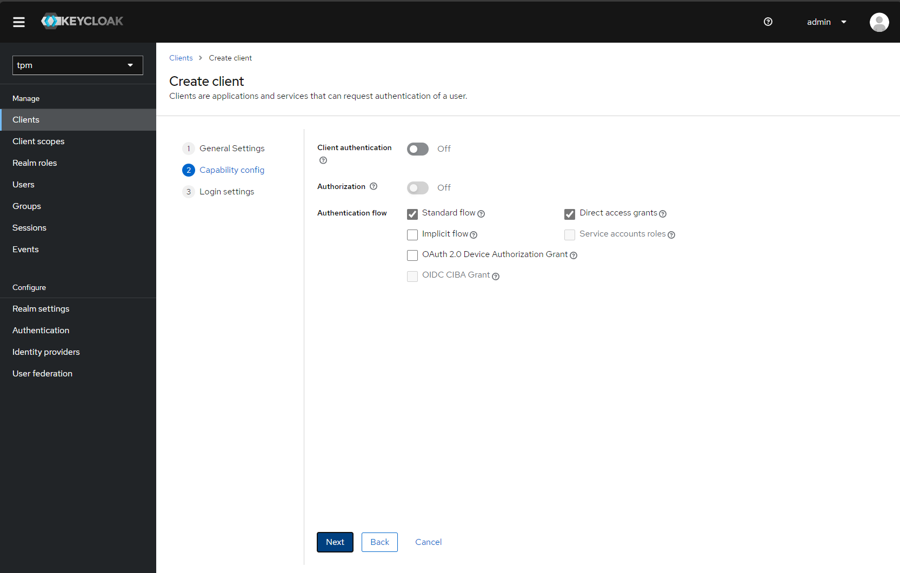

# System organizacji pracy dla biura tłumaczeń

## Spis treści

* [Wprowadzenie](#wprowadzenie)
  * [Biznes tłumaczeń w dzisiejszych czasach](#biznes-tłumaczeń-w-dzisiejszych-czasach)
  * [Wspóczesne zarządzanie projektami](#wspóczesne-zarządzanie-projektami)
  * [Systemy zarządzania projektami i ich rola w branży tłumaczeniowej](#systemy-zarządzania-projektami-i-ich-rola-w-branży-tłumaczeniowej)
* [Koncepcja aplikacji](#koncepcja-aplikacji)
  * [Geneza projektu i inspiracje](#geneza-projektu-i-inspiracje)
  * [Założenia i cele projektu](#założenia-i-cele-projektu)
  * [Funkcjonalności aplikacji](#funkcjonalności-aplikacji)
* [Projekt aplikacji](#projekt-aplikacji)
  * [Przypadki użycia i historyjki użytkownika](#przypadki-użycia-i-historyjki-użytkownika)
    * [Jako użytkownik, chcę:](#jako-użytkownik-chcę)
    * [Jako administrator systemu, chcę:](#jako-administrator-systemu-chcę)
    * [Jako kierownik projektu, chcę:](#jako-kierownik-projektu-chcę)
    * [Jako tłumacz, redaktor, korektor, ekspert merytoryczny czy edytor chcę:](#jako-tłumacz-redaktor-korektor-ekspert-merytoryczny-czy-edytor-chcę)
    * [Jako inżynier wsparcia, chcę:](#jako-inżynier-wsparcia-chcę)
  * [Zasady projektowania systemu](#zasady-projektowania-systemu)
    * [Domain-driven design (DDD)](#domain-driven-design-ddd)
    * [Architektura heksagonalna, czyli wzorzec Porty i adaptery (HA)](#architektura-heksagonalna-czyli-wzorzec-porty-i-adaptery-ha)
    * [Wstrzykiwanie zależności (DI)](#wstrzykiwanie-zależności-di)
    * [Logowanie i monitorowanie](#logowanie-i-monitorowanie)
    * [Kombinacja DDD, HA, DI i logowania/monitorowania](#kombinacja-ddd-ha-di-i-logowaniamonitorowania)
    * [Architektura wielowarstwowa](#architektura-wielowarstwowa)
* [Stos technologiczny](#stos-technologiczny)
  * [Postanowienia ogólne w wyborze technologii](#postanowienia-ogólne-w-wyborze-technologii)
  * [Interfejs użytkownika](#interfejs-użytkownika)
  * [Serwer aplikacji](#serwer-aplikacji)
  * [Przechowywanie danych](#przechowywanie-danych)
  * [Zewnętrzne API](#zewnętrzne-api)
  * [Monitorowanie i analiza pracy aplikacji](#monitorowanie-i-analiza-pracy-aplikacji)
  * [Testowanie](#testowanie)
  * [Wdrożenie](#wdrożenie)
  * [Uwierzytelnianie i autoryzacja](#uwierzytelnianie-i-autoryzacja)
* [Implementacja](#implementacja)
  * [Przygotowanie środowiska](#przygotowanie-środowiska)
    * [Instalacja Node.js](#instalacja-nodejs)
    * [Instalacja Docker](#instalacja-docker)
    * [Instalacja Visual Studio Code](#instalacja-visual-studio-code)
    * [Instalacja IntelliJ IDEA](#instalacja-intellij-idea)
    * [Instalacja Git](#instalacja-git)
  * [Infrastruktura](#infrastruktura)
    * [Docker Compose](#docker-compose)
    * [Konfiguracja instancji PostgreSQL](#konfiguracja-instancji-postgresql)
    * [Konfiguracja instancji Redis](#konfiguracja-instancji-elasticsearch)
    * [Konfiguracja instancji MinIO](#konfiguracja-instancji-minio)
    * [Konfiguracja instancji Keycloak](#konfiguracja-instancji-keycloak)
    * [Konfiguracja stosu ELK](#konfiguracja-stosu-elk)
  * [Interfejs użytkownika](#interfejs-użytkownika-1)
    * [Tworzenie projektu za pomocą Vite](#tworzenie-projektu-za-pomocą-vite)
    * [Zarządzanie zależnościami za pomocą narzędzia npm](#zarządzanie-zależnościami-za-pomocą-narzędzia-npm)
    * [Wyznaczenie kluczowych elementów interfejsu](#wyznaczenie-kluczowych-elementów-interfejsu)
    * [Uwierzytelnianie i kontrola dostępu](#uwierzytelnianie-i-kontrola-dostępu)
    * [Lokalizacja](#lokalizacja)
    * [Nawigacja i routing](#nawigacja-i-routing)
    * [Komunikacja z serwerem](#komunikacja-z-serwerem)
    * [Implementacja widoków](#implementacja-widoków)
    * [Implementacja formularzy](#implementacja-formularzy)
    * [Wdrożenie aplikacji](#wdrożenie-aplikacji)
  * [Serwer aplikacji](#serwer-aplikacji-1)
    * [Tworzenie projektu za pomocą Spring Initializr](#tworzenie-projektu-za-pomocą-spring-initializr)
    * [Narzędzie Gradle](#narzędzie-gradle)
    * [Warstwa domeny - encje](#warstwa-domeny---encje)
    * [Warstwa domeny - repozytoria](#warstwa-domeny---repozytoria)
    * [Warstwa domeny - zapytania i specyfikacje](#warstwa-domeny---zapytania-i-specyfikacje)
    * [Warstwa domeny - serwisy](#warstwa-domeny---serwisy)
    * [Warstwa aplikacji - persystencja](#warstwa-aplikacji---persystencja)
    * [Warstwa aplikacji - serwisy aplikacyjne](#warstwa-aplikacji---serwisy-aplikacyjne)
    * [Warstwa aplikacji - kontrolery](#warstwa-aplikacji---kontrolery)
    * [Warstwa aplikacji - specyfikacje](#warstwa-aplikacji---specyfikacje)
    * [Warstwa aplikacji - zewnętrzne API](#warstwa-aplikacji---zewnętrzne-api)
    * [Warstwa aplikacji - uwierzytelnianie i autoryzacja](#warstwa-aplikacji---uwierzytelnianie-i-autoryzacja)
    * [Implementacja logowania i monitorowania](#implementacja-logowania-i-monitorowania)
    * [Testowanie](#testowanie-1)
    * [Wdrożenie aplikacji](#wdrożenie-aplikacji-1)
* [Prezentacja](#prezentacja)
  * [Rejestracja nowego użytkownika](#rejestracja-nowego-użytkownika)
  * [Logowanie się do systemu](#logowanie-się-do-systemu)
  * [Zarządzanie słownikami](#zarządzanie-słownikami)
  * [Zarządzanie bazą klientów](#zarządzanie-bazą-klientów)
  * [Zarządzanie projektami](#zarządzanie-projektami)
    * [Przegląd projektów](#przegląd-projektów)
    * [Tworzenie i edycja projektu](#tworzenie-i-edytowanie-projektu)
    * [Zmiana statusu projektu](#zmiana-statusu-projektu)
    * [Zmiana terminu realizacji projektu](#zmiana-terminu-realizacji-projektu)
    * [Podział projektu na zadania](#podział-projektu-na-zadania)
    * [Zarządzanie zadaniami](#zarządzanie-zadaniami)
    * [Zarządzanie kosztami realizacji projektu](#zarządzanie-kosztami-realizacji-projektu)
    * [Zarządzanie dokumentami projektu](#zarządzanie-dokumentami-projektu)
    * [Komunikacja w ramach projektu](#komunikacja-w-ramach-projektu)
  * [Monitorowanie pracy systemu](#monitorowanie-pracy-systemu)
* [Przyszłość systemu](#przyszłość-systemu)
  * [Integracja z narzędziami maszynowego tłumaczenia](#integracja-z-narzędziami-maszynowego-tłumaczenia)
  * [Integracja z narzędziami do analizy tekstu](#integracja-z-narzędziami-do-analizy-tekstu)
  * [Integracja ze słownikami terminologicznymi](#integracja-ze-słownikami-terminologicznymi)
  * [Glosariusze](#glosariusze)
  * [Rozbudowanie możliwości raportowania](#rozbudowanie-możliwości-raportowania)
  * [Usprawnienia monitorowania pracy systemu](#podalsze-usprawnienia-monitorowania-pracy-systemu)

## Wprowadzenie

### Biznes tłumaczeń w dzisiejszych czasach

W dzisiejszych czasach, wraz z globalizacją i rosnącym handlem międzynarodowym, rola tłumaczeń biznesowych staje się niezwykle ważna. Przedsiębiorstwa, dążąc do ekspansji na rynkach zagranicznych, muszą dostosowywać swoje materiały, takie jak umowy, dokumenty finansowe, strategie marketingowe, raporty, prezentacje czy strony internetowe, do języka i kultury docelowej. Tłumaczenia biznesowe, ze względu na specyfikę, wymagają nie tylko doskonałej znajomości języka, ale także specjalistycznej wiedzy w danej branży. Błędy w tłumaczeniu mogą prowadzić do poważnych nieporozumień, które mogą mieć negatywne konsekwencje dla firmy.
W związku z tym wiele firm decyduje się na współpracę z profesjonalnymi biurami tłumaczeń, które oferują usługi dostosowane do specyficznych potrzeb biznesu. Tłumacze specjalizujący się w danych dziedzinach zapewniają wysoką jakość i precyzję tłumaczeń, co jest kluczem do budowania zaufania i pozytywnego wizerunku na rynkach międzynarodowych[1][2][4].

Globalizacja rynków prowadzi do zwiększenia znaczenia kultury w komunikacji biznesowej. Tłumaczenie tekstu to jedno, ale dostosowanie go do specyfiki kulturowej docelowego kraju to zadanie o wiele bardziej złożone, a jednocześnie kluczowe dla skuteczności przekazu. To właśnie proces nazywamy lokalizacją.
Lokalizacja to proces adaptacji produktu lub treści do specyfiki kulturowej, językowej, prawnej i innych aspektów konkretnego rynku docelowego. Chodzi tu nie tylko o tłumaczenie językowe, ale także o uwzględnienie różnic kulturowych, norm społecznych, zwyczajów, wartości oraz oczekiwań docelowej grupy odbiorców.

**Dlaczego lokalizacja jest ważna?**:
1. **Zrozumienie rynku**: Lokalizacja pozwala firmom na lepsze zrozumienie potrzeb i oczekiwań lokalnych konsumentów, co przekłada się na skuteczniejszą komunikację i większe zaufanie do marki.
2. **Budowanie relacji**: Dostosowanie treści do lokalnych realiów pozwala na nawiązanie głębszej relacji z klientem, co z kolei prowadzi do lojalności i większego zaangażowania.
3. **Unikanie wpadek kulturowych**: Niedostosowanie treści do kultury docelowej może prowadzić do nieporozumień, a w skrajnych przypadkach nawet do skandalów. Lokalizacja minimalizuje ryzyko nieświadomego popełnienia kulturowych faux pas.

**Przykłady lokalizacji**:
1. **Reklama**: Słynny przykład dotyczy Chevroleta, który wprowadził na rynek latynoamerykański model o nazwie Nova. W języku hiszpańskim "no va" oznacza "nie jedzie", co nie było najlepszym wyborem dla samochodu.
2. **Strony internetowe**: Wiele firm dostosowuje design, treści i funkcje swoich stron do lokalnych oczekiwań, np. różne metody płatności czy odmienne grafiki związane z lokalnymi świętami.
3. **Gry komputerowe**: Lokalizacja gier to nie tylko tłumaczenie dialogów, ale także dostosowywanie postaci, scenariuszy czy nawet mechaniki gry do lokalnych oczekiwań.

**Wykorzystanie technologii**: Lokalizacja korzysta z zaawansowanych narzędzi technologicznych, które pozwalają na efektywną adaptację treści. Przykładowo, systemy zarządzania tłumaczeniami (TMS) mogą automatycznie identyfikować elementy do lokalizacji, a także dbać o spójność terminologiczną.

Lokalizacja to kluczowy element strategii międzynarodowej każdej firmy, która dąży do skutecznej komunikacji z klientami na różnych rynkach. W erze globalizacji nie wystarczy już tylko tłumaczyć - trzeba "mówić" językiem kultury.

W świecie, gdzie interakcje międzynarodowe stały się codziennością, tłumaczenia ustne odgrywają kluczową rolę w wielu aspektach komunikacji. Od spotkań biznesowych, przez konferencje naukowe, po wydarzenia kulturalne - profesjonalne tłumaczenia ustne są niezbędne, by zapewnić płynny przepływ informacji między ludźmi różnych narodowości i kultur.

**Rodzaje tłumaczeń ustnych**:
1. **Tłumaczenie konsekutywne**: Tłumacz przekazuje treść po tym, jak mówca skończy wypowiedź. Jest to często stosowane w małych grupach lub w trakcie spotkań biznesowych.
2. **Tłumaczenie symultaniczne**: Tłumacz przekazuje treść niemal jednocześnie z mówcą, zwykle pracując w kabinie dźwiękoszczelnej. Jest to typ tłumaczenia popularny na dużych konferencjach czy wydarzeniach międzynarodowych.
3. **Tłumaczenie szeptane**: Tłumacz siedzi obok osoby, która potrzebuje tłumaczenia, i szeptem przekazuje jej treść wypowiedzi.

**Kluczowe znaczenie tłumaczeń ustnych**:
1. **Przekroczenie barier językowych**: Tłumaczenia ustne umożliwiają płynną komunikację między osobami, które nie mówią tym samym językiem, eliminując jednocześnie ryzyko nieporozumień.
2. **Kulturowa adaptacja**: Profesjonalni tłumacze ustni nie tylko przekładają słowa, ale również dostosowują komunikat do specyfiki kulturowej odbiorców, uwzględniając niuanse, zwyczaje i kontekst.
3. **Dostępność informacji**: Na dużych konferencjach czy seminarium tłumaczenia ustne gwarantują, że każdy uczestnik, niezależnie od jego języka ojczystego, ma dostęp do tej samej wiedzy i informacji.
4. **Profesjonalizm w biznesie**: W kontekście biznesowym tłumaczenia ustne są często kluczem do sukcesu, umożliwiając precyzyjne negocjacje, budowanie zaufania i rozwijanie relacji z partnerami międzynarodowymi.

**Wyzwania związane z tłumaczeniami ustnymi**:
- **Wysoki poziom stresu**: Tłumaczenie symultaniczne wymaga niezwykle wysokiej koncentracji i jest bardzo wymagające psychicznie.
- **Potrzeba ciągłego doskonalenia**: Świat jest w ciągłym ruchu, a wraz z nim ewoluują języki i terminologia. Dlatego tłumacze muszą nieustannie podnosić swoje kwalifikacje.
- **Różnorodność tematyczna**: Tłumacze często muszą radzić sobie z tematyką, która jest dla nich nowa, co wymaga szybkiego przyswajania informacji.

Z kolei technologia, w tym sztuczna inteligencja, rewolucjonizuje branżę tłumaczeń. Narzędzia tłumaczeniowe oparte na AI pozwalają na szybsze i bardziej efektywne tłumaczenia, co z kolei przyczynia się do zwiększenia konkurencyjności firmy na globalnym rynku. Niemniej jednak, niezależnie od technologii, ludzki dotyk i ekspertyza w tłumaczeniu pozostają niezastąpione [3]. Istnieje kilka powodów, dla których SI nie jest jeszcze w stanie zastąpić tłumaczy[6][7]:

1. **Brak kontekstu**: W przetwarzaniu języka naturalnego kontekst jest kluczowy dla zrozumienia tekstu. SI może mieć trudności w zrozumieniu kontekstu, co prowadzi do błędów tłumaczeniowych.
2. **Złożoność języka naturalnego**: Język naturalny jest bardzo złożony i ma wiele niuansów i subtelnych znaczeń. SI może mieć trudności w przeniesieniu tych niuansów i znaczeń na inny język.
3. **Złożoność tłumaczenia**: Tłumaczenie to nie tylko przekładanie słów z jednego języka na drugi. To proces interpretacji i przekazywania znaczenia tekstu, co wymaga wiedzy i doświadczenia, którego SI nie posiada.
4. **Jakość tłumaczenia**: Mimo postępu w rozwoju SI, wciąż nie jest w stanie osiągnąć jakości tłumaczenia, która byłaby wystarczająca do zastąpienia tłumaczy. Żywi tłumacze posiadają wiedzę i doświadczenie, które pozwala im na tworzenie dokładnych i precyzyjnych tłumaczeń.

Pomimo tych ograniczeń, SI może nadal odgrywać ważną rolę w procesie tłumaczenia. Może pomóc w automatyzacji procesów tłumaczeniowych, takich jak tłumaczenie dokumentów lub stron internetowych, ale wciąż potrzebuje wsparcia żywych tłumaczy, którzy sprawdzą i poprawią jakość tłumaczeń [5].

Podsumowując, w dobie globalizacji i rosnącego znaczenia międzynarodowego handlu oraz komunikacji, tłumaczenia - zarówno pisemne, jak i ustne - odgrywają kluczową rolę w budowaniu relacji, prowadzeniu biznesu i wymianie informacji między różnymi kulturami i narodami. Chociaż technologia, w tym sztuczna inteligencja, wnosi ważny wkład w usprawnienie i przyspieszenie procesów tłumaczeniowych, niezastąpionym elementem tłumaczenia pozostaje człowiek, który jest w stanie zrozumieć kontekst, niuanse i subtelności języka. Współpraca między ludźmi a technologią to przyszłość branży tłumaczeniowej, łącząca najlepsze z obu światów.

Źródła:

1. "Business Translation Services for Global Enterprises" - TransPerfect - https://www.transperfect.com/services/business-translation-services [dostęp: 21.02.2023]
2. "What is Business Translation?" - SDL - https://www.sdl.com/solutions/translation/what-is-business-translation/ [dostęp: 21.02.2023]
3. "The Role of Translation in Global Business" - Multilingua Blog - https://www.multilingua.com/blog/the-role-of-translation-in-global-business/ [dostęp: 21.02.2023]
4. "Business Translation Services" - LingvoHouse - https://lingvohouse.com/services/business-translation/ [dostęp: 21.02.2023]
5. "Can AI Replace Human Translators?" - TAUS - https://www.taus.net/think-tank/articles/can-ai-replace-human-translators [dostęp: 21.02.2023]
6. "The Pros and Cons of Artificial Intelligence in Translation" - Memsource - https://www.memsource.com/blog/2018/01/18/the-pros-and-cons-of-artificial-intelligence-in-translation/ [dostęp: 21.02.2023]
7. "Why AI will never replace human translators" - LanguageWire - https://www.languagewire.com/en/blog/why-ai-will-never-replace-human-translators [dostęp: 21.02.2023]

###	Wspóczesne zarządzanie projektami

Wykonanie każdego zadania, nieważne jak skomplikowane i wielkie - czy była by to budowa nowego wieżowca czy otwarcie małego osiedlowego sklepu - może być nazwane projektem. Większość z nas dokładnie wie, jak tego rodzaju dzieła kształtują nasz życiu osobistym i/lub zawodowym. Niestety, nie wszystkie projekty kończą się pełnym sukcesem. Zdarzają się prekroczenia budżetów i terminów realizacji, mogą nie spełniać wymagań stawianych przez klientów lub przez nas samych. Część projektów zostaje porzucona.

Umiejętne zarządzanie jest ważnym czynnikiem, mającym znaczący wpływ na sukces w przeprowadzaniu projektu. Skuteczne zarządzanie opiera się na wysokim poziomie kompetencji w kilku obszarach. Potrzebne są umiejętności optymalnego planowania, podtrzymania motywacji zespołu, komunikacji interpersonalnej oraz często szeroka wiedza techniczna i dziedzinowa. Wszystkie te elementy są istotne podczas realizacji różnorodnych typów projektów i maja olbrzymi wpływ na ich końcowy sukces [1]. Zarządzanie projektami dzisiaj zajmuje się zbieraniem wiedzy i poszerzaniem wiedzy oraz budowaniem narzędzi, metodyk i technik, które pomagają w efektywnej realizacji projektów. Zarządzanie projektami jest bardzo bogatą i szeroką dyscypliną zawiera w sobie tysiące lat doświadczenia w realizacji różnej skali projektów i stanowi jedną z najbardziej dynamicznie rozwijających się dziedzin zarządzania. Wiele organizacji, w tym także te związane z tłumaczeniami, zaczyna dostrzegać korzyści płynące z zastosowania narzędzi i technik zarządzania projektami.

Pierwsza połowa XX wieku stała się początkiem ery szerokiego użycia nowych technologii i narzędzi. Upowszechnienie samolotów i samochodów poskutkowało zwiększeniem mobilności zasobów i pozwoliło na dużo bardziej efektywną ich alokację. Rozwój środków telekomunikacji w postaci telegrafów i telefonów spowodował zanczące uproszenia w komunikacji na duże odłegłosći. Pojawiały się pierwsze komputery i bazy danych, co z kolei uprościło różnolakie obliczenia i procesy administracyjne. Kolejnym ważnym w tym okresie wydarzeniem było pojawienie się pierwszych koncepcji zarządzania projektami. W 1917 roku Henry Gantt opracował jeden ze swoich najważniejszych wkładów w dziedzinę zarządzania projektami: diagram Gantta, który pozwalał na wizualizację harmonogramu projektu. Jednym z pierwszych zastosowań wykresu Gantta w dużych projektach było planowanie i realizacja budowy Zapory Hoovera w latach 1931-1936[2]. 

Za początek współczesnego zarządzania projektami można uznać założenie w 1956 roku Amerykańskiego Stowarzyszenia Inżynierów Kosztów (ang. The American Association of Cost Engineers, dzisiaj znane jako AACE International). Jest to wiodące stowarzyszenie zawodowe skupiające kosztorysantów, inżynierów kosztów, planistów, kierowników projektów i specjalistów ds. kontroli projektów. W kolejnych latach zaczęły pojawiać się pierwsze metodyki zarządzania projektami, takie jak CPM/PERT. W roku 1969 powstał Project Management Institute (PMI), który jest największą organizacją na świecie zrzeszającą specjalistów z zakresu zarządzania projektami. W kolejnych latach zaczęły pojawiać się kolejne metodyki zarządzania projektami, takie jak PRINCE2, PMBOK, Scrum, Kanban, Lean, itd.

Na przestrzeni lat możemy zauważyć jak podejście do zarządzania projektami zmieniało się od bardziej "sztywnego" sekwencyjnego podejścia, które zakładało że wszystkie wymagania projektówe są znane na początku realizacji do "reaktywnego" zwinnego podejścia, które pozwalało lepiej przystosować się do ciągle zmieniających sie potrzeb. Zmiany te wynikały ze wzrostem skali i złożoności projektów oraz potrzebą reagować na coraz bardziej dynamicznie rozwijający się świat.

Najbardziej znaną sekwencyjną metodyką jest Waterfall. Obecnie metodyka Waterfall jest najczęściej wykorzystywana w projektach, które są bardzo dobrze zdefiniowane i nie ulegają zmianie w trakcie realizacji, np. w grach wideo czy projektach budowlanych. Można ją stosować zarówno w dużych przedsięwzięciach, jak i w mniejszych projektach - dla każdego projektu, który od początku ma dobrze zdefiniowane wymagania. Przykładem sukcesu takiego podejścia do realizacji projektu może być misja Apollo 11, celem której było wysłanie pierwszego człowieka na Księżyc. Projekt ten był bardzo dobrze zdefiniowany, miał mierzalny cel i był realny do osiągnięcia w określonym czasie [8].

Agile (czyli "zwinnność") jest to zbiorcze określenie dla metod i praktyk zarządzania projektami, które kładą nacisk na elastyczność, adaptację do zmieniających się wymagań i skupienie na dostarczaniu wartości dla klienta w jak najkrótszym czasie [2][3][5]. Jest to odpowiedź na tradycyjne metody zarządzania projektami, które często były uznawane za zbyt sztywne i nieefektywne w szybko zmieniających się środowiskach, takich jak rozwój oprogramowania.

Podstawowe cechy podejścia Agile:

1. **Iteracyjność i przyrostowość**: Projekty są dzielone na małe części, nazywane iteracjami lub sprintami, które trwają zazwyczaj od dwóch do czterech tygodni. Każda iteracja ma na celu dostarczenie pewnej funkcjonalności lub wartości dla klienta.

2. **Komunikacja**: Regularne spotkania (tzw. stand-upy) pomagają zespołowi porozumieć się, wyznaczyć priorytety i rozwiązać bieżące problemy.

3. **Feedback**: Klient jest stale angażowany w proces tworzenia produktu, dzięki czemu może na bieżąco dostarczać informacji zwrotnych, które pozwalają na dostosowywanie produktu do jego potrzeb.

4. **Autoorganizacja zespołu**: Zespoły Agile są często samodzielne i mają pełne uprawnienia do podejmowania decyzji dotyczących tego, jak najlepiej osiągnąć cel sprintu.

5. **Ciągłe doskonalenie**: Po każdej iteracji zespoły przeprowadzają retrospekcje, podczas których analizują, co poszło dobrze, a co można poprawić.

Ważne jest również zrozumienie, że Agile to nie tylko metodyki (takie jak Scrum czy Kanban), ale również kultura i zestaw wartości. Te wartości zostały zdefiniowane w "Agile Manifesto" i obejmują między innymi:

- Wartość ludzi i interakcji ponad procesy i narzędzia.
- Współpracę z klientem ponad negocjowanie umów.
- Reagowanie na zmiany ponad śledzenie planu.

Mimo że początki Agile są związane głównie z branżą IT i rozwijaniem oprogramowania, zasady te są obecnie stosowane w wielu różnych branżach i kontekstach [6].

Omawiająć tematykę zarządzania projektami, warto też zawsze pamiętać, że nie wszystko kończy się na narzędziach i metodach. Wiele projektów kończy się niepowodzeniem, a jednym z głównych powodów jest brak odpowiedniego przygotowania i planowania. Przykładami takich projektów są:

1. **Budowa Eurotunelu** - początkowo oszacowano, że projekt będzie kosztować około 5 miliardów funtów, ale ostateczny koszt wyniósł prawie 10 miliardów funtów. Znaczenie dokładnego budżetowania i monitorowania kosztów jest tutaj kluczowe.
2. **Festiwal Fyre** - brak odpowiedniego planowania i zarządzania ryzykiem doprowadził do katastrofalnej imprezy, która zakończyła się fiaskiem i wieloma skargami.
3. **Kryzys BlackBerry w 2011 roku**, kiedy usługi firmy na całym świecie przestały działać na trzy dni. Firma została skrytykowana za słabą komunikację z klientami podczas awarii.

Ważnym elementem współczesnego zarządzania projektami jest wykorzystanie narzędzi informatycznych, takich jak oprogramowanie do zarządzania projektami, które umożliwiają prowadzenie projektów na wysokim poziomie i ułatwiają koordynację pracy zespołu. Dodatkowo, analiza danych i wykorzystanie narzędzi Business Intelligence pozwala na wgląd w efektywność projektów oraz umożliwia podejmowanie szybkich i trafnych decyzji [1].

Ważnym elementem współczesnego zarządzania projektami jest również zwrócenie uwagi na aspekty związane z etyką i zrównoważonym rozwojem [1][4]. Zgodność z przepisami i normami, a także zasadami etycznymi i społecznymi, to kluczowe elementy dla długoterminowego sukcesu projektu i organizacji [1].

Źródła:

1. Project Management Institute (PMI) - https://www.pmi.org/
2. Agile Alliance - https://www.agilealliance.org/
3. "Agile Project Management with Scrum" - Ken Schwaber
4. "Effective Project Management: Traditional, Agile, Extreme" - Robert K. Wysocki
5. "The Project Manager's Guide to Mastering Agile" - Charles G. Cobb
6. Waterfall vs Agile - https://www.atlassian.com/agile/project-management/waterfall-vs-agile
7. Waterfall Model a Complete Guide - 2019 Edition - Gerardus Blokdyk
8. How Project Apollo Shaped the Project Management Landscape for any Organization? - https://www.saviom.com/blog/project-apollo-shaped-the-project-management-landscape/

### Systemy zarządzania projektami i ich rola w branży tłumaczeniowej

System zarządzania projektami (Project Management System, PMS) to narzędzie informatyczne, które pozwala na kompleksowe zarządzanie projektem poprzez koordynację pracy zespołu, planowanie zadań, monitorowanie postępów i raportowanie wyników. Często PMS wspierają różne współczesne metody zarządznia projektami, w tym z rodziny Agile. [8][9]

Przykładowe PMS i ich funkcjonalności:

1. **Asana** - Asana jest elastycznym narzędziem do zarządzania projektami, które pozwala na planowanie, śledzenie i komunikację w projekcie. Zawiera listy zadań, harmonogramy, panele i funkcje automatyzacji.
2. **Trello** - Trello bazuje na metodologii Kanban i pozwala użytkownikom tworzyć tablice z kartami reprezentującymi zadania. Jest intuicyjne, wizualne i można je dostosować poprzez różne dodatki.
3. **Jira** - Stworzony głównie dla zespołów programistycznych, Jira oferuje zaawansowane narzędzia do śledzenia błędów i zadań. Często jest używany z Confluence, narzędziem do zarządzania dokumentacją.
4. **Monday** - Monday.com to wizualna platforma zarządzania pracą, która pozwala zespołom planować i śledzić projekty w kolorowych i dostosowywalnych tablicach.
5. **Basecamp** - Basecamp jest narzędziem do zarządzania projektami i komunikacji zespołowej, które oferuje czaty, listy zadań, dokumenty i harmonogramy w jednym miejscu.
6. **Microsoft Project** - Jest to jedno z najbardziej zaawansowanych narzędzi do zarządzania projektami, które oferuje szczegółowe harmonogramowanie, alokację zasobów i analizę postępów.
7. **Smartsheet** - Smartsheet to platforma do zarządzania i automatyzacji pracy, która łączy wygląd arkusza kalkulacyjnego z funkcjami zarządzania projektami.
8. **Wrike** - Wrike to narzędzie do zarządzania pracą z funkcjami takimi jak listy zadań, śledzenie czasu, raportowanie i integracja z innymi narzędziami.
9. **Notion** - Notion to wszechstronne narzędzie, które łączy notatki, bazy danych, tablice Kanban, wikis i kalendarze, pozwalając zespołom na organizację i zarządzanie projektami.
10. **Redmine** - Redmine to otwarte oprogramowanie do zarządzania projektami, które oferuje śledzenie błędów, harmonogramowanie i wsparcie dla wielu projektów.
11. **Jama Connect** - Jama Connect to narzędzie do zarządzania wymaganiami, które pozwala zespołom na śledzenie wymagań, testowanie i zarządzanie zmianami.

Systemy PMS zwiększają efektywność zarządzania projektem poprzez łatwe planowanie zadań, monitorowanie postępów oraz komunikację w zespole. Umożliwiają oni również klarowne określenie celów, ocenę ryzyka i identyfikację problemów. Dzięki nim projekt staje się bardziej transparentny, ułatwiając wymianę informacji wśród członków zespołu oraz komunikację z interesariuszami zewnętrznymi. Systemy te przyczyniają się do oszczędności czasu, adaptacji do zmieniających się wymagań oraz korzystają z narzędzi analitycznych i sztucznej inteligencji. Służą zarządzaniu różnymi projektami, takimi jak oprogramowanie, budowa czy kampanie marketingowe, pomagając dostarczyć je na czas i w ramach budżetu[8][10][11][12].

Kontynuując temat, co raz więcej firm decyduje się na tworzenie takich narzędzi od zera, co pozwoli im dostać system w pełni odpowiadający potrzebom organizacji. Jednakże, systemy PMS nie są tylko dla tradycyjnych sektorów biznesu. Biura tłumaczeń również odnajdują w nich wielkie korzyści.

Biura tłumaczeń zajmują się przetwarzaniem ogromnej ilości informacji, co może stanowić wyzwanie dla zarządzania projektami tłumaczeniowymi. W celu poprawy jakości zarządzania takimi projektami i zwiększenia efektywności pracy biuro tłumaczeń powinno rozważyć użycie specjalistycznego narzędzia PMS.

Według raportu opublikowanego na stronie Language Industry Hires [14], zastosowanie PMS pozwala na lepsze zarządzanie projektami tłumaczeniowymi, ponieważ umożliwia łatwe przypisywanie zadań, śledzenie postępów prac i dzielenie się plikami między członkami zespołu. PMS ułatwia także współpracę w zespole, co przyczynia się do zwiększenia skuteczności i efektywności projektów tłumaczeniowych.

Innym istotnym aspektem jest możliwość analizowania danych, które pozwala na dokładniejsze monitorowanie postępów projektów i dokonywanie zmian w planie projektowym. Według badania przeprowadzonego przez Common Sense Advisory, firmy, które korzystają z narzędzi analitycznych w procesie tłumaczenia, są bardziej skuteczne i efektywne. Dzięki analizie danych biuro tłumaczeń może zidentyfikować słabe punkty w procesie tłumaczenia i wprowadzić odpowiednie zmiany, aby poprawić jego jakość i zwiększyć zyski.

Podsumowując, specjalistyczne narzędzia PMS mogą przynieść wiele korzyści dla biur tłumaczeń. Pozwalają one na usprawnienie zarządzania projektami, ułatwienie współpracy w zespole, zwiększenie efektywności projektów, poprawę jakości produktów końcowych i zwiększenie konkurencyjności na rynku. W związku z tym warto rozważyć zastosowanie takiego narzędzia w codziennej pracy biura tłumaczeń.

Warto podkreślić, że specjalistyczne narzędzie PMS jest dostosowane do potrzeb biur tłumaczeń, a nie jest to jedynie uniwersalne narzędzie do zarządzania projektami. Istnieje wiele dostępnych na rynku rozwiązań, które oferują różne funkcjonalności i opcje, co pozwala na wybór narzędzia, które najlepiej odpowiada indywidualnym potrzebom i wymaganiom biura tłumaczeń.

Źródła:

9. Project Management Institute (PMI) - https://www.pmi.org/
10. "Project Management Systems: A Technology Review" - Alok Mishra and Neeraj Mishra, International Journal of Computer Applications Technology and Research, Volume 5– Issue 1, 2016
11. "The Benefits of Project Management Software" - Derek Huether, ProjectManager.com - https://www.projectmanager.com/blog/the-benefits-of-project-management-software
12. "The Advantages of Project Management Software" - Workzone - https://www.workzone.com/blog/the-advantages-of-project-management-software/
13. "Why Use Project Management Software?" - Zoho - https://www.zoho.com/projects/blog/
14. "5 Reasons Why Your Translation Agency Needs Project Management Software" - Language Industry Hires - https://www.languageindustryhires.com/single-post/2017/03/13/5-Reasons-Why-Your-Translation-Agency-Needs-Project-Management-Software [dostęp: 21.02.2023]
15. "Translation Management Technology for LSPs" - Common Sense Advisory - https://csa-research.com/Insights/ArticleID/46/Translation-Management-Technology-for-LSPs [dostęp: 21.02.2023]

## Koncepcja aplikacji

### Geneza projektu i inspiracje

Wraz z rosnącym zapotrzebowaniem na profesjonalne usługi tłumaczeniowe dostrzegłem potrzebę stworzenia specjalistycznego narzędzia do zarządzania unikalnymi wyzwaniami związanymi z projektami tłumaczeniowymi. Tradycyjne narzędzia do zarządzania projektami często nie radzą sobie z obsługą wielu języków, zarządzaniem wieloma tłumaczami i obsługą różnych formatów plików. Dlatego też postanowino stworzyć specjalistyczny system zarządzania projektami tłumaczeniowymi.

Zadaniem systemu jest usprawnienie przepływu pracy nad tłumaczeniami, poprawienie ich jakości oraz ułatwienie komunikacji i współpracy między kierownikami projektów, tłumaczami i innymi członkami zespołu. Zawiera on również funkcje takie jak zapewnienie jakości, zarządzanie terminologią oraz integrację z tłumaczeniami maszynowymi, co pozwala zapewnić najwyższą jakość tłumaczeń.

Dodatkowo, system zapewni ulepszone zarządzanie zasobami, pozwalając kierownikom na bardziej efektywne zarządzanie czasem i budżetem, a także zautomatyzowane raporty i analizy umożliwiające śledzenie postępów projektu, alokacji zasobów i budżetu.

Podsumowując, poprzez stworzenie specjalistycznego systemu zarządzania projektami tłumaczeniowymi, dążymy do poprawy wydajności, jakości i ogólnego sukcesu projektów tłumaczeniowych, pomagając firmom i organizacjom w skutecznej komunikacji z klientami, partnerami i innymi interesariuszami w różnych językach.

### Założenia i cele projektu

Cele i założenia koncepcji aplikacji systemu zarządzania projektami tłumaczeniowymi obejmują:

1. **Usprawnienie przepływu pracy tłumaczeniowej**: Poprzez zapewnienie scentralizowanej platformy do zarządzania projektami tłumaczeniowymi, aplikacja pomoże kierownikom projektów i tłumaczom pracować wydajniej i efektywniej.
2. **Ułatwienie komunikacji i współpracy**: Aplikacja zapewni kierownikom projektów i tłumaczom narzędzia do komunikacji i współpracy nad projektami, co pomoże zwiększyć efektywność procesu tłumaczenia.
3. **Usprawnienie zarządzania zasobami**: Poprzez dostarczenie narzędzi do śledzenia i raportowania czasu i budżetu, aplikacja pomoże kierownikom projektów w bardziej efektywnym zarządzaniu zasobami.
4. **Zapewnienie widoczności i kontroli**: Aplikacja zapewni zautomatyzowane raportowanie i analitykę, aby pomóc kierownikom projektów w śledzeniu postępów projektu, alokacji zasobów i budżetu, co pomoże poprawić widoczność i kontrolę nad projektem.
5. **Zapewnienie przyjazności dla użytkownika**: Aplikacja będzie miała łatwy w użyciu interfejs, dzięki czemu będzie dostępna dla użytkowników o każdym poziomie umiejętności.
6. **Zapewnienie bezpeiczeństwa**: Aplikacja będzie posiadała solidne zabezpieczenia chroniące dane projektu oraz dane użytkowników.
7. **Aspekty techniczne**: Aplikacja będzie elastyczna i skalowalna, aby dostosować się do rosnących potrzeb i wymagań klienta.

Podsumowując, cele i założenia koncepcji aplikacji systemu zarządzania projektami tłumaczeniowymi to usprawnienie i poprawa procesu tłumaczenia poprzez zapewnienie scentralizowanej platformy do zarządzania projektami tłumaczeniowymi, poprawa jakości tłumaczeń, ułatwienie komunikacji i współpracy, poprawa zarządzania zasobami, zapewnienie widoczności i kontroli nad projektem, bycie przyjaznym dla użytkownika, bycie bezpiecznym i możliwość dostosowania do potrzeb klientów.

### Funkcjonalności aplikacji

Aplikacja będzie zawierała następujące funkcje:

1. **Zarządzanie projektami**: Aplikacja zapewni narzędzia do zarządzania projektami tłumaczeniowymi, takie jak tworzenie i edytowanie projektów, przydzielanie zadań oraz śledzenie postępów projektu. Jest to podstawowa funkcja aplikacji, która pomoże usprawnić przepływ pracy tłumaczeniowej. Dla każdego projektu mozna będzie zdefiniować nazwę, opis, szczegóły realizacji, powiązanie z klientem, języki, terminy, oraz budżet. Powstanie też funkcjonalność zarządzania zespołem projektowym oraz centralne repozytorium plików projektu.
2. **Komunikacja i współpraca**: W celach komunikacji w ramach każdego projektu powstanie funkcjonalność tworzenia wątków komunikacyjnych, które będą zawierały temat wątku, treść, oraz możliwość zostawienia komentarzy i reakcji. Każdy wątek będzie miał możliwość zamrożenia, zamknięcia i ponownego otwarcia, co pozwoli na lepszą organizację komunikacji.
3. **Zarządzanie zasobami**: Powstaną narzędzia do śledzenia i raportowania kosztów i czasu, poświęconego na realizacje projektu, co pomoże kierownikom projektów skuteczniej zarządzać zasobami.
4. **Raportowanie i analityka**: Zostanie zaimplementowany widoki siątki z rozbudowanymi opcjami filtrowania i sortowania, dzięki czemu będzie można łatwo znaleźć szukane dane. Powstanie również funkcjonalność eksportu danych z widoków siatek, tak aby można było je wykorzystać w innych aplikacjach w celach raportowania i analizy, takich jak Excel czy Power BI.
5. **Zarządzanie użytkownikami**: Aplikacja zapewni narzędzia do zarządzania użytkownikami, takie jak tworzenie i edycja użytkowników, przypisywanie ról i zarządzanie uprawnieniami.
6. **Bezpieczeństwo**: Powstaną mechanizmy autentykacji i autoryzacji, takie jak logowanie, wylogowanie, resetowanie hasła, zmiana adresu e-mail, oraz resetowanie adresu e-mail. System autentykacji i autoryzacji zapewni konfigurowalność, tak aby można było włączyć lub wyłączyć niektóre z tych mechanizmów.
7. **Aspekty techniczne**: Zostanie zapewniona monitorowalność w postaci rozbudowanego systemu logowania i narzędzi analizy logów, co pomoże w szybkim rozwiązywaniu problemów.

## Projekt aplikacji
 
### Przypadki użycia i historyjki użytkownika

#### Jako użytkownik, chcę:

1. Zalogować się do systemu, aby móc zacząć korzystać z aplikacji.
2. Wylogować się z systemu, dzięki czemu mogę skończyć pracę z aplikacją.
3. Zmienić hasło, dzięki czemu będę mógł zachować bezpieczeństwo swojego konta.
4. Zresetować hasło, dzięki czemu będę mógł odzyskać dostęp do swojego konta, jeśli je zapomnę.
5. Zmienić adres e-mail, tak aby moje konto było bezpieczne.
6. Zresetować adresu e-mail, tak aby odzyskać dostęp do konta, jeśli go zapomnę.

#### Jako administrator, chcę:

1. Pełny dostęp do aplikacji, aby móc zarządzać wszystkimi jej funkcjonalnościami.
2. Dodać nowego użytkownika, aby mógł rozpocząć pracę z aplikacją.
3. Edytować istniejącego użytkownika, aby móc zaktualizować jego dane.
4. Mieć mozliwość zarządzania dostępem użytkowników, by móc kontrolować jego uprawnienia.

#### Jako kierownik projektu, chcę:

1. Mieć widok siatki dostępnych projektów z rozbudowanymi opcjami filtrowania i sortowania, dzięki czemu mogę łatwo znaleźć szukany projekt.
2. Wyeskporotwać dane z widoku siatki, tak aby móc je wykorzystać w innych aplikacjach w celach raportowania i analizy.
3. Stworzyć nowy projekt, aby móc rozpocząć nad nim pracę.
4. Mieć pełną kontrolę nad cyklem życia projektu którym zarządzam, aby móc śledzić jego postępy i zidentyfikować problemy.
5. Zarządzać zespołem projektowym, aby móc kontrolować dostęp do projektu dla poszczególnych użytkowników oraz wiedzieć, kto jaką rolę pełni w projekcie.
6. Podzielić projekt na zadania, aby móc odpowiednio podzielić pracę między członków zespołu.
7. Prypisać zadania do członków zespołu, aby wiedzieć, kto jest odpowiedzialny za wykonanie danego zadania.
8. Monitorować postępy w realizacji zadań, aby móc śledzić postępy projektu.
9. Zarzadzać plikami projektu, aby móc łatwo udostępniać je innym członkom zespołu.
10. Śledzić koszty realizacji projektu, aby móc kontrolować budżet.
11. Komunikować z zespołem projektowym, aby wszyscy członkowie zespołu mogli być na bieżąco z postępami projektu.
12. Mieć widoki siatek zadań, kosztów realizacji, komunikacji i plików projektu, dzięki czemu mogę łatwo znaleźć szukane dane.
13. Wyeskporotwać dane z widoków siatek zadań i kosztów realizacji, tak aby móc je wykorzystać w innych aplikacjach w celach raportowania i analizy.
14. Zarządzać listą klientów, aby móc dodawać nowych klientów i edytować istniejących.

#### Jako tłumacz, redaktor, korektor, ekspert merytoryczny czy edytor chcę:

1. Mieć widok siatki projektów, do których jestem przypisany, dzięki czemu mogę łatwo znaleźć projekt, nad którym pracuję.
2. Mieć widok siatki zadań, do których jestem przypisany, dzięki czemu mogę łatwo znaleźć zadanie, nad którym pracuję.
3. Kontolować cykl życia zadania, nad którym pracuję, aby móc odpowiednio zarządzać jego postępami.
4. Mieć widok siatki plików projektu, do którego jestem przypisany, dzięki czemu mogę łatwo znaleźć plik, nad którym pracuję.
5. Pobrać pliki niezbędne do pracy, aby móc rozpocząć pracę nad zadaniem.
6. Wgrać pliki z tłumaczeniami, aby móc zakończyć pracę nad zadaniem.
7. Brać udział w komunikacji zespołu projektowego, aby wszyscy członkowie zespołu mogli być na bieżąco z postępami projektu.
8. Zaraportować czas poświęcony na realizację zadania, aby móc śledzić postępy projektu.

#### Jako obserwator, chcę:

1. Mieć widok siatki projektów, do których mam dostęp, dzięki czemu mogę łatwo znaleźć projekt, który mnie interesuje.
2. Mieć pełny wgląd w projekty, do których mam dostęp, aby móc śledzić ich postępy.
3. Brać udział w komunikacji zespołu projektowego, aby wszyscy członkowie zespołu mogli być na bieżąco z postępami projektu.

#### Jako inżynier wsparcia, chcę:

1. Posiadać widok siatki logów z rozbudowanymi opcjami filtrowania i sortowania, dzięki czemu mogę łatwo znaleźć log, którego szukam.
2. Mieć możliwość eksportowania danych z widoku siatki, tak aby móc je wykorzystać w innych aplikacjach.
3. Mieć możliwość monitorowania wydajności aplikacji, dzięki czemu mogę się upewnić, że działa ona prawidłowo.

### Wzorce i zasady projektowe

Domain-driven design (DDD)
Domain Driven Design (DDD) to podejście do projektowania oprogramowania, które koncentruje się na modelowaniu biznesowych dziedzin (domen) poprzez głębokie zrozumienie ich reguł, procesów i relacji między nimi. W ramach DDD, dziedziny są uważane za centralny punkt projektowania i są reprezentowane za pomocą obiektów w kodzie źródłowym, które odzwierciedlają ich charakterystyczne cechy [1].

Jednym z kluczowych celów DDD jest stworzenie tzw. "języka ogólnego" (ang. ubiquitous language) w projektach oprogramowania. Język ogólny to zestaw terminów i pojęć używanych w danym obszarze, które powinny być używane konsekwentnie przez wszystkich uczestników projektu - zarówno w biznesie, jak i w IT [2]. DDD promuje budowanie modelu dziedziny opartego na tym języku ogólnym, co prowadzi do lepszej komunikacji między różnymi zespołami i ekspertami dziedzinowymi.

DDD wyróżnia się wieloma konceptami, takimi jak agregaty, encje, wartości, fabryki, repozytoria, czy usługi domenowe. Każdy z tych konceptów pełni swoją specyficzną rolę w modelowaniu dziedziny, ale razem tworzą one całość, która odzwierciedla rzeczywistość biznesową [3].

W ostatnich latach DDD zdobyło dużą popularność wśród programistów i architektów oprogramowania pragnących lepiej zrozumieć dziedziny biznesowe oraz tworzyć oprogramowanie, które dokładnie je odzwierciedla. Stosowanie DDD może przyczynić się do tworzenia bardziej elastycznych, skalowalnych i łatwych do utrzymania systemów, które odpowiadają rzeczywistym potrzebom biznesowym [4].

Podsumowując, DDD to podejście projektowania oprogramowania, które skupia się na modelowaniu biznesowych dziedzin. Wykorzystuje język ogólny, co sprzyja lepszej komunikacji i zrozumieniu między różnymi uczestnikami projektu. DDD integruje wiele konceptów, które razem tworzą spójny model dziedziny. Dzięki niemu możliwe jest tworzenie bardziej elastycznych i skalowalnych systemów, które w pełni odpowiadają na potrzeby biznesowe.

1. Evans, E. (2004). Domain-driven design: Tackling complexity in the heart of software. Addison-Wesley Professional.
2. Fowler, M. (2013). Domain-specific languages. Addison-Wesley.
3. Vernon, V. (2011). Implementing Domain-Driven Design. Addison-Wesley Professional.
4. Ghosh, S., & Misra, S. C. (2014). A survey of domain-driven design in current practice.

#### Architektura heksagonalna, czyli wzorzec Porty i adaptery (HA)

Architektura Heksagonalna, często nazywana Architekturą Portów i Adapterów, to wzorzec projektowy, który zdobywa na popularności w świecie tworzenia oprogramowania. HA skupia się na oddzieleniu warstwy aplikacji od logiki biznesowej, co redukuje zależności między nimi i ułatwia proces testowania [1].

Architektura Heksagonalna bazuje na trzech kluczowych elementach: portach, adapterach i rdzeniu. Porty to interfejsy definiujące komunikację między warstwą logiki biznesowej a pozostałymi częściami systemu. Działają jako punkty wejścia i wyjścia do rdzenia systemu, co zwiększa jego elastyczność oraz umożliwia łatwość wprowadzania zmian. Adaptery są natomiast implementacjami tych portów, co pozwala na sprawną integrację warstwy logiki biznesowej z resztą systemu [2].

Rdzeń jest sercem systemu i zawiera całą logikę biznesową. Właśnie tam realizowane są wszystkie operacje powiązane z funkcjonalnościami systemu. Dzięki oddzieleniu warstwy biznesowej od reszty systemu, HA ułatwia testowanie i rozwijanie aplikacji [3]. Ten wzorzec jest szczególnie wartościowy w dużych i skomplikowanych systemach, gdzie elastyczność i łatwość modyfikacji logiki biznesowej są niezbędne.

Zastosowania architektury Heksagonalnej można zaobserwować w wielu aplikacjach, w tym w systemach bankowych czy e-commerce. Jest ona wykorzystywana w projektach, gdzie priorytetem jest elastyczność oraz łatwość wprowadzania zmian w logice biznesowej [1]. Umożliwia to programistom skupienie się na kluczowej warstwie biznesowej bez konieczności martwienia się o resztę systemu.

Podsumowując, Architektura Heksagonalna to efektywne narzędzie umożliwiające wprowadzanie zmian w logice biznesowej bez negatywnego wpływu na inne segmenty systemu. Ułatwia to programistom prace nad warstwą biznesową, co bezpośrednio przekłada się na większą elastyczność oraz łatwość adaptacji systemu [2].

1. A. Włodarczyk, "Hexagonal Architecture w praktyce", https://bulldogjob.pl/articles/806-hexagonal-architecture-w-praktyce, [dostęp: 21.02.2023].
2. A. Roca, "Hexagonal Architecture: Three principles and an implementation example", https://www.theserverside.com/blog/Coffee-Talk-Java-News-Stories-and-Opinions/Hexagonal-Architecture-Three-principles-and-an-implementation-example, [dostęp: 21.02.2023].
3. M. Verburg, "Hexagonal Architecture - Practical Example in Java", https://www.baeldung.com/hexagonal-architecture-ddd-spring, [dostęp: 21.02.2023].

#### Wstrzykiwanie zależności (DI)

Wstrzykiwanie zależności (ang. Dependency Injection, DI) to wzorzec projektowy umożliwiający oddzielenie procesu tworzenia obiektów od ich użytkowania. Zamiast inicjowania obiektów bezpośrednio wewnątrz innych obiektów, co może prowadzić do silnego sprzęgnięcia, obiekty są dostarczane z zewnątrz.

W praktyce oznacza to, że dany obiekt nie jest odpowiedzialny za inicjowanie innych obiektów, których potrzebuje. Zamiast tego otrzymuje je z zewnątrz, za pośrednictwem konstruktora, metod czy właściwości [1]. Takie podejście czyni obiekt bardziej elastycznym oraz ułatwia jego testowanie, umożliwiając badanie jego funkcji niezależnie od innych obiektów, z którymi współpracuje.

Wstrzykiwanie zależności można realizować na różne sposoby, między innymi poprzez konstruktor, metody czy właściwości. W każdym z tych przypadków obiekty potrzebne do działania klasy dostarczane są z zewnątrz, nie są tworzone bezpośrednio w jej wnętrzu. Dzięki temu, w sytuacji gdy zachodzi potrzeba zmiany obiektów w klasie, nie musimy modyfikować samej klasy – wystarczy podmienić dostarczane obiekty [2].

DI sprawdza się zwłaszcza w skomplikowanych projektach, gdzie liczba klas i ich wzajemne zależności są duże. Umożliwia ono efektywne zarządzanie tymi zależnościami, co prowadzi do łatwiejszego testowania i rozwijania aplikacji.

Chociaż wstrzykiwanie zależności jest skutecznym sposobem na eliminację silnego sprzęgnięcia, nie jest jedyną metodą osiągnięcia tego celu. Alternatywnym podejściem jest wzorzec fabryki (Factory), który centralizuje tworzenie obiektów i ich dostarczanie do innych klas. W porównaniu jednak z DI, wzorzec fabryki może być bardziej skomplikowany i mniej elastyczny [3].

Źródła:

1. M. Fowler, "Inversion of Control Containers and the Dependency Injection pattern", https://martinfowler.com/articles/injection.html, [dostęp: 21.02.2023].
2. S. Freeman, S. Robson, "Head First Design Patterns", O'Reilly Media, 2004.
3. E. Gamma, R. Helm, R. Johnson, J. Vlissides, "Design Patterns: Elements of Reusable Object-Oriented Software", Addison-Wesley, 1994.

#### Logowanie i monitorowanie

Logowanie i monitorowanie to nieodzowne elementy każdej nowoczesnej aplikacji. Poprzez logowanie zbieramy szczegółowe informacje o tym, co dzieje się wewnątrz aplikacji, podczas gdy monitorowanie pozwala śledzić jej działanie w czasie rzeczywistym oraz szybko reagować na ewentualne problemy. Odpowiednie narzędzia i techniki w tych obszarach są kluczem do zapewnienia wysokiej jakości i niezawodności działania systemu.

Logowanie, inaczej "logging", polega na rejestrowaniu informacji dotyczących różnych wydarzeń zachodzących w aplikacji [1]. Zwykle koncentruje się ono na danych, które pomogą zdiagnozować i rozwiązać problemy. Do logów trafiają informacje o błędach, ostrzeżeniach, danych diagnostycznych oraz żądaniach i odpowiedziach HTTP. W środowiskach chmurowych, logowanie nabiera szczególnego znaczenia, ponieważ umożliwia śledzenie problemów w skomplikowanych, rozproszonych systemach.

Monitoring, z kolei, polega na zbieraniu, analizie i prezentacji danych dotyczących działania aplikacji oraz zasobów na której jest ona uruchomiona, takich jak infrastruktura czy sieć [2]. Dzięki narzędziom monitorującym, jesteśmy w stanie obserwować takie metryki jak wydajność, zużycie pamięci RAM, obciążenie procesora czy przepustowość sieci. Pozwala to administratorom na ciągłą kontrolę nad systemem i szybką interwencję, zapewniając nieprzerwaną pracę aplikacji i satysfakcję użytkowników.

W skrócie, odpowiednie logowanie i monitorowanie są niezbędne do utrzymania jakości i niezawodności aplikacji. Dobrze zaplanowane i skonfigurowane mechanizmy w obu tych obszarach umożliwiają szybką identyfikację oraz rozwiązanie problemów, zanim wpłyną one negatywnie na doświadczenia użytkowników.

Źródła:

1. M. Shema, "Logging Basics", https://www.loggly.com/ultimate-guide/java-logging-basics/, [dostęp: 21.02.2023].
2. A. Otocki, "A beginner's guide to monitoring", https://www.datadoghq.com/blog/monitoring-101-a-beginners-guide/, [dostęp: 21.02.2023].

#### Kombinacja DDD, HA, DI i logowania/monitorowania

Połączenie podejść Domain-Driven Design (DDD), Architektury Heksagonalnej (HA), Wstrzykiwania Zależności (DI) oraz logowania i monitorowania to koncepcja, która zdobyła duże uznanie we współczesnym programowaniu. DDD skupia się na tworzeniu precyzyjnego modelu biznesowego, pomagając jednocześnie zidentyfikować kluczowe koncepcje biznesowe niezbędne podczas tworzenia aplikacji [1]. HA, z kolei, umożliwia izolację logiki biznesowej od specyfik technologicznych, co sprzyja łatwości wprowadzania zmian [2]. DI sprzyja elastyczności w zarządzaniu zależnościami, co ułatwia testowanie i implementację zmian [3]. Tymczasem systemy logowania i monitorowania odgrywają kluczową rolę w obserwacji i diagnostyce aplikacji, szybkim wykrywaniu oraz rozwiązywaniu problemów.

Integracja tych metodologii jest szczególnie wartościowa dla projektów o dużej skali i potrzebie elastyczności. Pomaga to utrzymać klarowną i spójną architekturę aplikacji, ułatwia testowanie, diagnostykę oraz efektywne wprowadzanie zmian. DI w tym kontekście jest niezwykle ważne, ponieważ umożliwia dynamiczną modyfikację zależności między modułami bez konieczności interwencji w istniejący kod, co znacząco usprawnia zarządzanie projektem.

Pomimo wielu korzyści, warto podkreślić pewne wyzwania związane z zastosowaniem tych podejść. Wymagają one od programistów głębokiej wiedzy i doświadczenia, ponieważ każda z tych metodologii posiada własne zalecenia i najlepsze praktyki. Jednak, przy prawidłowym zastosowaniu, korzyści z ich wykorzystania w projektach o dużej skali i złożoności są nie do przecenienia [4].

Podsumowując, integracja DDD, HA, DI oraz logowania i monitorowania jest niezwykle efektywna w projektowaniu aplikacji. Umożliwia tworzenie spójnych, elastycznych i łatwych w utrzymaniu systemów, choć wymaga od programistów zaawansowanej wiedzy i umiejętności.

Źródła:

1. Evans, Eric. "Domain-driven design: tackling complexity in the heart of software." Pearson Education, 2004.
2. "Hexagonal architecture." Port on Patterns, 2013, https://www.innoq.com/en/portals/hexagonal-architecture/.
3. Freeman, Adam, and James Turnbull. "Building microservices: designing fine-grained systems." O'Reilly Media, Inc., 2015.
4. Szewczyk, Paweł. "Combining Domain-Driven Design and Hexagonal Architecture to develop robust and maintainable web applications." Procedia Computer Science 126 (2018): 1191-1200.

## Stos technologiczny

### Postanowienia ogólne w wyborze technologii

Wybierając stos technologiczny dla systemu organizacji pracy w biurze tłumaczeń, istnieje wiele ogólnych postanowień, które warto wziąć pod uwagę. Stos technologiczny to zestaw narzędzi, frameworków, języków programowania i infrastruktury, które zostaną wykorzystane do budowy i zarządzania systemem. Oto kilka kluczowych aspektów, które postanowiono rozważyć przy wyborze stosu technologicznego[1]:

1. **Cel i wymagania systemu**: Jakie funkcje i możliwości ma zapewnić system? Jakie problemy ma rozwiązywać? To pomoże w określeniu, jakie technologie najlepiej spełnią te cele.

2. **Skalowalność**: System musi być elastyczny, umożliwiający nie tylko obsługę większej liczby użytkowników, ale też łatwą adaptację do nowych funkcji i wymagań.

3. **Bezpieczeństwo**: Bezpieczeństwo jest kluczowym aspektem w biurze tłumaczeń, gdzie dane klientów mogą być poufne. Należy wybierać technologie, które zapewnią odpowiednie mechanizmy ochrony danych, uwzględniając kwestie takie jak szyfrowanie i autoryzacja, zarządzanie dostępem oraz obrona przed atakami z zewnątrz.

4. **Integracje**: Wybrane technologie powinne pozwalać na łatwe integrowanie się z innymi narzędziami i systemami, które biuro tłumaczeń już używa, na przykład z narzędziami do zarządzania projektami, systemami CRM, API zewnętrznych dostawców czy narzędziami do tłumaczeń.

5. **Wspieranie języków**: Specyfika pracy biura tłumaczeń często ma za sobą obsługę wielu języków, ważne jest, aby stos technologiczny obsługiwał różne zestawy znaków i mógł być dostosowany do specyfiki różnych języków.

6. **Łatwość utrzymania i rozwoju**: Należy wybierać technologie, które są stosunkowo łatwe do utrzymania i rozwijania. To pomoże zminimalizować koszty eksploatacji i zapewnić, że system będzie gotowy na przyszłe zmiany i ulepszenia.

7. **Wsparcie społeczności i dokumentacja**: Ważne jest też sprawdzić, czy wybrane technologie cieszą się wsparciem społeczności programistycznej, co ułatwi rozwiązywanie problemów i znajdowanie odpowiedzi na pytania. Również dostępność do dobrej dokumentacji jest kluczowa. W przyszłości, wybór popularnych i lubianych technologii może ułatwić znalezienie nowych pracowników do zespołu utrzymania i rozwoju systemu. Narzędzia, lubiane przez społeczność, są zwykle dłużej utrzymywane i rozwijane, co jest ważne w przypadku długoterminowego projektu.

8. **Koszty**: Koszty są istotnym czynnikiem. Każde biuro tłumaczeń ma inne możliwości finansowe, ale wszystkie chcą zapewnić że koszt utrzymania i rozwoju systemu będzie jak najniższy. Dla tego ważne jest, aby wybierać technologie, które oferują najlepszy stosunek ceny do wartości, uwzględniając zarówno darmowe, jak i płatne opcje.

9. **Zgodność z przepisami prawno-regulacyjnymi**: Jeśli biuro tłumaczeń obsługuje tłumaczenia o charakterze prawnym, medycznym lub innym specjalistycznym, należy upewnić się, że wybrane technologie pomogą w spełnieniu wymogów prawnych i regulacyjnych.

Żródła:

1. https://www.softermii.com/blog/10-tips-in-choosing-the-best-tech-stack-for-your-web-application

### Interfejs użytkownika

Interfejs użytkownika (UI), czasem nazywany interfejsem graficznym użytkownika (GUI), stanowi kluczową część oprogramowania, umożliwiającą interakcję między użytkownikiem a systemem komputerowym. To właśnie dzięki UI użytkownik obcuje z aplikacją; zawiera on przyciski, pola tekstowe, menu, ikony i inne elementy nawigacyjne. Istotą dobrze zaprojektowanego interfejsu jest jego intuicyjność i użyteczność, co jest szczególnie ważne w systemach służących do organizacji pracy, gdyż są one używane przez użytkowników na co dzień.

W kontekście tworzonego systemu do organizacji pracy biura tłumaczeń, postanowiono, aby interfejs użytkownika przybrał formę aplikacji webowej. Wybór ten podyktowany jest wieloma zaletami aplikacji internetowych, wśród których warto wymienić:

1. **Dostępność z różnych lokalizacji i urządzeń**: Aplikacje webowe są dostępne poprzez przeglądarki internetowe. Umożliwia to korzystanie z systemu z dowolnego miejsca świata oraz na różnorodnych urządzeniach - od komputerów po smartfony. Taka elastyczność jest kluczowa dla biura tłumaczeń, gdzie mobilność i zdalna praca są na porządku dziennym.
2. **Prostota aktualizacji i konserwacji**: Aplikacje webowe są łatwe do aktualizacji. Zmiany są wprowadzane centralnie i natychmiast dostępne dla wszystkich użytkowników, eliminując potrzebę indywidualnych aktualizacji na poszczególnych urządzeniach.
3. **Skalowalność**: Aplikacje te mogą być dostosowane do potrzeb zarówno małych biur tłumaczeń, jak i dużych korporacji. W miarę wzrostu firmy, system może być odpowiednio rozbudowywany.
4. **Bezpieczeństwo**: Poprzez zastosowanie odpowiednich protokołów i mechanizmów, takich jak szyfrowanie danych czy uwierzytelnienie, aplikacje webowe mogą zapewnić wysoki poziom bezpieczeństwa.

Po wyborze formy aplikacji internetowej na interfejs użytkownika, kluczowym stało się określenie technologii niezbędnych do jego realizacji. W świetle przyjętych założeń projektowych, postanowiono wykorzystać:

1. **React**: To dynamicznie rozwijana biblioteka JavaScript, przeznaczona do tworzenia interfejsów użytkownika[1]. React pozwala na budowę modułowych, łatwych do zarządzania komponentów, które można wielokrotnie wykorzystywać w różnych częściach aplikacji. Ważne jest, że React, jako biblioteka, skupia się głównie na interfejsie użytkownika, pozostawiając programiście swobodę w wyborze innych narzędzi do zarządzania stanem aplikacji czy nawigacją.
2. **Typescript**: To rozszerzenie języka JavaScript, które wprowadza m.in. statyczne typowanie[2]. Dzięki temu pozwala wyłapać wiele błędów jeszcze przed uruchomieniem kodu, co przekłada się na większą stabilność i bezpieczeństwo aplikacji.
3. **Material Design**: Zestaw wytycznych i zasad projektowania interfejsów, stworzony przez Google[3]. Skupia się na tworzeniu spójnych, intuicyjnych i nowoczesnych aplikacji. Wykorzystanie gotowych komponentów zgodnych z Material Design, takich jak te dostarczane przez MUI[4], przyspiesza proces tworzenia aplikacji i gwarantuje estetyczny oraz ujednolicony wygląd.

Kombinacja React z TypeScriptem zapewnia solidne podstawy do tworzenia stabilnych i wydajnych aplikacji. Material Design, z kolei, gwarantuje intuicyjny i estetyczny interfejs, co przekłada się na lepsze doświadczenie użytkownika.

Źródła:

1. React - [https://react.dev/](https://react.dev/)
2. Typescript - [https://www.typescriptlang.org/](https://www.typescriptlang.org/)
3. Material Design - [https://m3.material.io/](https://m3.material.io/)
4. MUI - [https://mui.com/](https://mui.com/)

### Serwer aplikacji

Serwer aplikacji służy jako centralne miejsce przetwarzania danych oraz zarządzania operacjami biznesowymi. Musi być on wydajny, skalowalny oraz łatwy w utrzymaniu. 

Kierując się zasadami określonymi w sekcji [Postanowienia ogólne w wyborze technologii](#postanowienia-ogólne-w-wyborze-technologii), podjęto decyzję o implementacji serwera aplikacji w formie usługi sieciowej bazującej na architekturze REST. Usługa sieciowa to aplikacja oferująca interfejs programistyczny (API), umożliwiający komunikację z innymi aplikacjami. Architektura REST (Representational State Transfer) stanowi obecnie dominujący standard tworzenia API. Charakteryzuje się ona oparciem o zasoby i definiuje sposób komunikacji między klientem a serwerem. Warto również podkreślić, że REST jest niezależny od protokołu, co pozwala na jego zastosowanie z różnymi protokołami, takimi jak HTTP, HTTPS, TCP, UDP i inne.

Do realizacji tego projektu wybrano następujące technologie:

1. **Spring Framework**: Jest to sprawdzony w praktyce szkielet do tworzenia aplikacji[1]. Dzięki niemu łatwiej jest budować zaawansowane systemy, ponieważ oferuje on gotowe rozwiązania dla wielu aspektów rozwoju oprogramowania, takich jak wstrzykiwanie zależności, bezpieczeństwo, obsługa błędów, a także obsługa baz danych. Jego elastyczność czyni go doskonałym wyborem do tworzenia usług REST-owych.
2. **Spring Boot**: Uproszczony start z Spring[2]. Dzięki Spring Boot możemy ominąć wiele kroków konfiguracyjnych wymaganych przy tradycyjnym podejściu do Springa, przyspieszając tym samym rozwój aplikacji.
3. **Spring Cloud**: Zestaw narzędzi zoptymalizowany do tworzenia aplikacji rozproszonych[3]. Dzięki niemu łatwiej jest zarządzać problemami typowymi dla systemów rozproszonych, takimi jak odkrywanie usług czy obsługa obciążenia.
4. **Spring Data**: Ułatwia interakcję z bazami danych poprzez abstrakcję na poziomie repozytorium[4], eliminując potrzebę ręcznego pisania zapytań do bazy. Zintegrowane rozwiązania dla różnych baz danych pozwalają na łatwe zarządzanie i manipulację danymi.
5. **Spring Security**: Framework skoncentrowany na zapewnieniu szerokiego zakresu funkcji autentykacji i autoryzacji[5]. Oferuje wsparcie dla różnych mechanizmów bezpieczeństwa, takich jak uwierzytelnianie oparte na formularzach, OAuth2 czy JWT.
6. **Język Kotlin**: Chociaż Kotlin[6] jest często kojarzony z programowaniem aplikacji mobilnych, znalazł on również szerokie zastosowanie w środowisku backendowym. Jego ekspresywna składnia oraz silne wsparcie dla bezpieczeństwa typów czynią go atrakcyjnym wyborem dla wielu programistów. Kotlin jest kompatybilny z Java, co umożliwia korzystanie z bogatego ekosystemu tej technologii, w tym z frameworku Spring.

Kluczową zaletą skorzystania z technologii Spring oraz jej podprojektów jest ich dojrzałość, wsparcie społeczności oraz bogactwo funkcjonalności. Spring Framework stał się de facto standardem w świecie aplikacji Java. Jego modułowość, szeroki zakres funkcji i elastyczność stanowią silne podstawy do tworzenia niezawodnych i wydajnych aplikacji. Kotlin, jako język programowania, dodaje wartość dzięki swojej ekspresywności, bezpieczeństwu i kompatybilności z technologią Java. W połączeniu z frameworkiem Spring, Kotlin może naprawdę przyspieszyć rozwój projektu, jednocześnie zapewniając wysoką jakość kodu.

Źródła:

1. Spring Framework - [https://spring.io/projects/spring-framework](https://spring.io/projects/spring-framework)
2. Spring Boot - [https://spring.io/projects/spring-boot](https://spring.io/projects/spring-boot)
3. Spring Cloud - [https://spring.io/projects/spring-cloud](https://spring.io/projects/spring-cloud)
4. Spring Data - [https://spring.io/projects/spring-data](https://spring.io/projects/spring-data)
5. Spring Security - [https://spring.io/projects/spring-security](https://spring.io/projects/spring-security)
6. Kotlin - [https://kotlinlang.org/](https://kotlinlang.org/)

### Przechowywanie danych

Przechowywanie danych to kluczowy aspekt każdej aplikacji. Wybór odpowiednich technologii do przechowywania, zarządzania i odzyskiwania danych jest niezbędny dla zapewnienia wydajności, niezawodności i elastyczności systemu.

Opierając się na wcześniej ustalonych zasadach, zdefiniowanych w sekcji [Postanowienia ogólne w wyborze technologii](#postanowienia-ogólne-w-wyborze-technologii), dokonano wyboru technologii przechowywania danych w następujący sposób:

1. **Postgres**: Jest to jedna z najbardziej zaawansowanych baz danych typu open-source na świecie. Postgres oferuje wsparcie dla transakcji, zaawansowane funkcje indeksowania, możliwość przechowywania różnorodnych typów danych i wiele innych funkcji niezbędnych do skutecznego zarządzania danymi w skali dużych aplikacji. Jego niezawodność, skalowalność oraz wsparcie dla procedur składowanych i wyzwalaczy czynią go idealnym wyborem dla przechowywania głównych danych aplikacyjnych.
2. **Redis**: To bardzo wydajna, in-memory baza danych, która często jest wykorzystywana jako system cache. Dzięki przechowywaniu danych w pamięci RAM, Redis oferuje błyskawiczny czas dostępu do danych, co jest niezwykle przydatne dla operacji wymagających szybkiego odczytu. Redis jest nie tylko systemem pamięci podręcznej, ale również oferuje struktury danych, takie jak listy, zestawy, mapy i kolejki, co sprawia, że jest wszechstronnym narzędziem do różnorodnych zastosowań w aplikacji.
3. **MinIO**: MinIO to wysokiej wydajności, rozproszony magazyn plików i obiektów. Dzięki swojej skalowalności i wydajności jest idealny do przechowywania dużych ilości plików, takich jak obrazy, filmy czy dokumenty. MinIO zapewnia też funkcje takie jak szyfrowanie, replikacja czy wersjonowanie obiektów. Jego architektura API jest kompatybilna z Amazon S3, co czyni go łatwym w integracji z wieloma aplikacjami i narzędziami dostępnymi na rynku.

Wspólnie, te technologie tworzą kompleksowy ekosystem przechowywania danych, który może sprostać różnorodnym wymaganiom aplikacji, zarówno pod względem wydajności, jak i bezpieczeństwa. Poprzez połączenie relacyjnej bazy danych (Postgres) z szybką pamięcią podręczną (Redis) oraz skalowalnym magazynem plików (MinIO), aplikacja jest w stanie efektywnie zarządzać danymi w różnorodnych scenariuszach użycia.

### Zewnętrzne API

W erze cyfrowej wiele aplikacji polega na zewnętrznych źródłach danych, które oferują specyficzne informacje lub funkcje. Zewnętrzne API (Application Programming Interface) umożliwiają aplikacjom dostęp do takich danych w sposób ustrukturyzowany i automatyczny. W projekcie zdecydowano się skorzystać z trzech kluczowych zewnętrznych API, aby uzyskać dostęp do różnych zestawów danych i funkcji:

1. **Restcountries**
    - **Opis**: Restcountries to publiczne API dostarczające informacji na temat różnych krajów na świecie. Umożliwia użytkownikom dostęp do szczegółów takich jak nazwa kraju, stolica, populacja, waluta, język, flaga i wiele innych.
    - **Zastosowanie**: Wykorzystanie tego API pozwala na bieżące informacje dotyczące krajów, co może być przydatne w wielu aplikacjach, zwłaszcza tych o charakterze międzynarodowym.
    - **Link**: [https://restcountries.com/](https://restcountries.com/)

2. **SIL International Code Tables**
    - **Opis**: SIL International Code Tables oferują kody dla różnych języków, krajów oraz skryptów. Są one szeroko używane w międzynarodowych projektach oraz w badaniach lingwistycznych.
    - **Zastosowanie**: Dzięki temu API aplikacja może identyfikować języki, kraje i skrypty za pomocą standardowych kodów, co zapewnia spójność danych i ułatwia integrację z innymi systemami.
    - **Link**: [https://iso639-3.sil.org/code_tables](https://iso639-3.sil.org/code_tables)

3. **Exchangerate.host**
    - **Opis**: Exchangerate.host to bezpłatne API umożliwiające dostęp do aktualnych kursów walut oraz historycznych danych. API korzysta z różnych źródeł, aby zapewnić dokładne i aktualne informacje.
    - **Zastosowanie**: W aplikacjach biznesowych, zwłaszcza w tych, które obsługują różne waluty, aktualne kursy walut są niezbędne. Exchangerate.host jest nieocenionym narzędziem w takich przypadkach, umożliwiając łatwą konwersję walut oraz analizę historycznych trendów kursów walut.
    - **Link**: [https://exchangerate.host/](https://exchangerate.host/)

Współczesne aplikacje często opierają się na zewnętrznych źródłach danych, które wzbogacają ich funkcjonalność i zapewniają wartość dodaną dla użytkowników. Wybór odpowiednich API jest kluczowy dla funkcjonalności i niezawodności aplikacji. Restcountries, SIL International Code Tables i Exchangerate.host zostały wybrane ze względu na ich niezawodność, dokładność danych oraz łatwość integracji. Korzystanie z tych API umożliwi aplikacji dostarczanie dokładnych i aktualnych danych w różnych kontekstach, od informacji geograficznych i lingwistycznych po finansowe.

### Monitorowanie i analiza pracy aplikacji

Monitorowanie i analiza działania aplikacji są kluczowymi elementami w procesie zarządzania i utrzymania oprogramowania. Umożliwiają one identyfikację i rozwiązywanie problemów, a także dostarczają cennych informacji na temat wydajności i zachowania użytkowników. Jednym z najbardziej popularnych rozwiązań na rynku, które pozwala na kompleksową analizę danych operacyjnych z aplikacji, jest stos ELK, składający się z trzech głównych komponentów: Elasticsearch, Logstash i Kibana.

1. **Elasticsearch**: Jest to silnik wyszukiwania i analizy w czasie rzeczywistym oparty na Lucene. Pozwala na przechowywanie, indeksowanie i analizę dużych ilości danych. Jest wysoce skalowalny i może przetwarzać terabajty danych w ciągu sekund. Elasticsearch zapewnia możliwość szybkiego wyszukiwania i agregacji danych, co jest kluczowe dla monitorowania i analizy w czasie rzeczywistym.

2. **Logstash**: To narzędzie służące do zbierania, przetwarzania i przesyłania logów i danych operacyjnych do różnych miejsc przechowywania, w tym do Elasticsearch. Logstash jest niezwykle elastyczny i pozwala na zbieranie danych z różnych źródeł, ich przetwarzanie (np. filtracja, wzbogacanie) oraz przesyłanie do wielu różnych celów.

3. **Kibana**: Jest to narzędzie do wizualizacji danych przechowywanych w Elasticsearch. Umożliwia tworzenie różnorodnych dashboardów, map cieplnych, wykresów i tabel, które pozwalają na dogłębną analizę zgromadzonych danych. Dzięki Kibanie, zespoły IT mogą w łatwy sposób monitorować wydajność aplikacji, identyfikować problemy oraz analizować zachowanie użytkowników.

Korzystanie z ELK w kontekście monitorowania aplikacji daje wiele korzyści:

- **Szybkość reakcji**: Dzięki analizie w czasie rzeczywistym możliwe jest szybkie wykrywanie i rozwiązywanie problemów związanych z wydajnością, błędami czy awariami.
  
- **Elastyczność**: Stos ELK pozwala na integrację z wieloma źródłami danych, co umożliwia zbieranie i analizę informacji z różnych części systemu.
  
- **Skalowalność**: ELK jest w stanie obsłużyć bardzo duże ilości danych, dzięki czemu nadaje się do monitorowania zarówno małych aplikacji, jak i dużych systemów enterprise.
  
- **Personalizacja**: Możliwość dostosowywania dashboardów w Kibana do indywidualnych potrzeb pozwala na tworzenie spersonalizowanych widoków dla różnych użytkowników i zespołów.

Podsumowując, stos ELK jest potężnym narzędziem, które pozwala na kompleksowe monitorowanie i analizę działania aplikacji. Jego modułowa budowa oraz integracja z wieloma źródłami danych sprawiają, że jest to jedno z najlepszych rozwiązań dostępnych na rynku w zakresie analizy operacyjnej.

### Testowanie

W dzisiejszym świecie programistycznym nie można podważać znaczenia testowania. Właściwie przetestowane oprogramowanie nie tylko zwiększa zaufanie do kodu, ale również pozwala deweloperom na szybkie wprowadzanie zmian, mając pewność, że nie wprowadzają regresji. W ekosystemie Java dwa najpopularniejsze narzędzia używane do testowania jednostkowego to JUnit i Mockito.

1. **JUnit**: Jest to ramka do testowania jednostkowego dla języka Java. JUnit umożliwia szybkie i skuteczne testowanie fragmentów kodu, zwanych jednostkami, w izolowanym środowisku. Nowa wersja, JUnit 5, wprowadza wiele ulepszeń, takich jak możliwość grupowania testów czy parametryzowania, co sprawia, że testowanie staje się jeszcze bardziej elastyczne i wydajne.

2. **Mockito**: To biblioteka do tworzenia atrap (ang. mock) obiektów w testach jednostkowych w Javie. Mockito pozwala na symulowanie zachowania zewnętrznych zależności w testowanych jednostkach, dzięki czemu testy są naprawdę niezależne od zewnętrznego środowiska. Dzięki temu deweloperzy mogą skupić się na testowaniu konkretnego zachowania, a nie całego systemu.

Aby w pełni korzystać z możliwości JUnit i Mockito, ważne jest, aby pisać kod, który jest łatwy do testowania. Oto kilka wskazówek, jak to osiągnąć:

- **Modularyzacja**: Kod powinien być podzielony na mniejsze, niezależne moduły lub klasy. Dzięki temu można testować każdy fragment osobno, co ułatwia identyfikację i naprawę błędów.

- **Unikanie zbyt wielu zależności**: Im mniej zależności ma dana klasa, tym łatwiej jest ją przetestować. Gdzie to możliwe, należy korzystać z wstrzykiwania zależności, co pozwala na łatwą zamianę rzeczywistych komponentów na atrapy w testach.

- **Przejrzystość funkcji**: Każda funkcja lub metoda powinna wykonywać jedno konkretne zadanie. Nie tylko ułatwia to testowanie, ale również sprawia, że kod jest czytelniejszy i łatwiejszy do utrzymania.

- **Korzystanie z interfejsów**: W Javie korzystanie z interfejsów pozwala na tworzenie bardziej elastycznego i łatwego do testowania kodu. Mockito doskonale radzi sobie z naśladowaniem interfejsów, co ułatwia symulację zachowań w testach.

- **Unikanie kodu statycznego i singletonów**: Są one trudne do testowania i mogą prowadzić do problemów z izolacją w testach. Zamiast tego lepiej korzystać z wzorców projektowych, które umożliwiają lepszą kontrolę nad zależnościami.

Podsumowując, testowanie jest kluczowym elementem cyklu życia oprogramowania. Korzystając z narzędzi takich jak JUnit i Mockito oraz pisząc kod z myślą o testowalności, deweloperzy mogą znacznie zwiększyć jakość swojego oprogramowania, zredukować liczbę błędów i usprawnić proces wdrażania zmian.

### Wdrożenie

Wdrożenie oprogramowania to kluczowy etap w cyklu życia projektu, który ma na celu umożliwienie użytkownikom dostępu do aplikacji w środowisku produkcyjnym. Współczesne praktyki w zakresie wdrażania skupiają się na automatyzacji, reprodukowalności i skalowalności rozwiązań. Jednym z narzędzi, które odmieniło podejście do wdrażania i zarządzania aplikacjami, jest Docker. Docker to platforma, która pozwala na tworzenie, wdrażanie i uruchamianie aplikacji w kontenerach. Konteneryzacja, czyli izolowanie aplikacji w kontenerach, przypomina działanie maszyn wirtualnych, ale jest bardziej lekka i elastyczna.

Kluczowe korzyści wynikające z użycia Dockera w procesie wdrożenia:

- **Reprodukowalność**: Dzięki Dockerowi, aplikacja działa identycznie w każdym środowisku, od deweloperskiego po produkcyjne. Kontenery zawierają wszystko, co potrzebne do działania aplikacji, co eliminuje problem "u mnie działa".

- **Izolacja**: Każdy kontener działa niezależnie, co oznacza, że jedna aplikacja nie wpływa na działanie innych. To idealne rozwiązanie dla mikrousług lub gdy kilka aplikacji działa na jednym serwerze.

- **Skalowalność**: Docker współpracuje z narzędziami do orkiestracji, takimi jak Kubernetes, co umożliwia automatyczne skalowanie aplikacji w zależności od obciążenia.

- **Szybkość**: Kontenery Dockera są lżejsze niż tradycyjne maszyny wirtualne i uruchamiają się szybciej. Pozwala to na błyskawiczne wdrożenia i aktualizacje.

- **Integracja z CI/CD**: Docker może być zintegrowany z narzędziami do ciągłej integracji i dostarczania (CI/CD), co automatyzuje proces budowania, testowania i wdrażania aplikacji.

**Proces wdrożenia z Dockerem**:

1. **Tworzenie obrazu**: Pierwszym krokiem jest stworzenie obrazu Dockera na podstawie pliku `Dockerfile`, który opisuje, jak skonfigurować środowisko dla aplikacji. Obraz ten zawiera wszystkie zależności potrzebne do działania aplikacji.

2. **Przechowywanie obrazów**: Po utworzeniu obraz można go przechowywać w repozytorium, takim jak Docker Hub lub prywatne repozytorium. Umożliwia to łatwe rozpowszechnianie obrazu wśród członków zespołu lub w różnych środowiskach.

3. **Uruchamianie kontenera**: Z obrazu można uruchomić kontener, który działa na docelowej maszynie lub klastrze. Kontener uruchamia aplikację w izolowanym środowisku, które zostało wcześniej zdefiniowane w `Dockerfile`.

Podsumowując, Docker odmienił sposób, w jaki myślimy o wdrożeniach, oferując rozwiązania, które są jednocześnie szybkie, niezawodne i skalowalne. Dzięki niemu zespoły mogą skupić się na tworzeniu świetnych aplikacji, mając pewność, że będą one działać tak samo w każdym środowisku.

### Uwierzytelnianie i autoryzacja

Uwierzytelnianie i autoryzacja to dwie kluczowe kwestie w zakresie bezpieczeństwa każdej aplikacji. Uwierzytelnianie polega na weryfikacji tożsamości użytkownika, podczas gdy autoryzacja określa, jakie zasoby są dostępne dla uwierzytelnionego użytkownika. W tym rozdziale przedstawimy technologie, które wspomagają te procesy: Keycloak, SSO, OIDC, OAuth2 i JWT.

1. **Keycloak**: Keycloak to otwarte oprogramowanie do zarządzania tożsamością i dostępem. Umożliwia uwierzytelnianie, autoryzację oraz centralne zarządzanie użytkownikami. Zapewnia wsparcie dla wielu protokołów uwierzytelniania, w tym SSO, OIDC i OAuth2, zarządzanie sesjami użytkowników, integrację z różnymi bazami danych użytkowników, takimi jak LDAP czy Active Directory, oraz rozbudowę poprzez dodatki.

2. **SSO (Single Sign-On)**: SSO to metoda jednokrotnego logowania, która pozwala użytkownikom na dostęp do wielu aplikacji i systemów po jednorazowym uwierzytelnieniu. Zamiast wielokrotnego logowania do różnych aplikacji, użytkownik loguje się tylko raz, a jego tożsamość jest automatycznie rozpoznawana w innych systemach.

3. **OIDC (OpenID Connect)**: OIDC to rozszerzenie protokołu OAuth2, które dodaje funkcje uwierzytelniania. Umożliwia klientom zdobycie informacji o tożsamości uwierzytelnionego użytkownika.

4. **OAuth2**: OAuth2 to protokół autoryzacji, umożliwiający aplikacjom ograniczony dostęp do kont użytkowników w innych usługach. Na przykład, użytkownik może pozwolić aplikacji A na dostęp do jego danych w usłudze B, nie udostępniając swojego hasła do usługi B.

5. **JWT (JSON Web Token)**: JWT to standard kodowania informacji o użytkowniku w postaci tokena. Jest on cyfrowo podpisany, co gwarantuje jego autentyczność i integralność. Może być używany do przesyłania informacji o tożsamości użytkownika między systemami.

Korzystając z tych technologii, możemy stworzyć zaawansowany system uwierzytelniania i autoryzacji. Dzięki Keycloak, który może służyć jako centralny serwer uwierzytelniania, możemy wdrożyć SSO we wszystkich naszych aplikacjach. Gdy użytkownik loguje się po raz pierwszy, Keycloak generuje token JWT, który jest przekazywany do aplikacji. Token ten potwierdza tożsamość użytkownika i może zawierać informacje o jego uprawnieniach, bazując na protokołach takich jak OIDC i OAuth2.

Odpowiednia konfiguracja uwierzytelniania i autoryzacji jest kluczem do ochrony danych i zasobów przed nieuprawnionym dostępem, jednocześnie gwarantując użytkownikom łatwy dostęp do potrzebnych zasobów. Wspomniane technologie pozwalają zbudować bezpieczny i wydajny system uwierzytelniania.

## Implementacja

### Przygotowanie środowiska
#### Instalacja Node.js

Node.js to środowisko uruchomieniowe JavaScript, umożliwiające wykonywanie kodu JavaScript poza przeglądarką. W naszym projekcie Node.js będzie używane głównie do uruchomienia serwera deweloperskiego dla Reacta, co umożliwi efektywny rozwój i testowanie aplikacji front-endowej. Dzięki temu programiści będą mogli korzystać z funkcji, takich jak "hot reloading", co znacząco przyspiesza proces tworzenia oprogramowania. 

Node.js dostarcza również menedżera pakietów npm, który jest niezbędnym narzędziem dla każdego programisty JavaScript. Npm pozwala na zarządzanie zależnościami projektu i jest wykorzystywany do instalowania, udostępniania i zarządzania zależnościami (takimi jak biblioteki i narzędzia), które są niezbędne do rozwoju aplikacji.

Aby zainstalować Node.js na Windowsie, należy pobrać instalator z oficjalnej strony projektu Node.js i postępować zgodnie z instrukcjami wyświetlanymi przez instalator. Po zakończeniu instalacji, można sprawdzić poprawność instalacji, otwierając wiersz poleceń i wpisując polecenie `node -v`. Prawidłowa odpowiedź powinna zawierać numer zainstalowanej wersji Node.js. Aby sprawdzić czy npm został poprawnie zainstalowany razem z Node.js, można użyć polecenia `npm -v`, które także powinno zwrócić numer wersji.

#### Instalacja Docker

Docker to platforma umożliwiająca konteneryzację aplikacji, co sprawia, że aplikacje są izolowane w kontenerach, co z kolei umożliwia łatwe przenoszenie i uruchamianie ich w różnych środowiskach. Docker jest niezbędnym narzędziem dla programistów, umożliwiającym tworzenie, testowanie, i rozmieszczanie aplikacji w izolowanym, spójnym i powtarzalnym środowisku.

Docker umożliwia instalację różnych narzędzi, silników baz danych, serwerów WWW i instancji serwisów, takich jak ELK, prawie nie ingerując w działanie maszyny-hosta. To pozwala na szybkie stawianie środowiska od zera, bez obaw o konflikty z wcześniej zainstalowanym oprogramowaniem.

W kontekście pracy nad systemem organizacji pracy dla biura tłumaczeń, Docker będzie używany do uruchamiania różnych serwisów i narzędzi. Ułatwi to zarządzanie zależnościami oraz konfigurację środowiska programistycznego i produkcyjnego. Dzięki Dockerowi, konfiguracja środowiska jest jednolita dla wszystkich programistów pracujących nad systemem, minimalizując ryzyko pojawienia się błędów wynikających z różnic w konfiguracji lokalnych środowisk programistycznych.

Aby zainstalować Docker na platformie Windows, należy pobrać instalator Docker Desktop for Windows ze strony [Docker Hub](https://hub.docker.com/editions/community/docker-ce-desktop-windows) i postępować zgodnie z instrukcjami wyświetlanymi przez instalator. Po zakończeniu instalacji, Docker powinien być dostępny w menu Start. Aby sprawdzić, czy instalacja przebiegła prawidłowo, można otworzyć wiersz poleceń i wpisać polecenie `docker -v`, które powinno zwrócić numer zainstalowanej wersji Docker.

#### Instalacja Visual Studio Code

Visual Studio Code to lekki, ale potężny edytor kodu źródłowego, dostępny na różne platformy, który staje się coraz bardziej popularny wśród programistów. Jest to narzędzie, które charakteryzuje się minimalnym użyciem zasobów komputera, co sprawia, że jest bardzo wydajne, nawet na komputerach o ograniczonej mocy obliczeniowej. Visual Studio Code oferuje także prawie nieograniczone możliwości personalizacji oraz konfiguracji za pomocą rozszerzeń dostępnych w sklepie Visual Studio Code Marketplace, co pozwala dostosować edytor do indywidualnych potrzeb i preferencji każdego programisty.

W kontekście budowy systemu organizacji pracy dla biura tłumaczeń, Visual Studio Code zostanie użyty głównie do tworzenia i modyfikowania kodu aplikacji front-endowej. Jego przystępność, elastyczność i wydajność sprawiają, że jest to idealne narzędzie do prac związanych z rozwojem aplikacji opartej na technologiach webowych.

Aby zainstalować Visual Studio Code na platformie Windows, należy najpierw odwiedzić stronę [Visual Studio Code](https://code.visualstudio.com/) i pobrać instalator dla systemu Windows. Następnie, po pobraniu, uruchomić instalator i postępować zgodnie z instrukcjami wyświetlanymi przez kreatora instalacji. Po zakończeniu procesu instalacji, Visual Studio Code będzie dostępny w menu Start, gotowy do uruchomienia i konfiguracji zgodnie z indywidualnymi preferencjami, w tym dodawania odpowiednich rozszerzeń dostępnych w Visual Studio Code Marketplace.

Visual Studio Code to narzędzie, które doskonale nadaje się do pracy nad różnymi typami projektów programistycznych, a jego elastyczność i możliwość personalizacji pozwalają na dostosowanie edytora do konkretnych wymagań projektu, co sprawia, że jest to jedno z kluczowych narzędzi wykorzystywanych w procesie tworzenia oprogramowania.

#### Instalacja IntelliJ IDEA

IntelliJ IDEA to zaawansowane środowisko programistyczne (IDE) stworzone przez JetBrains, znane z doskonałego wsparcia dla ekosystemu JVM i Javy. Jest to wybór wielu profesjonalnych programistów, szczególnie tych, którzy pracują nad aplikacjami korzystającymi z Spring Framework oraz JPA, dzięki wszechstronnemu i intuicyjnemu wsparciu tych technologii.

IntelliJ IDEA oferuje szereg funkcji, które ułatwiają codzienną pracę, takich jak inteligentne uzupełnianie kodu, analiza kodu w czasie rzeczywistym, automatyczne refaktoryzacje i wiele innych. Dzięki temu skomplikowane zadania stają się bardziej zrozumiałe, a proces rozwijania aplikacji na platformie Java staje się bardziej efektywny i przyjemny.

W przypadku naszej pracy nad systemem dla biura tłumaczeń, IntelliJ IDEA będzie głównym narzędziem wykorzystywanym do rozwijania części backendowej aplikacji, oferując efektywne narzędzia i wsparcie dla technologii używanych w projekcie.

Aby zainstalować IntelliJ IDEA na platformie Windows, należy przejść na stronę [IntelliJ IDEA](https://www.jetbrains.com/idea/download/) i pobrać wersję odpowiednią dla systemu operacyjnego Windows. Po pobraniu pliku instalacyjnego, wystarczy uruchomić go i postępować zgodnie z instrukcjami pojawiającymi się w trakcie procesu instalacji. Po zakończeniu instalacji, IntelliJ IDEA będzie gotowa do użycia i dalszej konfiguracji zgodnie z preferencjami użytkownika.

#### Instalacja Git

Git to system kontroli wersji, który umożliwia efektywne śledzenie zmian w kodzie źródłowym, zapisywanie różnych wersji projektu i bezproblemowe wprowadzanie modyfikacji w kodzie. Jest to kluczowe narzędzie, które pozwala na organizację i kontrolę pracy nad kodem źródłowym podczas tworzenia systemu organizacji pracy dla biura tłumaczeń.

W tym projekcie, Git będzie używany do zapisywania różnych etapów rozwoju projektu, co pozwoli na łatwy dostęp do wcześniejszych wersji kodu i umożliwi analizę oraz modyfikację historii projektu. Dzięki temu możliwe będzie utrzymanie porządku i ciągłości pracy nad systemem, oraz precyzyjna kontrola nad każdym etapem procesu tworzenia oprogramowania.

Aby zainstalować Git na platformie Windows, najpierw trzeba pobrać instalator z oficjalnej strony [Git](https://git-scm.com/). Po pobraniu instalatora, użytkownik powinien uruchomić plik i postępować zgodnie z instrukcjami pojawiającymi się w kreatorze instalacji. Zaleca się akceptowanie domyślnych ustawień, choć doświadczeni użytkownicy mogą dostosować opcje instalacji do własnych potrzeb. Po zakończeniu instalacji, Git jest gotowy do użycia zarówno z linii poleceń, jak i za pośrednictwem dostarczonego interfejsu graficznego, takiego jak Git Bash.

### Infrastruktura

#### Docker Compose

Docker Compose to narzędzie do definiowania i uruchamiania wielokontenerowych aplikacji Docker. Umożliwia użytkownikowi definiowanie całego ekosystemu aplikacji, składającego się z wielu serwisów, w jednym pliku YAML. Dzięki temu możliwe jest jednoczesne uruchamianie wszystkich serwisów z jednym poleceniem (`docker-compose up`).

Plik `docker-compose.yml` to standardowy plik konfiguracyjny używany przez Docker Compose do definiowania i uruchamiania wielokontenerowych aplikacji Docker. Jest napisany w formacie YAML i umożliwia definiowanie różnych aspektów infrastruktury aplikacji.

Kluczowe sekcje w pliku `docker-compose.yml` to:

1. **services**: Sekcja ta definiuje kontenery, które mają być uruchomione w ramach danej kompozycji. Każdy serwis reprezentuje kontener i opiera się na obrazie Docker:
    ```yaml
    services:
      web:
        image: nginx:latest
        ports:
          - "8080:80"
      database:
        image: postgres:latest
        environment:
          POSTGRES_DB: mydatabase
          POSTGRES_USER: user
          POSTGRES_PASSWORD: password
    ```
    W powyższym przykładzie definiujemy dwa serwisy: `web` oparty na obrazie `nginx` oraz `database` oparty na obrazie `postgres`. W ramach projektu poszczególne serwisy będą reprezentować instancje różnych narzędzi

2. **networks**: Sekcja ta pozwala na definiowanie własnych sieci dla kontenerów. Dzięki temu można izolować komunikację między kontenerami lub połączyć je w określony sposób:
    ```yaml
    networks:
      frontend:
      backend:
    ```
    Możemy następnie przypisać te sieci do określonych serwisów:
    ```yaml
    services:
      web:
        image: nginx:latest
        networks:
          - frontend
      database:
        image: postgres:latest
        networks:
          - backend
      ```

3. **volumes**: Sekcja ta umożliwia definiowanie woluminów, które pozwalają na trwałe przechowywanie danych poza kontenerami. Jest to kluczowe dla baz danych, aby dane nie były tracone po zniszczeniu kontenera:
    ```yaml
    volumes:
      db-data:
    ```
    Podobnie jak w przypadku sieci, można następnie przypisać te woluminy do określonych serwisów:
    ```yaml
    services:
      database:
        image: postgres:latest
        volumes:
          - db-data:/var/lib/postgresql/data
    ```

Każda z tych sekcji pozwala na definiowanie kluczowych aspektów kompozycji wielokontenerowej aplikacji. Korzystając z nich, można zapewnić właściwą komunikację między kontenerami, trwałe przechowywanie danych oraz precyzyjne definiowanie zależności i konfiguracji każdego kontenera. Inicjalizacje projektu zaczniemy od tworzenia katalogu, umieszczając w nim plik `docker-compose.yml` z podstawową konfiguracją:

```yaml
version: "3.8"

services:

volumes:

networks:
  tpm-network:
    driver: bridge

```

Wykorzystanie Docker Compose w projekcie ma na celu uproszczenie procesu konfiguracji środowiska developerskiego oraz zapewnienie spójności środowiska między programistami. Poniżej kilka kluczowych korzyści wynikających z zastosowania Docker Compose:

1. **Kod jako infrastruktura**: Dzięki Docker Compose cała infrastruktura jest zdefiniowana w postaci kodu, co sprawia, że jest ona łatwo powtarzalna, przenośna i wersjonowana. Wszystkie zależności, konfiguracje i inne ustawienia są jasno określone w pliku `docker-compose.yml`.
2. **Eliminacja "u mnie działa"**: Problem różnic w środowiskach developerskich jest dobrze znany w branży IT. Docker Compose minimalizuje ten problem, gwarantując, że wszyscy programiści pracują na identycznym środowisku.
3. **Szybkie wdrażanie i przywracanie środowiska**: W przypadku problemów z konfiguracją lub uszkodzeniem środowiska, zamiast tracić godziny na diagnozowanie i naprawę, programista może szybko zniszczyć i ponownie uruchomić wszystkie kontenery za pomocą kilku poleceń (`docker-compose down` i `docker-compose up`). Jeśli problem dotyczy konkretnego kontenera, istnieje również możliwość ponownego uruchomienia tylko tego kontenera. Dodatkowo, przy użyciu woluminów, dane, takie jak bazy danych, mogą być zachowane nawet po zniszczeniu kontenera, a w razie potrzeby można też przywrócić konkretne woluminy lub sieci do ich pierwotnego stanu.
4. **Onboarding nowych programistów**: Wprowadzenie nowego członka zespołu jest znacznie uproszczone, niezależnie od tego, czy pracuje on w biurze, czy zdalnie. Wystarczy sklonować repozytorium i uruchomić `docker-compose up`, aby natychmiast mieć działające środowisko developerskie. Dzięki temu zminimalizowane są potencjalne problemy z różnicami w konfiguracji lokalnych maszyn, co jest szczególnie ważne w środowiskach zdalnych, gdzie fizyczna pomoc innych członków zespołu może być utrudniona.

W kontekście współczesnego rozwoju oprogramowania, gdzie złożoność technologiczna i liczba zależności ciągle rośnie, narzędzia takie jak Docker Compose stają się niezbędne. W tym projekcie Docker Compose pełni kluczową rolę, umożliwiając łatwe zarządzanie, konfigurację i izolację różnych serwisów potrzebnych do działania aplikacji.

#### Konfiguracja instancji PostgreSQL

Baza danych jest kluczowym składnikiem większości aplikacji. W systemie organizacji pracy dla biura tłumaczeń zostanie wykorzystany PostgreSQL - popularny system zarządzania relacyjnymi bazami danych. Konfiguracja bazy danych dla systemu składa się z kilku kroków:

1. **Plik Dockerfile**

    Plik `db.Dockerfile` w katalogu `db` definiuje obraz kontenera dla instancji PostgreSQL:

    ```Dockerfile
    FROM postgres:15.3-alpine

    ENV POSTGRES_USER=admin
    ENV POSTGRES_PASSWORD=1qaz@WSX

    COPY ./init.sql /docker-entrypoint-initdb.d/init.sql

    EXPOSE 5432

    CMD ["postgres"]
    ```

    Krótkie objaśnienie poszczególnych sekcji:

    - `FROM postgres:15.3-alpine`: Obraz bazowy, na którym zostanie oparty kontener. W tym przypadku jest to `postgres:15.3-alpine`, który jest oficjalnym obrazem PostgreSQL opartym na Alpine Linux.
    - `ENV POSTGRES_USER` i `ENV POSTGRES_PASSWORD`: Zmienne środowiskowe, które zostaną użyte do utworzenia użytkownika i hasła dla bazy danych.
    - `COPY ./init.sql /docker-entrypoint-initdb.d/init.sql`: Kopiowanie pliku `init.sql` do katalogu `/docker-entrypoint-initdb.d/` w kontenerze. Plik ten zawiera instrukcje SQL, które zostaną wykonane podczas pierwszego uruchomienia kontenera w celu skonfigurowania bazy danych.
    - `EXPOSE 5432`: Mapowanie portu 5432, na którym działa serwer PostgreSQL, aby był dostępny z zewnątrz.
    - `CMD ["postgres"]`: Komenda, która zostanie wykonana po uruchomieniu kontenera. W tym przypadku jest to `postgres`, czyli komenda, która uruchamia serwer PostgreSQL.

2. **Skrypt inicjalizacyjny**

    Plik `init.sql` zawiera instrukcje SQL, które są automatycznie wykonane podczas pierwszego uruchomienia kontenera. Pozwala to na automatyczne skonfigurowanie struktury bazy danych oraz przyznanie odpowiednich uprawnień dla użytkowników:

    ```sql
    CREATE USER "application" WITH PASSWORD '1qaz@WSX';
    CREATE USER "keycloak" WITH PASSWORD '1qaz@WSX';

    CREATE DATABASE "tpm";
    GRANT CONNECT, TEMPORARY ON DATABASE "tpm" TO "application";
    GRANT CONNECT, TEMPORARY ON DATABASE "tpm" TO "keycloak";

    \c tpm

    CREATE SCHEMA IF NOT EXISTS "application";
    GRANT ALL PRIVILEGES ON SCHEMA "application" TO "application";

    CREATE SCHEMA IF NOT EXISTS "keycloak";
    GRANT ALL PRIVILEGES ON SCHEMA "keycloak" TO "keycloak";

    CREATE EXTENSION IF NOT EXISTS "uuid-ossp";
    ```

    W przypadku systemu organizacji pracy dla biura tłumaczeń, skrypt inicjalizacyjny tworzy dwóch użytkowników: `application` oraz `keycloak`, którzy będą używani przez aplikację oraz serwer Keycloak. Następnie tworzy schematy `application` i `keycloak`, które będą używane przez aplikację oraz serwer Keycloak i przyznaje odpowiednie uprawnienia dla użytkowników. Na koniec, skrypt tworzy rozszerzenie `uuid-ossp`, które będzie używane przez aplikację do generowania identyfikatorów UUID.

3. **Definicja serwisu**

    W pliku `docker-compose.yml` do sekcji `services` należy dodać definicję serwisu dla bazy danych:

    ```yaml
    services:
      db:
        container_name: db
        build:
          context: ./db
          dockerfile: ./db.Dockerfile
        ports:
          - "5432:5432"
        networks:
          - tpm-network
        volumes:
          - db-data:/var/lib/postgresql/data
        healthcheck:
          test: ["CMD", "pg_isready", "-U", "postgres"]
          interval: 30s
          timeout: 5s
          retries: 5
    ```

    Ważne aspekty konfiguracji serwisu:
    - `container_name`: Definicja nazwy kontenera.
    - `build`: Definicja sposobu budowania obrazu kontenera. W tym przypadku zostanie użyty plik `db.Dockerfile` znajdujący się w katalogu `db`.
    - `ports`: Mapowanie portów. W tym przypadku port 5432 kontenera zostanie udostępniony na porcie 5432 maszyny-hosta.
    - `networks`: Przypisanie kontenera do sieci `tpm-network`.
    - `volumes`: Mapowanie woluminu `db-data` do katalogu `/var/lib/postgresql/data` w kontenerze.
    - `healthcheck`: Definicja testu sprawdzającego stan kontenera. W tym przypadku sprawdzana jest dostępność serwera PostgreSQL.

    Konfiguracja woluminu z kolei jest bardzo prosta, wystarczy dodać definicję woluminu do sekcji `volumes`:

    ```yaml
    volumes:
      db-data:
    ```

    W ten sposób, wolumin `db-data` zostanie utworzony i będzie dostępny dla kontenera `db`.

Konfiguracja instancji PostgreSQL w kontenerze Docker może wydawać się skomplikowana, ale poprzez podzielenie jej na logiczne kroki i jasne objaśnienie każdego z nich, proces ten staje się prosty i przejrzysty. Dzięki takiej konfiguracji, zyskujemy pewność, że baza danych jest nie tylko izolowana i łatwa w zarządzaniu, ale także łatwo reproducyjna, co jest nieocenione w środowiskach produkcyjnych. Ponadto, wykorzystanie Dockera zapewnia elastyczność i skalowalność, dzięki czemu można łatwo dostosować się do rosnących wymagań systemu i zapewnić niezawodność na najwyższym poziomie.

#### Konfiguracja instancji Redis

Redis to bardzo popularna, otwartoźródłowa baza danych typu klucz-wartość, która oferuje szybkie operacje na danych. W systemie organizacji pracy dla biura tłumaczeń zostanie wykorzystana instancja Redis do celów cache'owania i tymczasowego przechowywania danych. Konfiguracja tej instancji odbywa się w kilku krokach:

1. **Plik Dockerfile**

    Plik `cache.Dockerfile` w katalogu `cache` definiuje obraz kontenera dla instancji Redis:

    ```Dockerfile
    FROM redis/redis-stack-server:6.2.6-v9

    EXPOSE 6379

    CMD redis-server --requirepass 1qaz@WSX
    ```

    Krótkie objaśnienie poszczególnych sekcji:

    - `FROM redis/redis-stack-server:6.2.6-v9`: Wykorzystanie oficjalnego obrazu Redis o określonej wersji jako bazowy dla kontenera.
    - `EXPOSE 6379`: Eksponowanie portu 6379, standardowego portu dla Redis, dzięki czemu będzie on dostępny z zewnątrz kontenera.
    - `CMD redis-server --requirepass 1qaz@WSX`: Instrukcja uruchamiająca serwer Redis z wymaganym hasłem dostępu.

2. **Definicja serwisu**

    W pliku `docker-compose.yml` do sekcji `services` należy dodać definicję serwisu dla instancji Redis:

    ```yaml
    services:
      cache:
        container_name: cache
        build:
          context: ./cache
          dockerfile: ./cache.Dockerfile
        ports:
          - "6379:6379"
        networks:
          - tpm-network
        volumes:
          - cache-data:/data
    ```

    Ważne aspekty konfiguracji serwisu:
    - `container_name`: Określa nazwę kontenera.
    - `build`: Określa, w jaki sposób obraz kontenera zostanie zbudowany. Tutaj wskazujemy na plik `cache.Dockerfile` znajdujący się w katalogu `cache`.
    - `ports`: Mapuje port 6379 kontenera do portu 6379 maszyny-hosta.
    - `networks`: Przypisuje kontener do sieci `tpm-network`.
    - `volumes`: Mapuje wolumin `cache-data` do katalogu `/data` w kontenerze.

    Aby zapewnić trwałość danych, wolumin `cache-data` zostanie użyty do przechowywania danych w instancji Redis, o czym mówi sekcja `volumes`:

    ```yaml
    volumes:
      cache-data:
    ```

Konfiguracja instancji Redis jest prosta i zwięzła. Dzięki wykorzystaniu Dockera możemy w szybki sposób uruchomić i skonfigurować serwer Redis, który będzie służył jako mechanizm cache'owania w naszym systemie. Całość konfiguracji opiera się na dwóch głównych elementach: pliku Dockerfile i definicji serwisu w `docker-compose.yml`. Po prawidłowej konfiguracji, serwer Redis jest gotowy do użycia z bezpiecznym hasłem dostępu i możliwością przechowywania danych w sposób trwały dzięki woluminom.

#### Konfiguracja instancji MinIO

MinIO jest wysoko wydajnym, otwartoźródłowym serwerem przechowywania obiektowego, który jest zgodny z Amazon S3. W systemie organizacji pracy dla biura tłumaczeń, MinIO będzie wykorzystywany jako lokalne rozwiązanie do przechowywania plików. Konfiguracja tej instancji obejmuje kilka kroków:

1. **Plik Dockerfile**

    Plik `file-storage.Dockerfile` w katalogu `file-storage` opisuje obraz kontenera dla instancji MinIO:

    ```Dockerfile
    FROM quay.io/minio/minio:RELEASE.2023-03-24T21-41-23Z

    ENV MINIO_ROOT_USER=admin
    ENV MINIO_ROOT_PASSWORD=1qaz@WSX

    EXPOSE 9000 9001

    RUN mkdir -p /data

    COPY entrypoint.sh /entrypoint.sh

    RUN chmod +x /entrypoint.sh

    ENTRYPOINT ["/entrypoint.sh"]
    ```

    Krótkie objaśnienie poszczególnych sekcji:

    - `FROM quay.io/minio/minio:RELEASE.2023-03-24T21-41-23Z`: Wykorzystuje określony obraz MinIO jako bazowy dla kontenera.
    - `ENV MINIO_ROOT_USER` i `ENV MINIO_ROOT_PASSWORD`: Zmienne środowiskowe definiujące głównego użytkownika i hasło dla serwera MinIO.
    - `EXPOSE 9000 9001`: Eksponuje porty 9000 i 9001 używane przez MinIO.
    - `RUN mkdir -p /data`: Tworzy katalog, który będzie używany do przechowywania danych.
    - `COPY` i `RUN`: Kopiuje i nadaje uprawnienia do wykonania pliku `entrypoint.sh`, który będzie używany jako punkt wejściowy do kontenera.

2. **Plik entrypoint.sh**

    Plik `entrypoint.sh` opisuje instrukcje, które zostaną wykonane podczas uruchamiania kontenera:

    ```bash
    #!/bin/sh
    "$@" &
    minio server --address "0.0.0.0:9000" --console-address "0.0.0.0:9001" /data
    ```

    Ten skrypt uruchamia serwer MinIO na adresie `0.0.0.0:9000` oraz konsolę zarządzania MinIO na adresie `0.0.0.0:9001`.

3. **Definicja serwisu**

    Definicja serwisu w pliku `docker-compose.yml` dla instancji MinIO:

    ```yaml
    services:
      file-storage:
        container_name: file-storage
        build:
          context: ./file-storage
          dockerfile: ./file-storage.Dockerfile
        ports:
          - "9000:9000"
          - "9001:9001"
        networks:
          - tpm-network
        volumes:
          - ./file-storage/entrypoint.sh:/entrypoint.sh:ro,Z
          - file-storage-data:/data
    ```

    Kluczowe elementy tej definicji to mapowanie portów, przypisanie kontenera do sieci `tpm-network`, oraz mapowanie woluminów, które zapewniają trwałość danych oraz dostępność skryptu `entrypoint.sh` w kontenerze.

Konfiguracja instancji MinIO pozwala na szybkie wdrożenie lokalnego rozwiązania przechowywania plików w zgodzie ze standardem Amazon S3. Dzięki jasnym definicjom Dockerfile oraz skryptowi `entrypoint.sh`, proces uruchamiania serwera jest transparentny i łatwo konfigurowalny. Wykorzystując Docker, można z łatwością zintegrować MinIO z innymi usługami w systemie, zapewniając wydajne i niezawodne przechowywanie danych.

#### Konfiguracja instancji Keycloak

Keycloak to otwarte oprogramowanie do zarządzania tożsamością i dostępem, które umożliwia uwierzytelnianie i autoryzację użytkowników. W systemie organizacji pracy dla biura tłumaczeń, Keycloak służy jako centralny serwer uwierzytelniania, który zarządza tożsamościami użytkowników i zapewnia bezpieczny dostęp do zasobów.

Konfiguracja obejmuje:

1. **Plik Dockerfile**

    Plik `auth-server.Dockerfile` w katalogu `auth-server` definiuje obraz kontenera dla instancji Keycloak:

    ```Dockerfile
    FROM quay.io/keycloak/keycloak:22.0.1 AS builder

    ENV KC_HEALTH_ENABLED=true
    ENV KC_METRICS_ENABLED=true
    ENV KC_DB=postgres

    WORKDIR /opt/keycloak
    # use proper certificate for production
    RUN keytool -genkeypair -storepass password -storetype PKCS12 -keyalg RSA -keysize 2048 -dname "CN=server" -alias server -ext "SAN:c=DNS:localhost,IP:127.0.0.1" -keystore conf/server.keystore
    RUN /opt/keycloak/bin/kc.sh build

    FROM quay.io/keycloak/keycloak:22.0.1
    COPY --from=builder /opt/keycloak /opt/keycloak

    ENV KC_PROXY=edge
    ENV KC_HOSTNAME_STRICT=false
    ENV KC_HOSTNAME_STRICT_HTTPS=false

    ENV KC_DB=postgres
    ENV KC_DB_URL=jdbc:postgresql://db:5432/tpm
    ENV KC_DB_SCHEMA=keycloak
    ENV KC_DB_USERNAME=keycloak
    ENV KC_DB_PASSWORD=1qaz@WSX

    ENV KEYCLOAK_ADMIN=admin
    ENV KEYCLOAK_ADMIN_PASSWORD=1qaz@WSX

    COPY ./realm.json /opt/keycloak/data/import/realm.json

    EXPOSE 8080
    EXPOSE 8443

    ENTRYPOINT [ \
        "/opt/keycloak/bin/kc.sh", \
        "start", \
        "--optimized", \
        "--import-realm" \
    ]
    ```

    Ważne elementy tego Dockerfile to:

    - Używanie dwóch etapów budowy: `builder` do tworzenia klucza i budowy, oraz głównego obrazu, który kopi
    uje wyniki z etapu budowy.
    - Generowanie klucza dla serwera za pomocą `keytool`.
    - Ustawianie zmiennych środowiskowych dla konfiguracji Keycloak, takich jak parametry bazy danych, nazwa i hasło administratora, oraz parametry związane z proxy i certyfikatami.
    - Kopiowanie konfiguracji domeny (realm) z pliku `realm.json`.
    - Określenie punktu wejścia, który uruchamia Keycloak z optymalizacjami i importuje konfigurację domeny.

2. **Definicja serwisu**

    Definicja serwisu w pliku `docker-compose.yml` dla instancji Keycloak:

    ```yaml
    services:
      auth-server:
        container_name: auth-server
        build:
          context: ./auth-server
          dockerfile: ./auth-server.Dockerfile
        ports:
          - "8081:8080"
          - "8082:8443"
        networks:
          - tpm-network
        depends_on:
          - db
          - logstash
    ```

    Warto zauważyć, że serwis `auth-server` zależy od serwisów `db` i `logstash`.

Za pomocą powyższej konfiguracji, Keycloak zostanie skonfigurowany do działania jako serwer uwierzytelniania w środowisku Docker. Zostały uwzględnione ważne aspekty takie jak konfiguracja bazy danych, administratora, certyfikatów oraz zależności serwisów. Dzięki Dockerowi, proces wdrożenia i zarządzania instancją Keycloak staje się znacznie bardziej uproszczony i łatwy w utrzymaniu.

#### Konfiguracja stosu ELK

ELK to popularny stos składający się z Elasticsearch (przeszukiwanie i przechowywanie), Logstash (przetwarzanie i przesyłanie logów) oraz Kibana (wizualizacja danych). W systemie organizacji pracy dla biura tłumaczeń, stos ELK będzie wykorzystywany do przetwarzania logów aplikacji i przechowywania ich w centralnym repozytorium.

Konfiguracja obejmuje:

1. **Pseudousługa monitoring-setup**

    Psuedousługa `monitoring-setup` jest usługą, która uruchamia się tylko raz, podczas pierwszego uruchomienia stosu ELK. Jej zadaniem jest skonfigurowanie indeksów, szablonów i innych elementów wymaganych do prawidłowego działania stosu ELK. Definicja tej usługi w pliku `docker-compose.yml`:

    ```yaml
    services:
      monitoring-setup:
        container_name: monitoring-setup
        build:
          context: ./monitoring/setup
          dockerfile: ./setup.Dockerfile
          args:
            ELASTIC_VERSION: ${ELASTIC_VERSION}
        init: true
        volumes:
          - ./monitoring/setup/entrypoint.sh:/entrypoint.sh:ro,Z
          - ./monitoring/setup/lib.sh:/lib.sh:ro,Z
          - ./monitoring/setup/roles:/roles:ro,Z
          - monitoring-setup-data:/state:Z
        environment:
          ELASTIC_PASSWORD: ${ELASTIC_PASSWORD:-}
          LOGSTASH_INTERNAL_PASSWORD: ${LOGSTASH_INTERNAL_PASSWORD:-}
          KIBANA_SYSTEM_PASSWORD: ${KIBANA_SYSTEM_PASSWORD:-}
        networks:
          - tpm-network
        depends_on:
          - elasticsearch
    ```

    Ważnym elementem tej definicji jest użycie `init: true`, co oznacza, że usługa ta uruchomi się tylko raz oraz definicja zmiennych środowiskowych w sekcji `environment`, które są wymagane do prawidłowego działania usługi. W tym przypadku, zmienne te są pobierane z pliku `.env` znajdującego się w katalogu głównym projektu: 

    ```sh
    ELASTIC_VERSION=8.6.2

    ELASTIC_PASSWORD='1qaz@WSX'
    LOGSTASH_INTERNAL_PASSWORD='1qaz@WSX'
    KIBANA_SYSTEM_PASSWORD='1qaz@WSX'
    ```

    Właściwa konfiguracja usługi `monitoring-setup` znajduje się w plikach `setup.Dockerfile` oraz `entrypoint.sh` w katalogu `monitoring/setup`. Plik `setup.Dockerfile` definiuje obraz kontenera dla usługi `monitoring-setup`:

    ```Dockerfile
    ARG ELASTIC_VERSION

    # https://www.docker.elastic.co/
    FROM docker.elastic.co/elasticsearch/elasticsearch:${ELASTIC_VERSION}

    USER root

    RUN set -eux; \
      mkdir /state; \
      chmod 0775 /state; \
      chown elasticsearch:root /state

    USER elasticsearch:root

    ENTRYPOINT ["/entrypoint.sh"]
    ```

    Z kolei plik `entrypoint.sh` zawiera instrukcje, które zostaną wykonane podczas uruchamiania kontenera.

2. **Konfiguracja usług `elasticsearch`, `logstash`, `kibana`**

    Usługi `elasticsearch`, `logstash` i `kibana` są konfigurowane w podobny sposób:

    ```yaml
    services:
      elasticsearch:
        container_name: elasticsearch
        build:
          context: ./monitoring/elasticsearch
          dockerfile: ./elasticsearch.Dockerfile
          args:
            ELASTIC_VERSION: ${ELASTIC_VERSION}
        volumes:
          - ./monitoring/elasticsearch/config/elasticsearch.yml:/usr/share/elasticsearch/config/elasticsearch.yml:ro,Z
          - elasticsearch-data:/usr/share/elasticsearch/data:Z
        expose:
          - "9200"
          - "9300"
        environment:
          node.name: elasticsearch
          ES_JAVA_OPTS: -Xms512m -Xmx512m
          ELASTIC_PASSWORD: ${ELASTIC_PASSWORD:-}
          discovery.type: single-node
        networks:
          - tpm-network
        restart: unless-stopped

      logstash:
        container_name: logstash
        build:
          context: ./monitoring/logstash
          dockerfile: ./logstash.Dockerfile
          args:
            ELASTIC_VERSION: ${ELASTIC_VERSION}
        volumes:
          - ./monitoring/logstash/config/logstash.yml:/usr/share/logstash/config/logstash.yml:ro,Z
          - ./monitoring/logstash/pipeline:/usr/share/logstash/pipeline:ro,Z
        ports:
          - "5000:5000"
          - "5044:5044"
          - "9600:9600"
        environment:
          LS_JAVA_OPTS: -Xms256m -Xmx256m
          LOGSTASH_INTERNAL_PASSWORD: ${LOGSTASH_INTERNAL_PASSWORD:-}
        networks:
          - tpm-network
        depends_on:
          - elasticsearch
        restart: unless-stopped

      kibana:
        container_name: kibana
        build:
          context: ./monitoring/kibana
          dockerfile: ./kibana.Dockerfile
          args:
            ELASTIC_VERSION: ${ELASTIC_VERSION}
        volumes:
          - ./monitoring/kibana/config/kibana.yml:/usr/share/kibana/config/kibana.yml:ro,Z
        ports:
          - "5601:5601"
        environment:
          KIBANA_SYSTEM_PASSWORD: ${KIBANA_SYSTEM_PASSWORD:-}
        networks:
          - tpm-network
        depends_on:
          - elasticsearch
        restart: unless-stopped
    ```

    Warto zauważyć, że usługa `logstash` zależy od usługi `elasticsearch`, ponieważ wysyła do niej logi. Ponadto, wszystkie usługi korzystają z woluminów, które zapewniają trwałość danych.

    Pliki `elasticsearch.Dockerfile`, `logstash.Dockerfile` i `kibana.Dockerfile` są bardzo podobne do siebie, różnią się jedynie odwołaniami do odpowiednich plików konfiguracyjnych. Wszystkie te pliki znajdują się w katalogach `monitoring/elasticsearch`, `monitoring/logstash` i `monitoring/kibana` odpowiednio. Przykładowo, plik `elasticsearch.Dockerfile`:

    ```Dockerfile
    ARG ELASTIC_VERSION

    FROM docker.elastic.co/elasticsearch/elasticsearch:${ELASTIC_VERSION}

    # Add elasticsearch plugins setup here
    # RUN elasticsearch-plugin install analysis-icu
    ```

    Każda z usług ma zdefiniowany dodatkowy plik konfiguracyjny, który jest montowany do kontenera. Przykładowo, plik `config/logstash.yml` dla usługi `logstash`:

    ```yaml
    http.host: 0.0.0.0

    node.name: logstash
    ```

    Oraz w przypadku usługi `logstash`, plik `pipeline/logstash.conf`:

    ```conf
    input {
      beats {
        port => 5044
      }

      udp {
            port => 5000
            codec => json
        }

      tcp {
        port => 5000
        codec => json_lines
      }
    }

    output {
      elasticsearch {
        hosts => "elasticsearch:9200"
        user => "logstash_internal"
        password => "${LOGSTASH_INTERNAL_PASSWORD}"
      }
    }
    ```

Wykorzystanie Dockera w procesie konfiguracji stosu ELK przynosi wiele korzyści:

1. **Przejrzystość**: Docker pozwala na izolację usług w kontenerach, co gwarantuje, że konfiguracja jest jednolita niezależnie od środowiska, na którym działa. Dzięki jasnym definicjom w Dockerfile oraz plikom konfiguracyjnym, każda usługa jest dokładnie zdefiniowana, co eliminuje problem "u mnie działa".

2. **Skalowalność**: Docker daje możliwość łatwego skalowania usług w miarę wzrostu potrzeb. Można dodawać więcej instancji Elasticsearch czy Logstash bez konieczności ręcznej konfiguracji każdej z nich.

3. **Zarządzanie**: Dzięki Docker Compose wszystkie usługi są zdefiniowane w jednym pliku, co ułatwia zarządzanie, uruchamianie, zatrzymywanie i aktualizację całego stosu jednym poleceniem.

4. **Integracja**: Docker umożliwia łatwą integrację różnych usług, dzięki czemu usługi ELK mogą być łatwo połączone z innymi aplikacjami czy bazami danych w środowisku deweloperskim.

5. **Bezpieczeństwo**: Izolacja kontenerów zapewnia dodatkową warstwę bezpieczeństwa, chroniąc aplikacje przed potencjalnie szkodliwymi interakcjami. Ponadto Docker umożliwia montowanie konfiguracji jako woluminów tylko do odczytu, co dodatkowo zwiększa bezpieczeństwo.

Konfiguracja stosu ELK kończy proces konfiguracji środowiska deweloperskiego. Stos ELK, w połączeniu z innymi usługami, tworzy spójne i wysoce funkcjonalne środowisko, które jest nie tylko łatwe w zarządzaniu, ale również elastyczne i skalowalne. Wykorzystanie Docker Compose do definiowania wszystkich usług w jednym miejscu sprawia, że całe środowisko staje się bardziej zorganizowane i łatwe w utrzymaniu.

### Interfejs użytkownika

#### Tworzenie projektu za pomocą Vite

Vite, narzędzie zbudowane z myślą o współczesnym front-endzie, jest narzędziem, które zrewolucjonizowało podejście do budowania oraz serwowania plików w trakcie deweloperki. Stworzone przez Evana You, twórcę Vue.js, Vite oferuje szybkość i wydajność poprzez wykorzystanie natywnego modułu ES (ECMAScript Module) oraz innych nowoczesnych technologii. Sama nazwa "Vite" (wymawiana jako /vit/) pochodzi z języka francuskiego i oznacza "szybko" - co odzwierciedla główny cel tego narzędzia, czyli zapewnienie szybkiego rozwoju i feedbacku dla deweloperów.

Korzystając z Vite, projekty są nie tylko szybsze w fazie deweloperskiej, ale także łatwiejsze do skalowania i optymalizacji pod kątem różnych wymagań wytwarzania oprogramowania.

Mechanizm działania Vite:

1. **Szybki Cold Start**: 
   - Vite unika konieczności bundlowania całej aplikacji podczas inicjalizacji serwera deweloperskiego, co znacząco przyspiesza start projektu. 
   - Vite odczytuje i interpretuje jedynie te moduły, które są aktualnie używane przez aplikację, zapewniając tym samym błyskawiczne uruchomienia, nawet w bardzo dużych projektach.

2. **Instant HMR (Hot Module Replacement)**:
   - Hot Module Replacement jest procesem, który pozwala na zastąpienie modułów w czasie uruchomienia aplikacji bez konieczności jej pełnego przeładowania. 
   - Dzięki wykorzystaniu natywnego ESM, Vite jest w stanie precyzyjnie identyfikować, które moduły były zmienione lub są zależne od zmienionego modułu, co umożliwia bardzo szybkie, niemal natychmiastowe, aktualizacje w trakcie deweloperki.

3. **Optymalizacja Build**:
   - Podczas procesu budowania na produkcję, Vite korzysta z Rollup - jednego z najbardziej efektywnych bundlerów w ekosystemie JavaScript, co zapewnia optymalizację kodu na produkcję.
   - Umożliwia wykorzystanie najnowszych technologii JavaScript, a także optymalizacje takie jak code splitting czy tree-shaking, dzięki czemu dostarczana do użytkownika końcowego aplikacja jest jak najbardziej zoptymalizowana pod względem wydajności i wielkości plików.

Przy użyciu Vite, deweloperzy mogą korzystać ze wszystkich zalet nowoczesnych technologii front-endowych, jednocześnie unikając wielu problemów związanych z konfiguracją i wydajnością, które często pojawiają się przy użyciu tradycyjnych bundlerów i narzędzi budujących. Vite, z jego szybkością i efektywnością, pozwala na bardziej płynny i produktywny proces tworzenia aplikacji webowych.

Proces tworzenia polega na wykonaniu poniższego polecenia:

```sh
npm create vite@latest tpm-ui --template react-ts
```

Polecenie to tworzy nowy projekt Vite o nazwie `tpm-ui` z szablonem `react-ts`, który zawiera wszystkie niezbędne zależności i konfiguracje dla aplikacji React napisanej w TypeScript. Kolejny krok to przejście do katalogu projektu i tworzenie plików `.gitignore`, `.eslintrc.cjs` oraz `postinstall.ts`: 

```sh 
cd tpm-ui
touch .gitignore
touch .eslintrc.cjs
touch postinstall.ts
```

Plik `.gitignore` zawiera listę plików i katalogów, które mają być ignorowane przez system kontroli wersji Git. W przypadku projektu Vite, plik ten powinien zawierać następujące wpisy:

```sh
# Logs
logs
*.log
npm-debug.log*
yarn-debug.log*
yarn-error.log*
pnpm-debug.log*
lerna-debug.log*

node_modules
dist
dist-ssr
*.local

# Editor directories and files
.vscode/*
!.vscode/extensions.json
.idea
.DS_Store
*.suo
*.ntvs*
*.njsproj
*.sln
*.sw?

/public/ag-grid/
/public/assets/
/public/tinymce/
```

Z kolei plik `.eslintrc.cjs` zawiera konfigurację ESLint, narzędzia do automatycznego formatowania kodu i wykrywania problematycznych wzorców w kodzie. Plik ten powinien zawierać następujące wpisy:

```js
module.exports = {
  root: true,
  env: { browser: true, es2020: true },
  extends: [
    'eslint:recommended',
    'plugin:@typescript-eslint/recommended',
    'plugin:react-hooks/recommended',
  ],
  ignorePatterns: ['dist', '.eslintrc.cjs'],
  parser: '@typescript-eslint/parser',
  plugins: ['react-refresh'],
  rules: {
    'react-refresh/only-export-components': [
      'warn',
      { allowConstantExport: true },
    ],
  },
}
```

Plik `postinstall.ts` zawiera skrypt, który jest uruchamiany po zakończeniu instalacji zależności projektu. Żeby to zadziało się automatycznie, należy dodać wpis do pliku `package.json` w sekcji `scripts`:

```json
{
  "scripts": {
    "postinstall": "node postinstall.ts"
  }
}
```

Na etapie inicjalizacji projektu, skrypt ten jest pusty, ale w przyszłości może zostać użyty do automatycznego generowania plików konfiguracyjnych, instalowania dodatkowych zależności lub uruchamiania innych skryptów.

Kolejny krok to instalacja zależności projektu za pomocą polecenia `npm install`. Po zakończeniu instalacji, struktura projektu powinna wyglądać następująco:

```
tpm-ui
├── node_modules
├── public
│   └── vite.svg
├── src
│   ├── App.css
│   ├── App.tsx
│   ├── assets
│   │   └── react.svg
│   ├── index.css
│   ├── main.tsx
│   └── vite-env.d.ts
├── .eslintrc.cjs
├── index.html
├── package-lock.json
├── package.json
├── postinstall.ts
├── README.md
├── tsconfig.json
├── tsconfig.node.json
└── vite.config.ts
```

Pozostałe pliki konfiguracyjne, takie jak `package.json`, `package-lock.json`, `tsconfig.json`, `tsconfig.node.json` oraz `vite.config.ts` są generowane automatycznie podczas inicjalizacji projektu i zawierają domyślne ustawienia dla projektu Vite:

- **`package.json`**: Plik konfiguracyjny npm, który zawiera listę zależności projektu, skrypty, aliasy i inne ustawienia.
- **`package-lock.json`**: Plik konfiguracyjny npm, który zawiera dokładne wersje zależności projektu, co zapewnia spójność wersji zależności między różnymi środowiskami.
- **`tsconfig.json`**: Plik konfiguracyjny TypeScript, który określa różne opcje kompilatora oraz ścieżki bazowe i aliasy dla modułów.
- **`tsconfig.node.json`**: Opcjonalny plik konfiguracyjny, który może być używany do określenia ustawień kompilatora TypeScript specyficznych dla środowiska Node.js, jeśli takowe są używane w projekcie.
- **`vite.config.ts`**: Plik konfiguracyjny Vite napisany w TypeScript, który pozwala na dostosowanie różnych aspektów Vite, takich jak aliasy ścieżek, proxy dla API, konfigurację dodatków i wiele więcej.

Każdy z tych plików konfiguracyjnych jest ważnym elementem ekosystemu projektu i zapewnia różne funkcjonalności oraz kontrolę nad różnymi aspektami pracy deweloperów oraz zachowania aplikacji w różnych środowiskach i fazach cyklu życia oprogramowania.

Po zakończeniu inicjalizacji projektu, można uruchomić serwer deweloperski za pomocą polecenia `npm run dev`. Po uruchomieniu, serwer deweloperski powinien wyświetlić następujący komunikat:

```sh
  VITE v4.4.9  ready in 505 ms

  ➜  Local:   http://localhost:5173/
  ➜  Network: use --host to expose
  ➜  press h to show help
```

Po uruchomieniu serwera deweloperskiego, można przejść do przeglądarki i otworzyć adres `http://localhost:5173/` aby zobaczyć domyślną stronę aplikacji. Zaczynając od tego momentu, można rozpocząć pracę nad aplikacją, modyfikując pliki w katalogu `src` i obserwując zmiany w czasie rzeczywistym w przeglądarce.

#### Zarządzanie zależnościami za pomocą narzędzia npm

Narzędzie NPM (Node Package Manager) jest kluczowym elementem ekosystemu Node.js i służy do zarządzania pakietami (modułami). Obejmuje to zarówno instalację, aktualizację, jak i usuwanie pakietów, które mogą być używane w twoim projekcie. Pakiety te mogą obejmować wszystko, od prostych bibliotek pomocniczych do pełnoprawnych frameworków.

Zarządzanie zależnościami z użyciem npm może być realizowane poprzez różne komendy, które są dostępne w narzędziu:
- `npm install [pakiet]`: Instaluje określony pakiet i dodaje go do pliku `package.json` oraz `package-lock.json`.
- `npm uninstall [pakiet]`: Usuwa pakiet i jednocześnie usuwa wpis z `package.json` i `package-lock.json`.
- `npm update [pakiet]`: Aktualizuje pakiet do najnowszej dostępnej wersji oraz aktualizuje wpis w `package.json`.
- `npm list`: Wyświetla zainstalowane pakiety i ich wersje.

NPM używa semantycznego wersjonowania, które jest zdefiniowane jako `MAJOR.MINOR.PATCH`, przy czym:
- `MAJOR` jest zwiększany dla niekompatybilnych zmian, które wymagają zmiany użytkownika.
- `MINOR` jest zwiększany dla nowości, które są kompatybilne wstecz.
- `PATCH` jest zwiększany dla kompatybilnych napraw błędów.

Dodatkowo, wersje mogą zawierać dodatkowe etykiety, takie jak `alpha`, `beta` lub `rc`, które są używane do oznaczania wersji testowych.

Istnieje też podział na lokalne i globalne zależności:
- Lokalne instalacje są preferowane, ponieważ gwarantują, że wszystkie zależności i ich dokładne wersje są dokumentowane i łatwo reprodukowalne między środowiskami. Pakiety lokalne są instalowane w katalogu projektu i są dostępne tylko dla tego projektu. Żeby zainstalować pakiet jako zależność deweloperską, należy użyć flagi `--save-dev` podczas instalacji. Zależności deweloperskie są używane tylko podczas tworzenia projektu i nie są wymagane do uruchomienia aplikacji.
- Globalne instalacje mogą być użyteczne dla narzędzi deweloperskich (takich jak linters czy test runners), które są używane w wielu projektach. Żeby zainstalować pakiet globalnie, należy użyć flagi `-g` podczas instalacji.

Przykładowe polecenia:

```sh
# Instalacja pakietu luxon w wersji 3.3.0
npm install luxon@3.3.0
```

```sh
# Instalacja pakietu @types/luxon w wersji 3.3.1 jako zależność deweloperska
npm install @types/luxon@3.3.1 --save-dev
```

```sh
# Aktualizacja pakietu luxon do najnowszej wersji
npm update luxon
```

```sh
# Usunięcie pakietu luxon
npm uninstall luxon
```

```sh
# Wyświetlenie listy zainstalowanych pakietów
npm list
```

##### NPM Scripts

W sekcji "scripts" pliku `package.json`, możemy definiować skrypty, które mogą być uruchamiane przy użyciu `npm run [skrypt]`. Skrypty te są używane do automatyzacji różnych zadań, takich jak budowanie projektu, uruchamianie testów, czy deployment.

```json
{
  "scripts": {
    "dev": "vite",
    "build": "tsc && vite build",
    "lint": "eslint . --ext ts,tsx --report-unused-disable-directives --max-warnings 0",
    "preview": "vite preview",
    "postinstall": "node ./postinstall.ts"
  }
}
```

Zarządzanie zależnościami to kluczowy aspekt w większości projektów programistycznych, zapewniając, że nasz projekt działa tak samo w różnych środowiskach. NPM jest jednym z najpopularniejszych menedżerów pakietów i jest szeroko stosowane w ekosystemie JavaScript.

#### Wyznaczenie kluczowych elementów interfejsu

Interfejs użytkownika (UI) to kluczowy element każdej strony internetowej lub aplikacji, umożliwiając użytkownikom interakcję z funkcjonalnościami i treściami. Zaprojektowanie intuicyjnego i przyjaznego interfejsu jest fundamentem doświadczenia użytkownika (UX).

System organizacji pracy dla biura tłumaczeń będzie w swojej istocie panelem administracyjnym, który będzie używany przez pracowników biura tłumaczeń do zarządzania projektami i klientami. W związku z tym, interfejs użytkownika powinien używać już istniejących wzorców i konwencji, które są znane użytkownikom i nie wymagają dodatkowego wysiłku w celu zrozumienia. Stąd zostały zdefiniowane kilka kluczowych elementów interfejsu, które są powszechnie stosowane w aplikacjach webowych:

1. **Nawigacja górna (breadcrumbs)**
   - **Definicja**: "Breadcrumbs" są elementem nawigacji, który pomaga użytkownikom zrozumieć, gdzie aktualnie się znajdują w strukturze witryny.
   - **Znaczenie**: Umożliwiają użytkownikom łatwe przejście do wcześniejszych sekcji strony lub powrót do strony głównej.
   - **Dobre praktyki**: Zazwyczaj umieszczane są na górze strony i prezentują ścieżkę nawigacji w formie hierarchicznej.
2. **Nawigacja boczna**
   - **Definicja**: To pionowy pasek narzędzi umieszczony zwykle po lewej stronie interfejsu, zawierający linki do różnych sekcji serwisu.
   - **Znaczenie**: Ułatwia dostęp do różnych sekcji serwisu, umożliwiając szybki dostęp do kluczowych funkcji.
   - **Dobre praktyki**: Powinna być prosta, czytelna, i zawierać ikony lub etykiety ilustrujące każdą sekcję.
3. **Przyciski akcji na pasku nawigacji górnej**
   - **Definicja**: Są to interaktywne elementy, które umożliwiają użytkownikowi dostęp do różnych funkcji, takich jak zmiana języka czy zarządzanie kontem.
   - **Znaczenie**: Wprowadzają dynamiczne funkcje strony, zwiększające dostosowanie do preferencji użytkownika.
   - **Dobre praktyki**: Przyciski powinny być łatwo rozpoznawalne i mieć jasne etykiety lub ikony.
4. **Główna treść strony**
   - **Definicja**: Jest to centralna część interfejsu, gdzie prezentowane są główne informacje, produkty lub funkcje.
   - **Znaczenie**: Zwraca uwagę użytkownika i stanowi główne miejsce, gdzie będą oni spędzać najwięcej czasu.
   - **Dobre praktyki**: Treść powinna być dobrze zorganizowana, czytelna i dostarczać wartościowe informacje.
5. **Footer**
   - **Definicja**: Dolna sekcja strony, która często zawiera linki do stron pomocniczych, informacje kontaktowe oraz prawne.
   - **Znaczenie**: Pomaga użytkownikom znaleźć dodatkowe informacje oraz dostarcza niezbędnych danych np. w zakresie praw autorskich.
   - **Dobre praktyki**: Powinien być przejrzysty, mieć czytelną czcionkę i zawierać istotne linki.

Poniżej przedstawiono przykładowy szkic interfejsu użytkownika, który zawiera kluczowe elementy interfejsu wymienione powyżej. Każdy z elementów jest oznaczony numerem, który odpowiada numerowi w powyższym opisie:


Kontynuując temat konwencji i wzorców, należy też pamiętać o takich ważnych elementach jak kolorystyka, dostępność, responsywność i wiele innych. Rozwiązania te są szeroko opisane w literaturze i nie będą tutaj szczegółowo omawiane, ale należy pamiętać, że są one niezbędne do stworzenia intuicyjnego i przyjaznego interfejsu użytkownika. W projekcie zostanie wykorzystany system projektowania Material Design, który adresuje wiele z tych problemów i zapewnia spójny wygląd i zachowanie aplikacji.

#### Uwierzytelnianie i kontrola dostępu

Uwierzytelnianie i kontrola dostępu to kluczowe elementy każdej aplikacji, które zapewniają bezpieczeństwo i poufność danych. W przypadku interfejsu użytkownika systemu organizacji pracy dla biura tłumaczeń, uwierzytelnianie i kontrola dostępu realizują następujące funkcje:

1. **Blokada dostępu do aplikacji**
   - **Definicja**: Jest to mechanizm, który uniemożliwia dostęp do aplikacji osobom nieupoważnionym.
   - **Znaczenie**: Zapewnia bezpieczeństwo i poufność danych, uniemożliwiając dostęp osobom niepowołanym.
   - **Dobre praktyki**: Powinien być łatwy w użyciu, a jednocześnie zapewniać wysoki poziom bezpieczeństwa.
2. **Uwierzytelnianie użytkownika**
   - **Definicja**: Jest to proces weryfikacji tożsamości użytkownika, który pozwala na potwierdzenie, że użytkownik jest tym, za kogo się podaje.
   - **Znaczenie**: Zapewnia bezpieczeństwo i poufność danych, uniemożliwiając dostęp osobom niepowołanym.
   - **Dobre praktyki**: Powinien być łatwy w użyciu, a jednocześnie zapewniać wysoki poziom bezpieczeństwa.
3. **Kontrola dostępu**
   - **Definicja**: Jest to mechanizm, który pozwala na kontrolę dostępu do różnych funkcji aplikacji na podstawie uprawnień użytkownika.
   - **Znaczenie**: Zapewnia bezpieczeństwo i poufność danych, uniemożliwiając dostęp osobom niepowołanym.
   - **Dobre praktyki**: Powinien być łatwy w użyciu, a jednocześnie zapewniać wysoki poziom bezpieczeństwa.

Cały system uwierzytelniania i kontroli dostępu będzie oparty o Keycloak, otwartoźródłowe narzędzie do zarządzania tożsamością i dostępem. Keycloak został skonfigurowany pod obsługę protokołu OpenID Connect, który jest standardem branżowym dla uwierzytelniania i kontroli dostępu. W przypadku interfejsu użytkownika, zadaniem jest integracja z Keycloak.

Integracja z Keycloak na skonfigurowaniu klienta OIDC w Keycloak oraz tworzeniu kontekstu autoryzacji w aplikacji.

Konfiguracją klienta OIDC w Keycloak polega na utworzeniu klienta w odpowiednim realmie, który będzie używany przez aplikację do uwierzytelniania użytkowników. W tym celu należy przejść do zakładki "Clients" w panelu administracyjnym Keycloak i kliknąć przycisk "Create". Typ klienta powinien być ustawiony na "OpenID Connect", a nazwę klienta można ustawić na dowolną, np. "tpm-ui":


Klikamy przycisk "Next". Następnym krokiem będzie konfiguracja klienta. W tym kroku musimy upewnić się, że opcja Client Authentication jest wyłącona, a opcje "Standard Flow Enabled" oraz "Direct Access Grants" są zaznaczone:



Klikamy prycisk "Next". W kolejnym kroku musimy ustawić adres URL aplikacji w polu "Valid Redirect URIs" oraz "Web Origins":


Klikamy przycisk "Save". Na tym etapie konfiguracja klienta OIDC w Keycloak jest zakończona.

Kolejnym krokiem jest utworzenie kontekstu autoryzacji w aplikacji. Kontekst autoryzacji jest odpowiedzialny za komunikację z Keycloak i uwierzytelnianie użytkowników. Kontekst autoryzacji został zaimplementowany z użyciem React Context API oraz biblioteki `keycloak-js`.

Na początku, tworzymy plik `AuthContext.tsx` w katalogu `src/contexts`. Zaczynamy od tworzenia instancji klienta Keycloak:

```tsx
const keycloakConfig: KeycloakConfig = {
  realm: "tpm",
  clientId: "tpm-frontend",
  url: environment.authServerUrl,
};

const keycloak = new Keycloak(keycloakConfig);
```

W konfiguracji klienta Keycloak, należy ustawić `realm` na nazwę realmu, który został utworzony w Keycloak, `clientId` na nazwę klienta, który został utworzony w Keycloak, oraz `url` na adres URL instancji Keycloak. W przypadku projektu, wartości te są pobierane z pliku konfiguracyjnego `environment.ts`.

Kolejny krok to utworzenie kontekstu autoryzacji. Kontekst w aplikacji React służy do przechowania globalnego stanu aplikacji i udostępnienia go wszystkim komponentom które są w nim zawarte. W tym przypadku, kontekst autoryzacji będzie zawierał informacje o zalogowanym użytkowniku, takie jak identyfikator, imię, nazwisko, adres email, role, itp. Kontekst autoryzacji będzie też zawierał funkcje, które będą używane do logowania i wylogowywania użytkownika, sprawdzania uprawnień, itp.

Początek implementacji odznacza definicja interfejsu `AuthContextValues`, który będzie zawierał wszystkie wartości, które będą dostępne w kontekście autoryzacji:

```tsx
export type Role = "admin"
  | "project-manager"
  | "translator"
  | "editor"
  | "proofreader"
  | "subject-matter-expert"
  | "publisher"
  | "observer"
  | "user";

interface AuthContextValues {
  isAuthenticated: boolean;
  logout: () => void;
  userId: string;
  username: string;
  firstName: string;
  lastName: string;
  email: string;
  roles: Role[];
  hasRole: (role: Role) => boolean;
  hasAnyRole: (roles: Role[]) => boolean;
}
```

Następnie, definiujemy sam kontekst autoryzacji z domyślnymi wartościami używając funkcji `createContext`:

```tsx
export const AuthContext = createContext<AuthContextValues>({
  isAuthenticated: false,
  logout: () => {},
  userId: "",
  username: "",
  firstName: "",
  lastName: "",
  email: "",
  roles: [],
  hasRole: (role: Role) => false,
  hasAnyRole: (roles: Role[]) => false
});
```

Wartości te są domyślne i będą używane w przypadku, gdy użytkownik nie jest zalogowany. Następnie, definiujemy komponent `AuthContextProvider`. `AuthContextProvider` ma za zadanie inicjalizację klienta Keycloak, uwierzytelnianie użytkownika, oraz przechowywanie informacji o użytkowniku w kontekście autoryzacji. Implementacja używa hooków Reacta. Hooki w React są funkcjami, które pozwalają na manipulację stanem komponentu oraz wykonanie pewnych akcji w odpowiednich momentach cyklu życia komponentu. W tym przypadku, hooki są używane do przechowywania stanu uwierzytelnienia użytkownika oraz informacji o użytkowniku (hook `useState`), a także do inicjalizacji klienta Keycloak i aktualizacji informacji o użytkowniku (hook `useEffect`):

```tsx
interface AuthContextProviderProps {
  children: JSX.Element;
}

const AuthContextProvider = (props: AuthContextProviderProps) => {
  const [initialized, setInitialized] = useState<boolean>(false);

  const [isAuthenticated, setAuthenticated] = useState<boolean>(false);
  const [userId, setUserId] = useState<string>("");
  const [username, setUsername] = useState<string>("");
  const [firstName, setFirstName] = useState<string>("");
  const [lastName, setLastName] = useState<string>("");
  const [email, setEmail] = useState<string>("");
  const [roles, setRoles] = useState<Role[]>([]);

  const keycloakInitOptions: KeycloakInitOptions = {
    onLoad: "login-required",
    flow: "standard"
  };

  useEffect(() => {
    const initializeUser = (authenticated) => {
      setAuthenticated(authenticated);
      const { sub, preferred_username, given_name, family_name, email, realm_access } = keycloak.tokenParsed || {};
      setUserId(sub || "");
      setUsername(preferred_username);
      setFirstName(given_name);
      setLastName(family_name);
      setEmail(email);
      setRoles(realm_access?.roles as Array<Role> || []);
    };

    const setAuthorizationHeader = (config) => {
      config.headers = config.headers || {};
      config.headers["Authorization"] = `Bearer ${keycloak.token}`;
      return config;
    };

    const handleResponseError = async (error) => {
      if (error.response?.status === 401) {
        try {
          const result = await keycloak.updateToken(5);
          if (result) {
            return axios({ ...error.config });
          } else {
            throw new Error("Unauthorized");
          }
        } catch (error) {
          keycloak.logout();
          throw error;
        }
      }
      throw error;
    };

    const initializeKeycloak = async () => {
      try {
        const authenticated = await keycloak.init(keycloakInitOptions);
        if (!authenticated) keycloak.login();
        initializeUser(authenticated);

        axios.interceptors.request.use(setAuthorizationHeader, error => Promise.reject(error));
        axios.interceptors.response.use(response => response, handleResponseError);

        setInitialized(true);
      } catch (error) {
        setAuthenticated(false);
        setInitialized(true);
      }
    };

    initializeKeycloak();
  }, []);

  useEffect(() => {
    if (isAuthenticated) {
      setUserId(keycloak.tokenParsed?.sub || "");
      setUsername(keycloak.tokenParsed?.preferred_username);
      setFirstName(keycloak.tokenParsed?.given_name);
      setLastName(keycloak.tokenParsed?.family_name);
      setEmail(keycloak.tokenParsed?.email);
      setRoles(keycloak.tokenParsed?.realm_access?.roles as Array<Role> || []);
    }
  }, [isAuthenticated]);

  const logout = () => {
    keycloak.logout();
  };

  const hasRole = (role: Role) => {
    return roles.includes(role);
  };

  const hasAnyRole = (roles: Role[]) => {
    return roles.some(role => hasRole(role));
  };

  return (
    <AuthContext.Provider value={{ isAuthenticated, logout, userId, username, firstName, lastName, email, roles, hasRole, hasAnyRole }}>
      { initialized ? props.children : <LoadingScreen /> }
    </AuthContext.Provider>
  );
};

export default AuthContextProvider;
```

Na koniec, dodatkowo definiujemy hook `useAuth`, który pozwala na dostęp do kontekstu autoryzacji w komponentach:

```tsx
export const useAuth = () => {
  const authContext = useContext(AuthContext);

  if (!authContext) {
    throw new Error("useAuth must be used within an AuthContextProvider");
  }

  return authContext;
}
```

Po zdefiniowaniu kontekstu autoryzacji, należy go użyć w aplikacji. W tym celu, należy dodać komponent `AuthContextProvider` blisko korzenia aplikacji tak, aby zawierał wszystkie komponenty, które będą używały kontekstu autoryzacji:

```tsx
const Root = () => {
  const { theme } = useThemeContext();
  const currentTheme = useMemo(() => theme === "dark" ? darkTheme : lightTheme, [theme]);

  return (
    <ThemeProvider theme={currentTheme}>
      <CssBaseline />
      <BrowserRouter>
        <AuthContextProvider>
          <LocalizationProvider dateAdapter={AdapterLuxon}>
            <BreadcrumbsContextProvider>
              <SnackbarContextProvider>
                <StrictMode>
                  <App />
                </StrictMode>
              </SnackbarContextProvider>
            </BreadcrumbsContextProvider>
          </LocalizationProvider>
        </AuthContextProvider>
      </BrowserRouter>
    </ThemeProvider>
  );
};
```

Po dodaniu komponentu `AuthContextProvider`, aplikacja jest gotowa do uwierzytelniania użytkowników.

#### Lokalizacja

W erze globalizacji, zdolność aplikacji do obsługi różnych języków i dostosowywania się do kulturowych specyfików danego regionu stała się kluczem do jej sukcesu na międzynarodowym rynku. Lokalizacja odnosi się nie tylko do tłumaczenia treści, ale również do dostosowywania formatu daty, waluty, jednostek miary i innych kulturowych norm. W przypadku systemu zarządzania biurem tłumaczeń, zdolność do obsługi wielu języków jest nie tylko pożądana, ale wręcz konieczna.

W ramach projektu, lokalizacja została zaimplementowana z użyciem biblioteki react-i18next, która jest szeroko stosowana w ekosystemie React. React-i18next jest biblioteką, która umożliwia tłumaczenie treści, obsługuje wiele języków i dostosowuje się do regionalnych ustawień użytkownika. W przypadku aplikacji React, react-i18next jest najczęściej używaną biblioteką do lokalizacji. Kluczowe Funkcje react-i18next:
- **Wsparcie dla wielu języków:** Umożliwia dodawanie i zarządzanie tłumaczeniami dla wielu języków.
- **Lazy Loading:** Tłumaczenia dla określonego języka mogą być ładowane na żądanie, co przyspiesza wczytywanie aplikacji.
- **Detekcja języka:** Automatyczne rozpoznawanie preferowanego języka użytkownika na podstawie ustawień przeglądarki.
- **Zintegrowane interpolacje:** Możliwość wstawiania dynamicznych wartości do tłumaczonych ciągów.

Proces implementacji lokalizacji zaczyna się od inicjalizacji react-i18next. Inicjalizacja react-i18next polega na utworzeniu instancji `i18n` i przekazaniu jej konfiguracji. Konfiguracja `i18n` zawiera informacje o językach, które są obsługiwane przez aplikację, domyślny język, oraz ścieżkę do plików z tłumaczeniami. W tym celu tworzymy plik `localization.ts` w katalogu `src`:

```ts
import i18n from "i18next";
import { initReactI18next } from "react-i18next";
import en from '../public/locales/en/translation.json';
import pl from '../public/locales/pl/translation.json';
// Pozostałe języki

i18n.use(initReactI18next).init({
  lng: 'en',
  resources: {
    en: {
      translation: en
    },
    pl: {
      translation: pl
    },
    // Pozostałe języki
  },
  fallbackLng: 'en'
});

export default i18n;
```

Kolejny krok to zdefiniowanie tłumaczeń. Tłumaczenia są przechowywane w plikach JSON, gdzie każdy język posiada osobny plik z odpowiadającymi mu tłumaczeniami. W tym celu tworzymy katalog `locales` w katalogu `public`, a następnie tworzymy katalogi dla każdego języka, który jest obsługiwany przez aplikację. W każdym katalogu tworzymy plik `translation.json`, który zawiera tłumaczenia dla danego języka. Przykładowe tłumaczenia dla języka angielskiego:

```json
{
  "layout": {
    "header": {
      "title": "Project Hermes"
    },
    "navigationDrawer": {
      "title": "Project Hermes",
      "items": {
        "projects": "Projects",
        "tasks": "Tasks",
        "expenses": "Expenses",
        "threads": "Threads",
        "clients": "Clients",
        "clientTypes": "Client Types",
        "dictionaries": "Dictionaries",
        "languages": "Languages",
        "countries": "Countries",
        "currencies": "Currencies",
        "accuracies": "Accuracies",
        "expenseCategories": "Expense Categories",
        "industries": "Industries",
        "priorities": "Priorities",
        "translationUnits": "Translation Units",
        "serviceTypes": "Service Types",
        "users": "Users"
      }
    },
    "themeSwitcher": {
      "tooltip": "Toggle light/dark theme"
    },
    "languageSwitcher": {
      "tooltip": "Change language"
    },
    "settingsMenu": {
      "tooltip": "Settings",
      "items": {
        "account": "Account",
        "logout": "Logout"
      }
    }
  },
  // Pozostałe tłumaczenia
}
```

Po zdefiniowaniu tłumczeń, pozostaje użyć ich w aplikacji. W tym celu, należy użyć hooka `useTranslation`, który pozwala na dostęp do tłumaczeń w komponentach. Hook `useTranslation` zwraca obiekt, który zawiera funkcję `t`, która pozwala na tłumaczenie ciągów tekstowych. Przykład użycia hooka `useTranslation`:

```tsx
export const ThemeSwitcher = () => {
  const { theme, setTheme } = useThemeContext();
  const { t } = useTranslation("translation", { keyPrefix: "layout.themeSwitcher" });
  const [darkTheme, setDarkTheme] = useState<boolean>(theme === "dark"); 

  const handleThemeChange = () => {
    setDarkTheme(prevDarkTheme => {
      setTheme(prevDarkTheme ? "light" : "dark");
      return !prevDarkTheme;
    });
  };

  return (
    <Tooltip title={t('tooltip')}>
      <IconButton onClick={handleThemeChange}>
        {darkTheme ? <Brightness7 /> : <Brightness4 />}
      </IconButton>
    </Tooltip>
  );
};
```

Ostatnim krokiem jest implementacja mechanizmu zmiany języka. W tym celu, należy użyć hooka `useTranslation`. Hook `useTranslation` zwraca obiekt, który zawiera funkcję `i18n`, która pozwala na zmianę języka. Przykład implementacji mechanizmu zmiany języka w postaci menu:

```tsx
export const LanguageSwitcher = () => {
  const styles = {
    langaugeSwitchContainer: css`
      position: relative;
      display: inline-block;
    `,
  };

  const [anchorEl, setAnchorEl] = useState(null);
  const [language, setLanguage] = useState("en");

  const languages = [
    {
      code: "en",
      name: "English",
    },
    {
      code: "pl",
      name: "Polski",
    },
    // Pozostałe języki
  ];

  const { t, i18n } = useTranslation("translation", { keyPrefix: "layout.languageSwitcher" });

  const handleOpenLanguageMenu = (event: any) => {
    setAnchorEl(event.currentTarget);
  };

  const handleCloseLanguageMenu = () => {
    setAnchorEl(null);
  };

  const handleLanguageChange = (code: string) => {
    i18n.changeLanguage(code);
    setLanguage(language);
    setAnchorEl(null);
  };

  return (
    <div className={styles.langaugeSwitchContainer}>
      <Tooltip title={t("tooltip")}>
        <IconButton onClick={handleOpenLanguageMenu}>
          <Language />
        </IconButton>
      </Tooltip>
      <Menu id="language-menu"
        anchorEl={anchorEl}
        open={Boolean(anchorEl)}
        onClose={handleCloseLanguageMenu}
        anchorOrigin={{
          vertical: "bottom",
          horizontal: "right",
        }}
        keepMounted
        transformOrigin={{
          vertical: "top",
          horizontal: "right",
        }}
      >
        {languages.map((language) => (
          <MenuItem key={language.code} onClick={() => handleLanguageChange(language.code)}>
            {language.name}
          </MenuItem>
        ))}
      </Menu>
    </div>
  );
};
```

Integracja react-i18next z aplikacją zapewnia elastyczne i skalowalne rozwiązanie do obsługi wielojęzyczności. Biuro tłumaczeń, działając na arenie międzynarodowej, zyskuje dzięki temu narzędziu zdolność do komunikacji z klientami i tłumaczami w ich ojczystym języku, co znacząco poprawia doświadczenie użytkownika i profesjonalizm serwisu.

#### Nawigacja i routing

W aplikcajach webowych, routing jest mechanizmem, który pozwala na nawigację pomiędzy różnymi widokami aplikacji. Z kolei nawigacja to proces przechodzenia pomiędzy różnymi widokami aplikacji. Są one ze sobą ścisłe powiązane, ponieważ nawigacja jest realizowana za pomocą routingu i odwrotnie, routing jest używany do nawigacji.

W przypadku interfejsu użytkownika systemu organizacji pracy dla biura tłumaczeń, routing i nawigacja zostały zaimplementowane z użyciem biblioteki React Router DOM, która cieszy się dużą popularnością w ekosystemie React. React Router DOM jest biblioteką, która pozwala na deklaratywne definiowanie routingu w aplikacji React. Deklaratywne definiowanie oznacza, że routing jest definiowany za pomocą komponentów React, które są renderowane w zależności od ścieżki URL. React Router DOM pozwala też na nawigację pomiędzy widokami aplikacji za pomocą komponentu `Link`, który renderuje link do określonej ścieżki URL.

Implementację routingu zaczynamy od zdefiniowania komponentu `RouterConfig`. Komponent ten zawiera wszystkie ścieżki URL, które są dostępne w aplikacji oraz komponenty, które są renderowane dla tych ścieżek, oraz odpowiada za kontrolę dostępu do poszczególnych ścieżek. Implementację komponentu zapoczątkowuje zdefiniowanie interfejsu `RouteConfig`, który zawiera informacje o ścieżce URL, komponencie, który ma być renderowany dla tej ścieżki, oraz rolach, które są wymagane do uzyskania dostępu do tej ścieżki:

```tsx
type RouteConfig = {
  path: string;
  roles: Role[];
  element: JSX.Element;
};
```

Następnie, definiujemy tablicę `routerConfig`, która zawiera wszystkie ścieżki URL, które są dostępne w aplikacji. Każda ścieżka jest reprezentowana przez obiekt typu `RouteConfig`:

```tsx
const routerConfig: RouteConfig[] = [
  {
    path: "/",
    roles: [
      "admin",
      "project-manager",
      "translator",
      "editor",
      "proofreader",
      "subject-matter-expert",
      "publisher",
      "observer",
      "user",
    ],
    element: <Navigate to="/dashboard" />,
  },
  {
    path: "/dashboard",
    roles: [
      "admin",
      "project-manager",
      "translator",
      "editor",
      "proofreader",
      "subject-matter-expert",
      "publisher",
      "observer",
      "user",
    ],
    element: <Dashboard />,
  },
  {
    path: "/projects",
    roles: [
      "admin",
      "project-manager",
      "translator",
      "editor",
      "proofreader",
      "subject-matter-expert",
      "publisher",
      "observer",
    ],
    element: <Projects.Index />,
  },
  {
    path: "/projects/create",
    roles: ["admin", "project-manager"],
    element: <Projects.Create />,
  },
  {
    path: "/projects/:id/edit",
    roles: ["admin", "project-manager"],
    element: <Projects.Edit />,
  },
  {
    path: "/projects/:id",
    roles: [
      "admin",
      "project-manager",
      "translator",
      "editor",
      "proofreader",
      "subject-matter-expert",
      "publisher",
      "observer",
    ],
    element: <Projects.Details />,
  },
  {
    path: "/tasks",
    roles: [
      "admin",
      "project-manager",
      "translator",
      "editor",
      "proofreader",
      "subject-matter-expert",
      "publisher",
      "observer",
    ],
    element: <Tasks.Index />,
  },
  // Pozostałe ścieżki...
];
```

Następnie, definiujemy komponent `RouterConfig`, który będzie renderował komponent `Routes` z React Router DOM. Komponent `Routes` renderuje komponent `Route` dla każdej ścieżki URL zdefiniowanej w tablicy `routerConfig`. Komponent `Route` z kolei renderuje komponent `SecuredRoute`, który jest odpowiedzialny za kontrolę dostępu do ścieżki URL.

```tsx
export const RouterConfig = () => {
  return (
    <Routes>
      {
        routerConfig.map((item, index) => {
          return (
            <Route
              key={`route-${index}`}
              path={item.path}
              element={
                <SecuredRoute roles={item.roles}>
                  {item.element}
                </SecuredRoute>
              }
            />
          );
        })
      }
      <Route path="/forbidden" element={<Errors.Forbidden />} />
      <Route path="/internal-server-error" element={<Errors.InternalServerError />} />
      <Route path="*" element={<Errors.NotFound />} />
    </Routes>
  );
}
```

Komponent `SecuredRoute` jest odpowiedzialny za kontrolę dostępu do ścieżki URL. Komponent ten sprawdza, czy użytkownik jest zalogowany, a następnie sprawdza, czy użytkownik ma wymagane role do uzyskania dostępu do ścieżki URL. Jeżeli użytkownik nie jest zalogowany, to zostaje przekierowany do strony logowania zgodnie z implementacją kontekstu autoryzacji. Jeżeli użytkownik jest zalogowany, ale nie ma wymaganych ról, to zostaje przekierowany do strony "403 Forbidden". Implementacja komponentu `SecuredRoute` wygląda następująco:

```tsx
export interface SecuredRouteProps {
  roles?: Role[];
  children: ReactNode;
}

export const SecuredRoute = (props: SecuredRouteProps) => {
  const { roles, children } = props;
  const { isAuthenticated, hasAnyRole } = useAuth();

  return isAuthenticated
    ? roles && hasAnyRole(roles) ? <>{children}</> : <Navigate to="/forbidden" />
    : <LoadingScreen />;
};
```

Za nawigacje pomiędzy widokami aplikacji odpowiadają komponenty `NavigationDrawer` oraz `NavigationBreadcrumbs`. Komponent `NavigationDrawer` jest odpowiedzialny za nawigację pomiędzy widokami aplikacji za pomocą nawigacji bocznej. Komponent ten renderuje listę linków do poszczególnych widoków aplikacji. Implementacja komponentu `NavigationDrawer` zaczyna się od zdefiniowania konfiguracji nawigacji, która zawiera informacje o ścieżce URL, ikonie, etykiecie oraz rolach, które są wymagane do uzyskania dostępu do widoku:

```tsx
export function useMenuConfig(): MenuConfig {
  const { t } = useTranslation("translation", { keyPrefix: "layout.navigationDrawer" });

  return [
    {
      icon: ChecklistIcon,
      label: () => t("items.projects"),
      path: Projects.path,
      roles: [
        "admin",
        "project-manager",
        "translator",
        "editor",
        "proofreader",
        "subject-matter-expert",
        "publisher",
        "observer"
      ],
    },
    {
      icon: TaskIcon,
      label: () => t("items.tasks"),
      path: Tasks.path,
      roles: [
        "admin",
        "project-manager",
        "translator",
        "editor",
        "proofreader",
        "subject-matter-expert",
        "publisher",
        "observer"
      ],
    },
    {
      icon: WorkIcon,
      label: () => t("items.clients"),
      items: [
        {
          icon: WorkIcon,
          label: Clients.title,
          path: Clients.path,
          roles: [
            "admin",
            "project-manager"
          ],
        },
        {
          icon: HomeWorkIcon,
          label: () => t("items.clientTypes"),
          path: ClientTypes.path,
          roles: [
            "admin",
            "project-manager"
          ],
        }
      ]
    },
    // Pozostałe elementy...
  ];
}
```

Z kolei komponent `NavigationDrawer` renderuje listę linków do poszczególnych widoków aplikacji. Komponent ten wykorzystuje komponent `Link` z React Router DOM do nawigacji pomiędzy widokami aplikacji. Implementacja komponentu `NavigationDrawer` wykorzystuje komponenty z biblioteki `@mui/material` do renderowania nawigacji bocznej oraz ikon z biblioteki `@mui/icons-material` do renderowania ikon. Zostały również zaimplementowane dodatkowe subtelne animacje i stylowanie, które sprawiają, że nawigacja boczna jest bardziej przyjazna dla użytkownika. Komponent został zaimplementowany w taki sposób, aby uwzględniał uprawnienia użytkownika do poszczególnych widoków aplikacji korzystając z kontekstu autoryzacji. Implementacja komponentu `NavigationDrawer` wygląda następująco:

```tsx
export interface NavigationDrawerProps {
  open: boolean;
}

export const NavigationDrawer = (props: NavigationDrawerProps) => {
  const [open, setOpen] = useState(props.open);
  useEffect(() => setOpen(props.open), [props.open]);

  const drawerWidth = 280;
  const theme = useTheme();
  const menuConfig = useMenuConfig();
  const { hasAnyRole } = useAuth();

  const drawerOpenAnimation = theme.transitions.create("width", {
    easing: theme.transitions.easing.sharp,
    duration: theme.transitions.duration.enteringScreen,
  });
  const drawerCloseAnimation = theme.transitions.create("width", {
    easing: theme.transitions.easing.sharp,
    duration: theme.transitions.duration.leavingScreen,
  });

  const styles = {
    drawerOpened: css`
      transition: ${drawerOpenAnimation};
      & .MuiDrawer-paper {
        transition: ${drawerOpenAnimation};
      }
    `,
    drawerClosed: css`
      transition: ${drawerCloseAnimation};
      & .MuiDrawer-paper {
        transition: ${drawerCloseAnimation};
      }
    `,
  };

  const filterMenu = (menu: MenuConfig) => {
    const filteredItems: MenuConfig = [];

    for (const item of menu) {
      if (isItem(item) && hasAnyRole(item.roles)) {
        filteredItems.push(item);
      } else if (isGroup(item)) {
        const filteredGroup = filterItemGroup(item);
        if (filteredGroup.items.length > 0) {
          filteredItems.push(filteredGroup);
        }
      }
    }

    return filteredItems;
  }

  const filterItemGroup = (group: MenuItemGroup) => {
    const filteredItems: MenuConfig = [];

    for (const item of group.items) {
      if (isItem(item) && hasAnyRole(item.roles)) {
        filteredItems.push(item);
      } else if (isGroup(item)) {
        const filteredGroup = filterItemGroup(item);
        if (filteredGroup.items.length > 0) {
          filteredItems.push(filteredGroup);
        }
      }
    }

    return {
      ...group,
      items: filteredItems,
    };
  }

  return (
    <Drawer
      variant="permanent"
      open={open}
      className={open ? styles.drawerOpened : styles.drawerClosed}
      sx={{
        flexShrink: 0,
        whiteSpace: "nowrap",
        boxSizing: "border-box",
        overflow: "hidden",
        width: open ? drawerWidth : theme.spacing(9),
        "& .MuiDrawer-paper": {
          width: open ? drawerWidth : theme.spacing(9),
          whiteSpace: "nowrap",
          boxSizing: "border-box",
          overflow: "hidden",
        },
      }}
    >
      <Toolbar />
      <Box sx={{ overflowY: "auto", overflowX: "hidden" }}>
        {open ? (
          <List>
            {filterMenu(menuConfig).map((menuItem, index) =>
              (isItem(menuItem) ? (
                <NavigationDrawerItem
                  key={index}
                  open={open}
                  index={index}
                  icon={menuItem.icon}
                  label={menuItem.label}
                  path={menuItem.path}
                  nestIndex={0}
                />
              ) : (
                isGroup(menuItem) && (
                  <NavigationDrawerItemGroup
                    key={index}
                    drawerOpen={open}
                    index={index}
                    icon={menuItem.icon}
                    label={menuItem.label}
                    items={menuItem.items}
                    nestIndex={0}
                  />
                )
              )
            ))}
          </List>
        ) : flattenMenu(filterMenu(menuConfig)).map((menuItem, index) => (
            <NavigationDrawerItem
              key={index}
              open={open}
              index={index}
              icon={menuItem.icon}
              label={menuItem.label}
              path={menuItem.path}
              nestIndex={0}
            />
        ))}
      </Box>
    </Drawer>
  );
};
```

Komponent `NavigationBreadcrumbs` jest odpowiedzialny za nawigację pomiędzy widokami aplikacji za pomocą nawigacji górnej. Komponent ten renderuje listę linków do poszczególnych widoków aplikacji, które pokazują ścieżkę nawigacji od widoku głównego do aktualnego widoku. Implementacja komponentu `NavigationBreadcrumbs` wykorzystuje komponent `Link` z React Router DOM do nawigacji pomiędzy widokami aplikacji oraz komponent `Breadcrumbs` z biblioteki `@mui/material` do renderowania nawigacji górnej:

```tsx
export const NavigationBreadcrumbs = () => {
  const { breadcrumbs } = useBreadcrumbsContext();
  const { t, i18n } = useTranslation();

  // Force the component to re-render when the language changes
  useEffect(() => {}, [i18n]);

  return (
    <Breadcrumbs
      aria-label="breadcrumb"
      separator={<NavigateNextIcon fontSize="small" />}
    >
      <Link
        underline="hover"
        color="text.primary"
        component={RouterLink}
        to="/dashboard"
      >
        <Typography variant="h6" component="div">
          {t("layout.header.title")}
        </Typography>
      </Link>
      {breadcrumbs &&
        breadcrumbs.map((item, index) => {
          return (
            <Link
              key={`breadcrumb-${index}`}
              underline="hover"
              color="inherit"
              component={RouterLink}
              to={item.path}
            >
              <Typography variant="h6" component="div" color="inherit">
                {item.label instanceof Function ? <item.label /> : item.label}
              </Typography>
            </Link>
          );
        })}
    </Breadcrumbs>
  );
};
```

Informacje o tym, jakie linki powinny być wyświetlane w nawigacji górnej są przechowywane w kontekście nawigacji `BreadcrumbsContext`, zaimplementowanym w analogiczny do kontekstu autoryzacji sposób. Kontekst nawigacji `BreadcrumbsContext` jest odpowiedzialny za przechowywanie informacji o ścieżce nawigacji oraz aktualizację tych informacji w zależności od aktualnego widoku aplikacji i jest opisany poprzez interfejs `BreadcrumbsContextValues`:

```tsx
interface Breadcrumb<T = object> {
  label: string | JSX.Element | React.ComponentType<T>;
  path: string;
}

interface BreadcrumbsContextValues {
  breadcrumbs: Breadcrumb[];
  setBreadcrumbs: (breadcrumbs: Breadcrumb[]) => void;
}
```

Pojedyńcze widoki aplikacji są odpowiedzialne za aktualizację kontekstu nawigacji `BreadcrumbsContext` w zależności od aktualnego widoku aplikacji.

#### Komunikacja z serwerem

Tworzenie odpowiedniej komunikacji między klientem a serwerem jest kluczowe dla każdej aplikacji webowej. W celu zapewnienia wydajnej i skalowalnej komunikacji między klientem a serwerem, w aplikacji został zaimplementowany klient HTTP, który jest odpowiedzialny za wysyłanie żądań HTTP do serwera oraz konwersję odpowiedzi na obiekty JavaScript. 

Klient aplikacji został zaprojektowany w postaci prostej obudowy dla biblioteki Axios, która jest szeroko stosowana w ekosystemie React. Axios jest biblioteką, która pozwala na wykonywanie żądań HTTP w przeglądarce oraz w środowisku Node.js. Biblioteka ta oferuje wiele funkcji, które ułatwiają komunikację z serwerem, takich jak automatyczna konwersja odpowiedzi na obiekty JavaScript, obsługa błędów, anulowanie żądań, obsługa zapytań i odpowiedzi, itp.

Pierwszy krok w implementacji klienta aplikacji to obudowanie metod `get`, `post`, `put`, `patch`, `delete` klienta Axios w celu wykorzystania ich w aplikacji. Zaczynamy od utworzenia pliku `ApplicationClient.ts` w katalogu `src/client` i wprowadzamy następującą implementację:

```ts
function toObservable<T>(promise: Promise<AxiosResponse<T>>): Observable<T> {
  return new Observable((observer) => {
    promise
      .then((response) => {
        observer.next(response.data);
        observer.complete();
      })
      .catch((error) => {
        observer.error(error);
      });
  });
}

function getResource<TResponse>(
  path: string,
  search?: Partial<Search>,
  config?: {
    responseType?: ResponseType;
    headers?: object;
  }
): Observable<TResponse> {
  const params = search
    ? {
        page: search.page,
        size: search.pageSize,
        sort:
          search.sort &&
          search.sort.map((s) => `${s.field}:${s.direction}`).join("&"),
        search:
          search.filters &&
          search.filters
            .map((f) => `${f.field}:${f.operator}:${f.value || ""}`)
            .join("&"),
      }
    : undefined;

  return toObservable(
    axios.get(`${environment.apiUrl}/${path}`, {
      params: params,
      responseType: config?.responseType,
      headers: config?.headers,
    })
  );
}

function postResource<TRequest, TResponse>(
  path: string,
  body: TRequest
): Observable<TResponse> {
  return toObservable(
    axios.post(`${environment.apiUrl}/${path}`, body)
  );
}

function postMultipartResource<TResponse>(
  path: string,
  body: FormData
): Observable<TResponse> {
  return toObservable(
    axios.post(`${environment.apiUrl}/${path}`, body, {
      headers: {
        "Content-Type": "multipart/form-data",
      },
    })
  );
}

function putResource<TRequest, TResponse>(
  path: string,
  body: TRequest
): Observable<TResponse> {
  return toObservable(
    axios.put(`${environment.apiUrl}/${path}`, body)
  );
}

function patchResource<TRequest, TResponse>(
  path: string,
  body?: TRequest
): Observable<TResponse> {
  return toObservable(
    axios.patch(`${environment.apiUrl}/${path}`, body)
  );
}

function deleteResource(path: string) {
  return toObservable(
    axios.delete(`${environment.apiUrl}/${path}`)
  );
}
```

Domyślnie, żądania HTTP wykonane za pomocą Axios zwracają Promise, ale w systemie organizacji pracy dla biura tłumaczeń, zdecydowano się na wykorzystanie Observable z biblioteki RxJS. Ma to na celu wykorzystanie takich zalet RxJS, jak:

1. **Strumienie Danych (Data Streams):** Observables traktują wszelkie dane jako strumienie. W odróżnieniu od promisów, które reprezentują jedno wartość w czasie, Observables mogą emitować wiele wartości w różnych momentach. Pozwala to na efektywną obsługę danych w czasie rzeczywistym, takich jak strumieniowanie wideo, aktualizacje na żywo i inne interaktywne funkcje.
2. **Operatory (Operators):** Operatory RxJS umożliwiają skomplikowane operacje na strumieniach danych. Dzięki nim, możemy filtrować, mapować, redukować i łączyć strumienie w sposób modularny i złożony. Ułatwiają one również obsługę błędów, retryingów i wielu innych operacji, które byłyby trudne do zaimplementowania przy użyciu tradycyjnych callbacków lub promisów.
3. **Leniwa Wykonania (Lazy Execution):**
Observables nie są aktywowane dopóki ktoś na nie nie "subskrybuje". To oznacza, że możemy zdefiniować cały przepływ danych i operacje na nim bez faktycznego przetwarzania danych do momentu, gdy są one rzeczywiście potrzebne. Daje to elastyczność w kontroli nad przepływem danych.
4. **Wielokrotne Wartości i Łatwość Obsługi Błędów:** Innym kluczowym aspektem Observables jest ich zdolność do emitowania wielu wartości w czasie oraz łatwość w obsłudze błędów. W przypadku wystąpienia błędu w strumieniu, możemy łatwo przechwycić go i zareagować, na przykład poprzez retrying, czy też przekazanie błędu do odpowiedniego mechanizmu obsługi.

Następnie, definiujemy klienta aplikacji, który jest odpowiedzialny za wykonywanie żądań HTTP do serwera oraz konwersję odpowiedzi na obiekty JavaScript. Klient aplikacji jest zaprojektowany w taki sposób, aby zaoferować kolejny poziom abstrakcji i zamiast oferować metody obsługujące żądania HTTP, oferuje metody obsługujące konkretne zasoby. Implementacja klienta aplikacji wygląda następująco:

```ts
export const applicationClient = {
  projects() {
    return {
      all: (search?: Partial<Search>): Observable<Page<Project>> => getResource("project", search),
      export: (search?: Partial<Search>): Observable<unknown> => getResource("project/export", search, { responseType: "blob" }),
      create: (body: CreateProject): Observable<Project> => postResource("project", body),
      refdata: () => {
        return {
          statuses: (): Observable<ProjectStatus[]> => getResource(`project/refdata/status`),
          teamMembers: () => {
            return {
              roles: (): Observable<ProjectRole[]> => getResource(`project/refdata/team-member/role`),
            };
          }
        };
      },
      withId: (id: string) => {
        return {
          get: (): Observable<Project> => getResource(`project/${id}`),
          update: (body: UpdateProject): Observable<Project> => putResource(`project/${id}`, body),
          moveStart: (body: ProjectMoveStart): Observable<ProjectStartMoved> => patchResource(`project/${id}/move-start`, body),
          moveDeadline: (body: ProjectMoveDeadline): Observable<ProjectDeadlineMoved> => patchResource(`project/${id}/move-deadline`, body),
          finishDraft: (): Observable<ProjectNewStatus> => patchResource(`project/${id}/finish-draft`),
          backToDraft: (): Observable<ProjectNewStatus> => patchResource(`project/${id}/back-to-draft`),
          startProgress: (): Observable<ProjectNewStatus> => patchResource(`project/${id}/start-progress`),
          startReview: (): Observable<ProjectNewStatus> => patchResource(`project/${id}/start-review`),
          approve: (): Observable<ProjectNewStatus> => patchResource(`project/${id}/approve`),
          reject: (): Observable<ProjectNewStatus> => patchResource(`project/${id}/reject`),
          deliver: (): Observable<ProjectNewStatus> => patchResource(`project/${id}/deliver`),
          invoice: (): Observable<ProjectNewStatus> => patchResource(`project/${id}/invoice`),
          pay: (): Observable<ProjectNewStatus> => patchResource(`project/${id}/pay`),
          putOnHold: (): Observable<ProjectNewStatus> => patchResource(`project/${id}/put-on-hold`),
          resume: (): Observable<ProjectNewStatus> => patchResource(`project/${id}/resume`),
          cancel: (): Observable<ProjectNewStatus> => patchResource(`project/${id}/cancel`),
          reopen: (): Observable<ProjectNewStatus> => patchResource(`project/${id}/reopen`),
          teamMembers: () => {
            return {
              all: (search?: Partial<Search>): Observable<Page<TeamMember>> => getResource(`project/${id}/team-member`, search),
              add: (body: CreateTeamMember): Observable<TeamMember> => postResource(`project/${id}/team-member`, body),
              remove: (id: string) => deleteResource(`project/${id}/team-member/${id}`)
            };
          },
          tasks: () => {
            return {
              all: (search?: Partial<Search>): Observable<Page<Task>> => getResource(`project/${id}/task`, search),
              export: (search?: Partial<Search>): Observable<unknown> => getResource(`project/${id}/task/export`, search, { responseType: "blob" }),
              create: (body: CreateTask): Observable<Task> => postResource(`project/${id}/task`, body),
            };
          },
          expenses: () => {
            return {
              all: (search?: Partial<Search>): Observable<Page<Expense>> => getResource(`project/${id}/expense`, search),
              export: (search?: Partial<Search>): Observable<unknown> => getResource(`project/${id}/expense/export`, search, { responseType: "blob" }),
              create: (body: CreateExpense): Observable<Expense> => postResource(`project/${id}/expense`, body),
            };
          },
          threads: () => {
            return {
              all: (search?: Partial<Search>): Observable<Page<Thread>> => getResource(`project/${id}/thread`, search),
              create: (body: CreateThread): Observable<Thread> => postResource(`project/${id}/thread`, body),
            };
          },
          files: () => {
            return {
              all: (search?: Partial<Search>): Observable<Page<File>> => getResource(`project/${id}/file`, search),
              export: (search?: Partial<Search>): Observable<unknown> => getResource(`project/${id}/file/export`, search, { responseType: "blob" }),
              create: (body: FormData) => postMultipartResource(`project/${id}/file`, body),
            };
          },
        };
      },
    };
  },
  clients() {
    return {
      all: (search?: Partial<Search>): Observable<Page<Client>> => getResource(`client`, search),
      export: (search?: Partial<Search>): Observable<unknown> => getResource(`client/export`, search, { responseType: "blob" }),
      create: (body: CreateClient): Observable<Client> => postResource(`client`, body),
      withId: (id: string) => {
        return {
          get: (): Observable<Client> => getResource(`client/${id}`),
          update: (body: UpdateClient): Observable<Client> => putResource(`client/${id}`, body),
          activate: (): Observable<ClientStatus> => patchResource(`client/${id}/activate`),
          deactivate: (): Observable<ClientStatus> => patchResource(`client/${id}/deactivate`),
        };
      },
    };
  },
  // Pozostałe zasoby...
};
```

Co z kolei pozwala na wykonywanie żądań HTTP do serwera w sposób dużo bardziej czytelny i przejrzysty:

```tsx
const [projects, setProjects] = useState<Project[]>([]);

useEffect(() => {
  applicationClient.projects().all().subscribe((response) => {
    setProjects(response.content);
  });
}, []);
```

W wyniku, otrzymaliśmy klient aplikacji, zapełniający wysoki poziom abstrakcji i zapełnia asynchroniczność. To pozwoli na łatwe wykorzystanie klienta aplikacji w widokach i formularzach wszędzie tam, gdzie jest to potrzebne. Z kolei asynchroniczność pozwoli znacznie poprawić wydajność aplikacji, pozwalając na uniknięcie blokowania interfejsu użytkownika w czasie wykonywania żądań HTTP.

#### Implementacja widoków

W kontekście systemu organizacji pracy dla biura tłumaczeń, widokiem nazywany jest komponent, odpowidzialny za prezentacje zasobu aplikacji użytkownikowi oraz umożliwiają użytkownikowi interakcje z prezentowanym zasobem. Widoki w aplikacji są zamieszczone w katalogu `src/pages`, który zawiera podkatalogi dla poszczególnych zasobów aplikacji:

```bash
src/pages
├── clients
├── dashboard
├── dictionaries
│   ├── accuracy
│   ├── client-type
│   ├── country
│   ├── currency
│   ├── expense-category
│   ├── industry
│   ├── language
│   ├── priority
│   ├── service-types
│   └── unit
├── errors
├── expenses
├── projects
├── tasks
├── threads
├── users
└── utils
```

Każdy podkatałog zawiera pliki, odpowiedzialne za pojedyńcze widoki aplikacji. Złożoność takiego widoku jest zależna od złożoności zasobu, który jest prezentowany. W przypadku zasobów, które są proste i mają prostą interakcje, tych plików kilka, jak na przykład w przypadku `country`:

```bash
src/pages/dictionaries/country
├── Countries.ts
├── Details.tsx
└── Index.tsx
```

Tak jak w przypadku zasobów, które są bardziej złożone i mają bardziej złożoną interakcje, tych plików może być znacznie więcej, jak na przykład w przypadku `project`:

```bash
.
├── Create.tsx
├── Details.tsx
├── Edit.tsx
├── Index.tsx
├── Projects.ts
└── details
    ├── ProjectDetails.tsx
    ├── ProjectExpenses.tsx
    ├── ProjectFiles.tsx
    ├── ProjectTasks.tsx
    ├── ProjectTeamMembers.tsx
    ├── ProjectThreads.tsx
    ├── context
    │   └── ProjectContext.tsx
    ├── dialogs
    │   ├── ProjectMoveDeadlinesDialog.tsx
    │   └── ProjectMoveStartDialog.tsx
    └── handlers
        └── ProjectStatusTransitionHandlers.ts
```

Taki podział plików pozwala na łatwiejsze zarządzanie kodem źródłowym aplikacji, a także na łatwiejsze zarządzanie złożonością widoków aplikacji. Każdy widok w aplikacji jest zaimplementowany w postaci komponentu funkcyjnego, który wykorzystuje hooki React. Implementacja każdego widoku zaczyna się od utworzenia podstawowego komponentu funkcyjnego.
Do przykładu, implementacja widoku `src/pages/dictionaries/service-types/Index.tsx` zaczyna się od:

```tsx
const Index = () => {
  return (
    <h2>Client List</h2>
  );
};

export default Index;
```

Na bazie podstawowego komponentu funkcyjnego, implementacja widoku jest rozwijana o kolejne elementy, takie jak:

1. **Użycie hooka `useTranslation` z biblioteki `react-i18next` do tłumaczenia tekstu w widoku:**

    ```tsx
    const Index = () => {
      const { t } = useTranslation("translation", { keyPrefix: "serviceTypes.index" });

      // Pozostałe elementy widoku...

      return (
        <h2>{t("title")}</h2>
      );
    };
    ```

2. **Dalej widok ustawia odpowiednią ścieżkę nawigacji w kontekście nawigacji `BreadcrumbsContext`, używając hooka `useBreadcrumbs`:**

    ```tsx
    const Index = () => {
      // Pozostałe elementy widoku...

      useBreadcrumbs([
        { label: () => <Translate t={t} tKey='breadcrumbs.index'/>, path: "/service-types" }
      ]);

      // Pozostałe elementy widoku...

      return (
        <h2>{t("title")}</h2>
      );
    };
    ```

3. **Następnie jest umieszczona konfiguracja siatki danych, która jest wykorzystywana do wyświetlenia informacji na widoku:**

    ```tsx
    const Index = () => {
      // Pozostałe elementy widoku...

      const startPage = 0;
      const pageSize = 25;
      const columnDefs = [
        {
          headerComponent: () => <Translate t={t} tKey='grid.id'/>,
          field: "id",
          resizable: true,
          lockVisible: true,
          cellRenderer: IdRenderer
        },
        {
          headerComponent: () => <Translate t={t} tKey='grid.name' />,
          field: "name",
          resizable: true
        },
        {
          headerComponent: () => <Translate t={t} tKey='grid.description' />,
          field: "description",
          resizable: true
        },
        {
          headerComponent: () => <Translate t={t} tKey='grid.active' />,
          field: "active",
          resizable: true
        },
        {
          headerComponent: () => <Translate t={t} tKey='grid.value' />,
          field: "value",
          resizable: true
        },
        {
          headerComponent: () => <Translate t={t} tKey='grid.emoji' />,
          field: "emoji",
          resizable: true
        },
        {
          headerComponent: () => <Translate t={t} tKey='grid.actions.columnTitle' />,
          resizable: true,
          lockVisible: true,
          cellRenderer: ActionsRenderer
        }
      ];
      const filterDefs = [
        FilterDefinition.uniqueToken("id", () => <Translate t={t} tKey='grid.filters.id' />),
        FilterDefinition.string("name", () => <Translate t={t} tKey='grid.filters.name' />),
        FilterDefinition.boolean("active", () => <Translate t={t} tKey='grid.filters.active' />)
      ];

      // Pozostałe elementy widoku...

      return (
        <h2>{t("title")}</h2>
      );
    };
    ```

4. **Na koniec, kod TSX odpowiedzialny za renderowanie widoku:**

    ```tsx
    const Index = () => {
      // Pozostałe elementy widoku...

      return (
        <Box>
          <Typography variant="h4">{t('title')}</Typography>
          <Typography variant="subtitle1">{t('description')}</Typography>
          <Box pb={2} />
          <Grid<ServiceType>
            startPage={startPage}
            pageSize={pageSize}
            getRowId={(row) => row.data.id}
            fetch={applicationClient.serviceTypes().all}
            exportData={applicationClient.serviceTypes().export}
            filters={filterDefs}
            columnDefinitions={columnDefs}
            elevation={2}
          />
          <Box pb={2} />

          <SecuredComponent roles={['admin', 'project-manager']}>
            <Paper elevation={2} sx={{ p: 2 }}>
              <Button variant="contained" component={Link} to="create">{t('actions.create')}</Button>
            </Paper>
          </SecuredComponent>
        </Box>
      );
    };
    ```

    Warto zwrócić uwagę na komponent `SecuredComponent`, który w kontekście omawianego widoku jest odpowiedzialny za wyświetlenie przycisku do tworzenia nowego zasobu aplikacji tylko dla użytkowników, którzy posiadają odpowiednie uprawnienia administartora lub kierownika projektu.

W wyniku, otrzymaliśmy widok, który prezentuje listę zasobów aplikacji użytkownikowi oraz umożliwia użytkownikowi interakcje z prezentowanym zasobem. Skomplikowaność implementacji takiego widoku może różnić się mniej lub bardziej, w zależności od złożoności zasobu i interakcji z nim.

Minimalne różnice posiada widok `src/pages/dictionaries/service-types/Details.tsx`, który prezentuje szczegóły zasobu aplikacji użytkownikowi oraz umożliwia użytkownikowi interakcje z prezentowanym zasobem. Implementacja widoku `src/pages/dictionaries/service-types/Details.tsx` wygląda następująco:

```tsx
const Details = () => {
  const { id } = useParams();

  if (!id) {
    throw new Error('No id provided');
  }

  const { t } = useTranslation('translation', { keyPrefix: 'serviceTypes.details' });
  const { setBreadcrumbs } = useBreadcrumbsContext();

  const { loading, loadingError, serviceType, activate, deactivate } =
    useServiceType(id, (serviceType) => {
      setBreadcrumbs([
        { label: () => <Translate t={t} tKey='index'/>, path: '/service-types' },
        { label: serviceType.name, path: `/service-types/${serviceType.id}` }
      ]);
    });

  if (loading) {
    return (
      <Paper elevation={2} sx={{ p: 2 }}>
        <LoadingScreen />
      </Paper>
    );
  }

  if (loadingError) {
    return (
      <Paper elevation={2} sx={{ p: 2 }}>
        <Typography variant="h4" gutterBottom>{t('loadingError')} {id}</Typography>
        <Typography variant="body1" gutterBottom>{loadingError}</Typography>
      </Paper>
    );
  }

  return (
    <Box>
      <Typography variant="h4" gutterBottom>{serviceType.name}</Typography>

      <Paper elevation={2} sx={{ p: 2 }}>
        <Typography variant="h5" gutterBottom>{t('description')}</Typography>
        <Typography variant="body1" gutterBottom>{serviceType.description}</Typography>
      </Paper>
      <Box sx={{ pt: 2 }} />

      <Paper elevation={2} sx={{ p: 2 }}>
        <Typography variant="h5" gutterBottom>{t('details')}</Typography>
        <Typography variant="body1">{t('id')}: {serviceType.id}</Typography>
        <Typography variant="body1" gutterBottom>{t('active')}: {serviceType.active ? t('yes') : t('no')}</Typography>
      </Paper>
      <Box sx={{ pt: 2 }} />

      <SecuredComponent roles={['admin', 'project-manager']}>
        <Paper elevation={2} sx={{ p: 2 }}>
          <Typography variant="h5" gutterBottom>{t('actions')}</Typography>

          <Box component="span" pr={2}>
            <Button variant="contained" color="primary" component={Link} to="edit">{t('edit')}</Button>
          </Box>
          <Box component="span" pr={2}>
            {
              serviceType.active ? 
                <Button variant="contained" color="secondary" onClick={deactivate}>{t('deactivate')}</Button> :
                <Button variant="contained" color="secondary" onClick={activate}>{t('activate')}</Button>
            }
          </Box>
        </Paper>
      </SecuredComponent>
    </Box>
  );
};

export default Details;
```

Różnice w implementacji nie są trudne do wychwycenia:

1. **useParams** - hook z biblioteki React Router DOM, który pozwala na pobranie parametrów z adresu URL. W przypadku widoku `src/pages/dictionaries/service-types/Details.tsx`, parametr `id` jest wykorzystywany do pobrania szczegółów zasobu aplikacji z serwera.
2. **useServiceType** - hook, który jest odpowiedzialny za pobranie szczegółów zasobu aplikacji z serwera. Hook dostarcza informacje o stanie pobierania danych, błędach pobierania danych oraz o samych danych, a także dostarcza funkcje, które pozwalają na interakcje z zasobem aplikacji.
3. **useBreadcrumbsContext** - hook, który jest odpowiedzialny za dostarczenie informacji o kontekście nawigacji `BreadcrumbsContext`. Hook dostarcza funkcję `setBreadcrumbs`, która pozwala na ustawienie ścieżki nawigacji. `setBreadcrumbs` jest zaimplementowany w celu użycia go w przypadkach bardziej złożonych, np. w przypadku, gdy ścieżka nawigacji jest zależna od danych pobranych z serwera, na które trzeba poczekać.
4. **Różne widoki w zależności od stanu komponentu** - widok może prezentować różne informacje użytkownikowi. Na etapie pobierania danych, użytkownik zobaczy ekran ładowania, w przypadku błędu pobierania danych, użytkownik zobaczy informacje o błędzie, a w przypadku poprawnego pobrania danych, użytkownik zobaczy szczegóły zasobu aplikacji.

Dalej należy uwzględnić routing i zaimplementować widoki w kontekście aplikacji. W tym celu, najpierw tworzymy plik `src/pages/dictionaries/service-types/ServiceTypes.tsx`, który jest odpowiedzialny za zgrupowanie wszystkich widoków związanych z zasobem:

```tsx
export const ServiceTypes = {
  path: '/service-types',
  Index: React.lazy(() => import('./Index')),
  Details: React.lazy(() => import('./Details')),
  Create: React.lazy(() => import('./Create')),
  Edit: React.lazy(() => import('./Edit'))
}
```

Użycie `React.lazy` oraz dynamicznych importów pozwala na ładowanie widoków asynchronicznie, co pozwala na poprawę wydajności aplikacji. Na koniec, należy uwzględnić routing w kontekście aplikacji. W tym celu, powrócimy na chwilę do komponentu `RouterConfig.tsx`, omawianego wcześniej, i dodajmy odpowiednią konfigurację:

```tsx
const routerConfig: RouteConfig[] = [
  // Pozostałe elementy konfiguracji...
  {
    path: "/service-types",
    roles: ["admin", "project-manager"],
    element: <ServiceTypes.Index />,
  },
  {
    path: "/service-types/create",
    roles: ["admin", "project-manager"],
    element: <ServiceTypes.Create />,
  },
  {
    path: "/service-types/:id/edit",
    roles: ["admin", "project-manager"],
    element: <ServiceTypes.Edit />,
  },
  {
    path: "/service-types/:id",
    roles: ["admin", "project-manager"],
    element: <ServiceTypes.Details />,
  },
  // Pozostałe elementy konfiguracji...
];
```

Komponent `RouterConfig` należy zaktulizować, dodając możliwość renderowania komponentów asynchronicznie. W tym celu należy użyć komponentu `Suspense` z biblioteki React:

```tsx
export const RouterConfig = () => {
  return (
    <Routes>
      {
        routerConfig.map((item, index) => {
          return (
            <Route
              key={`route-${index}`}
              path={item.path}
              element={
                <SecuredRoute roles={item.roles}>
                  { /* Komponent Suspense jest odpowiedzialny za ładowanie widoków asynchronicznie */ }
                  <React.Suspense fallback={<LoadingScreen />}>
                    {item.element}
                  </React.Suspense>  
                </SecuredRoute>
              }
            />
          );
        })
      }
      <Route path="/forbidden" element={<Errors.Forbidden />} />
      <Route path="/internal-server-error" element={<Errors.InternalServerError />} />
      <Route path="*" element={<Errors.NotFound />} />
    </Routes>
  );
}
```

Podsumowując, opracowano efektywną podejście do tworzenia widoków w aplikacji. Zastosowanie komponentów funkcyjnych, hooków i zaawansowanego routingu owocuje modułową i skalowalną architekturą, która sprzyja utrzymaniu porządku w kodzie i ułatwia rozwój aplikacji.

#### Implementacja formularzy

Formularze są jednym z najważniejszych elementów aplikacji. Są one odpowiedzialne za wprowadzanie danych przez użytkownika. Rozbudowane formularze mogą być bardzo złożone i wymagać wielu elementów, takich jak:

* **Pola formularza** - pola formularza są odpowiedzialne za prezentacje danych użytkownikowi oraz za ich wprowadzanie. W zależności od typu danych, pola formularza mogą być różne. Na przykład, pole formularza, które jest odpowiedzialne za wprowadzanie daty, będzie miało inną implementację niż pole formularza, które jest odpowiedzialne za wprowadzanie tekstu.
* **Walidacja formularza** - walidacja formularza jest odpowiedzialna za sprawdzenie poprawności wprowadzonych danych przez użytkownika. W zależności od typu danych, walidacja formularza może być różna. Na przykład, walidacja formularza, która jest odpowiedzialna za sprawdzenie poprawności wprowadzonej daty, będzie miała inną implementację niż walidacja formularza, która jest odpowiedzialna za sprawdzenie poprawności wprowadzonego tekstu.
* **Ładowanie danych pomocniczych do formularza** - w zależności od złożoności formularza, może być konieczne załadowanie danych pomocniczych do formularza. Na przykład, w przypadku formularza, który jest odpowiedzialny za wprowadzanie danych klienta, może być konieczne załadowanie listy krajów, które są dostępne w systemie.
* **Obsługa błędów z serwera** - w przypadku wystąpienia błędów z serwera, użytkownik powinien otrzymać odpowiednią informację o błędzie. Na przykład, w przypadku formularza, który jest odpowiedzialny za wprowadzanie danych klienta, jeśli serwer zwróci błąd, że klient o podanym identyfikatorze już istnieje, użytkownik powinien otrzymać odpowiednią informację o błędzie.

Przykładem implementacji formularza jest widok `src/pages/dictionaries/units/edit.tsx`, który jest odpowiedzialny za edycję zasobu aplikacji:

```tsx
const Edit = () => {
  const { id } = useParams();

  if (!id) {
    throw new Error('No id provided');
  }

  const { t } = useTranslation('translation', { keyPrefix: 'units.edit' });
  const navigate = useNavigate();
  const { setBreadcrumbs } = useBreadcrumbsContext();
  const { showSuccess } = useSnackbarContext();

  const { measurements, loading: measurementsLoading, loadingError: measurementsLoadingError } = useMeasurements();
  const { unit, loading: unitLoading, loadingError: unitLoadingError } =
    useUnit(id, (unit) => {
      setBreadcrumbs([
        { label: () => <Translate t={t} tKey='index' />, path: '/units' },
        { label: unit.name, path: `/units/${unit.id}` },
        { label: () => <Translate t={t} tKey='edit' />, path: `/units/${unit.id}/edit` }
      ]);
    });

  const { handleSubmit, submitError } = useSubmitHandler<UpdateUnit, Unit>({
    handleSubmit: (values: UpdateUnit) => applicationClient.units().withId(id).update(values),
    successHandler: (result: Unit) => {
      showSuccess(
        t('successTitle'),
        t('successMessage', { id: result.id })
      );
      navigate(`/units/${result.id}`);
    }
  });

  const validate = useValidator(
    object({
      name: string().required(t('validation.nameRequired'))
        .min(3, t('validation.nameMinLength'))
        .max(50, t('validation.nameMaxLength')),
      description: string().required(t('validation.descriptionRequired'))
        .min(3, t('validation.descriptionMinLength'))
        .max(1000, t('validation.descriptionMaxLength')),
      volume: number().required(t('validation.volumeRequired'))
        .integer(t('validation.volumeInteger'))
        .min(0, t('validation.volumeMin'))
        .max(1000000, t('validation.volumeMax')),
      measurement: string().required(t('validation.measurementRequired'))
    })
  );

  if (measurementsLoading || unitLoading) {
    return (
      <Paper elevation={2} sx={{ p: 2 }}>
        <LoadingScreen />
      </Paper>
    );
  }

  if (measurementsLoadingError || unitLoadingError) {
    return (
      <Paper elevation={2} sx={{ p: 2 }}>
        <Typography variant="h4" gutterBottom>{t('loadingError')} {id}</Typography>
        {measurementsLoadingError && <Typography variant="body1" gutterBottom>{measurementsLoadingError}</Typography>}
        {unitLoadingError && <Typography variant="body1" gutterBottom>{unitLoadingError}</Typography>}
      </Paper>
    );
  }

  return (
    <Box>
      <Typography variant="h4">{t('edit')} {unit.name}</Typography>
      <Box pb={2} />
      <Form onSubmit={handleSubmit}
        keepDirtyOnReinitialize
        initialValues={{
          name: unit.name,
          description: unit.description,
          volume: unit.volume,
          measurement: unit.measurement
        }}
        validate={validate}
        render={({ handleSubmit, form, submitting, pristine }) => (
          <form onSubmit={handleSubmit} noValidate>
            <Paper elevation={2} sx={{ p: 2 }}>
              <TextField name="name" label={t('field.name')} required />
              <TextField name="description" label={t('field.description')} multiline rows={4} required />
              <NumberField name="volume" label={t('field.volume')} required />
              <SelectField name="measurement" label={t('field.measurement')} required
                options={
                  measurements.map((e) => ({ key: e.code as string, value: e.name,}))
                }
              />
            </Paper>
            <Box pb={2} />

            {submitError && (
              <>
                <Paper elevation={2} sx={{ p: 2 }}>
                  <Typography color="error">{t('submitError')}: {submitError}</Typography>
                </Paper>
                <Box pb={2} />
              </>
            )}

            <Paper elevation={2} sx={{ p: 2 }}>
              <Box display="flex" justifyContent="flex-end">
                <Button type="submit" disabled={submitting || pristine}>
                  {t('submit')}
                </Button>
                <Button type="button" disabled={submitting || pristine} onClick={() => form.reset()}>
                  {t('reset')}
                </Button>
              </Box>
            </Paper>
          </form>
        )}
      />
    </Box>
  );
};

export default Edit;
```

Implementacja formularza posiada wiele już znanych elementów, takich jak pobieranie parametrów z adresu URL, pobieranie danych z serwera, ustawianie ścieżki nawigacji, obsługa błędów, itp. Warto zwrócić uwagę na elementy, które są nowe:

1. **Hook `useSubmitHandler`** - hook, który jest odpowiedzialny za obsługę wysyłania formularza. Hook dostarcza funkcję `handleSubmit`, która jest później używana do obsługi wysyłania formularza oraz obsługi błędów. `submitError` jest zmienną, która przechowuje informacje o błędzie, który wystąpił podczas wysyłania formularza. Implementacja hooka `useSubmitHandler` wygląda następująco:

    ```tsx
    export interface SubmitHandlerParams<SubmitPayload, SubmitResult> {
      handleSubmit: (values: SubmitPayload) => Observable<SubmitResult>;
      successHandler: (result: SubmitResult) => void;
    }

    export function useSubmitHandler<SubmitPayload, SubmitResult>(
      config: SubmitHandlerParams<SubmitPayload, SubmitResult>
    ): {
      handleSubmit: (values: SubmitPayload) => Promise<SubmissionErrors | undefined>;
      submitError: string | null;
    } {
      const [submitError, setSubmitError] = useState<string | null>(null);

      const { t } = useTranslation("translation", { keyPrefix: "errors" });
      const { showError } = useSnackbarContext();

      const handleSubmit = async (values: SubmitPayload) => {
        try {
          const result = await firstValueFrom(config.handleSubmit(values));
          config.successHandler(result);
        } catch (error: any) {
          switch (error.response.status) {
            case 400: {
              const errors = error.response.data as {
                message: string;
                errors: [{ field: string; message: string }];
              };
      
              const formErrors: SubmissionErrors = {};
      
              errors.errors.forEach((e) => {
                formErrors[e.field] = e.message;
              });
      
              showError(t("error"), errors.message);
              setSubmitError(errors.message);
              return formErrors;
            }
            case 401:
              showError(t("error"), t("unauthorized"));
              setSubmitError(t("unauthorizedDescription"));
              break;
            case 403:
              showError(t("error"), t("forbidden"));
              setSubmitError(t("forbiddenDescription"));
              break;
            case 500:
              showError(t("error"), error.response.data.message);
              setSubmitError(`${t('internalServerError')}: ${error.response.data.message}`);
              break;
            default:
              showError(t("error"), error.message);
              setSubmitError(error.message);
          }
        }
      }

      return { handleSubmit, submitError };
    }
    ```

    Warto zwrócić uwagę na obsługę błędów, która jest zaimplementowana w hooku `useSubmitHandler`. W zależności od błędu, który wystąpił podczas wysyłania formularza, użytkownik otrzyma odpowiednią informację o błędzie. Na przykład, w przypadku błędu 400, użytkownik otrzyma informację o błędzie walidacji formularza, a w przypadku błędu 500, użytkownik otrzyma informację o błędzie serwera.

2. **Hook `useValidator`** - hook, który jest odpowiedzialny za walidację formularza. Hook dostarcza funkcję `validate`, która jest później używana do walidacji formularza. Implementacja hooka `useValidator` wygląda następująco:

    ```tsx
    type Validator = (values: any) => ValidationErrors;

    export function useValidator(validationSchema: ObjectSchema<any>): Validator {
      return (values: any) => {
        try {
          validationSchema.validateSync(values, { abortEarly: false });
          return {};
        } catch (error: any) {
          return error.inner.reduce((errors: any, error: any) => {
            return {
              ...errors,
              [error.path]: error.message
            };
          }, {});
        }
      };
    }
    ```

    Walidacja formularza jest zaimplementowana za pomocą biblioteki `yup`, która pozwala w sposób delkaratywny zdefiniować reguły walidacji formularza. Implementacja hooka `useValidator` obudowuje walidację formularza z biblioteki `yup` i dostarcza funkcję, która jest później używana do walidacji formularza i zwraca błędy walidacji, które potem są wyświetlane użytkownikowi.

3. **Komponent `Form` z biblioteki `react-final-form`** - komponent, który jest odpowiedzialny obsługę stanu i cyklu życia formularza. `react-final-form` rozwiązuje wiele typowych problemów związanych z formularzami w React, takich jak walidacja, zarządzanie stanem pól formularza, obsługę przesyłania formularzy oraz obsługę błędów i stanów pola. Biblioteka jest również lekka i nie wymaga zewnętrznych zależności stanu, co sprawia, że jest łatwa w integracji z istniejącymi projektami bez obciążania ich nadmiernie.

4. **Pola formularza** - elementy, które pozwalają użytkownikowi na wprowadzanie danych. W aplikacji pola formularza są zaimplementowane w postaci komponentów, takich jak `TextField`, `SelectField` czy `NumberField` i łączą komponent `Field` z biblioteki `react-final-form` z odpowiednimi komponentami z biblioteki `mui`. Na przykład, implementacja komponentu `SelectField` wygląda następująco:

    ```tsx
    export interface SelectFieldProps {
      name: string;
      label: string;
      multiple?: boolean;
      required?: boolean;
      defaultValue?: [];
      options: { key: string, value: string }[];
    }

    export const SelectField = (props: SelectFieldProps) => {
      const { name, label, multiple, required, options } = props;
      const labelId = `${name}-label`;

      return (
        <Field name={name}>
          {({ input, meta }) => (
            <FormControl variant="outlined" fullWidth margin="normal" error={meta.error && meta.touched}>
              <InputLabel id={labelId}>{label}</InputLabel>
              <Select
                {...input}
                label={label}
                labelId={labelId}
                displayEmpty
                multiple={multiple}
                required={required}
                inputProps={{ name: label, id: label }}
                error={(meta.error && meta.touched) || meta.submitError}
                value={input.value || (multiple ? [] : '')}
              >
                {
                  options.map(option => (
                    <MenuItem key={option.key} value={option.key}>
                      {option.value}
                    </MenuItem>
                  ))
                }
              </Select>
              <FormHelperText error={(meta.error && meta.touched) || meta.submitError}>
                {(meta.touched && meta.error) || meta.submitError}
              </FormHelperText>
            </FormControl>
          )}
        </Field>
      );
    }
    ```

Podsumowując, połaczenie wyżej wspomnianych komponentów poskutkowało otrzymanie prostego, ale zupełnie zadowalającego potrzeby aplikacji systemu trworzenia formularzy. W zależności od złożoności formularza, implementacja może być bardziej lub mniej złożona, ale zawsze będzie opierać się na tych samych elementach.

#### Wdrożenie aplikacji

Finalnie, aplikacja musi zostać wdrożona. W przypadku systemu organizacji pracy dla biura tłumaczeń, aplikacja musi zostac przygotowana do wdrożenia za pomocą narzędzia Docker. W tym celu, należy utworzyć plik `Dockerfile`, który będzie zawierał skrypt, który będzie odpowiedzialny za budowanie oraz za uruchomienie kontenera z aplikacją:

```dockerfile
FROM node:18-alpine as builder
WORKDIR /app
ENV PATH /app/node_modules/.bin:$PATH
COPY package.json package-lock.json postinstall.ts ./
COPY assets ./assets
RUN npm ci
COPY . ./
RUN npm run build

FROM nginx:stable-alpine
COPY --from=builder /app/dist /usr/share/nginx/html
COPY nginx.conf /etc/nginx/nginx.conf
EXPOSE 80
CMD ["nginx", "-g", "daemon off;"]
```

Zbudowanie obrazu aplikacji za pomocą pliku `Dockerfile` sklada się z dwóch etapów:

1. **Budowanie aplikacji** - na etapie budowania, aplikacja jest budowana, co przekształca kod źródłowy aplikacji do statycznych plików, które będą gotowe do serwowania przez serwer HTTP.
2. **Uruchomienie aplikacji** - na etapie uruchomienia, aplikacja jest uruchamiana w kontenerze, który jest oparty na serwerze HTTP Nginx.

Należy dodatkowo nadpisać domyślną konfigurację serwera HTTP Nginx, aby umożliwić poprawne serwowanie aplikacji oraz poprawne działanie routingu aplikacji. W tym celu, należy utworzyć plik `nginx.conf`, który będzie zawierał konfigurację serwera HTTP Nginx:

```nginx
events {}

http {
  include /etc/nginx/mime.types;
  
  server {
    listen       80;
    server_name  localhost;

    location / {
      root   /usr/share/nginx/html;
      index  index.html;
      try_files $uri $uri/ /index.html;

      # Add CORS headers
      if ($request_method = 'OPTIONS') {
        add_header 'Access-Control-Allow-Origin' '*';
        add_header 'Access-Control-Allow-Methods' 'GET, POST, OPTIONS';
        add_header 'Access-Control-Allow-Headers' 'DNT,User-Agent,X-Requested-With,If-Modified-Since,Cache-Control,Content-Type,Range,Authorization';
        add_header 'Access-Control-Max-Age' 1728000;
        add_header 'Content-Type' 'text/plain; charset=utf-8';
        add_header 'Content-Length' 0;
        return 204;
      }
      add_header 'Access-Control-Allow-Origin' '*';
      add_header 'Access-Control-Allow-Methods' 'GET, POST, OPTIONS';
      add_header 'Access-Control-Allow-Headers' 'DNT,User-Agent,X-Requested-With,If-Modified-Since,Cache-Control,Content-Type,Range,Authorization';
    }

    error_page   500 502 503 504  /50x.html;
    location = /50x.html {
      root   /usr/share/nginx/html;
    }
  }
}
```

Po utworzeniu pliku `nginx.conf`, należy zbudować obraz aplikacji za pomocą polecenia:

```bash
docker build -t tpm-api:1.0.0-BETA . --no-cache
```

Zbudowany obraz aplikacji dostępny jest w lokalnym repozytorium obrazów Docker. Następnie, do pliku `docker-compose.yml` w projekcie `tpm-infrastructure` należy dodać konfigurację aplikacji:

```yaml
services:
  ui:
    container_name: ui
    build:
      context: ./ui
      dockerfile: ./ui.Dockerfile
    ports:
      - "80:80"
    networks:
      - tpm-network
```

Oraz utworzyć plik `ui.Dockerfile`, który będzie zawierał jedną linię, która będzie odpowiedzialna za uruchomienie kontenera z aplikacją:

```dockerfile
FROM tpm-ui:1.0.0-BETA
```

Po dodaniu konfiguracji aplikacji do pliku `docker-compose.yml`, należy uruchomić aplikację za pomocą polecenia:

```bash
docker-compose up -d
```

Po uruchomieniu, aplikacja będzie dostępna pod adresem `http://localhost`.

### Serwer aplikacji

#### Tworzenie projektu za pomocą Spring Initializr

Pracę nad serwerem aplikacji rozpoczynamy od utworzenia projektu za pomocą Spring Initializr. Spring Initializr jest narzędziem, które pozwala na wygenerowanie szkieletu projektu Spring Boot. W tym celu, należy przejść na stronę internetową [https://start.spring.io/](https://start.spring.io/) i wybrać odpowiednie opcje zgodnie z założeniami projektu:

[](./docs/spring-initializr.png)

W projekcie, wykorzystano następujące opcje:

* **Project**: Gradle - Kotlin. Wybór tej opcji mówi o tym, że projekt będzie budowany za pomocą narzędzia Gradle wykorzystującym Kotlin DSL.
* **Language**: Kotlin. Wybór tej opcji ustala Kotlin jako język programowania, który będzie domyślnie wykorzystywany w projekcie.
* **Spring Boot**: 3.1.5. Wybór wersji Spring Boot, która będzie wykorzystywana w projekcie.
* **Project Metadata**: Nazwa projektu, nazwa grupy oraz pakiet, w którym będą znajdować się klasy projektu.
* **Dependencies**: Wybór zależności, które będą wykorzystywane w projekcie. Na powyższym rysunku przedstawione są przykładowe zależności, które będą wykorzystywane w projekcie.

Po wybraniu odpowiednich opcji, należy kliknąć przycisk `Generate` i pobrać wygenerowany projekt. Archiwum z projektem należy rozpakować i otworzyć za pomocą Intellij IDEA. Intellij IDEA automatycznie skonfiguruje potrzebną dystrybucję JDK na podstawie plików projektu i przygotuje wszystko do uruchomienia aplikacji. Otrzymany projekt w swojej postaci już jest gotową aplikacją Spring Boot, która jest gotowa do dalszego rozwoju.

#### Narzędzie Gradle

Narzędzie Gradle to potężny i elastyczny system automatyzacji budowania, który stał się standardem w projektach Java, w tym w projektach Spring Boot. Wykorzystuje on DSL (Domain-Specific Language) oparty na Groovy lub Kotlin do definiowania zadań budowania i zarządzania zależnościami. Oto kilka kluczowych cech i funkcji Gradle:

1. **Elastyczność i Skalowalność**: Gradle zapewnia dużą elastyczność, umożliwiając tworzenie niestandardowych skryptów i zadań, które mogą być skalowane dla małych i dużych projektów.
2. **Wydajność**: Gradle używa mechanizmu incrementation build oraz cache'owania, co znacząco przyspiesza proces budowania aplikacji, szczególnie w dużych projektach.
3. **Zarządzanie Zależnościami**: Gradle pozwala na łatwe zarządzanie zależnościami bibliotek z Maven Central, Google, jCenter i innych repozytoriów. 
4. **Wsparcie dla Wielu Języków i Platform**: Chociaż jest powszechnie stosowany w projektach Java, Gradle obsługuje również inne języki programowania, takie jak Kotlin, Groovy, Scala oraz platformy jak Android.
5. **Integracja z IDE i Inne Narzędzia**: Gradle współpracuje z popularnymi środowiskami programistycznymi takimi jak IntelliJ IDEA, Eclipse, oraz NetBeans, co ułatwia importowanie projektów i zarządzanie nimi.
6. **Plugins**: Gradle oferuje bogaty zestaw wtyczek, które rozszerzają jego funkcjonalność i ułatwiają integrację z różnymi ramami, serwerami aplikacji i narzędziami CI/CD.
7. **Build Scans**: Funkcja ta pozwala na analizę budowy aplikacji i identyfikację problemów dzięki tworzeniu szczegółowych raportów o budowaniu.
8. **Dokumentacja**: Gradle posiada obszerną i dobrze napisaną dokumentację, która jest dużym atutem dla deweloperów na każdym poziomie zaawansowania.

W kontekście serwera aplikacji, Gradle zostanie wykorzystany do budowania aplikacji, zarządzania zależnościami oraz do uruchamiania aplikacji. Initializr automatycznie skonfigurował projekt do wykorzystania Gradle, więc nie ma potrzeby dodatkowej konfiguracji. Konfiguracja Gradle składa się z dwóch plików:

1. **build.gradle.kts** - kluczowy element konfiguracji Gradle w projekcie Spring Boot, definiującym zależności i zadania budowania. Przykład zawartości tego pliku dla projektu wygląda następująco:

    ```kotlin
    import org.jetbrains.kotlin.gradle.tasks.KotlinCompile

    // Konfiguracja wtyczek
    plugins {
        id("org.springframework.boot") version "3.1.2"
        id("io.spring.dependency-management") version "1.1.0"
        kotlin("jvm") version "1.7.22"
        kotlin("plugin.spring") version "1.7.22"
        kotlin("plugin.jpa") version "1.7.22"
    }

    group = "net.nuclearprometheus.tpm"
    version = "1.0.0-BETA"
    java.sourceCompatibility = JavaVersion.VERSION_17

    // Konfiguracja zależności
    configurations {
        compileOnly {
            extendsFrom(configurations.annotationProcessor.get())
        }
    }

    repositories {
        mavenCentral()
    }
    
    // Wersje zależności
    val springCloudVersion: String by extra { "2022.0.4" }
    val liquibaseVersion: String by extra { "4.20.0" }
    val springdocVersion: String by extra { "2.1.0" }
    val minioVersion: String by extra { "8.5.2" }
    val keycloakVersion: String by extra { "22.0.1" }
    val openCsvVersion: String by extra { "5.8" }
    val logstashLogbackEncoderVersion: String by extra { "7.4" }

    // Poszczególne zależności
    dependencies {
        implementation("org.springframework.boot:spring-boot-starter-actuator")
        implementation("org.springframework.boot:spring-boot-starter-cache")
        implementation("org.springframework.boot:spring-boot-starter-data-jpa")
        implementation("org.springframework.boot:spring-boot-starter-data-redis")
        implementation("org.springframework.boot:spring-boot-starter-oauth2-client")
        implementation("org.springframework.boot:spring-boot-starter-oauth2-resource-server")
        implementation("org.springframework.boot:spring-boot-starter-security")
        implementation("org.springframework.boot:spring-boot-starter-validation")
        implementation("org.springframework.boot:spring-boot-starter-web")
        implementation("org.springframework.cloud:spring-cloud-starter-openfeign")
        implementation("com.fasterxml.jackson.module:jackson-module-kotlin")
        implementation("io.projectreactor.kotlin:reactor-kotlin-extensions")
        implementation("org.jetbrains.kotlin:kotlin-reflect")
        implementation("org.jetbrains.kotlin:kotlin-stdlib-jdk8")
        implementation("org.jetbrains.kotlinx:kotlinx-coroutines-reactor")
        implementation("org.keycloak:keycloak-core:$keycloakVersion")
        implementation("org.keycloak:keycloak-policy-enforcer:$keycloakVersion")
        implementation("org.keycloak:keycloak-admin-client:$keycloakVersion")
        implementation("org.keycloak:keycloak-authz-client:$keycloakVersion")
        implementation("org.liquibase:liquibase-core:$liquibaseVersion")
        implementation("org.liquibase.ext:liquibase-hibernate6:$liquibaseVersion")
        implementation("com.opencsv:opencsv:$openCsvVersion")
        implementation("org.springdoc:springdoc-openapi-starter-webmvc-ui:$springdocVersion")
        implementation("net.logstash.logback:logstash-logback-encoder:$logstashLogbackEncoderVersion")
        implementation("io.minio:minio:$minioVersion")
        annotationProcessor("org.springframework.boot:spring-boot-configuration-processor")
        runtimeOnly("org.postgresql:postgresql")
        testImplementation("org.springframework.boot:spring-boot-starter-test")
        testImplementation("io.projectreactor:reactor-test")
        testImplementation("org.springframework.security:spring-security-test")
    }

    dependencyManagement {
        imports {
            mavenBom("org.springframework.cloud:spring-cloud-dependencies:$springCloudVersion")
        }
    }

    // Konfiguracja zadań
    tasks.withType<KotlinCompile> {
        kotlinOptions {
            freeCompilerArgs = listOf("-Xjsr305=strict")
            jvmTarget = "17"
        }
    }

    tasks.named<Jar>("jar") {
        enabled = false
    }

    tasks.withType<Test> {
        useJUnitPlatform()
    }
    ```

2. **settings.gradle.kts** - plik, który zawiera konfigurację projektu. W tym pliku, są zdefiniowane moduły, które są wykorzystywane w projekcie. Przykładowy plik `settings.gradle.kts` wygląda następująco:

    ```kotlin
    rootProject.name = "project-hermes-api"
    ```

Konfiguracja Gradle w projekcie Spring Boot jest zwykle prosta i nie wymaga dodatkowych zmian po wygenerowaniu projektu za pomocą Spring Initializr. Plik build.gradle.kts zawiera wszystkie niezbędne informacje dotyczące zależności i zadań budowania, podczas gdy settings.gradle.kts określa nazwę i konfigurację projektu. Użycie Gradle w projekcie Spring Boot zapewnia deweloperom potężne narzędzie do zarządzania zależnościami, budowania aplikacji oraz automatyzacji wielu innych zadań związanych z cyklem życia oprogramowania.

#### Warstwa domeny - model

Model domenowy jest kluczowym elementem w projektowaniu oprogramowania, szczególnie w metodologii Domain-Driven Design (DDD). Jest to abstrakcyjna reprezentacja aspektów biznesowych systemu, która ułatwia rozumienie i zarządzanie złożonością biznesową. Model domeny w pryzpadku systemu organizacji pracy dla biura tłumaczeń jest reprezentowany przez obiekty wartości oraz encje:

* **Obiekty wartości (value objects)** - proste obiekty, które są definiowane przez ich atrybuty i nie posiadają własnej tożsamości. Są niemutowalne, co oznacza, że ich stan nie zmienia się po utworzeniu. Obiekty wartości są wykorzystywane do reprezentowania koncepcji, takich jak kwoty pieniężne, daty, identyfikatory itp. Są one kluczowe dla wyrażenia szczegółów biznesowych i zapewnienia integralności modelu domenowego.
* **Encje (entities)** - obiekty, które mają unikalną tożsamość i są rozpoznawalne niezależnie od swoich atrybutów. Tożsamość ta pozwala na śledzenie i interakcję z encją przez cały cykl życia aplikacji. Encje są opisane poprzez atrybuty (stan) i metody (zachowanie). Atrybuty reprezentują właściwości encji, natomiast metody definiują sposób interakcji z encją i zmiany jej stanu. Encje często zawierają obiekty wartości jako część swojej struktury, wykorzystując je do reprezentowania określonych aspektów bez potrzeby nadawania im unikalnej tożsamości.

Rozpatrzmy przykład encji na podstawie klasy `net.nuclearprometheus.tpm.applicationserver.domain.model.client.Client`:

```kotlin
class Client(
    id: ClientId = ClientId(),
    name: String,
    email: String,
    phone: String,
    address: String,
    city: String,
    state: String,
    zip: String,
    country: Country,
    vat: String? = null,
    notes: String,
    type: ClientType,
    active: Boolean = true
): Entity<ClientId>(id) {

    init {
        validate {
            assert { name.isNotBlank() } otherwise {
                ValidationError("name", "Name cannot be blank")
            }
            assert { email.isNotBlank() } otherwise {
                ValidationError("email", "Email cannot be blank")
            }
            assert { phone.isNotBlank() } otherwise {
                ValidationError("phone", "Phone cannot be blank")
            }
            assert { address.isNotBlank() } otherwise {
                ValidationError("address", "Address cannot be blank")
            }
            assert { city.isNotBlank() } otherwise {
                ValidationError("city", "City cannot be blank")
            }
            assert { state.isNotBlank() } otherwise {
                ValidationError("state", "State cannot be blank")
            }
            assert { zip.isNotBlank() } otherwise {
                ValidationError("zip", "Zip cannot be blank")
            }
            assert { type.corporate && !vat.isNullOrBlank() } otherwise {
                ValidationError("vat", "VAT cannot be blank for corporate clients")
            }
            assert { type.active } otherwise {
                ValidationError("type", "Client type cannot be inactive")
            }
        }
    }

    var name: String = name; private set
    var email: String = email; private set
    var phone: String = phone; private set
    var address: String = address; private set
    var city: String = city; private set
    var state: String = state; private set
    var zip: String = zip; private set
    var country: Country = country; private set
    var vat: String? = vat; private set
    var notes: String = notes; private set
    var type: ClientType = type; private set
    var active: Boolean = active; private set

    fun update(
        name: String,
        email: String,
        phone: String,
        address: String,
        city: String,
        state: String,
        zip: String,
        country: Country,
        vat: String?,
        notes: String,
        type: ClientType
    ) {
        val typeChanged = { this.type.id != type.id }

        validate {
            assert { name.isNotBlank() } otherwise {
                ValidationError("name", "Name cannot be blank")
            }
            assert { email.isNotBlank() } otherwise {
                ValidationError("email", "Email cannot be blank")
            }
            assert { phone.isNotBlank() } otherwise {
                ValidationError("phone", "Phone cannot be blank")
            }
            assert { address.isNotBlank() } otherwise {
                ValidationError("address", "Address cannot be blank")
            }
            assert { city.isNotBlank() } otherwise {
                ValidationError("city", "City cannot be blank")
            }
            assert { state.isNotBlank() } otherwise {
                ValidationError("state", "State cannot be blank")
            }
            assert { zip.isNotBlank() } otherwise {
                ValidationError("zip", "Zip cannot be blank")
            }
            assertIf(typeChanged) { type.corporate && !vat.isNullOrBlank() } otherwise {
                ValidationError("vat", "VAT cannot be blank for corporate clients")
            }
            assertIf(typeChanged) { type.active } otherwise {
                ValidationError("type", "Client type cannot be inactive")
            }
        }

        this.name = name
        this.email = email
        this.phone = phone
        this.address = address
        this.city = city
        this.state = state
        this.zip = zip
        this.country = country
        this.vat = vat
        this.notes = notes
        this.type = type
    }

    fun activate() {
        active = true
    }

    fun deactivate() {
        active = false
    }
}
```

Klasa `Client` dziedziczy po klasie `Entity`, która jest abstrakcyjną klasą bazową dla wszystkich encji w systemie. Klasa `Entity` jest odpowiedzialna za zapewnienie, że każda encja ma unikalny identyfikator, który jest używany do rozpoznawania i różnicowania encji. Klasa `Entity` wygląda następująco:

```kotlin
open class Entity<TId>(val id: TId) where TId : Id<*>
```

Identyfikator encji jest reprezentowany przez klasę `Id`, która jest abstrakcyjną klasą bazową dla wszystkich identyfikatorów w systemie. Klasa `Id` jest odpowiedzialna za zapewnienie, że każdy identyfikator jest unikalny. Klasa `Id` wygląda następująco:

```kotlin
open class Id<T>(val value: T): Comparable<Id<T>> where T : Comparable<T>, T : Any {
    override fun compareTo(other: Id<T>) = value.compareTo(other.value)
    override fun equals(other: Any?) = other is Id<*> && value == other.value
    override fun hashCode() = value.hashCode()
    override fun toString() = value.toString()
}
```

Identyfikatorem encji `Client` jest klasa `ClientId`, która wygląda następująco:

```kotlin
class ClientId(value: UUID = UUID.randomUUID()): Id<UUID>(value)
```

Klasa `Client` reprezentuje klienta w systemie z atrybutami takimi jak nazwa, email, telefon itp. Metody klasy umożliwiają aktualizację danych klienta, aktywację, czy dezaktywację. Kluczowe aspekty modelu domenowego, które są widoczne w tej klasie to:

1. **Tożsamość Encji**: Encja `Client` ma unikalny identyfikator `ClientId`, który służy jako jej tożsamość. Jest to zgodne z zasadą DDD, gdzie encje są rozpoznawane i różnicowane przez ich tożsamość.
2. **Atrybuty i Stan**: Klasa zawiera atrybuty, takie jak name, email, phone, address, które reprezentują stan encji. Stan ten może się zmieniać, ale tożsamość encji pozostaje stała.
3. **Zachowania Encji**: Metody takie jak update, activate, deactivate reprezentują zachowania encji. Pozwalają one na zmianę stanu encji w kontrolowany sposób, co jest kluczowym elementem zarządzania stanem w DDD.
4. **Walidacja Stanu**: W konstruktorze i metodzie update używane są asercje do walidacji stanu encji. Jest to istotne, aby upewnić się, że encja zawsze pozostaje w spójnym i ważnym stanie.
5. **Enkapsulacja**: Stan encji jest prywatny, a zmiany mogą być wprowadzane tylko za pomocą zdefiniowanych metod. Zapewnia to, że wszystkie zmiany stanu są poprawne i zgodne z regułami biznesowymi.
6. **Reagowanie na Zmiany**: Metoda update pozwala na zmianę wielu atrybutów encji jednocześnie, co jest przydatne w przypadkach, gdy zmiany są powiązane i muszą być wykonane razem.
7. **Proaktywne Zarządzanie Stanem**: Metody activate i deactivate są prostymi przykładami zarządzania stanem encji, pokazując jak encja może mieć wewnętrzne logiki zmieniające jej stan.

Dotrzymując reprezentowanych przez klasę `Client` zasad DDD, zostały zaimplementowane pozostałe encje w systemie, takie jak `Project`, `Task`, `TaskStatus`, `TimeEntry` i inne. Warto też wspomnieć jednak o pozostałych zasadach DDD, takich jak agregaty czy fabryki, które nie są dotrzymywane w projekcie. W przypadku agregatów, nie ma potrzeby ich stosowania, ponieważ encje rzadko są powiązane ze sobą w sposób, który wymagałby ich grupowania. W przypadku fabryk - encje są tworzone w sposób relatywnie prosty, bez potrzeby wykorzystywania zewnętrznych zasobów. Warto pamiętać, że metodologię powinne pomagać w rozwiązywaniu problemów, a nie je tworzyć, i wprowadzenie agregatów i fabryk w tym przypadku nie wniosłoby niczego wartościowego do projektu, a jedynie zwiększyło by jego złożoność. W podsumowaniu, model domeny wygląda następująco:

[](./docs/domain-model.png)

#### Warstwa domeny - repozytoria

Repozytoria w DDD pełnią kluczową rolę w dostarczaniu encji z bazy danych. Są one odpowiedzialne za abstrakcję i enkapsulację sposobu, w jaki obiekty domenowe są przechowywane i odzyskiwane, co pozwala na oddzielenie logiki biznesowej od szczegółów przechowywania danych. Repozytoria są integralną częścią warstwy domeny, ponieważ bezpośrednio współpracują z encjami, które stanowią rdzeń modelu domenowego. Dostarczają one niezbędnych operacji do zapisywania, odzyskiwania i zarządzania życiem encji.

W projekcie dotrzymywane są zasady architektury heksagonalnej, która zakłada, że warstwa domeny nie powinna zależeć od żadnych innych warstw. W przypadku repozytoriów taka implementacja nie jest możliwa, więc zastosowano podejście, w którym interfejsy repozytoriów są częścią warstwy domeny, natomiast ich implementacje są częścią warstwy aplikacji. Interfejsy repozytoriów definiują kontrakt, który musi być spełniony przez ich implementacje. Określają one dostępne operacje, takie jak wyszukiwanie, dodawanie, usuwanie oraz aktualizacja encji, bez ujawniania szczegółów implementacji. Interfejsy repozytoriów, jako część warstwy domeny, zapewniają spójny i modularny sposób na dostęp do obiektów domenowych, co jest kluczowe dla utrzymania czystości i jasności modelu domenowego.

Więksość repozytoriów w projekcie dziedziczy po interfejsie `BaseRepository`. Interfejs ten jest intefejsem generycznym, który definiuje podstawowe operacje dla wszystkich encji w systemie. Interfejs `BaseRepository` wygląda następująco:

```kotlin
interface BaseRepository<TEntity : Entity<TEntityId>, TEntityId : Id<*>> {

    fun getAll(): List<TEntity>
    fun get(id: TEntityId): TEntity?
    fun get(ids: List<TEntityId>): List<TEntity>
    fun get(query: Query<TEntity>): Page<TEntity>
    fun create(entity: TEntity): TEntity
    fun createAll(entities: List<TEntity>): List<TEntity>
    fun update(entity: TEntity): TEntity
    fun updateAll(entities: List<TEntity>): List<TEntity>
    fun delete(id: TEntityId)
    fun deleteAll(ids: List<TEntityId>)
}
```

Taka definicja pozwala na krótką i zwięzłą definicje interfejsów repozytoriów dla poszczególnych encji. Przykładem takiego interfejsu jest interfejs `ClientRepository`, który wygląda następująco:

```kotlin
interface ClientRepository : BaseRepository<Client, ClientId>
```

W przypadku repozytoriów, które wymagają bardziej złożonych operacji, można zdefiniować dodatkowe metody w interfejsie repozytorium, jak w `ProjectRepository`, które wygląda następująco:

```kotlin
interface ProjectRepository : BaseRepository<Project, ProjectId> {

    fun getProjectsForUser(userId: UserId, query: Query<Project>): Page<Project>
}
```

Takie dodatkowe metody pomagają zdefiniować operacje specyficzne dla danej encji, które mogą być wymagane w różnych kontekstach. W miarę rozwoju projektu, interfejsy repozytoriów mogą być rozszerzane o dodatkowe metody bez konieczności przebudowywania całej architektury systemu. Te metody umożliwiają realizację bardziej złożonych operacji, które mogą wymagać integracji wielu encji lub specyficznych reguł biznesowych. Dodatkowo, przenoszą one realizację złożonych zapytań do repozytoriów, przez co serwisy mogą się skupić na realizacji logiki biznesowej. Dzięki możliwości definiowania specyficznych metod, repozytoria mogą implementować optymalizacje zapytań, co jest kluczowe w przypadkach, gdy standardowe metody CRUD nie są wystarczająco wydajne dla określonych przypadków użycia.

Repozytoria są niezbędne do utrzymania czystości i modułowości architektury, zapewniając, że zmiany w modelu domenowym lub w warstwie danych nie wpływają negatywnie na pozostałe części systemu. Ich elastyczność i możliwość rozszerzania są kluczowe dla skalowalności i ewolucji systemu, umożliwiając adaptację do zmieniających się wymagań biznesowych i technologicznych. Repozytoria w DDD stanowią zatem nie tylko techniczne rozwiązanie dla dostępu do danych, ale są integralną częścią architektury systemu, odgrywającą kluczową rolę w utrzymaniu jego integralności, elastyczności i skalowalności.

#### Warstwa domeny - zapytania i specyfikacje

Specyfikacje w Domain-Driven Design (DDD) służą do definiowania złożonych reguł biznesowych w sposób deklaratywny. Wzorzec Specification pozwala na oddzielenie logiki zapytań od encji biznesowych. Specyfikacje są wykorzystywane do tworzenia elastycznych i czytelnych kryteriów zapytań, co pozwala na efektywniejsze i bardziej zorganizowane operacje na danych. Implementacja specyfikacji w warstwie domeny jest w pełni abstrakcyjna i deleguję interpretację specyfikacji do warstwy aplikacji. Pozwala to na zachowanie czystości i modularności modelu domenowego, jednocześnie zapewniając elastyczność i skalowalność w warstwie aplikacji. Podczas implementacji specyfikacji w projekcie, zostały wykorzystane zalety języka Kotlin, takie jak funkcje wyższego rzędu, funkcje rozszerzające, funkcje lokalne, funkcje infixowe, wyrażenia lambda i wiele innych, co pozwoliło na stworzenie czytelnego i łatwego w obsłudze DSL (Domain-Specific Language) do tworzenia specyfikacji.

W projekcie specyfikacje są zaimplementowane w postaci abstrakcyjnej klasy `Specification` i jej pochodnych:

```kotlin
sealed class Specification<TEntity : Any> {
    class AndSpecification<TEntity : Any>(val left: Specification<TEntity>, val right: Specification<TEntity>) : Specification<TEntity>() {
        // hashCode i equals jak w ParameterizedSpecification
    }

    // OrSpecification, NotSpecification, TrueSpecification, FalseSpecification analogicznie do AndSpecification

    abstract class ParameterizedSpecification<TEntity : Any>(val name: String) : Specification<TEntity>() {
        override fun equals(other: Any?): Boolean {
            if (this === other) return true
            if (other !is ParameterizedSpecification<*>) return false

            if (name != other.name) return false

            return true
        }

        override fun hashCode(): Int {
            return name.hashCode()
        }
    }
}
```

Widzimy tutaj podstawowe specyfikacje reprezentujące operatory logiczne, takie jak `AndSpecification`, `OrSpecification`, `NotSpecification` i wartości logiczne `TrueSpecification` oraz `FalseSpecification`. Operatory logiczne pozwalają na kompozycję prostych zapytań w bardziej złożone. Z kolei `ParameterizedSpecification` jest klasą podstawową dla konkretnych specyfikacji, takich jak `BooleanSpecification`, `ComparableSpecification`, `CollectionSpecification` i inne:

```kotlin
sealed class ComparableSpecification {
    class Eq<TEntity : Any, TValue : Comparable<TValue>>(name: String, val value: TValue) : Specification.ParameterizedSpecification<TEntity>(name)
    class IsNull<TEntity : Any>(name: String) : Specification.ParameterizedSpecification<TEntity>(name)
    // Gt, Gte, Lt, Lte, AnyElement, NoneElement analogicznie do powyższych
}
```

Taka architektura pozwala stworzyć abstrakcyjną specyfikację, interpretację której można zdelegować do warstwy aplikacji. Żeby zapewnić jeszcze większą wygodę w tworzeniu specyfikacji, został stworzony `SpecificationBuilder`:

```kotlin
abstract class SpecificationBuilder<TEntity : Any> {

    protected val specificationFactories = mutableMapOf<String, SpecificationFactory<TEntity>>()

    protected fun registerSpecificationFactory(name: String, specificationBuilder: SpecificationFactory<TEntity>) {
        specificationFactories[name] = specificationBuilder
    }

    fun createSpecification(field: String, operator: Operator, value: String?): Specification<TEntity> {
        val builder = specificationFactories[field] ?: throw IllegalArgumentException("Unknown field $field")
        return builder.createSpecification(field, operator, value)
    }

    infix fun <TEntity : Any> Specification<TEntity>.and(other: Specification<TEntity>): Specification<TEntity> {
        return Specification.AndSpecification(this, other)
    }

    infix fun <TEntity : Any> Specification<TEntity>.or(other: Specification<TEntity>): Specification<TEntity> {
        return Specification.OrSpecification(this, other)
    }

    fun <TEntity : Any> not(specification: Specification<TEntity>): Specification<TEntity> {
        return Specification.NotSpecification(specification)
    }

    fun <TValue : Comparable<TValue>> comparable(name: String, valueClass: KClass<TValue>): ComparableSpecificationBuilder<TValue> {
        val builder = ComparableSpecificationBuilder(name, valueClass)
        registerSpecificationFactory(name, builder)
        return builder
    }

    inner class ComparableSpecificationBuilder<TValue : Comparable<TValue>>(val name: String, val valueClass: KClass<TValue>): SpecificationFactory<TEntity> {

        override fun createSpecification(field: String, operator: Operator, value: String?): Specification<TEntity> {
            val valueParser = ValueParserFactory.getParser(valueClass)
            return when (operator) {
                Operator.EQUALS -> {
                    val parsedValue = requireNotNull(valueParser.parse(value)) { "Value must not be null for specification $field:$operator. For null values use IS_NULL operator" }
                    eq(parsedValue)
                }
                Operator.GREATER_THAN -> {
                    val parsedValue = requireNotNull(valueParser.parse(value)) { "Value must not be null for specification $field:$operator. For null values use IS_NULL operator" }
                    gt(parsedValue)
                }
                // Pozostałe operatory
                else -> throw IllegalArgumentException("Unknown operator $operator")
            }
        }

        infix fun eq(value: TValue): Specification<TEntity> {
            return ComparableSpecification.Eq(name, value)
        }

        infix fun gt(value: TValue): Specification<TEntity> {
            return ComparableSpecification.Gt(name, value)
        }

        // Pozostałe operatory
    }

    // Wszystkie pozostałe specyfikacje
}
```

Przykładem użycia SpecificationBuilder jest `ProjectSpecificationBuilder`, który wygląda następująco:

```kotlin
object ProjectSpecificationBuilder : SpecificationBuilder<Project>() {
    val id = uniqueValue("id", UUID::class)
    val title = string("title")
    val sourceLanguage = uniqueValue("sourceLanguage", String::class)
    val targetLanguages = collection("targetLanguages", String::class)
    val accuracyId = uniqueValue("accuracyId", UUID::class)
    val industryId = uniqueValue("industryId", UUID::class)
    val unitId = uniqueValue("unitId", UUID::class)
    val amount = comparable("amount", Int::class)
    val expectedStart = comparable("expectedStart", ZonedDateTime::class)
    val internalDeadline = comparable("internalDeadline", ZonedDateTime::class)
    val externalDeadline = comparable("externalDeadline", ZonedDateTime::class)
    val budget = comparable("budget", BigDecimal::class)
    val currency = uniqueValue("currency", String::class)
    val status = enum("status", ProjectStatus::class)
    val clientId = uniqueValue("clientId", UUID::class)
    
    val finishedProject = status any listOf(ProjectStatus.CANCELLED, ProjectStatus.DELIVERED, ProjectStatus.INVOICED, ProjectStatus.PAID)
    val overdueProject = externalDeadline lt ZonedDateTime.now() and not(finishedProject)
}
```

Sortowanie w projekcie jest dużo prostsze i też wykorzystuje swój własny DSL, choć nie jest on tak rozbudowany jak w przypadku specyfikacji:

```kotlin
abstract class OrderByBuilder<TEntity : Any> {

    fun sort(name: String): SortBuilder<TEntity> {
        return SortBuilder(name)
    }

    class SortBuilder<TEntity : Any>(private val name: String) {

        val ascending: Order<TEntity>
            get() = Order(name, Direction.ASC)

        val descending: Order<TEntity>
            get() = Order(name, Direction.DESC)
    }

    infix fun Order<TEntity>.and(other: Order<TEntity>): Sort<TEntity> {
        return Sort(listOf(this, other))
    }

    infix fun Sort<TEntity>.and(other: Order<TEntity>): Sort<TEntity> {
        return Sort(this.order + other)
    }
}
```

Same sortowania też są znacząco prostsze niż specyfikacje, i są reprezentowane przez następujące klasy:

1. **Sort** - reprezentuje sortowanie, które jest listą porządków
    ```kotlin
    data class Sort<TEntity : Any>(val order: List<Order<TEntity>>)
    ```

2. **Order** - reprezentuje porządek, który jest parą nazwy pola i kierunku sortowania
    ```kotlin
    data class Order<TEntity : Any>(val name: String, val direction: Direction)
    ```

3. **Direction** - reprezentuje kierunek sortowania, który jest typem wyliczeniowym
    ```kotlin
    enum class Direction {
        ASC, DESC
    }
    ```

Analogicznie do specyfikacji, jest to tylko abstrakcja, której zadanie jest opisać sortowanie i przekazać jego interpretację do warstwy aplikacji. Przykładem użycia OrderByBuilder jest `ProjectOrderByBuilder`, który wygląda następująco:

```kotlin
object ProjectOrderByBuilder : OrderByBuilder<Project>() {
    val title = sort("title")
    val expectedStart = sort("expectedStart")
    val internalDeadline = sort("internalDeadline")
    val externalDeadline = sort("externalDeadline")
    val status = sort("status")
    
    val byDeadline = externalDeadline.ascending and internalDeadline.ascending
}
```

Parametry paginacji z kolei można wyrazić za pomocą dwóch liczb całkowitych, które reprezentują numer strony oraz rozmiar strony. Specyfikację, sortowanie i paginację można połączyć w jeden obiekt, który jest przekazywany do repozytoriów - `Query`:

```kotlin
class Query<TEntity : Any>(
    val specification: Specification<TEntity> = nonFiltered(),
    val sort: Sort<TEntity> = unsorted(),
    val page: Int? = null,
    val size: Int? = null
)
```

Który z kolei jest przekazywany do repozytoriów, które wykorzystują go do zapytań do bazy danych, na przykład:

```kotlin
val query = Query(
  specification = ProjectSpecificationBuilder.finishedProject
  orderBy = ProjectOrderByBuilder.byDeadline,
  page = 0,
  size = 25  
)
val finishedProjects = projectRepository.get(query)
```

W projekcie zapytania są rzadko definiowane bezpośrednio w kodzie, a częściej są budowane dynamicznie na podstawie parametrów przekazanych do API aplikacji. Ta elastyczność pozwala na dostosowanie zapytań do różnorodnych wymagań użytkowników i scenariuszy użycia.

Podsumowując, mechanizm zapytań i specyfikacji w projekcie stanowi fundamentalny element architektury systemu, umożliwiając tworzenie wydajnych, elastycznych i czytelnych zapytań, które są niezbędne dla efektywnego zarządzania danymi w aplikacji.

#### Warstwa domeny - serwisy

Serwisy w DDD są kluczowe dla implementacji logiki biznesowej. Stanowią one warstwę pośrednią między warstwą prezentacji a warstwą domeny, odpowiadając za orkiestrację i wykonanie złożonych operacji biznesowych. Serwisy pozwalają na oddzielenie logiki biznesowej od encji, co sprzyja czystości modelu domenowego i ułatwia utrzymanie kodu.

Implementacja serwisów zaczyna się od definicji interfejsu. Interfejsy serwisów definiują kontrakt, który musi być spełniony przez ich implementacje. Zawierają one deklaracje metod odpowiadających za realizację określonych funkcji biznesowych. Dzięki wykorzystaniu interfejsów, serwisy mogą być łatwiej testowane i utrzymywane. Pozwala to również na większą modularność systemu, umożliwiając na przykład łatwą zamianę implementacji serwisów.


``` kotlin
interface TeamMemberService {
    fun giveRoleToUser(userId: UserId, role: ProjectRole, projectId: ProjectId): TeamMember
    fun removeRoleFromUser(id: TeamMemberRoleId)
}
```

Kolejny krok - implementacja interfejsu. Implementacje serwisów zawierają konkretną logikę biznesową, wykorzystując do tego encje i repozytoria z warstwy domeny. Przykładem implementacji serwisu jest `TeamMemberServiceImpl`, który wygląda następująco:

``` kotlin
class TeamMemberServiceImpl(
    private val teamMemberRoleRepository: TeamMemberRoleRepository,
    private val teamMemberRepository: TeamMemberRepository,
    private val userRepository: UserRepository,
    private val userContextProvider: UserContextProvider,
    private val projectRepository: ProjectRepository,
    private val logger: Logger
) : TeamMemberService {

    override fun giveRoleToUser(userId: UserId, role: ProjectRole, projectId: ProjectId): TeamMember {
        logger.info("Creating team member for user $userId with role $role for project $projectId")

        val currentUser = userContextProvider.getCurrentUser()
        val project = projectRepository.get(projectId) ?: throw NotFoundException("Project does not exist")
        userRepository.get(userId) ?: throw NotFoundException("User does not exist")

        if (!currentUser.hasRole(UserRole.ADMIN) && !project.hasTeamMemberWithRole(currentUser.id, ProjectRole.PROJECT_MANAGER)) {
            throw ProjectAccessException("Only admin or project manager can add team members and assign project roles")
        }

        if (project.hasTeamMemberWithRole(userId, role)) {
            throw ProjectTeamMemberAlreadyHasRoleException("User $userId already has role $role for project $projectId")
        }

        teamMemberRoleRepository.create(
            TeamMemberRole(
                role = role,
                userId = userId,
                projectId = projectId
            )
        )

        return teamMemberRepository.get(TeamMemberId(userId.value)) ?: throw NotFoundException("Team member not found")
    }

    override fun removeRoleFromUser(id: TeamMemberRoleId) {
        logger.info("Removing team member role $id")
        teamMemberRoleRepository.delete(id)
    }
}
```

Szczególną uwagę w tym przykładzie należy zwrócić na następujące aspekty:

1. **Transakcje**: Mechanizm tranzakcji zależy od konkretnej technologii i jego realizacja jest odpowiedzialnością warstwy aplikacji. Jest to poza zakresem odpowiedzilaności odpowiedzialności serwisu, żeby zachować czystość architektury. 
2. **Walidacja**: Przed wykonaniem operacji, serwis sprawdza, czy użytkownik ma odpowiednie uprawnienia, czy encje istnieją, czy użytkownik już nie ma przypisanej roli itp. Jest to kluczowe dla zapewnienia spójności modelu domenowego i integralności danych. Takich walidacji nie da się zaimplementować na poziomie encji, ponieważ nie posiada ona informacji o kontekście, w którym jest wykorzystywana.
3. **Wyjątki**: Serwis rzucą wyjątki, które są zdefiniowane w warstwie domeny. Obsługa wyjątków jest zdefiniowana w warstwie aplikacji. W tym przykładzie serwis nie nadaje brakujących uprawnień użytkownikowi - jest to poza jego zakresem odpowiedzialności.
4. **Zależności**: Serwis wykorzystuje repozytoria i inne serwisy do realizacji swoich funkcji. Zależności są wstrzykiwane przez konstruktor i nigdy nie są to konkretne implementacje, tylko interfejsy. Jest to kluczowe dla utrzymania czystości i modularności architektury systemu.
5. **Podział odpowiedzialności**: Serwis jest odpowiedzialny za realizację tylko określonej funkcjonalności biznesowej.
6. **Logowanie**: Serwis loguje wszystkie operacje, które wykonuje. Jest to kluczowe dla monitorowania pracy systemu i debugowania problemów.

Serwisy w warstwie domeny są niezbędne dla efektywnej implementacji i orkiestracji logiki biznesowej w systemie. Zapewniają one jasne oddzielenie logiki biznesowej od encji i repozytoriów, co przyczynia się do lepszej organizacji kodu, łatwiejszego utrzymania i testowania. Właściwie zaprojektowane serwisy są kluczowe dla zachowania czystości architektury systemu i jego skalowalności.

#### Warstwa aplikacji - persystencja

Implementacja warstwy persystencji w architekturze heksagonalnej jest odpowiedzialnością warstwy aplikacji. Implementacja persystencji jest częścia implementacji portów wyjściowych. Do implementacji warstwy persystencji został użyty moduł frameworku Spring - Spring Data JPA. Spring Data JPA znacząco upraszcza implementację repozytoriów, dostarczając gotowych rozwiązań dla wielu typowych przypadków użycia - takich jak CRUD, paginacja, sortowanie, specyfikacje, audytowanie i wiele innych. Użycie Spring Data JPA ukrywa wiele nudnych i powtarzalnych zadań, w tym zarządzanie transakcjami i generowanie zapytań SQL. Dzięki temu implementacja warstwy persystencji została zredukowana do prostego mapowania encji domenowych na modele bazodanowe i odwrotnie, oraz implementacji repozytoriów Spring Data JPA. Przykładowym odpowiednikem encji domenowej w warstwie persystencji jest klasa `ClientDatabaseModel`, która zawiera definicję encji wraz z adnotacjami JPA:

```kotlin
@Entity(name = "Client")
@Table(name = "client")
open class ClientDatabaseModel(
    @Id() open var id: UUID,
    @Column(nullable = false, length = 255) open var name: String,
    @Column(nullable = false, length = 255) open var email: String,
    @Column(nullable = false, length = 64) open var phone: String,
    @Column(nullable = false, length = 512) open var address: String,
    @Column(nullable = false, length = 255) open var city: String,
    @Column(nullable = false, length = 255) open var state: String,
    @Column(nullable = false, length = 32) open var zip: String,
    @Column(nullable = false, length = 16) open var countryCode: String,
    @Column(nullable = true, length = 64) open var vat: String?,
    @Column(nullable = false, length = 512) open var notes: String,
    @Column(nullable = false) open var active: Boolean,
    @ManyToOne(fetch = FetchType.LAZY, cascade = [CascadeType.PERSIST]) @JoinColumn(nullable = false) open var type: ClientTypeDatabaseModel
)
```

Adnotacje JPA pozwalają na definiowanie mapowania pól na kolumny w bazie danych, relacji między encjami, a także sposobu ładowania danych. Poprawne zdefiniowanie mapowań znacząco upraszcza implemetację warstwy persystencji, ukrywając wiele szczegółow implementacyjnych, w tym kaskadowanie operacji, ładowanie leniwe i wiele innych. Implementacja repozytoriów Spring Data JPA jest równie prosta: wystarczy zdefiniować interfejs rozszerzający jeden z interfejsów Spring Data JPA, na przykład `JpaRepository`:

```kotlin
interface ClientJpaRepository : JpaRepository<ClientDatabaseModel, UUID>, JpaSpecificationExecutor<ClientDatabaseModel>
```

Mechanizmy Spring Data JPA automatycznie zgenerują wszystkie operacje na podstawie zdefiniowanego interfejsu na etapie uruchamiania aplikacji. W przypadku repozytoriów które wymagają bardziej złożonych operacji, można zdefiniować dodatkowe metody w interfejsie repozytorium, na przykład:

```kotlin
interface TeamMemberRoleJpaRepository : JpaRepository<TeamMemberRoleDatabaseModel, UUID>, JpaSpecificationExecutor<TeamMemberRoleDatabaseModel> {
    fun findAllByProjectId(projectId: UUID): List<TeamMemberRoleDatabaseModel>
    fun findAllByUserId(userId: UUID): List<TeamMemberRoleDatabaseModel>
    fun deleteAllByProjectId(projectId: UUID)
    fun deleteAllByUserId(userId: UUID)
    fun findByUserIdAndProjectId(userId: UUID, projectId: UUID): List<TeamMemberRoleDatabaseModel>
}
```

Tak samo jak w przypadku nierozszeroznych repozytoriów, Spring Data JPA automatycznie zaimplementuje wszystkie metody zdefiniowane w interfejsie na podstawie ich nazw. Jeśli tego nie wystarczy, metodę można opisać za pomocą adnotacji `@Query`, która pozwala na definiowanie zapytań SQL:

```kotlin
interface ReplyJpaRepository : JpaRepository<ReplyDatabaseModel, UUID>, JpaSpecificationExecutor<ReplyDatabaseModel> {

    @Query("SELECT r FROM Reply r WHERE r.threadId = :threadId")
    fun findAllByThreadId(@Param("threadId") threadId: UUID): List<ReplyDatabaseModel>
}
```

Implementacja repozytoria domenowego jest realizowana w postaci prostego adaptera, który implementuje odpowiedni interfejs repozytorium domenowego. Odpowiedzialnością tego adaptera jest głownie zmapowanie encji domenowych na modele bazodanowe i odwrotnie w celu połączenia warstwy domeny z warstwą persystencji. Przykładem implementacji repozytorium domenowego jest `ClientRepositoryImpl`:

```kotlin
@Repository
class ClientRepositoryImpl(
    private val jpaRepository: ClientJpaRepository,
    private val countryRepository: CountryRepository,
    private val clientSpecificationBuilder: ClientSpecificationFactory
) : ClientRepository {

    override fun getAll() = jpaRepository.findAll().map { it.toDomain(countryRepository) }
    override fun get(id: ClientId): Client? = jpaRepository.findById(id.value).map { it.toDomain(countryRepository) }.orElse(null)
    override fun get(ids: List<ClientId>) = jpaRepository.findAllById(ids.map { it.value }).map { it.toDomain(countryRepository) }

    override fun get(query: Query<Client>): Page<Client> {
        val page = jpaRepository.findAll(clientSpecificationBuilder.create(query), query.toPageable())

        return Page(
            items = page.content.map { it.toDomain(countryRepository) },
            currentPage = page.number,
            totalPages = page.totalPages,
            totalItems = page.totalElements
        )
    }

    override fun create(entity: Client) = jpaRepository.save(entity.toDatabaseModel()).toDomain(countryRepository)
    override fun createAll(entities: List<Client>) = jpaRepository.saveAll(entities.map { it.toDatabaseModel() }).map { it.toDomain(countryRepository) }
    override fun update(entity: Client) = jpaRepository.save(entity.toDatabaseModel()).toDomain(countryRepository)
    override fun updateAll(entities: List<Client>) = jpaRepository.saveAll(entities.map { it.toDatabaseModel() }).map { it.toDomain(countryRepository) }
    override fun delete(id: ClientId) = jpaRepository.deleteById(id.value)
    override fun deleteAll(ids: List<ClientId>) = jpaRepository.deleteAllById(ids.map { it.value })

    companion object Mapping {
        fun ClientDatabaseModel.toDomain(countryRepository: CountryRepository) = Client(
            id = ClientId(id),
            name = name,
            email = email,
            phone = phone,
            address = address,
            city = city,
            state = state,
            zip = zip,
            country = countryRepository.getByCode(countryCode) ?: UnknownCountry(CountryCode(countryCode)),
            vat = vat,
            notes = notes,
            type = type.toDomain(),
            active = active
        )

        fun Client.toDatabaseModel() = ClientDatabaseModel(
            id = id.value,
            name = name,
            email = email,
            phone = phone,
            address = address,
            city = city,
            state = state,
            zip = zip,
            countryCode = country.id.value,
            vat = vat,
            notes = notes,
            type = type.toDatabaseModel(),
            active = active
        )
    }
}
```

Implementacja takiego repozytorium jest bardzo przejrzysta i czytelna - jest klasycznym przykładem użycia adapterów do połączenia dwóch warstw. Finalnie, musimy upewnić się że aplikacja podczas uruchomienia da rady połączyć się z bazą danych i zweryfikować czy schemat bazy danych jest zgodny ze schematem JPA. Dla tego należy uzupełnić plik `application.yml` o następujące konfiguracje:

```yaml
spring:
  datasource:
    driver-class-name: org.postgresql.Driver
    url: jdbc:postgresql://localhost:5432/tpm
    username: application
    password: 1qaz@WSX
  jpa:
    hibernate:
      ddl-auto: validate
    database-platform: org.hibernate.dialect.PostgreSQLDialect
    properties:
      hibernate:
        default_schema: application
    open-in-view: false
  liquibase:
    change-log: db/changelog/db.changelog-master.xml
    default-schema: application
```

Plik `application.yml` jest plikiem konfiguracyjnym aplikacji, który zawiera konfiguracje dla wszystkich modułów frameworku Spring. W tym przykładzie aplikacja została skonfigurowana pod użycie bazy danych PostgreSQL z wyłączonym mechanizmem automatycznej generacji schematu bazy danych. Takie podejście pozwala na większą kontrolę nad schematem bazy danych i zapobiega przypadkowym modyfikacjom. Silnikiem migracji w projekcie został wybrany Liquibase ze względu na to że oferuje on wysoką elastyczność i jest w pełni kompatybilny z frameworkiem Spring. Konfiguracja Liquibase jest bardzo prosta - wystarczy zdefiniować plik z migracjami i schemat bazy danych, a framework sam zajmie się resztą. Przykładowy plik migracji, który tworzy tabelę `client` wygląda następująco:

```xml
<?xml version="1.0" encoding="UTF-8" ?>
<databaseChangeLog xmlns="http://www.liquibase.org/xml/ns/dbchangelog"
                   xmlns:xsi="http://www.w3.org/2001/XMLSchema-instance"
                   xsi:schemaLocation="http://www.liquibase.org/xml/ns/dbchangelog http://www.liquibase.org/xml/ns/dbchangelog/dbchangelog-latest.xsd">
  <changeSet id="001-initial-schema-client" author="oleh-shatskyi">
    <createTable tableName="client">
      <column name="id" type="UUID">
        <constraints primaryKey="true" nullable="false" primaryKeyName="clientPK"/>
      </column>
      <column name="active" type="BOOLEAN">
        <constraints nullable="false"/>
      </column>
      <column name="address" type="VARCHAR(512)">
        <constraints nullable="false"/>
      </column>
      <column name="city" type="VARCHAR(255)">
        <constraints nullable="false"/>
      </column>
      <column name="country_code" type="VARCHAR(16)">
        <constraints nullable="false"/>
      </column>
      <column name="email" type="VARCHAR(255)">
        <constraints nullable="false"/>
      </column>
      <column name="name" type="VARCHAR(255)">
        <constraints nullable="false"/>
      </column>
      <column name="notes" type="VARCHAR(512)">
        <constraints nullable="false"/>
      </column>
      <column name="phone" type="VARCHAR(64)">
        <constraints nullable="false"/>
      </column>
      <column name="state" type="VARCHAR(255)">
        <constraints nullable="false"/>
      </column>
      <column name="vat" type="VARCHAR(64)">
        <constraints nullable="false"/>
      </column>
      <column name="zip" type="VARCHAR(32)">
        <constraints nullable="false"/>
      </column>
      <column name="type_id" type="UUID">
        <constraints nullable="false" foreignKeyName="client_typeFK" referencedTableName="client_type" referencedColumnNames="id"/>
      </column>
    </createTable>
  </changeSet>
</databaseChangeLog>
```

Taką migrację włączamy do głownego pliku migracji `db.changelog-master.xml`, który jest odpowiedzialny za zdefiniowanie odpowiedniej kolejności migracji:

```xml
<?xml version="1.0" encoding="UTF-8" ?>
<databaseChangeLog xmlns="http://www.liquibase.org/xml/ns/dbchangelog"
                   xmlns:xsi="http://www.w3.org/2001/XMLSchema-instance"
                   xsi:schemaLocation="http://www.liquibase.org/xml/ns/dbchangelog http://www.liquibase.org/xml/ns/dbchangelog/dbchangelog-latest.xsd">
  <include file="initial-schema/000-initial-schema-dictionaries.xml" relativeToChangelogFile="true" />
  <include file="initial-schema/001-initial-schema-client.xml" relativeToChangelogFile="true" />
  <include file="initial-schema/002-initial-schema-project.xml" relativeToChangelogFile="true" />
  <include file="initial-schema/003-initial-schema-task.xml" relativeToChangelogFile="true" />
  <include file="initial-schema/004-initial-schema-expense.xml" relativeToChangelogFile="true" />
  <include file="initial-schema/005-initial-schema-file.xml" relativeToChangelogFile="true" />
  <include file="initial-schema/006-initial-schema-threads.xml" relativeToChangelogFile="true" />
  <include file="initial-schema/007-initial-schema-default-dictionaries.sql" relativeToChangelogFile="true" />
</databaseChangeLog>
```

Spring Data JPA automatycznie wykryje plik migracji i wykona go podczas uruchamiania aplikacji. W przypadku gdy schemat bazy danych nie będzie zgodny ze schematem JPA, aplikacja nie uruchomi się i wyświetli stosowny komunikat o błędzie. W innym przypadku, aplikacja uruchomi się i będzie gotowa do pracy.

Analogicznie, zostaje zaimplementowana inna część warstwy persystencji - schowek plików. Jest on równie prosty i przejrzysty jak repozytoria domenowe i w zasadzie jest prostą obudową nad klientem MinIO:

```kotlin
@Service
class MinioStorageService(
    private val minioClient: MinioClient
) : FileStorageService {

    override fun load(location: String, name: String): InputStream {
        return minioClient.getObject(
            GetObjectArgs.builder()
                .bucket(location)
                .`object`(name)
                .build()
        )
    }

    override fun store(location: String, name: String, dataStream: InputStream) {
        minioClient.putObject(
            PutObjectArgs.builder()
                .bucket(location)
                .`object`(name)
                .stream(dataStream, dataStream.available().toLong(), -1)
                .build()
        )
    }

    override fun delete(location: String, name: String) {
        minioClient.removeObject(
            RemoveObjectArgs.builder()
                .bucket(location)
                .`object`(name)
                .build()
        )
    }
}
```

Parametry połaczenia z MinIO są konfigurowane w pliku `application.yml`:

```yaml
app:
  file-storage:
    minio:
      endpoint: http://localhost:9000
      access-key: admin
      secret-key: 1qaz@WSX
      bucket-name: tpm
```

Dalej klient MinIO jest konfigurowany i rejestrowany w kontekście Spring w klasie `MinioClientConfig`:

```kotlin
@Configuration
@ConfigurationProperties(prefix = "app.file-storage.minio")
class MinioClientConfig(
    var endpoint: String = "",
    var accessKey: String = "",
    var secretKey: String = "",
) {

    @Bean
    fun minioClient(): MinioClient = MinioClient.builder()
        .endpoint(endpoint)
        .credentials(accessKey, secretKey)
        .build()

}
```

Podsumowując, implementacja warstwy persystencji w projekcie jest bardzo prosta i przejrzysta, nie łamie czystości architektury i jest w pełni zgodna z zasadami DDD. Użycie Spring Data JPA pozwala na uniknięcie wielu powszechnych błędów i znacząco upraszcza implementację warstwy persystencji. W połączeniu z Liquibase, implementacja warstwy persystencji jest bardzo prosta i nie wymaga dużo wysiłku, a też jest odporna na błędy i łatwa w utrzymaniu. Równie prosta jest implementacja schowka plików, która ze względu na swoją prostotę też jest przejrzysta i czytelna.

#### Warstwa aplikacji - serwisy aplikacyjne

Jeśli warstwa persystencji w aplikacji jest implementacją portów wyjściowych, to warstwa serwisów aplikacyjnych i kontrolerów jest implementacją portów wejściowych. Serwisy aplikacyjne są odpowiednikiem adapterów z warstwy persystencji - są odpowiedzialne za mapowanie modeli domenowych na modele widoków oraz przetłumaczenie żądań tak, żeby były zgodne z interfejsami serwisów i repozytoriów domenowych. Serwisy aplikacyjne dodatkowo odpawiadają za transakcje, możliwe cache'owanie i inne aspekty, które są związane z warstwą aplikacji. Implementacja serwisów aplikacyjnych jest bardzo prosta i przejrzysta, na przykład:

```kotlin
@Service
@Transactional(propagation = Propagation.REQUIRED)
class ClientApplicationService(
    private val service: ClientService,
    private val repository: ClientRepository,
    private val specificationBuilder: SpecificationBuilder<Client>
) {

    private val logger = loggerFor(this::class.java)

    @Cacheable("clients-cache")
    fun getClients(query: FilteredRequest<Client>): Page<ClientResponse> {
        logger.info("getClients($query)")
        return repository.get(query.toQuery(specificationBuilder)).map { it.toView() }
    }

    @Cacheable("clients-cache")
    fun getClient(id: UUID): ClientResponse {
        logger.info("getClient($id)")
        return repository.get(ClientId(id))?.toView() ?: throw NotFoundException("Client with id $id not found")
    }

    @CacheEvict("clients-cache", allEntries = true)
    fun createClient(request: CreateClient): ClientResponse {
        logger.info("createClient($request)")
        val client = service.create(
            request.name,
            request.email,
            request.phone,
            request.address,
            request.city,
            request.state,
            request.zip,
            CountryCode(request.countryCode),
            request.vat,
            request.notes,
            ClientTypeId(request.clientTypeId)
        )
        return client.toView()
    }

    @CacheEvict("clients-cache", allEntries = true)
    fun updateClient(id: UUID, request: UpdateClient): ClientResponse {
        logger.info("updateClient($id, $request)")
        val client = service.update(
            ClientId(id),
            request.name,
            request.email,
            request.phone,
            request.address,
            request.city,
            request.state,
            request.zip,
            CountryCode(request.countryCode),
            request.vat,
            request.notes,
            ClientTypeId(request.clientTypeId)
        )
        return client.toView()
    }

    @CacheEvict("clients-cache", allEntries = true)
    fun activateClient(id: UUID): ClientStatus {
        logger.info("activateClient($id)")
        return service.activate(ClientId(id)).toActivityStatus()
    }

    @CacheEvict("clients-cache", allEntries = true)
    fun deactivateClient(id: UUID): ClientStatus {
        logger.info("deactivateClient($id)")
        return service.deactivate(ClientId(id)).toActivityStatus()
    }
}
```

Ważne aspekty:

1. **Transakcje**: Serwisy aplikacyjne są odpowiedzialne za zarządzanie transakcjami. W tym przykładzie, cały serwis jest oznaczony adnotacją `@Transactional`, która definiuje, że wszystkie metody w serwisie będą wykonywane w ramach jednej transakcji. Jest to kluczowe dla zapewnienia spójności danych i integralności modelu domenowego. Cała odpowiedzialność za poprawną implementację transakcyjności leży po stronie Spring Data JPA.
2. **Cache'owanie**: Serwisy aplikacyjne mogą być oznaczone adnotacją `@Cacheable`, która definiuje, że wynik metody będzie cache'owany. Jest to przydatne w przypadku, gdy wynik metody jest zawsze taki sam dla tych samych parametrów. Jest to przydatne dla metod, które są wywoływane bardzo często i zwracają te same wyniki. Prykładem może być np. lista klięntów, która jest zmieniana bardzo rzadko, a jest wyświetlana bardzo często. Cache'owanie pozwala na uniknięcie wielu zapytań do bazy danych i znacząco poprawia wydajność aplikacji. Cache'owanie w aplikacji używa systemu Redis, który jest bardzo wydajny i łatwy w konfiguracji. Należy po prostu dodać odpowiednią konfigurację do pliku `application.yml`:

    ```yaml
    spring:
      data:
        redis:
          host: localhost
          port: 6379
          password: 1qaz@WSX
          timeout: 60000
    ```

    Po tym trzeba odpowiednio skonfigurować cache'owanie w aplikacji, dodając konfigurację: 

    ```kotlin
    @ConfigurationProperties(prefix = "app")
    class RedisCacheProperties(cacheConfigurations: List<CacheProperties>) {
        val caches = cacheConfigurations

        data class CacheProperties(
            var ttl: Long = 86400,
            var name: String = "cache",
            var unit: String = "SECONDS"
        )
    }

    @Configuration
    class RedisCacheConfig(private val cacheProperties: RedisCacheProperties) {

        private val logger = loggerFor(this::class.java)

        @Bean
        fun cacheConfiguration() = RedisCacheConfiguration.defaultCacheConfig()

        @Bean
        fun redisCacheManagerBuilderCustomizer() =
            RedisCacheManagerBuilderCustomizer { builder ->
                logger.info("Configuring Redis cache manager")
                cacheProperties.caches.forEach { (ttl, name, unit) ->
                    logger.info("Configuring Redis cache: $name with TTL: $ttl $unit")
                    builder.defaultFor(name, ttl, ChronoUnit.valueOf(unit))
                }
            }

        private val kotlinModule = KotlinModule.Builder()
            .withReflectionCacheSize(512)
            .configure(KotlinFeature.NullToEmptyCollection, false)
            .configure(KotlinFeature.NullToEmptyMap, false)
            .configure(KotlinFeature.NullIsSameAsDefault, false)
            .configure(KotlinFeature.SingletonSupport, false)
            .configure(KotlinFeature.StrictNullChecks, false)
            .build()

        private val javaTimeModule = JavaTimeModule()

        private val typeValidator = BasicPolymorphicTypeValidator.builder()
            .allowIfBaseType(Any::class.java)
            .build()

        private val objectMapper = ObjectMapper()
            .registerModule(kotlinModule)
            .registerModule(javaTimeModule)
            .activateDefaultTyping(typeValidator, ObjectMapper.DefaultTyping.EVERYTHING)

        private fun duration(seconds: Long, unit: TemporalUnit) = Duration.of(seconds, unit)

        private fun RedisCacheManagerBuilder.defaultFor(name: String, ttl: Long, unit: TemporalUnit) =
            withCacheConfiguration(
                name,
                RedisCacheConfiguration.defaultCacheConfig()
                    .entryTtl(duration(ttl, unit))
                    .disableCachingNullValues()
                    .serializeValuesWith(
                        SerializationPair.fromSerializer(
                            GenericJackson2JsonRedisSerializer(objectMapper)
                        )
                    )
            )
    }
    ```

    Po tym, można wygodnie dodawać i usuwać cache'y w aplikacji, dodając lub usuwając wpisy w pliku `application.yml` i dodając odpowiednią adnotację do metody serwisu jak w przykładzie powyżej. Przykładowa konfiguracja cache'owania w pliku `application.yml` wygląda następująco:

    ```yaml
    app:
      cache-configurations:
        - name: countries-client-cache
          ttl: 7
          unit: DAYS
        - name: languages-client-cache
          ttl: 7
          unit: DAYS
        - name: currencies-client-cache
          ttl: 1
          unit: DAYS
        - name: client-types-cache
          ttl: 86400
        - name: clients-cache
          ttl: 86400
      ```

3. **Mapowanie modeli**: Serwisy aplikacyjne są odpowiedzialne za mapowanie żadań na modele domenowe i modeli domenowych na odpowiedzi, które będą zgodne z interfejsami serwisów i repozytoriów domenowych. przykładem takiego żądania jest wspomniany w serwisie `CreateClient`:

    ```kotlin
    data class CreateClient(
        @field:[NotBlank(message = "Name is required")] val name: String,
        @field:[NotBlank(message = "Email is required") Email] val email: String,
        @field:[NotBlank(message = "Phone is required")] val phone: String,
        @field:[NotBlank(message = "Address is required")] val address: String,
        @field:[NotBlank(message = "City is required")] val city: String,
        @field:[NotBlank(message = "State is required")] val state: String,
        @field:[NotBlank(message = "Zip is required")] val zip: String,
        @field:[NotBlank(message = "Country code is required")] val countryCode: String,
        val vat: String,
        val notes: String,
        val clientTypeId: UUID
    )
    ```

    W serwisie aplikacji, ten obiekt jest rozkłdany na poszczególne parametry metody `create` serwisu domenowego. Zauważalne są dodatkowe adnotację walidacyjne, które odpowiadają za walidację żądania. Walidacja ta jest wykonywana jeszcze przed wywołaniem metody serwisu aplikacyjnego w kontrolerze.

    Z kolei, przykładem mapowania modelu domenowego na odpowiedź są metody `toView` i `toActivityStatus` rozszerzające klasę `Client`:

    ```kotlin 
    object ClientMapper {

        fun Client.toView() = ClientResponse(
            id = id.value,
            name = name,
            email = email,
            phone = phone,
            address = address,
            city = city,
            state = state,
            zip = zip,
            country = country.toView(),
            vat = vat,
            notes = notes,
            type = type.toView(),
            active = active
        )

        fun Client.toActivityStatus() = ClientStatus(
            id = id.value,
            active = active
        )
    }
    ```

    Takie mapowanie jest potrzebne, bo chcemy oddzielić model domenowy od modelu odpowiedzi i uniknąć przypadkowego ujawnienia wrażliwych danych. Takie metody mapujące są bardzo czytelne, szczególnie w miejscu ich wywołania. Każda encja domenowa, która jest udostępniana przez aplikację, ma co najmniej jedną metodę mapującą na odpowiedź, która jest wykorzystywana w serwisach aplikacyjnych.

Ostatnim krokiem serwis domenowy ma być zarajestrowany w kontekśie Springa, żeby mógł być wstrzykiwany w serwisy aplikacyjne. Do tego należy stworzyć klasę konfiguracyjną, która będzie odpowiedzialna za konfigurację serwisu i jego rejestrację:

```kotlin
@Configuration
class ClientConfig(
    private val clientRepository: ClientRepository,
    private val clientTypeRepository: ClientTypeRepository,
    private val countryRepository: CountryRepository
) {

    @Bean
    fun clientService(): ClientService = ClientServiceImpl(
        clientRepository,
        clientTypeRepository,
        countryRepository,
        loggerFor(ClientService::class.java)
    )

    @Bean
    fun clientSpecificationBuilder() = ClientSpecificationBuilder
}
```

Taka konfiguracja zbiera i wstrykuje wszystkie zależności w serwis i zwraca go jako bean Springa. Dzięki temu, serwis będzie mógł być wstrzykiwany w serwisy aplikacyjne i kontrolery.

Podsumowując, serwisy aplikacji są odpowiedzialne za oddzielenie domeny aplikacji od zewnetrznęgo świata. Są one odpowiedzialne za mapowanie modeli domenowych na modele widoków, przetłumaczenie żądań na żądania domenowe, zarządzanie transakcjami i cache'owaniem. Prostotę implementacji zapewniają możliwości frameworku Spring, który zapewnia między innym mechanizm wstrzykiwania zależności. Implementacja serwisów aplikacyjnych jest bardzo prosta i przejrzysta, a ich odpowiedzialności są dobrze zdefiniowane i jasne.

#### Warstwa aplikacji - kontrolery

Podobnie jak repozytoria Spring Data JPA, które ukrywają szczególy pracy z bazą danych, kontrolery Spring REST API odpowiadają za uproszczenie pracy z HTTP. Kontrolery Spring Boot definiują endpointy HTTP, metody HTTP, parametry i ciało żądania, a także zwracają odpowiedzi HTTP. Dzięki nim, można zdefiniować API aplikacji w postaci kodu i nie myśleć o szczegółach implementacyjnych, takich jak parsowanie żądań, nagłowków, parametrów, serializacja odpowiedzi i wiele innych. Kontrolery Spring Boot są bardzo proste w implementacji i nie wymagają dużo wysiłku. implementacja jak i w wielu innych miejscach polega na poprawnym zdefiniowaniu adnotacji w odpowiednich miejscach. Przykładem kontrolera jest `ClientController`:

```kotlin
@RestController
@RequestMapping("/api/v1/client")
class ClientController(private val service: ClientApplicationService) {

    private val logger = loggerFor(this::class.java)

    @GetMapping("")
    fun getClients(query: ListClients): ResponseEntity<Page<Client>> {
        logger.info("GET /api/v1/client")
        return ResponseEntity.ok().body(service.getClients(query))
    }

    @GetMapping("/export", produces = ["text/csv"])
    fun export(query: ListClients): ResponseEntity<InputStreamResource> {
        logger.info("GET /api/v1/client/export")

        val accuracies = service.getClients(query)

        val output = PipedOutputStream()
        val input = PipedInputStream(output)

        thread {
            val writer = OutputStreamWriter(output)
            val beanToCsv = StatefulBeanToCsvBuilder<ClientResponse>(writer).build()
            beanToCsv.write(accuracies.items)
            writer.flush()
            writer.close()
            output.close()
        }

        val name = "clients-${LocalDate.now()}.csv"

        val resource = InputStreamResource(input)

        return ResponseEntity.ok()
            .headers(
                HttpHeaders().apply {
                    add(HttpHeaders.CONTENT_DISPOSITION, "attachment; filename=$name")
                    add(HttpHeaders.CACHE_CONTROL, "no-cache, no-store, must-revalidate")
                    add(HttpHeaders.PRAGMA, "no-cache")
                    add(HttpHeaders.EXPIRES, "0")
                }
            )
            .contentType(MediaType.parseMediaType("text/csv"))
            .body(resource)
    }

    @GetMapping("/{clientId}")
    fun getClientById(@PathVariable(name = "clientId") id: UUID): ResponseEntity<Client> {
        logger.info("GET /api/v1/client/$id")
        return ResponseEntity.ok().body(service.getClient(id))
    }

    @PostMapping("")
    fun createClient(@RequestBody @Valid request: CreateClient): ResponseEntity<Client> {
        logger.info("POST /api/v1/client")
        return ResponseEntity.ok().body(service.createClient(request))
    }

    @PutMapping("/{clientId}")
    fun updateClient(@PathVariable(name = "clientId") id: UUID, @RequestBody request: UpdateClient): ResponseEntity<Client> {
        logger.info("PUT /api/v1/client/$id")
        return ResponseEntity.ok().body(service.updateClient(id, request))
    }

    @PatchMapping("/{clientId}/activate")
    fun activate(@PathVariable(name = "clientId") id: UUID): ResponseEntity<ClientStatus> {
        logger.info("PATCH /api/v1/client/$id/activate")
        return ResponseEntity.ok().body(service.activateClient(id))
    }

    @PatchMapping("/{clientId}/deactivate")
    fun deactivate(@PathVariable(name = "clientId") id: UUID): ResponseEntity<ClientStatus> {
        logger.info("PATCH /api/v1/client/$id/deactivate")
        return ResponseEntity.ok().body(service.deactivateClient(id))
    }

    @ExceptionHandler(NotFoundException::class)
    fun handleNotFoundException(e: NotFoundException): ResponseEntity<Unit> {
        logger.warn("NotFoundException: ${e.message}")
        return ResponseEntity.notFound().build()
    }

    @ExceptionHandler(ValidationException::class)
    fun handleValidationException(e: ValidationException): ResponseEntity<ValidationErrorResponse> {
        logger.warn("ValidationException: ${e.message}")
        return ResponseEntity.badRequest().body(ValidationErrorResponse("Validation failed", e.errors))
    }

    @ExceptionHandler(IllegalStateException::class)
    fun handleIllegalStateException(e: IllegalStateException): ResponseEntity<ErrorResponse> {
        logger.warn("IllegalStateException: ${e.message}")
        return ResponseEntity.internalServerError().body(ErrorResponse(e.message ?: "Illegal state"))
    }

    @ExceptionHandler(MethodArgumentNotValidException::class)
    fun handleMethodArgumentNotValidException(e: MethodArgumentNotValidException): ResponseEntity<ValidationErrorResponse> {
        logger.warn("MethodArgumentNotValidException: ${e.message}")
        return ResponseEntity.badRequest().body(
            ValidationErrorResponse(
                "Validation failed",
                e.fieldErrors.map { ValidationError(it.field, it.defaultMessage ?: "Validation failed" ) }
            )
        )
    }
}
```

Każdy kontroler jest oznaczony adnotacją `@RestController`, która definiuje, że klasa jest kontrolerem Spring REST API. Adnotacja `@RequestMapping` definiuje prefix endpointów kontrolera. W tym przykładzie, wszystkie endpointy kontrolera będą miały prefix `/api/v1/client`.

Dalej są zaimplementowane metody kontrolera, które w swojej istocie są mapowaniami żądań HTTP na opdowiednie metody serwisów aplikacyjnych. Osiąga się to za pomocą adnotacji `@GetMapping`, `@PostMapping`, `@PutMapping`, `@PatchMapping` i `@DeleteMapping`, które definiują metodę HTTP, endpoint i inne szczegóły żądania. Wszystkie metody kontrolera zwracają obiekt `ResponseEntity`, który jest odpowiedzią HTTP. Wszystkie odpowiedzi są zwracane w postaci JSON i posiadają status HTTP 200.

Kolejna odpowiedzialność kontrolera to obsługa błędów. Metody do obsługi błędów są oznaczone adnotacją `@ExceptionHandler`, która definiuje, że metoda jest odpowiedzialna za obsługę błędu i to jaki błąd obsługuje. W tym przykładzie, kontroler obsługuje cztery rodzaje wyjątków:

1. `NotFoundException` - wyjątek, który jest rzucany w przypadku, gdy żądany zasób nie został znaleziony. W takim przypadku, kontroler zwraca odpowiedź HTTP 404.
2. `ValidationException` - wyjątek, który jest rzucany w przypadku, gdy żądanie nie przeszło walidacji. W takim przypadku, kontroler zwraca odpowiedź HTTP 400.
3. `IllegalStateException` - wyjątek, który jest rzucany w przypadku, gdy żądanie jest nieprawidłowe. W takim przypadku, kontroler zwraca odpowiedź HTTP 500.
4. `MethodArgumentNotValidException` - wyjątek, który jest rzucany w przypadku, gdy żądanie nie przeszło walidacji. W takim przypadku, kontroler zwraca odpowiedź HTTP 400.

Poprawne obsłużenie wyjątków zapewnia że praca z udpostępnionym API jest intuitywna i prosta. Jest to zapełnione poprzez poprawne użycie kodów odpowiedzi HTTP i odpowiednich komunikatów błędów. Dodatkowo pozytywnie to wpływa na bezpieczeństwo aplikacji - taka obsługa wyjątków zapobiega przypadkowemu ujawnieniu stacktrace'a, który może ujawniać architekturę aplikacji i wrażliwe dane.

Trzecia odpowiedzialność - wstępna walidacja danych. Umieszczenie adnotacji walidacyjnych w klasach żądań i parametrach metod kontrolera powoduje, że Spring automatycznie waliduje żądanie przed wywołaniem metody kontrolera. W przypadku, gdy żądanie nie przeszło walidacji, kontroler rzuci wyjątek `MethodArgumentNotValidException`.

Podsumowując, kontrolery są wygodnym sposobem zdefiniowania wejścia do aplikacji. Jak i w przypadku repozytoriów i serwisów aplikacyjnych, użycie Spring znacząco upracza implementację kontrolerów i gwarantuje uniknięcie wielu powszechnych błędów.

#### Warstwa aplikacji - specyfikacje

* Mapowanie specyfikacji domenowych na Spring Data Specifications
* Użycie specyfikacji w repozytoriach Spring Data
* Wykonanie zapytań w pamieci zamiast mapowań na specyfikacje

#### Warstwa aplikacji - zewnętrzne API

* Czemu aplikację mogą korzystać z zewnętrznych API
* Korzystanie z zewnętrznych API w aplikacji

#### Warstwa aplikacji - uwierzytelnianie i autoryzacja

* Konfiguracja Keycloak
* Konfiguracja Spring Security
* Implementacja uwierzytelniania i autoryzacji

#### Implementacja logowania i monitorowania

* Logowanie
* Monitorowanie

#### Testowanie

* JUnit 5 i Mockito

#### Wdrożenie aplikacji

* Dockerfile
* Publikacja obrazu Docker
* Docker Compose

## Prezentacja
### Rejestracja nowego użytkownika
### Logowanie się do systemu
### Zarządzanie słownikami
### Zarządzanie bazą klientów
### Zarządzanie projektami
#### Przegląd projektów
#### Tworzenie i edycja projektu
#### Zmiana statusu projektu
#### Zmiana terminu realizacji projektu
#### Podział projektu na zadania
#### Zarządzanie zadaniami
#### Zarządzanie kosztami realizacji projektu
#### Zarządzanie dokumentami projektu
#### Komunikacja w ramach projektu
### Monitorowanie pracy systemu

## Przyszłość systemu
### Integracja z narzędziami maszynowego tłumaczenia
### Integracja z narzędziami do analizy tekstu
### Integracja ze słownikami terminologicznymi
### Glosariusze
### Rozbudowanie możliwości raportowania
### Usprawnienia monitorowania pracy systemu
